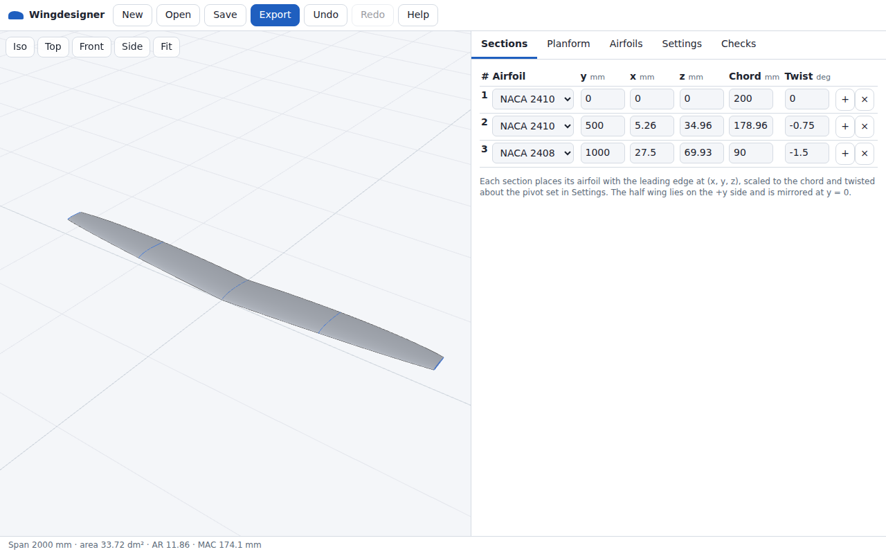
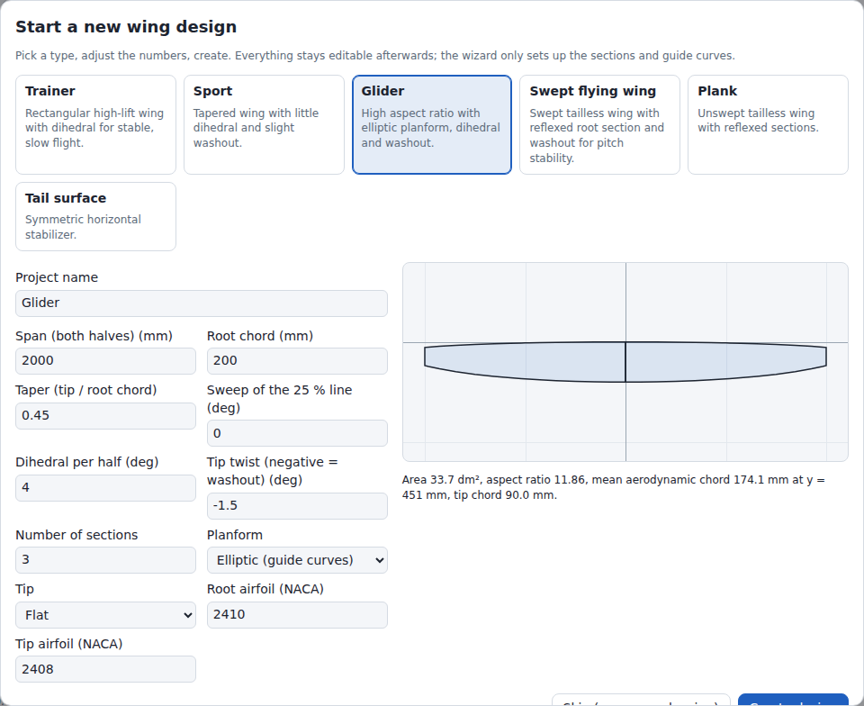

English: [README.md](README.md)

# Wingdesigner

Browseranwendung zum Konstruieren von Flügeln für ferngesteuerte Flugmodelle (RC, radio-controlled).

- Erzeugt einen Halbflügel als NURBS-Fläche (Non-Uniform Rational B-Spline) durch 2 bis 200 Profilschnitte.
- Modelliert den Halbflügel bei y ≥ 0; die andere Hälfte ist sein Spiegelbild an der Ebene y = 0.
- Exportiert Modelle als STEP (Standard for the Exchange of Product model data), STL (Stereolithografie) und 3MF (3D Manufacturing Format).
- Speichert das Projekt als JSON (JavaScript Object Notation).
- Projekte und Profildateien werden an keinen Server gesendet.

| Ressource | Adresse | Veröffentlicht durch |
| --- | --- | --- |
| App | <https://subtilitas.github.io/Wingdesigner/> | `ci.yml`, Push auf `main`, nachdem alle anderen CI-Jobs (Continuous Integration) bestanden sind; Erreichbarkeit: nicht geprüft |
| Wiki-Startseite (Englisch und Deutsch) | <https://github.com/subtilitas/Wingdesigner/wiki> | `docs.yml`, Push auf `main` mit Änderungen in `docs/wiki/` oder `docs.yml`, oder manueller Start; Erreichbarkeit: nicht geprüft |

| Thema | Englisch | Deutsch |
| --- | --- | --- |
| Arbeitsablauf, Bedienung, Exportoptionen | [User Guide](https://github.com/subtilitas/Wingdesigner/wiki/User-Guide) | [Benutzerhandbuch](https://github.com/subtilitas/Wingdesigner/wiki/Benutzerhandbuch) |
| Profilkurven, Schnitte, Leitkurven, Fläche | [Geometry](https://github.com/subtilitas/Wingdesigner/wiki/Geometry) | [Geometrie](https://github.com/subtilitas/Wingdesigner/wiki/Geometrie) |
| Profildateien, Prüfungen, Projekt-JSON, STEP, STL, 3MF | [File Formats](https://github.com/subtilitas/Wingdesigner/wiki/File-Formats) | [Dateiformate](https://github.com/subtilitas/Wingdesigner/wiki/Dateiformate) |
| Profilquellen und Lizenzen | [Airfoil Sources](https://github.com/subtilitas/Wingdesigner/wiki/Airfoil-Sources) | [Profilquellen](https://github.com/subtilitas/Wingdesigner/wiki/Profilquellen) |
| Architektur, Build, Tests, CI | [Development](https://github.com/subtilitas/Wingdesigner/wiki/Development) | [Entwicklung](https://github.com/subtilitas/Wingdesigner/wiki/Entwicklung) |



## Funktionen

| Funktion | Verhalten | Grenzen und Vorgaben |
| --- | --- | --- |
| Profilschnitte | Jeder Schnitt setzt ein Profil mit der Profilnase auf (x, y, z), skaliert es auf die Profiltiefe und dreht es um den Schränkungswinkel. | 2 bis 200 Schnitte; y 0 bis 1 000 000 mm, alle y verschieden; x und z −1 000 000 bis 1 000 000 mm; Profiltiefe 1 bis 100 000 mm; Schränkung −360 bis 360°. Die Tabelle **Sections** begrenzt eingegebene Werte auf diese Grenzen; Ziehen im Grundriss bleibt innerhalb dieser Grenzen. |
| Profilkurve | Kubischer B-Spline durch jeden Punkt der Profildatei. | Parametrisierung: zentripetal (Vorgabe), Sehnenlänge, gleichabständig. Bei Sehnenlänge oder gleichabständig fügen Fehlermeldungen zu Profilen unter **Checks** einen Hinweis auf zentripetal an. |
| Neuabtastung in Tiefenrichtung | Alle Schnitte werden bei denselben Anteilen der Profiltiefe abgetastet, kosinusverteilt zur Nasen- und Endleiste hin verdichtet. | 16 bis 200 Stationen je Profilseite, Vorgabe 60 |
| Interpolation in Spannweitenrichtung | **Linear** (linear): gerade Felder (Feld: Spannweitenabschnitt zwischen 2 benachbarten Schnitten), Knicke an den Schnitten. **Smooth** (glatt): natürlicher kubischer Spline durch die Werte der Schnitte. | Vorgabe linear; glatt braucht 3 oder mehr Schnitte (bei 2 Schnitten ist die Interpolation linear) |
| Stationen in Spannweitenrichtung | Mit Leitkurve oder glatter Interpolation: N Stationen je Feld (Schnitt eingeschlossen), kosinusverteilt zu den Feldenden hin verdichtet. Sonst: Stationen nur an den Schnitten. Zusätzliche Stationen kommen dort hinzu, wo die Fläche um mehr als 0,5 mm oder 10 % der örtlichen Profiltiefe (der kleinere Wert gilt; Abstand im Raum) vom vorgesehenen Profil abweicht. Verglichene Punkte: Profilnase, oberer Endleistenpunkt und 5 Tiefenstationen je Profilseite (bei der Vorgabe von 60 Stationen je Profilseite). Zusätzliche Stationen liegen an Prüfpositionen: 257 gleich verteilte Spannweitenpositionen, die Stationen und jeder Kontrollpunkt und Knoten der Leitkurven. Jede zusätzliche Station hält mindestens 1e-6 der Spannweite Abstand zu jeder anderen Station. | N = 3 bis 40, Vorgabe 8; bis zu 32 zusätzliche Stationen. Gittergrenze: N wird auf den größten Wert gesenkt, für den N × (Schnitte − 1) × (2 × Stationen je Profilseite + 1) ≤ 160 000 gilt, mit Warnung. Vorgaben (60 Stationen je Profilseite, N = 8): gesenkt ab 167 Schnitten; 200 Schnitte: N = 6. |
| NURBS-Fläche | Tensorprodukt-B-Spline-Fläche durch alle Stationen. | Grad 3 in Tiefenrichtung; in Spannweitenrichtung Grad 1 (lineare Interpolation, ohne Leitkurven) oder 3 |
| Leitkurven | Nasenlinie (Nasenleiste) und Endlinie (Endleiste) im Grundriss. Jede ist eine NURBS-Kurve durch Punkte (Kurvenparameter proportional zu y) oder aus Kontrollpunkten, gestreckt auf die Spannweite von Wurzel bis Rand. | Vorgabe: aus; Grad 1 bis 5, Vorgabe 3; 2 bis 500 Punkte (**Add point** ist bei 500 gesperrt); y streng monoton steigend; x innerhalb ±1 100 000 mm (deckt die Endleiste x + Profiltiefe jedes gültigen Schnitts ab), y innerhalb ±1 000 000 mm; gezogene und eingegebene x-Werte werden auf ±1 100 000 mm begrenzt. Fehler, wenn ein Kontrollpunkt der Kurve außerhalb x = ±1 200 000 mm liegt; Kurven durch Punkte mit ungleichmäßigem Abstand in y erreichen das. Abhilfe laut Meldung: Punkte gleichmäßiger in y verteilen, Kontrollpunktmodus. |
| Endleiste | Wie in den Profildateien, geschlossen oder mit fester Endleistendicke in mm. | Vorgabe: wie in den Profildateien; Endleistendicke 0,4 mm. Assistent: feste Endleistendicke max(0,3 mm; 0,2 % der Wurzeltiefe). Beispielflügel: fest 0,5 mm. Begrenzt auf 5 % der örtlichen Profiltiefe, mit Warnung (keine Warnung im letzten Feld eines Flügelendes **Pointed**). |
| Flügelende | **Flat** (flach): Der Flügel endet am Randschnitt. **Pointed** (spitz): Randprofil auf 1/N der Profiltiefe am vorletzten Schnitt skaliert, mindestens 1 mm. Im letzten Feld bleibt die Profiltiefe ≥ dieser Randtiefe. Zusammenlaufende Leitkurven enden im skalierten Profil. | Vorgabe flach; N = 100 bis 1000, Vorgabe 200. Die Tabelle **Sections** zeigt die Randtiefe; `(min.)` markiert die Untergrenze 1 mm. |
| Spiegelung | Anzeigeschalter **Show mirrored half (y < 0)** (gespiegelte Hälfte zeigen) unter **Settings**. Exporte verwenden die Exportoption **Wing halves**. Die Kennwerte gelten immer für beide Hälften. | Anzeigeschalter: Vorgabe an |
| Profilimport | Selig, Lednicer, 3-spaltige Tabelle (x, y oben, y unten), XML (Extensible Markup Language), HTML-Seiten (HyperText Markup Language; Koordinaten in `<pre>`-Blöcken oder Tabellen). Liest Dezimalkommas, Prozentkoordinaten, UTF-8 (Unicode Transformation Format, 8 Bit) und Windows-1252. Eingabe: Dateien ablegen, **Choose files** (Dateien wählen) oder Text einfügen. Zeigt Kontur, NURBS-Kurve und Prüfmeldungen, bevor das Profil ins Projekt übernommen wird. Aufeinanderfolgende Punkte, die näher als 1e-9 der Profiltiefe am vorherigen Punkt liegen, werden entfernt. Ein Profil mit Fehler, auch bei gescheiterter NURBS-Interpolation, kann nicht übernommen werden (**Cannot add (errors)**). Die Vorschau (Upload und **View**) zeichnet die NURBS-Kurve mit der Profil-Parametrisierung des Projekts. | Filter von **Choose files**: `.dat`, `.txt`, `.cor`, `.xml`, `.htm`, `.html`, `.csv` und Textdateien; abgelegte Dateien: jede Endung; 5 bis 5000 Punkte, Warnung unter 20; höchstens 2 000 000 Zeichen; Dateien über 8 MB werden ungelesen abgewiesen; höchstens 200 Profile je Projekt. Projektdateien: dieselben Grenzen für Punkte und Profile. Bei 200 Profilen öffnet die Registerkarte **Airfoils** keine Vorschau und zeigt `The project holds 200 airfoils, the limit; "Remove unused" frees places.` |
| NACA-Generator | 4- und 5-stellige NACA-Profile (National Advisory Committee for Aeronautics) nach NACA Report 824. Dazu S-Schlag-Profile mit 5 Stellen (dritte Ziffer 1). Endleiste offen oder geschlossen. | 17 Vorlagen; 81 Punkte je Profilseite |
| Assistent | Eingaben: 7 Zahlenwerte (siehe [Eingaben des Assistenten](#eingaben-des-assistenten)), Grundriss (gerade oder elliptisch), Flügelende (flach oder spitz), NACA-Code von Wurzel- und Randprofil. Ergebnis: gleichmäßig verteilte Schnitte; der elliptische Grundriss fügt Nasen- und Endlinie als Leitkurven hinzu. Letzter Schnitt: Randprofil; alle anderen: Wurzelprofil. | 6 Vorlagen: **Trainer**, **Sport** (Sportmodell, vorausgewählt), **Glider** (Segelflugmodell), **Swept flying wing** (Pfeilnurflügel), **Plank** (Brettnurflügel), **Tail surface** (Leitwerk). Elliptisch mit flachem Flügelende: Zuspitzung < 1. Spitzes Flügelende: Randtiefe 1/200 der Profiltiefe am vorletzten Schnitt, mindestens 1 mm. |
| Prüfungen | Listet Fehler und Warnungen. Grundriss: Spannweite, Flügelfläche (dm²), Streckung, mittlere aerodynamische Flügeltiefe (MAC), Lage der MAC (y, x der Profilnase), x bei 25 % MAC, Wurzel- und Randtiefe. Fläche: Grad, Anzahl der Kontrollpunkte, Endleiste offen oder geschlossen. Spannweite = 2 × y des Randschnitts; Flügelfläche und MAC: 5-Punkt-Gauß-Legendre-Quadratur des vorgesehenen Grundrisses in jedem Intervall zwischen den Stationen in Spannweitenrichtung. | Export von STEP, STL und 3MF gesperrt, solange Fehler bestehen. Werte von Schnitten und Leitkurven außerhalb der Projektgrenzen sind Fehler; das automatische Speichern speichert ein solches Projekt nicht, und **Open** weist es ab. Wurzelschnitt nicht bei y = 0: Die Lücke zwischen den Hälften zählt zur Spannweite, nicht zur Flügelfläche. |
| Bedienung | Maus, Touchscreen, Tastatur. 3D-Ansicht: Ziehen dreht, Mausrad oder Zwei-Finger-Spreizen zoomt, rechte Maustaste oder 2 Finger verschieben. 2D-Ansichten (Grundriss, Vorschauen): Punkt ziehen verschiebt ihn, Hintergrund ziehen verschiebt die Ansicht, Mausrad oder Spreizen zoomt, 2 Finger verschieben, Doppelklick passt die Ansicht ein. | Rückgängig: Strg+Z oder Cmd+Z; Wiederholen: Strg+Umschalt+Z, Cmd+Umschalt+Z, Strg+Y oder Cmd+Y. Tastenkürzel wirken nicht, solange ein Eingabefeld den Fokus hat oder ein Dialog offen ist. Rückgängig-Verlauf: höchstens 100 Schritte und höchstens 64 000 000 Zeichen serialisiertes Projekt (Rückgängig und Wiederholen zusammen); ein Projekt über 640 000 Zeichen behält weniger Schritte, mindestens 1. Ziehbewegungen mit weniger als 800 ms Abstand bilden 1 Rückgängig-Schritt. |
| Speicherung | Speichert nach jeder Änderung, die die Projektprüfung besteht, automatisch im lokalen Speicher des Browsers (Local Storage), mit der Neuberechnung im nächsten Animations-Frame; ein ausstehendes Speichern wird sofort ausgeführt, wenn die Seite verborgen oder verlassen wird (Neuladen, Schließen des Tabs). Ein gespeichertes Projekt, das nicht geladen werden kann, bleibt unter `wingdesigner.project.v1.rejected` erhalten, und der Assistent öffnet sich. Solange der Assistent des ersten Aufrufs offen ist, wird nichts gespeichert. **Save** (Speichern) lädt die Projektdatei (JSON) herunter. **Open** (Öffnen) öffnet eine Projektdatei. | Local Storage nicht verfügbar: Projekt bleibt nur im Arbeitsspeicher. **Open**: Dateien über 50 MB werden abgewiesen. |

### Eingaben des Assistenten

| Eingabe im Assistenten | Bereich | Einheit |
| --- | --- | --- |
| **Span (both halves)** (Spannweite, beide Hälften) | 100 bis 20 000 | mm |
| **Root chord** (Wurzeltiefe) | 10 bis 3000 | mm |
| **Taper (tip / root chord)** (Zuspitzung, Randtiefe / Wurzeltiefe) | 0,1 bis 1,5 | — |
| **Sweep of the 25 % line** (Pfeilung der 25-%-Linie) | −45 bis 60 | ° |
| **Dihedral per half** (V-Form je Hälfte) | −15 bis 30 | ° |
| **Tip twist (negative = washout)** (Schränkung am Rand, negativ = Nase ab) | −15 bis 15 | ° |
| **Number of sections** (Anzahl der Schnitte) | 2 bis 8 | — |

## Koordinaten und Einheiten

| Größe | Definition | Einheit |
| --- | --- | --- |
| x | In Tiefenrichtung, positiv zur Endleiste | mm |
| y | In Spannweitenrichtung, positiv zum rechten Flügelende; der Halbflügel liegt bei y ≥ 0 | mm |
| z | Nach oben | mm |
| Schnittursprung | Profilnase = Punkt mit minimalem x auf der interpolierten Profilkurve | mm |
| Profiltiefe | x-Abstand von der Profilnase zur Mitte der Endleiste des interpolierten Profils | mm |
| Schränkung | Drehung um den Drehpunkt der Schränkung; positiv = Nase hoch | ° |
| Drehpunkt der Schränkung | Anteil der Profiltiefe ab der Profilnase, 0 bis 1, Vorgabe 0,25 | — (Anteil der Profiltiefe) |

## Exporte

Dateiname, abgeleitet vom Projektnamen:

1. Akzente entfernt (ü → u).
2. Jede Folge anderer Zeichen als `A-Z a-z 0-9 . _ -` wird zu einem `_`.
3. `_` am Anfang und Ende entfernt.
4. Leeres Ergebnis: `wing`.

Beispiel: `Flügel V2 (neu)` → `Flugel_V2_neu.step`.

| Format | Datei | Inhalt | Prüfung |
| --- | --- | --- | --- |
| STEP, Application Protocol 214 (AP214), Textformat nach ISO (International Organization for Standardization) 10303-21 | `.step` | Ein geschlossener B-rep-Volumenkörper (Boundary Representation) je Hälfte. Flächen: Ober- und Unterseite als B-Spline-Fläche (die exakte NURBS-Fläche des Flügels), Regelfläche an der Endleiste (nur bei offener Endleiste), ebene Abschlussflächen an Wurzel und Rand. | CI: `scripts/validate_step.py` liest 8 Testflügel mit OpenCascade (cadquery-ocp 8.0.1). Bestanden: Formen gültig, Hüllen geschlossen und orientiert, Volumen innerhalb 0,05 % des Volumens des Dreiecksnetzes. |
| STL, binär | `.stl` | Geschlossenes Dreiecksnetz; eine Hülle je Körper. | Unit-Tests: Jede gerichtete Kante kommt einmal vor, ihre Umkehrung einmal; Volumen aus der gelesenen float32-Datei innerhalb 0,0005 % des Volumens des Dreiecksnetzes. |
| 3MF | `.3mf` | Dieselben Dreiecksnetze; ein Objekt je Hülle; Einheit Millimeter. | Unit-Tests: 3 Paketteile, Einheit Millimeter, 1 Objekt und 1 Build-Eintrag je Hülle, Anzahl der Eckpunkte. CI: `scripts/validate_3mf.py` liest die 8 Testflügel mit lib3mf 2.5.0 im strikten Modus. Bestanden: keine Warnungen beim Einlesen, Anzahl der Dreiecke je Objekt wie geschrieben, jedes Objekt mannigfaltig und orientiert. Slicer-Software: nicht getestet. |
| Projekt-JSON | `.json` | Profilkoordinaten, Schnitte, Leitkurven, Einstellungen. Abgeleitete NURBS-Daten nur, wenn der Flügel ohne Fehler berechnet wird. Abgeleitete Daten: die Kurve jedes Profils, das ein Schnitt verwendet, jede aktive Leitkurve (null, wenn aus), Stationen in Spannweitenrichtung, NURBS-Fläche (Grad, Knotenvektoren, Kontrollpunkte). Der Import ignoriert die abgeleiteten Daten und berechnet sie neu. | Unit-Tests: Schreiben, erneutes Einlesen und Neuberechnen ergibt dieselben Schnitte, Leitkurven, Profilpunkte und Kontrollpunkte der Fläche; Prüfung jedes Felds. |

| Exportoption | Werte | Wirkung |
| --- | --- | --- |
| **Wing halves** (Flügelhälften) | **Both halves as separate bodies** (beide Hälften als getrennte Körper, Vorgabe) | 2 Körper in jedem Format |
| | **Full wing as one body** (ganzer Flügel als ein Körper) | STL und 3MF: 1 Hülle, nur wenn der Wurzelschnitt bei y = 0 liegt, sonst 2 Körper. STEP: 2 Volumenkörper. |
| | **Right half only** (nur rechte Hälfte) | 1 Körper |
| **Mesh density** (Netzdichte) | **Normal** (Vorgabe), **Fine (4x triangles)** (fein, 4-fache Anzahl Dreiecke) | Nur STL und 3MF |

## Profildaten und Lizenzen

- 4- und 5-stellige NACA-Profile werden im Browser aus den veröffentlichten Gleichungen berechnet. Für sie wird keine Koordinatendatei verwendet.
- Die mitgelieferte Profilbibliothek (`public/airfoils/`) enthält 6 Koordinatendateien.
  **Library** (Bibliothek) listet sie nach den 17 NACA-Vorlagen, jeweils mit Kategorie, Verwendung, Autor und Lizenzkennung.
- Beim Hinzufügen einer Bibliotheksdatei werden Autor (als Quellenangabe, in der Vorschau änderbar), Lizenzkennung, Quelladresse und Adresse der Bedingungen
  in `source` des Projektprofils übernommen.
- Quelle, Rechtsgrundlage mit Zitaten, Bedingungen und Text der Quellenangabe je Datei (Englisch):
  [public/airfoils/NOTICE.md](public/airfoils/NOTICE.md).

| Profil | Quelle | Lizenzkennung | Grundlage |
| --- | --- | --- | --- |
| Clark Y | NACA Report No. 502, Table I; Profil von Virginius E. Clark | `public-domain` | Werk der Regierung der Vereinigten Staaten; Schutzfrist in den Vereinigten Staaten abgelaufen |
| NACA 8-H-12 | NACA Technical Note 1998, Table I | `public-domain` | Werk der Regierung der Vereinigten Staaten |
| NACA M-6 | NACA Report No. 221, Table XXIX | `public-domain` | Werk der Regierung der Vereinigten Staaten; Schutzfrist in den Vereinigten Staaten abgelaufen |
| RAF 34 | Tabelle des Royal Aircraft Establishment (RAE) in NACA Report No. 286 | `public-domain` | Schutzfrist in den Vereinigten Staaten abgelaufen; Tabelle nachgedruckt in einem Werk der Regierung der Vereinigten Staaten |
| S9104 | Michael Selig, University of Illinois Urbana-Champaign | `CC-BY-4.0` | Lizenz Creative Commons Attribution 4.0 International (CC BY 4.0) vom Konstrukteur |
| USA 35B | NACA Report No. 233, Table XXXVI | `public-domain` | Werk der Regierung der Vereinigten Staaten; Schutzfrist in den Vereinigten Staaten abgelaufen |

- Status der 5 gemeinfreien Dateien außerhalb der Vereinigten Staaten: nicht geklärt.
- RAF 34: 7 Werte des Quellscans sind um bis zu 0,20 % der Profiltiefe unsicher (Liste in NOTICE.md).
- Die Langformen von „RAF“ und „USA“ in den Profilnamen sind unbekannt; die geprüften Quellen nennen sie nicht.
- Der Download als `.dat` und die Exporte STEP, STL und 3MF enthalten keine Quellenangabe.
  NOTICE.md nennt den Text der Quellenangabe für eine weitergegebene Datei, die mit S9104 erstellt ist.
- Nicht mitgeliefert: aerodesign.de und mh-aerotools.de (private Nutzung erlaubt, Weitergabe eingeschränkt),
  UIUC Airfoil Coordinates Database (University of Illinois Urbana-Champaign; keine Lizenz angegeben).
  Die App verlinkt diese Quellen.
- Ebenfalls nicht mitgeliefert: Daten unter Creative Commons Attribution-ShareAlike 4.0 (Weitergabe unter gleichen Bedingungen),
  Profile von Mark Drela unter der GNU General Public License (GPL) ab Version 2, die PROFOIL-Testprofile.
  Entscheidungen: [RECORD.md](RECORD.md).
- Bedingungen und Zitate: [Profilquellen](https://github.com/subtilitas/Wingdesigner/wiki/Profilquellen),
  [Airfoil Sources](https://github.com/subtilitas/Wingdesigner/wiki/Airfoil-Sources).
- Hochgeladene Profile behalten Namen und Quellenangabe in der Projektdatei (JSON).
- Die Profilvorschau füllt das Feld **Source / attribution** (Quellenangabe) vor. Bibliotheksdatei: Autor aus `index.json`.
  Andere Profile: aus dem Profilnamen; Groß- und Kleinschreibung sowie führende Leerzeichen spielen keine Rolle.

| Name beginnt mit | Eingetragene Quellenangabe |
| --- | --- |
| `HS` + Leerzeichen oder Bindestrich | Hartmut Siegmann, www.aerodesign.de |
| `MH` + optional Leerzeichen oder Bindestrich + Ziffer | Martin Hepperle, www.mh-aerotools.de |

## Aktuelle Einschränkungen

| Einschränkung | Bedingung |
| --- | --- |
| Schnitte liegen in Ebenen y = konstant. | Bei einem V-Form-Winkel Γ ist jede Schnittebene um Γ gegen die Ebene senkrecht zur Spannweitenlinie geneigt. |
| Eine Profiltiefe unter 1 mm ist nicht möglich. | Eine Profiltiefe unter 1 mm an einer Spannweitenposition ist ein Fehler. Geprüft an 257 gleich verteilten Spannweitenpositionen, an jeder Station und an jedem Kontrollpunkt und Knoten der Leitkurven. Eine Profiltiefe der angepassten Fläche unter 0,9 mm (gemessen in der vorgesehenen Tiefenrichtung) ist ein Fehler; geprüft an denselben Positionen und bei 0,25, 0,5 und 0,75 jedes Intervalls zwischen den Stationen der angepassten Fläche. Ein Flügelende **Pointed** endet in einem Profil mit 1/100 bis 1/1000 der Profiltiefe am vorletzten Schnitt, mindestens 1 mm. |
| Glatte Interpolation kann überschwingen. | Fehler, wenn ein interpolierter Wert (x der Profilnase und Profiltiefe, soweit keine Leitkurve sie setzt, z, Schränkung oder Höhe eines Konturpunkts) um mehr als das 2-Fache des Bereichs seiner Schnittwerte außerhalb dieses Bereichs liegt, oder wenn die Dicke des interpolierten Profils unter 0 liegt. Geprüft an denselben Spannweitenpositionen wie die Profiltiefe. Die Meldung zum Überschwingen nennt die Größe, die Spannweitenposition und den kleinsten Abstand zwischen Schnitten. Abhilfe laut den Meldungen: lineare Interpolation, gleichmäßig verteilte Schnitte, eng beieinanderliegende Schnitte entfernen, mehr Schnitte. |
| Ein Flügel außerhalb ±1 200 000 mm oder mit mehr als 100 000 mm Profiltiefe zwischen den Schnitten ist nicht möglich. | Fehler, wenn an einer Spannweitenposition der Profiltiefenprüfung x der Profilnase, x der Endleiste oder z außerhalb ±1 200 000 mm liegt oder die Profiltiefe 100 000 mm übersteigt. Ursachen: glatte Interpolation, auch innerhalb der Grenze für das Überschwingen, zum Beispiel Schnitte bei y = 0, 100 und 1000 mm mit x = 0, 1 000 000 und 0 mm (x der Profilnase 1 211 902 mm bei y = 125 mm); Nasen- und Endlinie mehr als 100 000 mm voneinander entfernt. Die Meldung nennt Spannweitenposition, x der Profilnase, z und Profiltiefe. Abhilfe laut Meldung: Leitkurven prüfen, lineare Interpolation. |
| Bei geschlossener Endleiste oder fester Endleistendicke können sich Ober- und Unterseite kreuzen. | Tritt auf, wo das Profil innen dünner ist als seine Endleistendicke. Die Oberseite liegt dann unter der Unterseite; das ist ein Fehler. **As in the airfoil files** (wie in den Profildateien) oder eine größere Endleistendicke wählen. |
| Die NURBS-Fläche folgt den Leitkurven exakt nur an den Stationen in Spannweitenrichtung. | Warnung, wenn die Fläche nach den zusätzlichen Stationen (bis zu 32 in 6 Durchläufen) noch um mehr als 0,5 mm (oder 10 % der örtlichen Profiltiefe, wenn kleiner) vom vorgesehenen Profil abweicht (Profilnase, oberer Endleistenpunkt, 5 Tiefenstationen je Profilseite bei 60 Stationen je Profilseite). Die Warnung verwendet nur die Prüfpositionen der Profiltiefenprüfung. Die Warnung nennt mehr Stationen je Feld (bis 40) als Abhilfe; die Wirkung bei einem Flügel mit dieser Warnung ist nicht gemessen. Senkt die Gittergrenze N (Funktionen, Stationen in Spannweitenrichtung), fügt eine höhere Einstellung keine Stationen hinzu. Die Vorlagen des Assistenten mit spitzem Flügelende ergeben keine solche Warnung; Glider mit spitzem Flügelende (elliptischer Grundriss, 8 Stationen je Feld): 6 zusätzliche Stationen, größte Abweichung 0,156 mm. Zwischen den Stationen weicht die Fläche innerhalb von 2 mm vor einem spitzen elliptischen Flügelende um 0,3 bis 0,8 mm ab; die Warnung erfasst das nicht. Eine örtliche Dicke der angepassten Fläche an den verglichenen Tiefenstationen unter 0 („turns inside out“, stülpt sich um) oder von höchstens 0,001 % der Profiltiefe zwischen 1 % und 99 % der Profiltiefe („has zero thickness“, Dicke 0) ist ein Fehler. Geprüft an den Prüfpositionen und bei 0,25, 0,5 und 0,75 jedes Intervalls zwischen den Stationen der angepassten Fläche. Ursachen laut Meldung: schnell wechselnde Leitkurven, ungleichmäßig verteilte Schnitte bei glatter Interpolation. |
| Die Fläche wird nur an ausgewählten Flächenzeilen auf Selbstüberschneidung geprüft. | Eine Flächenzeile (Ebene y = konstant), die sich zwischen den neu abgetasteten Punkten selbst kreuzt, ist ein Fehler („The loft surface crosses itself at y = … mm near x = … mm“; Abhilfe laut Meldung: mehr Stationen je Profilseite). Geprüfte Flächenzeilen: jeder Schnitt, die Mitte zwischen benachbarten Schnitten und die Mitte der 64 breitesten Intervalle zwischen den Stationen der angepassten Fläche. Flächenzeilen in den übrigen Intervallen zwischen Stationen werden nicht geprüft. |
| Endleistendicken unter 0,01 mm werden auf 0,01 mm geöffnet. | Gilt, außer wenn jede Station eine geschlossene Endleiste hat. Stationen mit weniger als 0,01 mm Endleistendicke werden auf 0,01 mm geöffnet (höchstens 5 % der örtlichen Profiltiefe). Eine Warnung nennt die Anzahl der geöffneten Stationen. Ihr Text nennt geschlossene und offene Stationen auch dann, wenn jede Station offen ist und weniger als 0,01 mm Endleistendicke hat. |
| Leitkurven setzen nur x und Profiltiefe. | z (V-Form) und Schränkung folgen immer den Werten der Schnitte. |
| Geneigte Profile werden nicht zurückgedreht. | Die Schränkung bezieht sich auf die x-Achse der Datei. Warnung, wenn die Linie von Profilnase zu Endleiste um mehr als 0,5° geneigt ist. Die mitgelieferten Profile Clark Y (1,97°) und USA 35B (1,51°) lösen diese Warnung aus. |
| STEP-Dateien enthalten keine Farben, keine Flächennamen und keine Baugruppenstruktur. | Gilt für jede STEP-Datei. |
| Der Punkt bei 25 % MAC ist ein geometrischer Bezugspunkt. | Angezeigt unter **Checks** als „25 % MAC (geometric reference)“. Keine Berechnung von Neutralpunkt oder Schwerpunkt. |
| Browser nur mit Chromium getestet. | Playwright-Tests bei 1280 x 720 und im Smartphone-Profil Pixel 7. Firefox und Safari: nicht getestet. |
| Rechenzeit und Speicherbedarf der Flügelberechnung auf Smartphones: nicht gemessen. | — |

## Schnellstart

1. App öffnen. Beim ersten Aufruf öffnet sich der Assistent mit der Vorlage **Sport**.
   Vorlage wählen, Werte anpassen, **Create design** (Entwurf anlegen) klicken.
   **Skip (open sample wing)** (Überspringen, Beispielflügel öffnen) lädt „Sport wing 1500“: 1500 mm Spannweite, 3 Schnitte, NACA 2412 und 2410.

   

2. **Airfoils** (Profile): NACA-Code eingeben und **Preview** (Vorschau) klicken, bei einem Eintrag der **Library** (Bibliothek) **Preview** klicken,
   oder Profildateien auf die Ablagefläche ziehen oder **Choose files** (Dateien wählen) klicken.
   Vorschau prüfen, dann **Add to project** (zum Projekt hinzufügen) klicken.
3. **Sections** (Schnitte): Profil in der Spalte **Airfoil** wählen. y, x, z, Profiltiefe und Schränkung je Schnitt eingeben.
   **+** fügt nach der Zeile einen Schnitt ein (gesperrt bei 200 Schnitten). **×** löscht die Zeile (gesperrt bei 2 Schnitten).
4. **Planform** (Grundriss): **Use guide curve** (Leitkurve verwenden) für Nasenlinie oder Endlinie ankreuzen. Punkte ziehen.
5. **Checks** (Prüfungen): Fehler, Warnungen und Grundrisswerte lesen.
6. **Export**: Format, Flügelhälften und Netzdichte wählen, dann **Download** klicken.

## Entwicklung

Benötigt Node.js 24 (`.nvmrc`; `package.json` engines `>=24`).
STEP- und 3MF-Prüfung: Python 3.12 (wie in der CI); andere Python-Versionen nicht getestet.
Versionsgeschichte: [CHANGELOG.md](CHANGELOG.md).

```bash
npm ci
npx playwright install chromium   # Browser für End-to-End-Tests (e2e) und Screenshots (oder PW_CHROMIUM=/pfad/zu/chrome setzen)
npm run dev              # Entwicklungsserver auf http://localhost:5173
npm test                 # 182 Unit-Tests (Vitest)
npm run lint             # ESLint
npm run build            # Produktions-Build nach dist/
npm run preview          # dist/ auf http://localhost:4173 ausliefern
npm run e2e              # Produktions-Build, dann 125 Playwright-Tests auf Desktop 1280 x 720 und Pixel 7 (250 Läufe)
npm run coverage         # Unit-Tests mit Abdeckungsbericht in coverage/
npm run coverage:readme  # Abdeckungstabellen in README.md und README.de.md schreiben
npm run coverage:check   # Exit-Code 1, wenn eine README-Abdeckungstabelle von coverage/ abweicht
npm run airfoils:check   # mitgelieferte Profilbibliothek und NACA-Vorlagen prüfen
npm run step:cases       # 8 STEP-Dateien, 8 3MF-Dateien und cases.json nach step-check/ schreiben
npm run screenshots      # Build erzeugen und docs/wiki/images/ neu aufnehmen
npm run docs:check       # Seitenpaare, Wiki-Links, Bilder und Abdeckungsmarker prüfen
pip install cadquery-ocp==8.0.1.0.0 lib3mf==2.5.0         # Python 3.12
python scripts/validate_step.py step-check/cases.json   # STEP-Dateien mit OpenCascade prüfen
python scripts/validate_3mf.py step-check/cases.json    # 3MF-Dateien mit lib3mf prüfen (strikter Modus)
```

## Testabdeckung

Aktualisieren: `npm run coverage && npm run coverage:readme`. Die CI führt `npm run coverage:check` aus und schlägt bei einer Abweichung fehl.
Die Playwright-Tests führen den DOM-Code (Document Object Model) aus; seine Abdeckung wird nicht gemessen.

<!-- coverage:start -->
| Anweisungen | Verzweigungen | Funktionen | Zeilen |
| ---: | ---: | ---: | ---: |
| 98,0 % | 92,9 % | 99,7 % | 98,6 % |

Unit-Tests (Vitest, V8-Coverage) über `src/`, ohne den DOM-Code in `src/ui/` und `src/main.js`.
<!-- coverage:end -->

## Lizenz

MIT License (benannt nach dem Massachusetts Institute of Technology), siehe [LICENSE](LICENSE). Profilkoordinaten behalten die Bedingungen ihrer Quelle.
