English: [[User Guide|User-Guide]]

# Benutzerhandbuch

| Konvention | Wert |
| --- | --- |
| Einheiten | Millimeter (mm), Winkel in Grad (°) |
| x | in Profiltiefenrichtung, positiv zur Endleiste |
| y | in Spannweitenrichtung, positiv zum rechten Flügelende |
| z | nach oben |
| Bearbeitete Geometrie | rechter Halbflügel (y ≥ 0), gespiegelt an der Ebene y = 0 |
| Vorzeichen der Schränkung | positiv = Nase hoch |
| Feld | Spannweitenabschnitt zwischen zwei benachbarten Schnitten |
| Station | eine platzierte Profilkontur an der Spannweitenposition y; jeder Schnitt ist eine Station |

Die App zeigt sich auf Deutsch oder Englisch (Abschnitt [Sprache](#sprache)). Diese Seite nennt die Bedienelemente mit ihrer deutschen Beschriftung. Die englische Beschriftung steht bei der ersten Nennung in jedem Abschnitt in Klammern, z. B. **Einstellungen** (Settings).

## Bildschirmaufbau

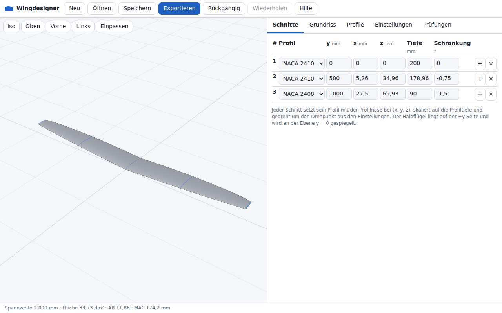

| Bereich | Inhalt |
| --- | --- |
| Kopfleiste | **Neu** (New), **Öffnen** (Open), **Speichern** (Save), **Exportieren** (Export), **Schaum** (Foam), **Rückgängig** (Undo), **Wiederholen** (Redo), **Hilfe** (Help) |
| 3D-Ansicht | NURBS-Fläche (Non-Uniform Rational B-Spline) des Flügels, Schnittkonturen (blau, ausgewählter Schnitt rot), Linien der Nasenleiste und der Endleiste (grau), Raster in der Ebene z = 0 (20 × 20 Zellen); Ansichtsschaltflächen |
| Bedienbereich | Registerkarten **Schnitte** (Sections), **Grundriss** (Planform), **Profile** (Airfoils), **Einstellungen** (Settings), **Prüfungen** (Checks). Rechts der 3D-Ansicht, 360 bis 650 px breit; die 3D-Ansicht nimmt den Rest der Breite. |
| Statusleiste | `Spannweite … mm · Fläche … dm² · AR … · MAC … mm` (AR: aspect ratio, deutsch Streckung; MAC: mean aerodynamic chord, deutsch mittlere aerodynamische Flügeltiefe), danach die Anzahl der Warnungen (`1 Warnung`, `2 Warnungen`; nur bei 1 oder mehr Warnungen). Bei Fehlern: Anzahl der Fehler und erste Fehlermeldung in roter Schrift (`… Fehler: …`). Bei ausgeschalteter automatischer Sicherung: `Automatische Sicherung aus: „Speichern“ verwenden` in roter Schrift (Abschnitt [Speicherung](#speicherung)). |
| Meldungen | Kurzmeldungen (z. B. `Entwurf „Segelflugmodell“ angelegt.`) am unteren Rand der 3D-Ansicht für 4 s; eine Meldung mit mehr als 66 Zeichen bleibt 60 ms je Zeichen. Fehlermeldungen auf rotem Grund. |

| Schaltfläche der Kopfleiste | Wirkung |
| --- | --- |
| **Neu** | Öffnet den Assistenten (Abschnitt [Assistent](#assistent)). |
| **Öffnen** | Lädt eine Projektdatei im Format JSON (JavaScript Object Notation, Dateiendung `.json`). Öffnet den Importdialog für eine XFLR5- oder flow5-Datei (Dateiendung `.xfl`, `.fl5` oder `.xml`; XML: Extensible Markup Language; Abschnitt [Import aus XFLR5 und flow5](#import-aus-xflr5-und-flow5)). Die Dateiauswahl listet `.json`-, `.xfl`-, `.xml`-, `.wpa`- und `.fl5`-Dateien. JSON- und XML-Dateien über 100 MB werden ungelesen abgewiesen: `<Datei> kann nicht geöffnet werden: … MB; Projektdateien sind auf 100 MB begrenzt.` Eine Datei, die der Browser nicht lesen kann (entferntes Laufwerk, entzogene Berechtigung), zeigt `<Datei> kann nicht geöffnet werden: Der Browser konnte die Datei nicht lesen (NotReadableError).`; der aktuelle Entwurf bleibt. Ungültige JSON-Dateien werden abgewiesen; die Meldung zeigt bis zu 3 Fehler. Abgeleitete NURBS-Daten in der Datei werden ignoriert und neu berechnet. Eine Projektdatei des Formats Version 2, deren Einstellwinkel der XFLR5-Import in die Schnitte eingerechnet hat, öffnet mit diesem Winkel als **Einstellwinkel des Teils** (Part tilt); der Hinweis nach `<Datei> geöffnet.` sagt das (Abschnitt [Speicherung](#speicherung)). |
| **Speichern** | Lädt das Projekt-JSON herunter. Gleiche Datei wie **Exportieren** > **Projekt-JSON** (Project JSON). Brächten die abgeleiteten NURBS-Daten die Datei über 100 MB, lässt die Datei sie weg (Abschnitt [Export](#export)). Ein Fehler zeigt die rote Meldung `Speichern fehlgeschlagen: ….` |
| **Exportieren** | Öffnet den Exportdialog (Abschnitt [Export](#export)). |
| **Schaum** | Öffnet den Schaumschnitt-Assistenten (Abschnitt [Schaumschnitt](#schaumschnitt)). |
| **Rückgängig** / **Wiederholen** | Springen im Bearbeitungsverlauf einen Schritt zurück beziehungsweise vor. Der Verlauf liegt nur im Arbeitsspeicher: höchstens 100 Schritte und höchstens 64 000 000 Zeichen serialisiertes Projekt (Rückgängig- und Wiederholen-Schritte zusammen); ein Projekt über 640 000 Zeichen behält weniger Schritte, mindestens 1. **Neu** und **Öffnen** lassen sich mit **Rückgängig** zurücknehmen. |
| **Hilfe** | App-Version, Arbeitsablauf, Bedienung, Links zu diesem Wiki, zum Quellcode und zu `LICENSES.txt` (Link **Lizenzen dieser App und ihrer Bibliotheken** (Licenses of this app and its libraries)). Die Datei enthält die MIT-Lizenz (Massachusetts Institute of Technology) der App und die Lizenztexte von three.js und fflate. Der Link **Dokumentation (Wiki)** (Documentation (wiki)) öffnet in der englischen Oberfläche die Startseite dieses Wikis und in der deutschen Oberfläche die Seite Benutzerhandbuch. |

### Schmale Bildschirme

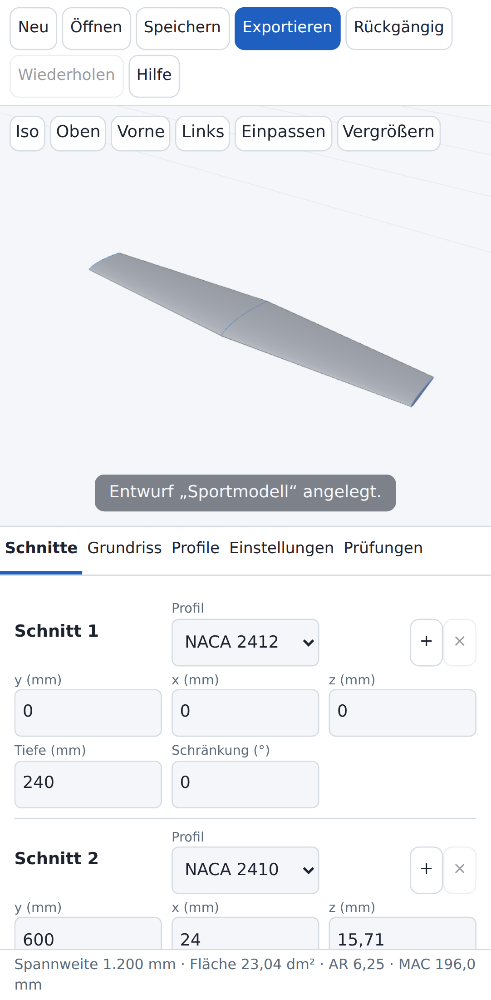

Bei einer Fensterbreite von höchstens 860 px:

- Die 3D-Ansicht liegt über dem Bedienbereich: 42 % der Fensterhöhe, mindestens 240 px.
- In der 3D-Ansicht erscheint **Vergrößern** (Enlarge). Die Schaltfläche blendet den Bedienbereich aus und gibt der 3D-Ansicht die volle Höhe; erneutes Tippen blendet ihn wieder ein.
- Die Schnitttabelle wird zu einer Karte je Schnitt (3 Spalten, Beschriftung über jedem Wert).
- Die Grundriss-Zeichenfläche ist 260 px hoch.
- Deutsche Oberfläche: Die Statusleiste zeigt höchstens 2 Zeilen; die Registerkarte **Prüfungen** zeigt den ganzen Text. Die Kopfleiste hat bei einer Fensterbreite von höchstens 637 px 2 Zeilen (gemessen in Chromium 141: 2 Zeilen bei 637 px, 1 Zeile bei 638 px).
- Bei einer Fensterbreite von höchstens 460 px haben die Schaltflächen der Kopfleiste links und rechts je 5 px Innenabstand statt 8 px; bei höchstens 402 px je 3 px, mit 2 px Abstand zwischen den Schaltflächen.
- Bei einer Fensterbreite von höchstens 420 px bleiben die 8 Schaltflächen der Kopfleiste der englischen Oberfläche in 1 Zeile. Die Zeile lässt sich seitlich verschieben, wenn sie breiter als das Fenster ist: unter 356 px (gemessen in Chromium 141). Die deutsche Kopfleiste bricht stattdessen um, und die Schaltflächen eines Projektprofils rücken unter den Namen.

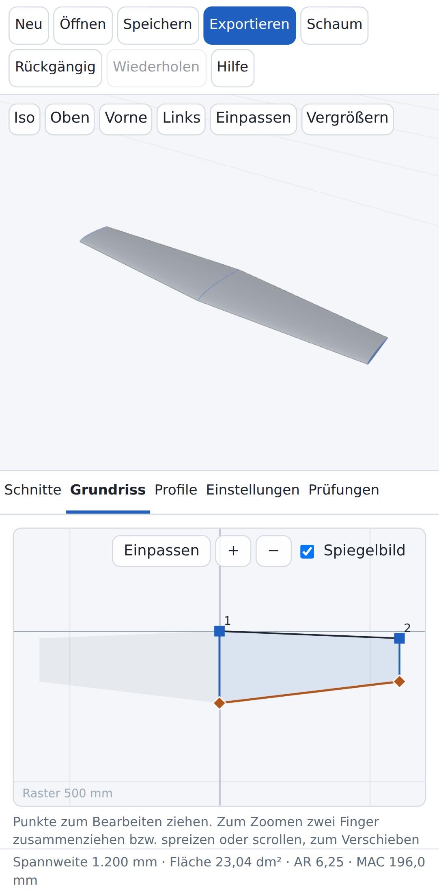

Auf Touchscreens (grober Zeiger) sind Schaltflächen und Eingabefelder mindestens 40 px hoch.

## Import aus XFLR5 und flow5

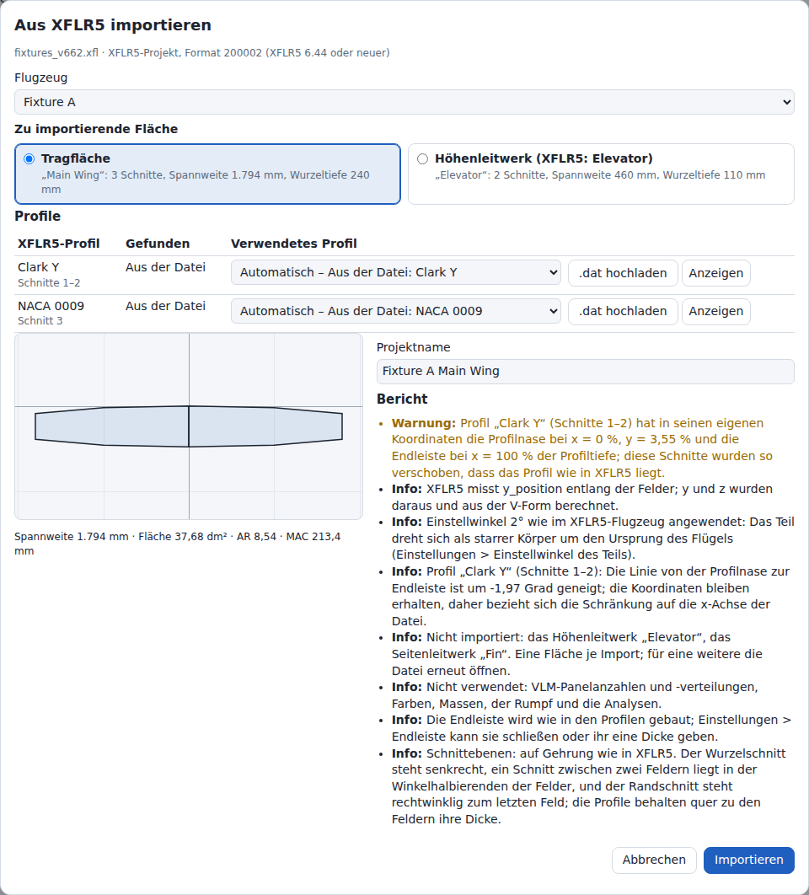

**Öffnen** (Open) liest neben Projektdateien auch Dateien von XFLR5 und von flow5. Der Import übernimmt eine Fläche aus einem Flugzeug der Datei und ersetzt damit das aktuelle Projekt: aus einer XFLR5-Datei die Tragfläche oder das Höhenleitwerk (XFLR5 nennt es Elevator), aus einer flow5-Datei einen ihrer Flügel (Abschnitt [flow5-Dateien](#flow5-dateien)). Er liest Dateien von XFLR5 6.10.01 bis 6.62 und von flow5 7.50 bis 7.57. Version 6.62 (24.03.2026) ist die letzte Version von XFLR5; flow5 ist sein Nachfolger (Version 7).

### Dateien

- **Öffnen** akzeptiert neben `.json` auch `.xfl` (XFLR5-Projekt), `.fl5` (flow5-Projekt) und `.xml` (XFLR5- oder flow5-Flugzeug- oder -Flügeldatei). Der Filter der Dateiauswahl listet `.json`-, `.xfl`-, `.fl5`- und `.xml`-Dateien sowie `.wpa`-Dateien, die **Öffnen** mit dem Grund abweist (übernächster Punkt). Ob die Dateiauswahl von Android und iOS `.xfl`- und `.fl5`-Dateien mit diesem Filter anzeigt, ist ungetestet.
- Ein `.xfl`-Projekt enthält die Flugzeuge mit Profilkoordinaten. Eine XML-Datei enthält die Flügelgeometrie in der in XFLR5 eingestellten Längeneinheit und nur die Profilnamen. Gelesen werden die Projektformate 200001 (XFLR5 6.10.01 bis 6.43) und 200002 (6.44 bis 6.62) sowie XML-Dateien von XFLR5 6.11 bis 6.62.
- Projekte von XFLR5 6.09 und älter (`.wpa`) werden nicht gelesen: rote Meldung mit dem Grund. flow5-Dateien: Abschnitt [flow5-Dateien](#flow5-dateien).
- Eine Datei, die sich nicht importieren lässt, ergibt die rote Meldung `<Datei> kann nicht geöffnet werden: <Grund>`, z. B. `Die Datei ist bei Byte 902 beschädigt oder abgeschnitten (in einem Flügel).` Der aktuelle Entwurf bleibt, und der Bearbeitungsverlauf erhält keinen Schritt.
- Eine `.xfl`-Datei, die hinter den Flugzeugen beschädigt ist, ergibt trotzdem ihre Flugzeuge. Die Profile fehlen dann, und der Bericht enthält die Warnung `Die Profile konnten nicht gelesen werden. Die Datei ist bei Byte … beschädigt oder abgeschnitten (in der Liste der Profile). Profile auswählen oder hochladen.`
- Wie **Öffnen** das Leseprogramm wählt (Dateiendung, erste Bytes, Text), die Gründe für Abweisungen und die Grenzen (`.xfl` bis 2000 MB, andere Dateien 100 MB): [[Dateiformate]], Abschnitt XFLR5-Import.

### Dialog

Der Dialog ist modal. Er öffnet sich sofort. **Importieren** (Import) bleibt gesperrt, solange die App die Profile des Flügels prüft. Der Bericht zeigt `Die Profile werden geprüft …`, bei vielen Profilen `Die Profile werden geprüft … 236 von 1.000`. Die Prüfungen laufen in Scheiben von 50 ms, sodass **Abbrechen** (Cancel), Esc und Scrollen währenddessen funktionieren. Bis sie enden, sind Profiltabelle, Grundrissvorschau und die Zeile darunter leer, ebenso der Projektname, solange keiner eingegeben ist. Ein Wechsel des Flugzeugs oder der Fläche prüft die Profile des neuen Flügels auf dieselbe Weise, und nichts vom vorigen Flügel bleibt stehen; Prüfungen, die innerhalb von 50 ms enden, etwa die schon geprüfter Profile, zeigen keine Fortschrittszeile und leeren nichts.

| Element | Inhalt und Wirkung |
| --- | --- |
| Titel und Quellzeile | Titel **Aus XFLR5 importieren** (Import from XFLR5), bei einer flow5-Datei **Aus flow5 importieren** (Import from flow5). Die Zeile darunter nennt den Dateinamen und die Art der Datei: `XFLR5-Projekt, Format 200002 (XFLR5 6.44 oder neuer)`, `XFLR5-Projekt, Format 200001 (XFLR5 6.10 bis 6.43)`, `XFLR5-Flugzeugdatei (XML), Längeneinheit: Millimeter`, `XFLR5-Flügeldatei (XML), Längeneinheit: Zoll`. Längeneinheiten: Millimeter, Zentimeter, Dezimeter, Meter, Zoll, Fuß. Eine andere Einheit lautet `Längen in Einheiten von 25 mm`. |
| **Flugzeug** (Plane) | Nur, wenn die Datei mehr als ein Flugzeug enthält. Listet die Namen der Flugzeuge (`Flugzeug 2` für ein Flugzeug ohne Namen). Das erste Flugzeug ist vorgewählt (flow5: das erste Flugzeug mit einem Flügel zum Importieren). Ein Wechsel des Flugzeugs behält die gewählte Fläche, wenn das neue Flugzeug sie hat, sonst gilt die Vorgabe: die Tragfläche, oder das Höhenleitwerk, wenn es die einzige Fläche ist. |
| **Zu importierende Fläche** (Surface to import) | Karten mit Optionsfeldern: **Tragfläche** (Main wing) und **Höhenleitwerk (XFLR5: Elevator)** (Horizontal stabilizer (XFLR5: Elevator)), dann **Zweiter Flügel** (Second wing, Doppeldecker) und **Seitenleitwerk** (Fin), wo das Flugzeug sie hat. Eine Karte zeigt den XFLR5-Namen des Flügels, die Anzahl der Schnitte, die Spannweite (2 × y des Randschnitts, in mm) und die Wurzeltiefe (mm): `„Main Wing“: 3 Schnitte, Spannweite 1.794 mm, Wurzeltiefe 240 mm`. Eine Fläche, die das Flugzeug nicht hat, ist gesperrt und nennt ihren Grund: `Dieses Flugzeug hat kein Höhenleitwerk.` In einer Flügeldatei lautet der Grund `Der Flügel in dieser Datei ist ein Höhenleitwerk (Typ ELEVATOR).` (Karte Tragfläche) oder `Der Flügel in dieser Datei ist kein Höhenleitwerk (Typ ELEVATOR).` Die Karte des Seitenleitwerks nennt statt der Spannweite seine Höhe: `„Fin“: 2 Schnitte, Höhe 160 mm, Wurzeltiefe 120 mm`. Vorgewählt: die Tragfläche, sonst die erste Fläche, die das Flugzeug hat. Das Seitenleitwerk wird aufrecht importiert, wie XFLR5 es baut: um 90° oder −90° um seinen Ursprung gerollt (**Rollwinkel des Teils**). Ein einfaches Seitenleitwerk ist die linke Hälfte des Teils, die **Exportieren** > **Flügelhälften** > **Nur linke Hälfte** allein schreibt; ein symmetrisches dreht beide Hälften als einen Körper (**Linke Hälfte** Mit der rechten Hälfte gedreht); ein doppeltes sind zwei Seitenleitwerke bei ±(Position y). Ein einfaches oder doppeltes Seitenleitwerk mit Einstellwinkel ist gesperrt: XFLR5 dreht es um z, und ein Teil dreht sich nur um x und y. Konstruktion: [[Dateiformate]], Abschnitt Seitenleitwerk. |
| **Profile** (Airfoils) | Die Profiltabelle (Abschnitt [Profiltabelle](#profiltabelle)). |
| Grundrissvorschau | Beide Hälften des Flügels. Fehlt ein Profil, zeichnet sie die geraden Felder zwischen den Schnitten, sonst den Umriss des gebauten Flügels. Darunter, wenn sich der Flügel bauen lässt: `Spannweite … mm · Fläche … dm² · AR … · MAC … mm` (AR und MAC wie im Abschnitt [Bildschirmaufbau](#bildschirmaufbau)). Die Vorschau passt sich nach jeder Wahl neu ein. Doppelklick passt sie ein, Ziehen verschiebt sie, Strg+Mausrad zoomt. Eine Mausraddrehung ohne Strg scrollt den Dialog. |
| **Projektname** (Project name) | Vorgabe: Name des Flugzeugs und Name des Flügels, z. B. `Fixture A Main Wing`. Eine Flügeldatei hat keinen Flugzeugnamen. Ohne jeden Namen: `Importierter Flügel` (englische Oberfläche: `Imported wing`). Höchstens 10 000 Zeichen. Das Feld folgt dem Flugzeug und der Fläche, bis ein Name eingegeben wird. Ein geleertes Feld folgt ihnen wieder: Die nächste Wahl trägt den vorgegebenen Namen ein, und **Importieren** verwendet ihn bei leerem Feld. |
| **Bericht** (Report) | Jeder Wert, den der Import ändert, umrechnet oder weglässt (Abschnitt [Bericht](#bericht)). |
| **Abbrechen** | Schließt den Dialog. Nichts ändert sich. |
| **Importieren** | Importiert die Fläche wie angezeigt. Gesperrt, solange der Bericht einen Fehler enthält. Die Beschriftung lautet `Importieren`, wenn jeder Profilname ein verwendbares Profil hat, sonst `Importieren (1 Profil fehlt)` oder `Importieren (2 Profile fehlen)`: die Anzahl der Profilnamen ohne verwendbares Profil. |

- Der Tastaturfokus beginnt bei **Flugzeug** oder, wenn die Datei ein Flugzeug enthält, bei der gewählten Fläche, nicht im Feld **Projektname**. Enter auf einer Fläche importiert nicht. Enter im Feld **Projektname** importiert, solange **Importieren** aktiv ist. Esc bricht ab.
- Jede Wahl berechnet den Flügel neu: Profiltabelle, Vorschau, Name, Bericht und **Importieren** folgen ihr.
- Ein Flügel über den Größenwarnungen des Abschnitts [Projektgröße](#projektgröße) wird im Dialog nicht gebaut. Die Vorschau zeichnet gerade Felder, und der Bericht enthält die Warnung `Großes Projekt`.

### Profiltabelle

Die Tabelle hat eine Zeile je verschiedenem Profilnamen der rechten Seite des gewählten Flügels, in der Reihenfolge der Schnitte.

| Spalte | Inhalt |
| --- | --- |
| **XFLR5-Profil** (XFLR5 airfoil; **flow5-Profil** (flow5 airfoil)) | Der Name, wie er in der Datei steht. Zugeordnet wird er mit führenden, nachgestellten und doppelten Leerzeichen; der Browser zeigt diese Leerzeichen nicht an. Ein leerer Name lautet `(ohne Namen)`. Darunter die Schnitte, die ihn verwenden: `Schnitt 3` oder `Schnitte 1–2, 5` (1 = Wurzel). |
| **Gefunden** (Found) | Die Quelle, die die App für den Namen gefunden hat (Tabelle unten), oder nach einer Wahl **Gewählt** (Picked) oder **Nicht verwendbar** (Not usable; rot: das gewählte Profil besteht die Prüfungen nicht). |
| **Verwendetes Profil** (Airfoil used) | Eine Auswahlliste. Der erste Eintrag ist die automatische Wahl, `Automatisch – Aus der Datei: Clark Y`, oder `Profil wählen`, wenn nichts gefunden wurde. Dann folgen die Einträge des NACA-Generators (NACA: National Advisory Committee for Aeronautics) für die Namen der Tabelle, die Profile der Datei, die hochgeladenen Dateien, die Profile des aktuellen Projekts, die Bibliotheksprofile und die NACA-Vorgaben des Abschnitts [Bibliothek](#bibliothek). Ein Name, der mit einer NACA-Bezeichnung beginnt, z. B. `NACA0014_Flap`, wird nicht automatisch zugeordnet; seine Liste bietet `NACA-Generator: NACA 0014` zuerst an. Über 20 000 Einträgen (Zeilen × Profile) enthält eine Liste nur ihren gewählten Eintrag, bis sie den Fokus erhält oder angeklickt wird. |
| **.dat hochladen** (Upload .dat) | Öffnet eine Dateiauswahl (Abschnitt unten). |
| **Anzeigen** (View) | Öffnet die Vorschau des verwendeten Profils: Name und Quellenangabe sind schreibgeschützt, einzige Schaltfläche ist **Schließen** (Close). Gesperrt, solange für die Zeile weder ein Profil gefunden noch eines gewählt ist. Bei **Nicht verwendbar** zeigt die Vorschau die gewählte Datei mit ihrem Fehler; eine abgewiesene Datei hat keine Punkte. |

Die Spalte der beiden Schaltflächen hat die Überschrift **Aktionen** (Actions), nur für Screenreader sichtbar.

Die automatische Wahl ist die erste Quelle in dieser Reihenfolge, deren Profil die Prüfungen besteht:

| Reihenfolge | **Gefunden** | Quelle |
| --- | --- | --- |
| 1 | Aus der Datei | Das Profil der `.xfl`-Datei mit genau diesem Namen (ein späteres Profil desselben Namens ersetzt ein früheres). Ein leerer Name findet keines. XML-Dateien enthalten keine Profile. |
| 2 | Hochgeladene Datei | Eine in diesem Dialog hochgeladene Datei, deren Namenszeile dem Namen gleicht oder deren Dateiname ohne Endung ihm gleicht. Gleich, dann gleich ohne die Leerzeichen an beiden Enden. |
| 3 | Aktuelles Projekt | Ein Profil des aktuellen Projekts mit diesem Namen (gleich, dann ohne die Leerzeichen an beiden Enden). |
| 4 | Bibliothek | Ein Bibliotheksprofil mit diesem Namen (gleich, dann ohne die Leerzeichen an beiden Enden). |
| 5 | NACA-Gleichungen | Der Name ist eine NACA-Bezeichnung des Generators, z. B. `NACA 0009`, `NACA0009`, `0009` (gültige Bezeichnungen: Abschnitt [NACA-Generator](#naca-generator)). |
| 6 | Ähnlicher Name | Ein Name, der dem Namen eines hochgeladenen Profils, eines Profils des aktuellen Projekts oder eines Bibliotheksprofils gleicht, wenn Groß- und Kleinschreibung, Leerzeichen, `-` und `_` unberücksichtigt bleiben. Die Zelle erscheint in der Warnfarbe, und der Bericht enthält eine Warnung. |
| – | Fehlt | Keine Quelle besteht die Prüfungen. Die Zelle ist rot, und **Importieren** ist gesperrt. |

- Die Prüfungen sind die der Vorschau in der Registerkarte **Profile** (Abschnitt [Hochladen](#hochladen)), dazu eine Prüfung, dass die NURBS-Kurve durch die Punkte sich weder kreuzt noch in x zurückläuft. Eine Quelle, die durchfällt, wird übergangen. Besteht keine Quelle, nennt der Fehler die erste, die durchgefallen ist, und ihr Problem.
- Ein Profil einer `.xfl`-Datei ist seine Grundform ohne Klappenausschlag. Der Bericht nennt eine Klappe des Profils (Abschnitt [Bericht](#bericht)).
- Über 200 Profilnamen zeigt die Tabelle 200 Zeilen, zuerst die Zeilen ohne verwendbares Profil und die gewählten Zeilen. Darunter: `… weitere Profilnamen sind nicht aufgeführt; hochgeladene .dat-Dateien werden ihnen über den Namen zugeordnet.` Über 10 000 Namen oder wenn die Profile der Datei für die Namen ohne Wahl mehr als 1 000 000 Punkte haben, wird kein Name aufgelöst, und der Bericht enthält den Fehler `Die Profile dieses Flügels überschreiten die Grenzen eines Projekts (10.000 Profile, 1.000.000 Punkte zusammen).` Über 10 000 Namen ist die Tabelle außerdem leer.

**.dat hochladen**:

- Die Dateiauswahl nimmt die Dateitypen des Hochladens von Profilen (`.dat`, `.txt`, `.cor`, `.xml`, `.htm`, `.html`, `.csv`). Eine Datei über 20 MB wird abgewiesen wie im Abschnitt [Hochladen](#hochladen).
- Die Datei wird gelesen und geprüft wie in der Registerkarte **Profile**. Sie wird zur Wahl ihrer Zeile. Die anderen Zeilen finden sie über den Namen (Tabelle oben). Sie kommt nur ins Projekt, wenn ein Schnitt sie verwendet.
- Eine nicht verwendbare Datei zeigt **Nicht verwendbar** in ihrer Zeile, wenn eine Zeile sie verwendet, sonst eine Info-Zeile im Bericht.
- Jede hochgeladene Datei bleibt bis zum Schließen des Dialogs in der Liste jeder Zeile als `Hochgeladen: <Datei>`.
- Eine Statusmeldung, nur für Screenreader sichtbar, gibt das Ergebnis an: `test12.dat wird für „TEST 12“ verwendet.` oder `test12.dat ist nicht verwendbar: <Grund>`. Screenreader sind ungetestet.
- **.dat-Dateien hochladen …** (Upload .dat files…) über der Tabelle nimmt mehrere Dateien auf einmal. Jede Zeile findet dann ihre Datei über den Namen (Reihenfolge 2 der Tabelle oben); keine Zeile wählt eine. Der Hinweis neben der Schaltfläche: `Jeder Profilname erhält die Datei, deren Profil- oder Dateiname zu ihm passt.` Die Zeile für Screenreader: `2 Dateien hochgeladen; 2 Profilnamen verwenden sie.`

### Lage der Profile

XFLR5 zeichnet die Koordinaten eines Profils, wie sie sind: Die x-Achse der Datei liegt auf der Profilsehne des Schnitts. Wingdesigner legt die Profilnase eines Profils auf den Schnittpunkt und skaliert das Profil auf die Profiltiefe 1. Der Import gleicht das aus, wenn die Koordinaten bekannt sind, die XFLR5 verwendet hat:

| Profil | Schnitte |
| --- | --- |
| Profil der `.xfl`-Datei, hochgeladene `.dat`-Datei, NACA-Profil des Generators, Profil des aktuellen Projekts, das aus den NACA-Gleichungen erzeugt ist (Profile aus dem NACA-Generator oder den NACA-Vorlagen der Registerkarte **Profile**, aus dem Assistenten und im Beispielflügel; es erhält die Lage des erzeugten Schnitts seiner NACA-Bezeichnung) | Verschoben und skaliert, sodass jeder Profilpunkt dort liegt, wo XFLR5 ihn zeichnet. Ausnahme ist ein gewölbtes NACA-Profil: Der Generator addiert die Dicke quer zur Skelettlinie, XFLR5 senkrecht, daher weichen die Formen bei 250 mm Profiltiefe nahe der Profilnase um 0,28 mm (NACA 2412) bis 1,41 mm (NACA 23018) ab. |
| Anderes Profil des aktuellen Projekts, Bibliotheksprofil | Behalten die Werte der Datei: ihre Koordinaten in XFLR5 sind unbekannt. Ein Bibliotheksprofil mit geneigter Profilsehne (Clark Y 2,00°, USA 35B 1,57°) erhält eine Warnung: Hat XFLR5 eine Kopie mit waagrechter Profilsehne verwendet, wie die UIUC-Datei `clarky.dat`, stehen seine Schnitte um diesen Winkel weiter mit der Nase nach oben als in XFLR5. Die `.dat`-Datei hochladen, die XFLR5 verwendet hat. |

- Beispiel: `fixtures_v662.xfl`, Flugzeug Fixture A. Das Clark Y der Datei hat seine Profilnase 3,55 % der Profiltiefe über der x-Achse. Der Wurzelschnitt (Profiltiefe 240 mm) wird um 8,53 mm entlang seiner Normalen verschoben. Die Schnitttabelle weicht dann um diesen Betrag von der Flügeltabelle von XFLR5 ab.
- Jede Abweichung wird angewendet, auch eine kleine. Die Profilnase ist der Punkt kleinsten x auf der angepassten Kurve, die vor den Nasenpunkt der Datei reichen kann: um 0,0016 % der Profiltiefe beim Clark Y des Beispiels, um 0,003 bis 0,1 % bei gewölbten NACA-Schnitten. Die Schnitte verschieben sich auch darum.
- Der Bericht nennt jedes Profil, das Schnitte um mehr als 0,1 % der Profiltiefe verschiebt (0,25 mm bei 250 mm Profiltiefe): Info, und eine Warnung über 2 % der Profiltiefe. Kleinere Verschiebungen gelten ohne Berichtszeile.
- Ein Bibliotheksprofil, bei dem x oder y der Profilnase in seinen eigenen Koordinaten mehr als 2 % der Profiltiefe von 0 entfernt liegt oder dessen Profiltiefe um mehr als 2 % von 1 abweicht, erhält eine Info-Zeile: mitgeliefertes Clark Y 3,55 %, USA 35B 2,87 %. Dasselbe gilt für ein aus der Bibliothek übernommenes Profil des aktuellen Projekts. Das Hochladen der `.dat`-Datei, die XFLR5 verwendet hat, setzt die Schnitte wie XFLR5.
- Ein Profil des aktuellen Projekts aus einem XFLR5-Import oder einem Upload ist auf die Profiltiefe 1 skaliert gespeichert; seine eigenen Koordinaten sind verloren. Es erhält eine Info-Zeile: `Profil „Clark Y“ (Schnitte 1–2) des aktuellen Projekts ist auf die Profiltiefe 1 skaliert gespeichert, mit der Profilnase bei (0, 0); diese Schnitte behalten daher die Tabellenwerte. …` Beispiel: Die XML-Datei eines Flugzeugs, geöffnet, während das Projekt aus dessen `.xfl`-Import offen ist.
- Koordinaten, die nicht in Einheiten der Profiltiefe angegeben sind (x oder y der Profilnase mehr als 10 % der Profiltiefe von 0 entfernt, eine Profiltiefe unter 0,5 oder über 2 oder eine als Prozent der Profiltiefe gelesene Datei mit einer Profiltiefe außerhalb von 98 bis 102; z. B. eine Datei in Millimetern): Ein Profil einer `.xfl`-Datei besteht die Prüfung nicht (`Die Koordinaten sind nicht in Einheiten der Profiltiefe angegeben (Profilnase bei x = …, y = …; Endleiste bei x = …).`), und die anderen Quellen der Tabelle im Abschnitt [Profiltabelle](#profiltabelle) werden versucht. Eine Quelle, die besteht, wird verwendet, mit der Warnung `Profil „<name>“ aus der Datei besteht die Prüfung nicht: … Stattdessen wird „<match>“ verwendet.` Besteht keine, fehlt die Zeile: `Profil „<name>“ (…) aus der Datei besteht die Prüfung nicht: Die Koordinaten sind nicht in Einheiten der Profiltiefe angegeben (…). Eine .dat-Datei hochladen oder ein Profil wählen.` Eine hochgeladene Datei wird ohne Verschiebung verwendet, auf die Profiltiefe 1 skaliert, mit einer Warnung.

### Bericht

Der Bericht listet jeden Wert, den der Import ändert, umrechnet oder weglässt. Fehler stehen zuerst, dann Warnungen, dann Infos. Jede Zeile beginnt mit ihrem Schweregrad (**Fehler**, **Warnung**, **Info**). Zeilen über Schnitte nennen sie mit Nummer (`Schnitt 3`, `Schnitte 1–2, 5`; 1 = Wurzel).

- Zeilen einer Art über Schnitte oder Felder zeigen höchstens 5; eine weitere Zeile nennt die Anzahl der übrigen (`Weitere auseinandergeschobene Schnitte: 3.`). Der Bericht zeigt höchstens 200 Zeilen (`Weitere, nicht angezeigte Berichtszeilen: 12.`).
- Ein Fehler sperrt **Importieren**. Warnungen und Infos tun das nicht.
- Fehler und Warnungen des Aufbaus des Flügels (wie in der Registerkarte **Prüfungen** (Checks)) erscheinen als Warnungen: `Der Flügel lässt sich noch nicht bauen: …`. Sie sperren **Importieren** nicht, wie bei **Öffnen**.

| Schweregrad | Zeilen | Beispiel |
| --- | --- | --- |
| Fehler | Ein Profilname ohne verwendbares Profil. Ein Flügel, der sich nicht abbilden lässt: weniger als 2 Schnitte, fallendes `y_position`, Profiltiefe 0 oder kleiner, ein Wert, der keine Zahl ist, Werte außerhalb der Grenzen eines Projekts. Mehr Profile, als ein Projekt enthält. | `Profil „E423“ (Schnitte 1–2) fehlt: eine .dat-Datei hochladen oder ein Profil wählen.` |
| Warnung | Eine Warnung der Profilprüfungen, einmal je verwendetem Profil. Ein Profil, das über einen ähnlichen Namen gefunden wurde. Ein Profil, das seine Schnitte um mehr als 2 % der Profiltiefe verschiebt. Eine Klappe eines Profils nicht bei 0° (ohne Ausschlag importiert). Ein Bibliotheksprofil mit geneigter Profilsehne. Ein Feld mit mehr als 10° V-Form in einem Teil, das mit Schnittebenen **Senkrecht** importiert wird. Schnitte bei einem y, auseinandergeschoben. Eine auf 1 mm erhöhte Profiltiefe. Verschiedene Profile links und rechts. Ein Profil der Datei, das die Prüfung nicht besteht, wenn eine andere Quelle verwendet wird. Profile einer `.xfl`, die nicht gelesen werden konnten. Aufbauwarnungen des Flügels. Warnungen des XML-Leseprogramms. | `Profil „Clark Y“ (Schnitte 1–2) hat in seinen eigenen Koordinaten die Profilnase bei x = 0 %, y = 3,55 % und die Endleiste bei x = 100 % der Profiltiefe; diese Schnitte wurden so verschoben, dass das Profil wie in XFLR5 liegt.` |
| Info | Was umgerechnet oder angewendet wird: V-Form, Einstellwinkel, Position, eine Lücke an der Wurzel, ganze Umdrehungen der Schränkung, Längeneinheiten, die Schnittebenen. Ein Profil, das seine Schnitte um höchstens 2 % der Profiltiefe verschiebt. Eine Klappe bei 0°. Ein Bibliotheksprofil, dessen Koordinaten neben (0, 0) liegen, auch als Profil des aktuellen Projekts. Ein Profil des aktuellen Projekts aus einem XFLR5-Import oder einem Upload. Eine nicht verwendbare hochgeladene Datei, die keine Zeile gewählt hat. Eine geneigte Profilsehne eines anderen Profils. Flächen, die nicht importiert werden. Daten, die nicht verwendet werden. Die Endleiste. | `Einstellwinkel 2° wie im XFLR5-Flugzeug angewendet: Das Teil dreht sich als starrer Körper um den Ursprung des Flügels (Einstellungen > Einstellwinkel des Teils).` |

- Mit zwei Schnitten bei einem y wechselt XFLR5 das Profil abrupt. Wingdesigner braucht streng steigendes y: Der innere Schnitt wird um min(0,5 mm, ¼ des inneren Feldes) nach innen verschoben, mit der Warnung `Die Schnitte 3 und 4 liegen beide bei y = 250 mm; Schnitt 3 wurde um 0,5 mm nach innen verschoben.` Mit Schnittebenen **Auf Gehrung** teilen sich beide Schnitte die winkelhalbierende Ebene der Felder um sie herum, wie in XFLR5.
- Ein Teil, das mit Schnittebenen **Senkrecht** importiert wird (eines, dessen Gehrungsebenen die Fläche falten oder ein Profil mehr als auf das 2-Fache strecken würden), ergibt für ein Feld mit einer V-Form über 10° `Das Feld von Schnitt 2 bis 3 hat 35° V-Form: Quer zum Feld haben die senkrechten Schnitte 82 % der Dicke in XFLR5.` XFLR5 baut die Schnitte in Gehrungsebenen, Wingdesigner dann senkrecht: Die Dicke quer zum Feld beträgt cos(V-Form) mal die Dicke in XFLR5. Mit Schnittebenen **Auf Gehrung** ist die Dicke die von XFLR5, und die Warnung erscheint nicht.
- Jede Zeile mit ihrer Bedingung und die Abbildung der Werte: [[Dateiformate]], Abschnitt XFLR5-Import.
- Die letzten Info-Zeilen jedes Berichts: `Nicht verwendet: VLM-Panelanzahlen und -verteilungen, Farben, Massen, der Rumpf und die Analysen.` (VLM: Vortex-Lattice-Verfahren, vortex lattice method, ein Analyseverfahren von XFLR5) und `Die Endleiste wird wie in den Profilen gebaut; Einstellungen > Endleiste kann sie schließen oder ihr eine Dicke geben.`

### Importieren, Abbrechen und Rückgängig

**Importieren** ersetzt das aktuelle Projekt, wie es **Neu** (New) tut: Name, Profile, Schnitte, Leitkurven und Einstellungen. Es ist ein Rückgängig-Schritt.

| Punkt | Ergebnis |
| --- | --- |
| Schnitte | Einer je XFLR5-Schnitt, von der Wurzel zum Rand; von zwei gleichen Schnitten bei einem y nur der äußere (Kennungen `s1`, `s2`, … in der Projektdatei). Werte auf 4 Nachkommastellen gerundet (0,0001 mm, 0,0001°). Mit Schnittebenen **Auf Gehrung** erhält ein Schnitt, den sein Profil anders verschiebt als den nächsten Schnitt (ein gewölbter NACA-Schnitt, ein Profil neben (0, 0)), die V-Form von XFLR5 als **Feldwinkel**, sodass die Ebenen die von XFLR5 bleiben. |
| Profile | Jedes verwendete Profil. Gleiche Profile mehrerer Zeilen werden zusammengelegt. Ein Profil eines `.xfl`-Projekts zeigt in der Registerkarte **Profile** unter seinem Namen `XFLR5: <Dateiname>` oder seine Quellenangabe, und die Projektdatei behält einen Vermerk zur Herkunft, z. B. `Profil „Clark Y“ aus dem XFLR5-Flugzeug „Fixture A“; Grundform ohne Klappenausschlag.` Hochgeladene Profile, Bibliotheksprofile, NACA-Profile und Profile des aktuellen Projekts behalten ihre eigene Quelle. |
| **Drehpunkt der Schränkung (Anteil der Profiltiefe)** (Twist pivot (fraction of chord)) | 0,25, der Punkt, um den XFLR5 einen Schnitt schränkt |
| **Interpolation in Spannweitenrichtung** (Spanwise interpolation) | **Gerade Felder (gerade Linien zwischen den Schnitten, wie XFLR5)** (Straight panels (straight lines between sections, as XFLR5)) |
| **Schnittebenen** (Section planes) | **Auf Gehrung (senkrecht zu den Feldern, wie XFLR5)** (Mitred (square to the panels, as XFLR5)), auch für ein Teil mit Einstellwinkel. **Senkrecht (y = konstant)** (Vertical (y = const)) dort, wo Gehrungsebenen die Fläche falten oder ein Profil mehr als auf das 2-Fache strecken würden. Der Bericht nennt, welche und warum: `Schnittebenen: …` ([[Dateiformate]], Abschnitt XFLR5-Import, Schritt 6). |
| **Einstellwinkel des Teils (°, positiv = Nasenleiste hoch)** (Part tilt (°, positive = leading edge up)) | der Einstellwinkel des Flügels im XFLR5-Flugzeug, um ganze Umdrehungen auf −180 bis 180° reduziert; das Teil dreht sich um den Ursprung des Flügels, wie XFLR5 es dreht. Die Schnitte halten die Werte des ungedrehten Teils, verschoben um die Position des Flügels im Flugzeug. **Rollwinkel des Teils (°, positiv = rechter Randbogen hoch)** (Part roll (°, positive = right tip up)): 0. |
| **Endleiste** (Trailing edge) | **Wie in den Profildateien** (As in the airfoil files) |
| **Flügelende** (Wing tip) | **Flach (am Randschnitt abgeschnitten)** (Flat (cut at the tip section)) |
| **Gespiegelte Hälfte zeigen (y < 0)** (Show mirrored half (y < 0)) | an |
| Leitkurven | aus, Punkte an den Schnittkanten |
| Übrige Einstellungen | Vorgaben: 60 **Stationen je Profilseite** (Chordwise stations per surface), 8 **Stationen je Feld mit Leitkurve, glatter Interpolation oder linearen Feldern auf Gehrung** (Spanwise stations per panel with guides, smooth mode or mitred linear panels), **Zentripetal (empfohlen)** (Centripetal (recommended)) |

- Die Registerkarte **Schnitte** (Sections) öffnet sich, und die 3D-Ansicht und der Grundriss-Editor passen sich dem neuen Flügel an. Die automatische Sicherung speichert das Projekt (Abschnitt [Speicherung](#speicherung)).
- **Rückgängig** (Undo) stellt das vorherige Projekt wieder her, **Wiederholen** (Redo) den Import.
- Die Meldung lautet `Tragfläche „Main Wing“ von „Fixture A“ aus fixtures_v662.xfl importiert: 3 Schnitte, 2 Profile.` Für das Höhenleitwerk: `Höhenleitwerk „Elevator“ von … importiert`. Ein Flugzeug ohne Namen ergibt `Tragfläche „Main Wing“ aus <Datei> importiert: …`. Die erste Warnung des Berichts folgt in derselben Meldung, bei weiteren Warnungen `(2 weitere Warnungen im Importbericht.)`. Die Warnungen des XML-Leseprogramms bleiben im Bericht. Die Meldung hat mehr als 66 Zeichen und bleibt daher 60 ms je Zeichen (Abschnitt [Bildschirmaufbau](#bildschirmaufbau), Zeile Meldungen).
- **Abbrechen** und Esc ändern nichts und fügen keinen Rückgängig-Schritt hinzu.

### flow5-Dateien

- **Öffnen** liest flow5-Projekte (`.fl5`) der Projektformate 500750 (flow5 7.50 bis 7.53) und 500754 (7.54 bis 7.57) sowie flow5-Flugzeug- und -Flügeldateien (`.xml`, Wurzelelement `xflplane` oder `xflwing`). Andere Formate werden mit dem Grund abgewiesen: `Die Datei ist ein flow5-Projekt im Format 500006, geschrieben von flow5 7.26 oder älter: in einem aktuellen flow5 öffnen und speichern oder das Flugzeug als XML exportieren.`
- Die Quellzeile: `flow5-Projekt, Format 500754 (flow5 7.54 oder neuer)`, `flow5-Flugzeugdatei (XML), Längeneinheit: Millimeter`.
- **Flugzeug** (Plane) listet die Flugzeuge der Datei in ihrer Reihenfolge; flow5 sortiert sie nach Namen. Ein Flugzeug aus einem Dreiecksnetz (STL) hat keinen Flügel und bietet keine Fläche an; der Bericht nennt den Fehler `Flugzeug „Mesh plane“ hat keinen Flügel zum Importieren.` Der Dialog öffnet mit dem ersten Flugzeug, das einen Flügel hat.
- **Zu importierende Fläche** (Surface to import) listet jeden Flügel des Flugzeugs in der Reihenfolge der Datei: **Tragfläche** (Main wing), **Höhenleitwerk (flow5: Elevator)** (Horizontal stabilizer (flow5: Elevator)), **Seitenleitwerk** (Fin), **Weiterer Flügel** (Other wing), nummeriert, wenn eine Art mehrfach vorkommt (**Tragfläche 1**, **Tragfläche 2**). Jeder Flügel lässt sich importieren, außer einem einseitigen Flügel, der um z gedreht ist; diese Drehung kann die Lage eines Teils nicht nachbilden: `Ein einseitiger Flügel, um 3° um z gedreht (Ry_angle): Ein Teil dreht sich nur um x und y.`
- Ein Seitenleitwerk (ein einseitiger Flügel) wird als die Hälfte importiert, die flow5 baut: die linke Hälfte des Teils, mit **Rollwinkel des Teils** 90° bei einem Seitenleitwerk bei −90°. Seine gespiegelte rechte Hälfte liegt bei einem Seitenleitwerk bei y = 0 deckungsgleich darauf; bei einem schräg stehenden einseitigen Flügel ist sie ein zweiter Flügel, den flow5 nicht baut. Die Exportoption **Nur linke Hälfte** (Left half only) schreibt allein die Hälfte von flow5.
- Die Winkel des Flügels werden zur starren Lage des Teils (**Einstellungen** > **Einstellwinkel des Teils** und **Rollwinkel des Teils**, um den Ursprung des Flügels): `Ry_angle` der Einstellwinkel, `Rx_angle` der Rollwinkel. flow5 rollt beide Hälften eines zweiseitigen Flügels als einen Körper: Bei einem gerollten Flügel stellt der Import **Einstellungen** > **Linke Hälfte** (Left half) auf **Mit der rechten Hälfte gedreht (ganzer Flügel, wie flow5)** (Turned with the right half (whole wing, as flow5)), und der Bericht sagt das. Beide Hälften der gerollten Flügel der Testdateien liegen innerhalb von 0,01 mm am Analysenetz von flow5.
- Ein `.fl5`-Projekt enthält die Profile (**Gefunden**: **Aus der Datei**). Eine XML-Datei nennt ihre Namen oder nennt `.dat`-Dateien neben ihr: flow5 7.54 und neuer schreibt je Profil eine `.dat`-Datei neben die XML-Datei. Sie werden mit **.dat-Dateien hochladen …** hochgeladen; jede Zeile nimmt die Datei ihres Namens.
- Einzelheiten: [[Dateiformate]], Abschnitt flow5-Import.

### Dialog auf schmalen Bildschirmen

Der Dialog ist höchstens so hoch wie das Fenster minus 16 px, und sein Inhalt scrollt in ihm.

- Bis zu einer Fensterbreite von 860 px liegt die Grundrissvorschau über dem Projektnamen und dem Bericht (1 Spalte).
- Bis zu einer Fensterbreite von 800 px wird jede Zeile der Profiltabelle zu einer Karte ohne Kopfzeile: Name, Schnitte und **Gefunden** in der ersten Zeile, darunter die Liste **Verwendetes Profil** über die volle Breite, dann die Schaltflächen **.dat hochladen** und **Anzeigen**. Die 4 Spalten brauchen etwa 800 px.
- Die beiden Flächenkarten stehen nebeneinander, wenn der Dialog zwei Karten von mindestens 220 px fasst, sonst untereinander.
- Getestet in Chromium mit der Smartphone-Emulation des Pixel 7 bei einem Fenster von 360 × 780 px: Dialog und Seite haben keinen waagerechten Bildlauf, jedes Bedienelement liegt im Dialog, **Importieren** lässt sich nach dem Scrollen antippen, und die Meldung nach dem Import liegt in der 3D-Ansicht. Nicht auf einem Smartphone getestet.

### XFLR5-Dateien beim Hochladen von Profilen

Die Registerkarte **Profile** weist XFLR5-Dateien als Profile ab, mit der roten Meldung `<Datei> ist eine XFLR5-Datei, kein Profil. Mit „Öffnen“ lässt sich daraus ein Flügel importieren.`

- Die Abweisung gilt für `.xfl`-Projekte jeder Größe (die ersten 4 Bytes sind das Projektformat 200001 oder 200002) und für jede Datei bis 20 MB, deren Text das Element `<explane` enthält (XFLR5-Flugzeug- und -Flügeldateien im XML-Format). Jede andere Datei über 20 MB wird wegen ihrer Größe abgewiesen (Abschnitt [Hochladen](#hochladen)).
- Mit **Dateien wählen** (Choose files) gewählte oder abgelegte Dateien werden einzeln geprüft. Eine abgewiesene Datei öffnet keine Vorschau; die übrigen Dateien derselben Wahl öffnen weiterhin eine.
- Eingefügter Text wird darauf nicht geprüft.
- **.dat hochladen** im Importdialog weist dieselben Dateien ab. Die abgewiesene Datei wird zur Wahl ihrer Zeile: Die Zeile zeigt **Nicht verwendbar**, der Bericht enthält den Fehler `Profil „<name>“ (<Schnitte>): Das gewählte Profil besteht die Prüfung nicht: <Datei> ist eine XFLR5-Datei, kein Profil. Mit „Öffnen“ lässt sich daraus ein Flügel importieren.`, und **Importieren** bleibt gesperrt, bis die Zeile eine andere Wahl erhält. Die Statusmeldung für Screenreader nennt die Abweisung. Nach einer anderen Wahl bleibt die Abweisung als Info-Zeile.

## Speicherung

- Nach jeder Änderung speichert der Browser das Projekt in `localStorage` unter dem Schlüssel `wingdesigner.project.v1`. Der nächste Aufruf stellt es wieder her.
- Gespeichert werden nur Projekte, die die Prüfung von **Öffnen** (Open) bestehen. Sonst bleibt das letzte gültige Projekt gespeichert.
- Ein gespeichertes Projekt, das sich nicht laden lässt, bleibt unter `wingdesigner.project.v1.rejected` erhalten. Eine Fehlermeldung erscheint, und der Assistent öffnet sich wie beim ersten Aufruf. Ist für diese Kopie kein Platz, bleibt das Projekt unter `wingdesigner.project.v1`, und die automatische Sicherung bleibt für die Sitzung aus; die Statusleiste zeigt von Anfang an `Automatische Sicherung aus: „Speichern“ verwenden`.
- Die aktive Registerkarte steht unter `wingdesigner.tab`.
- Die gewählte Sprache steht unter `wingdesigner.language` (`en` oder `de`), sobald die Nutzerin oder der Nutzer unter **Einstellungen** (Settings) eine gewählt hat (Abschnitt [Sprache](#sprache)).
- Ohne gespeichertes Projekt (erster Aufruf) öffnet sich der Assistent. Solange dieser Assistent offen ist, wird nichts gespeichert; ein Neuladen zeigt den Assistenten erneut.
- Bei gesperrtem Speicher (privates Fenster) existiert das Projekt nur im geöffneten Browser-Tab. **Speichern** (Save) sichert es als Datei.
- Weist der Browser das Projekt ab (Browser behalten etwa 5 000 000 Zeichen je Website), erscheint einmal die rote Meldung `Die automatische Sicherung ist aus: Der Browserspeicher hat das Projekt abgelehnt (… Zeichen; Browser speichern etwa 5.000.000 je Website). Um es zu behalten, „Speichern“ verwenden.` Die Statusleiste zeigt `Automatische Sicherung aus: „Speichern“ verwenden`, bis eine automatische Sicherung wieder gelingt; dann erscheint die Meldung `Die automatische Sicherung funktioniert wieder.`
- Solange die automatische Sicherung scheitert, steht der Zeitpunkt des ersten Fehlschlags unter dem Schlüssel `wingdesigner.project.v1.stale`. Der nächste Aufruf stellt das zuletzt gespeicherte Projekt wieder her und meldet `Dies ist das Projekt im zuletzt gespeicherten Stand; die automatische Sicherung hörte am … auf, weil der Browserspeicher voll war, und spätere Änderungen wurden nicht gespeichert.` Bringt das wiederhergestellte Projekt die Warnung `Großes Projekt` mit, erscheinen beide Texte in einer Meldung in der Fehlerfarbe.
- Der Bearbeitungsverlauf (**Rückgängig** (Undo) und **Wiederholen** (Redo)) wird nicht gespeichert.
- Ein gespeichertes Projekt des Formats Version 2, dessen Einstellwinkel der XFLR5-Import in die Schnitte eingerechnet hat, wird mit diesem Winkel als **Einstellwinkel des Teils** (Part tilt) wiederhergestellt, mit dem Hinweis `Der Einstellwinkel von 3°, den der XFLR5-Import in die Schnitte eingerechnet hatte, ist ein starrer Einstellwinkel des ganzen Teils (Einstellungen > Einstellwinkel des Teils); die Schnitte halten die Werte des ungedrehten Teils.` **Öffnen** einer solchen Datei ergänzt denselben Text nach `<Datei> geöffnet.`. Mit Schnittebenen **Auf Gehrung** ergänzt der Hinweis `Mit Schnittebenen auf Gehrung ändert sich die Form: Der eingerechnete Einstellwinkel war nur für senkrechte Ebenen genau, der starre Einstellwinkel setzt das Teil wie XFLR5.`
- Die Einrechnung bleibt, wenn eine Leitkurve eingeschaltet oder bearbeitet ist: `Der Einstellwinkel von 3° des XFLR5-Imports bleibt in die Schnitte eingerechnet: Eine Leitkurve ist eingeschaltet oder bearbeitet, und Leitkurven halten nur x.` Sie bleibt auch, wenn eine Schränkung ohne sie außerhalb von ±360° läge: `Der Einstellwinkel von 3° des XFLR5-Imports bleibt in die Schnitte eingerechnet: Ohne ihn läge eine Schränkung außerhalb von ±360°.` Sie bleibt auch, wenn ein Schnitt ohne sie außerhalb von ±1 000 000 mm läge (eingerechnete Schnitte nahe der Koordinatengrenze): `Der Einstellwinkel von 45° des XFLR5-Imports bleibt in die Schnitte eingerechnet: Ohne ihn läge ein Schnitt außerhalb von ±1.000.000 mm.` Eine aktualisierte Wiederherstellung wird sofort gespeichert; der nächste Start zeigt keinen Hinweis. Ein solches Projekt behält mit Schnittebenen **Auf Gehrung** die Warnung aus Abschnitt [Prüfungen](#prüfungen). Regeln: [[Dateiformate|Dateiformate]], Abschnitt Projekt-JSON, Aktualisierung von Dateien der Version 2.

## Sprache

Die App spricht Englisch oder Deutsch.

| Punkt | Verhalten |
| --- | --- |
| Auswahlliste | **Language / Sprache** in der ersten Gruppe der Registerkarte **Einstellungen** (Settings), mit den Werten **English** und **Deutsch**. Gruppe und Liste tragen in beiden Sprachen dieselbe Beschriftung, sodass sich die Liste in jeder Sprache finden lässt. |
| Start | Die im Browser gespeicherte Wahl. Ohne gespeicherte Wahl: Deutsch, wenn die erste Sprache des Browsers Deutsch ist, sonst Englisch. |
| Deutscher Browser | Der erste Eintrag der Sprachliste des Browsers ist `de` oder beginnt mit `de-`, in beliebiger Groß- und Kleinschreibung (`de`, `de-AT`, `DE-ch`). Spätere Einträge zählen nicht: Die Liste `en-US`, `de` ergibt Englisch. |
| Gespeicherter Wert | Nur `en` und `de` gelten. Jeder andere gespeicherte Wert wird ignoriert, und die Sprache des Browsers entscheidet. |
| Speicherort | Schlüssel `wingdesigner.language` in `localStorage`, geschrieben, wenn die Nutzerin oder der Nutzer eine Sprache wählt. Bei gesperrtem Speicher gilt die Wahl bis zum Schließen der Seite. Projektdateien, automatische Sicherung und Exporte enthalten keine Spracheinstellung. |
| Erster Aufruf | Der Assistent öffnet sich in der Startsprache. Er ist modal, sodass die Liste erst nach **Entwurf anlegen** (Create design) oder **Überspringen (Beispielflügel öffnen)** (Skip (open sample wing)) erreichbar ist. |
| Seite | Das Attribut `lang` der Seite lautet `en` oder `de`. Der Seitentitel `Wingdesigner` ändert sich nicht. Die Zeile `<noscript>`, die bei ausgeschaltetem JavaScript erscheint, nennt beide Sprachen. |

### Umschalten

Eine Wahl wirkt sofort, ohne die Seite neu zu laden.

Sofort wechseln:

- die Kopfleiste, die Registerkarten, die Ansichtsschaltflächen, die Statusleiste, jeder Tooltip und jede zugängliche Beschriftung (`aria-label`) sowie die Seitenbeschreibung (`description`);
- der Inhalt jeder Registerkarte, darunter **Prüfungen** (Checks): Aufbaufehler, Aufbauwarnungen, Meldungen der Profilprüfung und die Warnung `Großes Projekt`;
- die Zahlen (Abschnitt [Zahlen](#zahlen));
- der Assistent sowie die Dialoge **Exportieren** (Export), **Hilfe** (Help) und die Profilvorschau, sobald sie sich das nächste Mal öffnen. Alle sind modal, sodass die Liste bei offenem Dialog nicht bedienbar ist.

Bleiben:

- das Projekt, der ausgewählte Schnitt, der Bearbeitungsverlauf (**Rückgängig** (Undo) und **Wiederholen** (Redo)) und die aktive Registerkarte;
- die Tastenkürzel. Die Tooltips nennen die Tasten in der aktuellen Sprache: `Undo (Ctrl+Z)`, auf Deutsch `Rückgängig (Strg+Z)`.

Der Aufbau nach dem Wechsel:

- Enthält **Prüfungen** einen Fehler oder eine andere Warnung als `Großes Projekt`, wird der Flügel neu aufgebaut, denn diese Meldungen stammen aus dem Aufbau. Der Aufbau dauert so lange wie nach einer Änderung (Abschnitt [Projektgröße](#projektgröße)).
- Sonst bleibt der Flügel, und die Warnung `Großes Projekt` wird neu geschrieben.

Meldungen:

- Eine sichtbare Meldung ohne roten Grund verschwindet beim Wechsel, mit ihrem Text.
- Eine Fehlermeldung (roter Grund) bleibt in der Sprache sichtbar, in der sie geschrieben wurde, bis ihre Anzeigedauer endet: 4 s oder 60 ms je Zeichen bei mehr als 66 Zeichen. Zu diesem Zeitpunkt wird ihr Text entfernt, wenn die Sprache eine andere ist als die, in der sie geschrieben wurde.

### Zahlen

| Zahl | Englisch | Deutsch |
| --- | --- | --- |
| Dezimalzeichen | Punkt: `23.04 dm²` | Komma: `23,04 dm²` |
| Anzahlen, Grenzen und berechnete Werte mit 4 oder mehr Stellen | in einigen Texten mit Komma gruppiert (`20,000`), in anderen nicht gruppiert (`1200 mm`) | mit Punkt gruppiert: `20.000`, `1.200 mm` |
| Aus einem Feld übernommene Werte (Positionen, Winkel, Parameter) | `y = 1000 mm`, `0.25` | nicht gruppiert: `y = 1000 mm`, `0,25` |

Beispiel, Statusleiste des Entwurfstyps **Sportmodell** (Sport):

| Sprache | Statusleiste |
| --- | --- |
| Englisch | `Span 1200 mm · area 23.04 dm² · AR 6.25 · MAC 196.0 mm` |
| Deutsch | `Spannweite 1.200 mm · Fläche 23,04 dm² · AR 6,25 · MAC 196,0 mm` |

Zahlenfelder:

- Ein Zahlenfeld zeigt die kürzeste Dezimalzahl, die den gespeicherten Wert genau wiedergibt, ohne Zifferngruppen: `0.6`, `1500` auf Englisch, `0,6`, `1500` auf Deutsch.
- Eine getippte Zahl wird in der aktuellen Sprache gelesen, nach diesen Regeln in dieser Reihenfolge:
  1. Leerzeichen entfallen, auch geschützte und schmale geschützte Leerzeichen: `1 500` ist 1500.
  2. Ein führendes `+` oder `-` und ein Exponent sind erlaubt: `-6,5`, `1e-7`, `1,5E3`.
  3. Eine Zahl in der gruppierten Schreibweise der aktuellen Sprache verliert ihre Gruppentrennzeichen: `1.500` und `1.234.567,5` auf Deutsch, `1,500` und `1,234,567.5` auf Englisch. Gruppen haben 3 Ziffern; die erste Gruppe hat 1 bis 3 Ziffern und beginnt nicht mit `0`.
  4. Eine Zahl mit Punkt und Komma nimmt das letzte der beiden Zeichen als Dezimaltrennzeichen und das andere als Gruppentrennzeichen: `1.234,5` und `1,234.5` sind in beiden Sprachen 1234,5. Das Dezimaltrennzeichen kommt einmal vor, jedes Gruppentrennzeichen steht zwischen Ziffern.
  5. Ein einzelner Punkt oder ein einzelnes Komma ist in beiden Sprachen das Dezimaltrennzeichen: `0,7` ist auch auf Englisch 0,7, `12.5` ist auch auf Deutsch 12,5, `0.500` ist auf Deutsch 0,5.
  6. Jeder andere Text ist keine Zahl, z. B. `1.2.3` (mehrere Punkte außerhalb der gruppierten Schreibweise), `12 mm`, `0x10`, `1e999` (außerhalb des Bereichs einer 64-Bit-Gleitkommazahl).

| Getippt | Englisch | Deutsch |
| --- | --- | --- |
| `0.7` | 0,7 | 0,7 |
| `0,7` | 0,7 | 0,7 |
| `1,500` | 1500 | 1,5 |
| `1.500` | 1,5 | 1500 |
| `1.234,5` | 1234,5 | 1234,5 |
| `1.2.3` | keine Zahl | keine Zahl |

- In einer Registerkarte zeigen ein Text, der keine Zahl ist, und ein leeres Feld wieder den gespeicherten Wert, sobald das Feld seinen Wert übernimmt (Abschnitt [Bedienung](#bedienung)). Im Assistenten sperren sie **Entwurf anlegen** (Abschnitt [Assistent](#assistent)).
- Felder mit einer unteren Grenze von 0 oder mehr tragen `inputmode="decimal"`, das die Bildschirmtastatur eines Telefons oder Tablets um einen Ziffernblock mit Dezimalzeichen bittet. Die anderen Felder behalten die volle Tastatur: x, z und **Schränkung** (Twist) in **Schnitte** (Sections), die Felder der Leitkurvenpunkte sowie Pfeilung, V-Form und Schränkung am Rand im Assistenten. Sie nehmen negative Werte an, und dieser Ziffernblock hat unter iOS keine Minustaste. Die Ziffernblöcke selbst sind auf keinem Telefon getestet.
- Für Hilfstechnologien hat ein Zahlenfeld die Rolle `spinbutton`: `aria-valuenow` enthält die getippte Zahl (fehlt, solange der Text keine Zahl ist), `aria-valuemin` und `aria-valuemax` die Grenzen des Felds.

### Was unverändert bleibt

- Dateiinhalte: STEP (Standard for the Exchange of Product model data), STL (Stereolithografie), 3MF (3D Manufacturing Format), Projekt-JSON und `.dat`-Dateien. Zahlen darin haben immer einen Dezimalpunkt. Die 3MF-Objektnamen `Wing right`, `Wing left` und `Wing` ändern sich nicht.
- Namen und Quellenangaben: der Projektname, Profilnamen, jeder von der Nutzerin oder dem Nutzer getippte Text, Quellenangaben, Lizenzkennungen, Quelladressen, die Namen der externen Quellen, `LICENSES.txt` und `NOTICE.md`.
- Texte, die der Browser schreibt: seine Dateidialoge, der Name eines Browserfehlers wie `NotReadableError` und der Grund, den der Browser nennt, wenn ihm der Speicher ausgeht oder er eine eigene Größengrenze erreicht (nach `Speichern fehlgeschlagen:` oder `Export fehlgeschlagen:`).
- Der Grund in `Die NURBS-Interpolation durch die Punkte ist fehlgeschlagen (…).` und der Text nach `Interner Fehler:` stammen aus dem Geometriecode und bleiben englisch.
- Die Beschreibungen der Bibliothekseinträge und der externen Quellen werden übersetzt.

Namen, die die App selbst schreibt, entstehen in der Sprache, die beim Anlegen eingestellt ist, und werden als Text gespeichert. Ein späterer Wechsel benennt sie nicht um:

| Name | Englisch | Deutsch |
| --- | --- | --- |
| Projektname aus dem Assistenten | Name des Entwurfstyps, z. B. `Sport` | Name des Entwurfstyps, z. B. `Sportmodell` |
| Projektname aus dem Assistenten, Namensfeld leer | ` mm wing` | `Flügel <Spannweite> mm` |
| Beispielflügel (**Überspringen (Beispielflügel öffnen)**) | `Sport wing 1500` | `Sportflügel 1500` |
| Projektdatei, deren `name` keine Zeichenkette ist | `Imported wing` | `Importierter Flügel` |
| Eingefügte Koordinaten ohne Namenszeile | `pasted` | `Eingefügtes Profil` |

### Dateinamen

Dateinamen von Downloads (**Speichern** (Save), **Exportieren**, Profil-`.dat`) schreiben deutsche Umlaute in beiden Sprachen aus: ä → ae, ö → oe, ü → ue, Ä → Ae, Ö → Oe, Ü → Ue, ß → ss. Andere Akzente entfallen (é → e, ñ → n). `Sportflügel 1500` ergibt `Sportfluegel_1500.step`. Die ganze Regel: [[Dateiformate]], Abschnitt Dateinamen beim Export.

## Bedienung

| Aktion | Maus | Touchscreen |
| --- | --- | --- |
| 3D-Ansicht drehen | linke Taste ziehen | mit einem Finger ziehen |
| 3D-Ansicht zoomen | Mausrad oder mittlere Taste ziehen | zwei Finger spreizen oder zusammenziehen |
| 3D-Ansicht verschieben | rechte Taste ziehen | mit zwei Fingern ziehen |
| Punkt im Grundriss-Editor verschieben | Punkt ziehen | Punkt ziehen |
| Grundriss-Editor, Profilvorschau oder Grundrissvorschau (Assistent) verschieben | Hintergrund ziehen | Hintergrund ziehen |
| Grundriss-Editor, Profilvorschau oder Grundrissvorschau (Assistent) zoomen | Mausrad (um den Mauszeiger) | zwei Finger spreizen oder zusammenziehen |
| Grundriss-Editor einpassen | Doppelklick oder **Einpassen** (Fit) | **Einpassen** |
| Profilvorschau einpassen | automatisch beim Öffnen; Doppelklick | automatisch beim Öffnen; keine Schaltfläche zum Einpassen |
| Grundrissvorschau (Assistent) einpassen | automatisch nach jeder Eingabe; Doppelklick | automatisch nach jeder Eingabe; keine Schaltfläche zum Einpassen |
| **Rückgängig** (Undo) | Strg+Z (macOS: Cmd+Z) | **Rückgängig** |
| **Wiederholen** (Redo) | Strg+Umschalt+Z oder Strg+Y (macOS: Cmd) | **Wiederholen** |

- Fangradius für Punkte im Grundriss-Editor: 9 px mit Maus oder Stift, 18 px mit Touchscreen. Innerhalb des Radius wird der nächstgelegene Punkt gewählt.
- Tastenkürzel wirken nicht, solange der Fokus in einem Eingabefeld, Textbereich oder einer Auswahlliste liegt oder solange ein Dialog offen ist.
- Der Tastaturfokus bleibt auf Zahlenfeldern, den Profillisten der Tabelle in **Schnitte** (Sections), den Auswahllisten in **Einstellungen** (Settings) und den Auswahllisten der Leitkurven (**Modus** (Mode), **Grad** (Degree)), den Kontrollkästchen in **Einstellungen** und **Leitkurve verwenden** (Use guide curve), dem Feld **Projektname** (Project name) und den Zeilenschaltflächen **+** und **×** der Tabelle in **Schnitte**, wenn die Registerkarte nach einer Änderung neu aufgebaut wird. Text- und Zahlenfelder markieren ihren Text erneut.
- Eingabefelder für Zahlen übernehmen den Wert mit Enter, beim Verlassen des Eingabefelds und bei jedem Schritt mit den Pfeiltasten. Ein leeres Feld oder ein Text, der keine Zahl ist (Abschnitt [Zahlen](#zahlen)), springt auf den vorherigen Wert zurück.
- Die Pfeiltasten nach oben und unten ändern ein Zahlenfeld ausgehend von der getippten Zahl um die Schrittweite des Felds, z. B. 5 mm für y und 0,1° für **Schränkung** (Twist) in der Tabelle **Schnitte**, und halten an den Grenzen des Felds.
- Ein Eingabefeld für Zahlen zeigt die kürzeste Dezimalzahl, die den gespeicherten Wert genau wiedergibt, z. B. `600,0000002` (englische Oberfläche: `600.0000002`); die Anzeige rundet keinen Wert.
- Ein Ziehvorgang ist ein Rückgängig-Schritt, wie lange er auch pausiert: Seine Änderungen werden zusammengefasst, bis der Zeiger losgelassen wird.
- **Rückgängig** oder **Wiederholen** während eines Ziehvorgangs beendet den Ziehvorgang; weitere Zeigerbewegungen bis zum Loslassen bewegen nichts. **Wiederholen** stellt einen rückgängig gemachten Ziehvorgang oder Punkt wieder her.
- Eine Aktion, die nichts ändert, ergibt keinen Rückgängig-Schritt und behält die Wiederholen-Schritte, z. B. **Unbenutzte entfernen** (Remove unused), wenn jedes Profil verwendet wird, **Zum Projekt hinzufügen** (Add to project) eines Profils, das das Projekt schon enthält, oder die Eingabe des Werts, den ein Feld schon hat.

| Schaltfläche der 3D-Ansicht | Kamera |
| --- | --- |
| **Iso** | Von vorn (vor der Nasenleiste), von links und von oben |
| **Oben** (Top) | Von oben (+z) |
| **Vorne** (Front) | Von vorn (−x) |
| **Links** (Side) | Von links (−y) |
| **Einpassen** | Gleiche Richtung wie **Iso** |
| **Vergrößern** (Enlarge) | Nur bei Breiten ≤ 860 px; blendet den Bedienbereich aus und ein |

**Iso**, **Oben**, **Vorne**, **Links** und **Einpassen** passen zusätzlich den ganzen Flügel in die Ansicht ein.

## Assistent

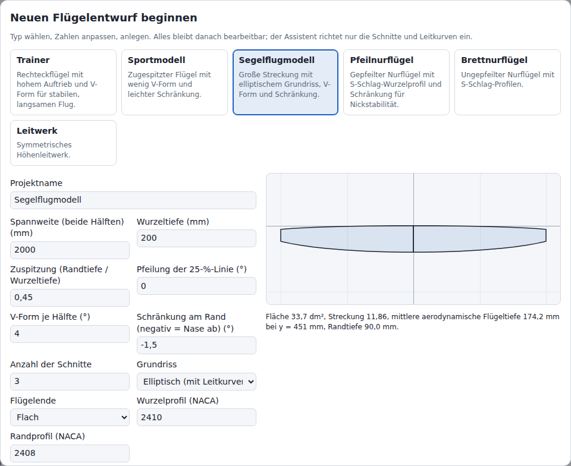

Der Assistent erzeugt aus 12 Eingaben (Tabelle unten) ein vollständiges Projekt. Er erzeugt Schnitte, Profile, die Endleisteneinstellung, die Form des Flügelendes und bei elliptischem Grundriss beide Leitkurven. Mit dem Grundriss **Felder (Tabelle)** (Panels (table)) ersetzt eine Feldtabelle 4 der Eingaben (siehe Felder unten). Alle Werte bleiben danach bearbeitbar.

- Öffnet sich beim ersten Aufruf mit dem Titel „Neuen Flügelentwurf beginnen“ (Start a new wing design) und mit **Neu** (New) mit dem Titel „Neuer Flügelentwurf“ (New wing design).
- Vorausgewählter Entwurfstyp: **Sportmodell** (Sport). Ein Klick auf die Karte eines Entwurfstyps lädt dessen Werte.
- Profile sind NACA-Profile der 4- oder 5-stelligen Reihe. Gültige Bezeichnungen: Abschnitt [NACA-Generator](#naca-generator).
- Die Zahlenfelder lesen eine getippte Zahl wie in Abschnitt [Zahlen](#zahlen) und prüfen sie schon beim Tippen. Beim Verlassen eines Felds zeigt es die gelesene Zahl, z. B. `1500` für ein auf Deutsch getipptes `1.500`. Die Pfeiltasten nach oben und unten ändern den Wert wie in den Registerkarten; in einem leeren Feld oder einem Feld ohne Zahl gehen sie vom Wert des gewählten Entwurfstyps aus.

| Eingabefeld | Bereich | Wirkung |
| --- | --- | --- |
| **Projektname** (Project name) | Text | Vorgabe: Name des Entwurfstyps. Leer: `Flügel <Spannweite> mm`. Beide entstehen in der aktuellen Sprache (Abschnitt [Sprache](#sprache)). |
| **Spannweite (beide Hälften)** (Span (both halves)) | 100 bis 20 000 mm | Spannweite von Flügelende zu Flügelende, gemessen entlang y. Mit einer V-Form δ ist jede Hälfte entlang ihres Feldes Spannweite / 2 / cos δ lang: 436 mm bei 500 mm Spannweite und 55°. |
| **Wurzeltiefe** (Root chord) | 10 bis 3000 mm | Profiltiefe bei y = 0 |
| **Zuspitzung (Randtiefe / Wurzeltiefe)** (Taper (tip / root chord)) | 0,1 bis 1,5 | Randtiefe geteilt durch Wurzeltiefe. Elliptischer Grundriss mit flachem Flügelende: kleiner als 1. Elliptischer Grundriss mit spitzem Flügelende: nicht verwendet. Ausgeblendet bei **Felder (Tabelle)**. |
| **Pfeilung der 25-%-Linie** (Sweep of the 25 % line) | −45 bis 60° | Pfeilung der 25-%-Linie; positiv = nach hinten gepfeilt. Ausgeblendet bei **Felder (Tabelle)**. |
| **V-Form je Hälfte** (Dihedral per half) | −60 bis 60° | z des Schnitts = y · tan(V-Form). Ein V-Leitwerk erhält den Winkel jeder Hälfte, z. B. 55°; ein umgekehrtes V-Leitwerk einen negativen Winkel. 60° ist das steilste erste Feld, das Schnittebenen **Auf Gehrung** bauen: Die senkrechte Wurzelebene streckt das Profil auf das 1 / cos 60° = 2-Fache (Abschnitt [Prüfungen](#prüfungen)). Ausgeblendet bei **Felder (Tabelle)**. |
| **Schränkung am Rand (negativ = Nase ab)** (Tip twist (negative = washout)) | −15 bis 15° | Schränkung ändert sich linear mit y von 0° an der Wurzel bis zu diesem Wert am Rand |
| **Anzahl der Schnitte** (Number of sections) | 2 bis 8, ganzzahlig | Schnitte gleichmäßig verteilt von Wurzel bis Rand. Ausgeblendet bei **Felder (Tabelle)**. |
| **Grundriss** (Planform) | **Gerade zugespitzt** (Straight taper), **Elliptisch (mit Leitkurven)** (Elliptic (guide curves)), **Felder (Tabelle)** (Panels (table)) | Tiefenverlauf, siehe unten; Felder: siehe Felder unten |
| **Flügelende** (Tip) | **Flach** (Flat), **Spitz (Maßstab 1/200)** (Pointed (1/200 scale)), **Elliptisch (nur mit Feldern)** (Elliptic (panels only)) | Flach: Der Flügel endet am Randschnitt. Spitz: Profiltiefe des Randschnitts = 1/200 der Profiltiefe am vorletzten Schnitt, mindestens 1 mm. Elliptisch: Das letzte Feld endet in einer Viertelellipse; nur mit dem Grundriss **Felder (Tabelle)**. |
| **Wurzelprofil (NACA)** (Root airfoil (NACA)) | NACA-Bezeichnung | Profil aller Schnitte außer dem Randschnitt |
| **Randprofil (NACA)** (Tip airfoil (NACA)) | NACA-Bezeichnung | Profil des Randschnitts |

Tiefenverlauf (η = Spannweitenanteil, 0 an der Wurzel, 1 am Rand; λ = Zuspitzung; η_prev = Spannweitenanteil des vorletzten Schnitts):

| Grundriss | Flügelende | Profiltiefe c(η) | Leitkurven |
| --- | --- | --- | --- |
| **Gerade zugespitzt** | **Flach** | c_root · (1 + (λ − 1) · η) | aus |
| **Gerade zugespitzt** | **Spitz** | wie **Flach**; Randschnitt: max(c(η_prev) / 200, 1 mm) | aus |
| **Elliptisch** | **Flach** | c_root · √(1 − (1 − λ²) · η²) | Nasenlinie und Endlinie an; je 11 Punkte bei η_i = sin(π i / 20), i = 0 … 10: 0; 0,156; 0,309; 0,454; 0,588; 0,707; 0,809; 0,891; 0,951; 0,988; 1 (zum Rand hin dichter) |
| **Elliptisch** | **Spitz** | c_root · √(1 − η²); Randschnitt: max(c(η_prev) / 200, 1 mm) | Nasenlinie und Endlinie an; je 11 Punkte bei denselben η wie **Flach**; beide Linien enden auf der 25-%-Linie |

Erzeugte Leitkurven verwenden **Durch Punkte** (Through points) und Grad 3. x der Endlinie: das gerundete x der Nasenlinie plus die gerundete Profiltiefe. Größte Abweichung der Profiltiefe der Leitkurven vom elliptischen Verlauf, Entwurfstyp **Segelflugmodell** (Glider), in % der Wurzeltiefe: Zuspitzung 0,1: 0,55 %; 0,2: 0,10 %; 0,3: 0,02 %; 0,45: 0,004 %; **Spitz**: 2,87 %, innerhalb der letzten 0,3 % der Spannweite (1 000 001 Spannweitenpositionen).

Erzeugte Werte:

| Wert | Regel |
| --- | --- |
| x der Profilnase | **Gerade zugespitzt** und **Elliptisch**: 0,25 · c_root + y · tan(Pfeilung) − 0,25 · c(η); die 25-%-Punkte liegen auf der Pfeilungslinie. **Felder (Tabelle)**: siehe Felder unten. |
| Rundung | 0,01 mm, 0,01° |
| Endleiste | **Feste Dicke in mm** (Fixed thickness in mm): 0,2 % der Wurzeltiefe, mindestens 0,3 mm |
| Flügelende | **Einstellungen** (Settings) > **Flügelende** (Wing tip) = **Flach** beim Flügelende **Flach**, **Spitz** bei den Flügelenden **Spitz (Maßstab 1/200)** und **Elliptisch (nur mit Feldern)**; Maßstab des Randprofils 1 : 200 |

Felder: Mit **Grundriss** = **Felder (Tabelle)** gibt eine Tabelle die halbe Spannweite als 1 bis 24 Felder von der Wurzel zum Rand an. **Zuspitzung (Randtiefe / Wurzeltiefe)**, **Pfeilung der 25-%-Linie**, **V-Form je Hälfte** und **Anzahl der Schnitte** sind dann ausgeblendet und werden nicht verwendet; sie behalten ihre Werte für einen Wechsel zurück zu einem anderen Grundriss.

| Spalte | Bereich | Wirkung |
| --- | --- | --- |
| **Feld** (Panel) | 1 bis 24 | Nummer des Felds, von der Wurzel an gezählt |
| **Anteil an der Spannweite (%)** (Span share (%)) | 0,1 bis 10 000 % | Anteil des Felds an der halben Spannweite. Die Anteile werden so umgerechnet, dass sie zusammen die halbe Spannweite füllen: 2 Felder mit je 100 % erhalten je 50 %. |
| **Pfeilung der Nasenleiste (°)** (Leading-edge sweep (deg)) | −89,9 bis 89,9° | Pfeilung der Nasenleiste entlang des Felds; positiv = nach hinten gepfeilt |
| **Äußere Profiltiefe (% der Wurzeltiefe)** (Outer chord (% of root)) | 0 bis 300 % | Profiltiefe am äußeren Ende des Felds, in % der **Wurzeltiefe** |
| **V-Form (°)** (Dihedral (deg)) | −60 bis 60° | V-Form des Felds |
| × | Schaltfläche | Entfernt das Feld (Name „Feld n entfernen“ (Remove panel n)). Gesperrt bei 1 Feld. |

- **Feld hinzufügen** (Add panel) hängt eine Kopie des letzten Felds an. Gesperrt bei 24 Feldern.
- Der Hinweis unter der Tabelle nennt die Summe der Anteile, z. B. „Die Anteile ergeben 200,0 %; sie werden auf die halbe Spannweite umgerechnet.“
- Wechselt **Grundriss** auf **Felder (Tabelle)** und hat der Entwurf noch keine Feldliste, beginnt die Tabelle mit einem Feld je Abschnitt zwischen den Schnitten des bisherigen Grundrisses (**Anzahl der Schnitte** − 1 Felder, gleiche Anteile). Jedes Feld endet an der Nasenleiste dieses Schnitts mit seiner Profiltiefe: Pfeilung der Nasenleiste und äußere Profiltiefe ungerundet (die Tabelle zeigt bis zu 6 Nachkommastellen), V-Form = **V-Form je Hälfte**. Ein gerader Grundriss behält seine Schnitte und ein spitzes Flügelende seine Profiltiefe (1/200 des Schnitts davor); ein elliptischer Grundriss wird zum Polygon durch seine Schnitte, ohne Leitkurven. **Sportmodell**: 1 Feld, 2,29061°, 60 %, 1,5°. **Segelflugmodell** (3 Schnitte): 2 Felder, äußere Profiltiefen 89,477651 % und 45 %. Ein Feld ohne Zahl beim Wechsel (etwa eine leere **Zuspitzung**) nimmt den Wert des gewählten Entwurfstyps. Entwurfstypen mit Feldern und eine zuvor im Dialog bearbeitete Feldliste behalten ihre Felder.

Schnitte des Grundrisses **Felder (Tabelle)** (b = halbe Spannweite; s_i = Anteil des Felds i geteilt durch die Summe der Anteile):

| Wert | Regel |
| --- | --- |
| Wurzelschnitt | Profilnase bei x = 0, y = 0, z = 0; Profiltiefe c_root |
| Schnitt am äußeren Ende von Feld i | Δy = s_i · b; y = y_prev + Δy; x der Profilnase = x_prev + Δy · tan(Pfeilung der Nasenleiste); z = z_prev + Δy · tan(V-Form); Profiltiefe = äußere Profiltiefe · c_root |
| Schränkung | Schränkung am Rand · y / b |
| Profile | Randprofil am Randschnitt; Wurzelprofil an allen anderen Schnitten |
| Flügelende **Spitz (Maßstab 1/200)** | Profiltiefe des Randschnitts = max(c_prev / 200, 1 mm), c_prev = Profiltiefe des Schnitts davor; der Randschnitt behält seinen 25-%-Punkt. |
| Flügelende **Elliptisch (nur mit Feldern)** | Das letzte Feld endet in einer Viertelellipse aus 6 Schnitten bei t = sin(π k / 12), k = 1 … 6 (t = 1 bei k = 6): y = y_in + t · Δy; Profiltiefe c(t) = c_in · √(1 − t²); die 25-%-Punkte liegen auf der Geraden vom 25-%-Punkt des inneren Schnitts (y_in, x_in, z_in, Profiltiefe c_in) mit der Pfeilung der Nasenleiste des Felds: x = x_in + 0,25 · c_in + t · Δy · tan(Pfeilung der Nasenleiste) − 0,25 · c(t); z = z_in + t · Δy · tan(V-Form). Die äußere Profiltiefe des letzten Felds wird nicht verwendet. Der Randschnitt erhält max(c_prev / 200, 1 mm) wie bei **Spitz**. Beispiel: **Sportmodell** als 1 Feld mit diesem Flügelende: 7 Schnitte, der Schnitt vor dem Rand 62,1 mm, der Rand 1 mm (die Untergrenze). |

Die Vorschau zeigt den Grundriss beider Hälften. Die Zeile darunter nennt Fläche (dm²), Streckung, mittlere aerodynamische Flügeltiefe (MAC) mit ihrer Spannweitenposition und Randtiefe, z. B. `Fläche 33,7 dm², Streckung 11,86, mittlere aerodynamische Flügeltiefe 174,2 mm bei y = 451 mm, Randtiefe 90,0 mm.`

Bei einer der folgenden Bedingungen wird die Zeile rot und nennt die Probleme; **Entwurf anlegen** (Create design) ist dann gesperrt:

- Ein Wert liegt außerhalb seines Bereichs (Spalte Bereich), oder sein Feld ist leer oder enthält keine Zahl (Abschnitt [Zahlen](#zahlen)).
- **Anzahl der Schnitte** ist nicht ganzzahlig (nicht bei **Felder (Tabelle)**).
- Wurzel- oder Randprofil ist keine gültige NACA-Bezeichnung.
- **Elliptisch** mit Flügelende **Flach** hat eine Zuspitzung ≥ 1 (`Ein elliptischer Grundriss braucht eine Zuspitzung < 1.`).
- Das Flügelende ist **Elliptisch (nur mit Feldern)** und der Grundriss nicht **Felder (Tabelle)** (`Ein elliptisches Flügelende braucht den Grundriss Felder.`).
- Die Feldliste hat weniger als 1 oder mehr als 24 Felder (`Der Grundriss Felder braucht 1 bis 24 Felder.`).
- Ein Wert eines Felds liegt außerhalb seines Bereichs, z. B. `Feld 2: Pfeilung der Nasenleiste muss zwischen -89,9 und 89,9 liegen.` Die Meldung nennt `Anteil an der Spannweite`, `Pfeilung der Nasenleiste`, `äußere Profiltiefe` oder `V-Form`; Anteil an der Spannweite und äußere Profiltiefe erscheinen als Verhältnis: 0,001 bis 100 und 0 bis 3.
- Ein Feld überspannt nach dem Umrechnen der Anteile weniger als 1 mm der halben Spannweite (`Feld 1 überspannt 0,0005 mm der halben Spannweite; ein Feld braucht mindestens 1 mm.`);
- Ein Schnitt liegt außerhalb von ±1 000 000 mm in x oder z, ein spitzes oder elliptisches Flügelende nach seiner Verschiebung auf den Viertelpunkt, z. B. 20 000 mm Spannweite mit einem Feld, 89,9° gepfeilt (`Feld 1 endet bei x = 5.729.572 mm, z = 0 mm, außerhalb von ±1.000.000 mm.`);
- Ein elliptisches Flügelende beginnt mit weniger als 1 mm / cos 75° = 3,8637 mm Profiltiefe: sein letzter innerer Schnitt behält cos 75° = 0,259 davon, unter dem Minimum von 1 mm; die Meldung rundet die Grenze auf (`Feld 2: das elliptische Flügelende braucht an seinem Anfang mindestens 3,87 mm Profiltiefe.`);
- Die äußere Profiltiefe eines Felds liegt unter 1 mm (`Feld 1: die äußere Profiltiefe liegt unter 1 mm.`), an jedem Feldende außer dem letzten bei den Flügelenden **Spitz (Maßstab 1/200)** und **Elliptisch (nur mit Feldern)**.
- Ein im Code erzeugtes Projekt (`wizardProject`) hat einen anderen Wert für Grundriss oder Flügelende (`Grundriss muss "straight", "elliptic" oder "panels" sein.`, `Flügelende muss "flat", "pointed" oder "elliptic" sein.`).
- Der Flügel hat einen Aufbaufehler (Abschnitt [Prüfungen](#prüfungen)). Beispiel: Entwurfstyp **Leitwerk** mit 100 mm Spannweite, 8 Schnitten und 55° V-Form je Hälfte. Die Schnittebene der senkrechten Wurzel und die des nächsten Schnitts, 7,1 mm weiter außen in y, drehen sich schneller, als die Profile erlauben, sodass sich die Fläche faltet. Eine größere Spannweite, weniger Schnitte oder weniger V-Form bauen; ab 200 mm Spannweite baut dieser Entwurfstyp mit 2 bis 8 Schnitten bis 60°.

| Entwurfstyp | Spannweite mm | Wurzeltiefe mm | Zuspitzung | Pfeilung ° | V-Form ° | Schränkung Rand ° | Schnitte | Grundriss | Flügelende | Wurzel- / Randprofil |
| --- | --- | --- | --- | --- | --- | --- | --- | --- | --- | --- |
| **Trainer** | 1400 | 250 | 1 | 0 | 3 | 0 | 2 | gerade | flach | 2412 / 2412 |
| **Sportmodell** | 1200 | 240 | 0,6 | 0 | 1,5 | −1 | 2 | gerade | flach | 2412 / 2410 |
| **Segelflugmodell** | 2000 | 200 | 0,45 | 0 | 4 | −1,5 | 3 | elliptisch | flach | 2410 / 2408 |
| **Hochleistungssegler** (Sailplane) | 3000 | 210 | (0,5) | (0) | (2) | −2 | (4) | Felder | elliptisch | 2410 / 2408 |
| **Delta-Jet** (Delta jet) | 900 | 800 | (0,2) | (45) | (0) | 0 | (2) | Felder | flach | 0008 / 0006 |
| **Doppeldelta** (Double delta) | 1000 | 1000 | (0,24) | (45) | (0) | 0 | (3) | Felder | flach | 0008 / 0006 |
| **Batwing** | 1000 | 363 | (0,5) | (0) | (0) | 0 | (2) | Felder | spitz | 0010 / 0008 |
| **Pfeilnurflügel** (Swept flying wing) | 1200 | 280 | 0,45 | 25 | 0 | −4 | 3 | gerade | flach | 23112 / 0010 |
| **Brettnurflügel** (Plank) | 1000 | 220 | 0,8 | 0 | 1 | 0 | 2 | gerade | flach | 23112 / 23112 |
| **Leitwerk** (Tail surface) | 500 | 130 | 0,7 | 5 | 0 | 0 | 2 | gerade | flach | 0009 / 0009 |

Werte in Klammern sind bei **Felder (Tabelle)** ausgeblendet; sie gelten nach einem Wechsel zu **Gerade zugespitzt** oder **Elliptisch (mit Leitkurven)**.

Felder der Entwurfstypen **Hochleistungssegler** bis **Batwing** (V-Form 0°, wo nicht angegeben):

| Entwurfstyp | Felder: Anteil an der Spannweite % / Pfeilung der Nasenleiste ° / äußere Profiltiefe % der Wurzeltiefe / V-Form ° |
| --- | --- |
| **Hochleistungssegler** | 45 / 0 / 95 / 2; 35 / 1,5 / 75 / 6; 20 / 4 / 50 / 10 |
| **Delta-Jet** | 100 / 54,9 / 20 |
| **Doppeldelta** | 30 / 70 / 58,8 (Strake); 70 / 45 / 23,8 (äußeres Delta) |
| **Batwing** | 15 / 18,4 / 94,8; 10 / 32 / 87,9; 8 / 43,2 / 84,5; 7 / 28,2 / 89,7; 7 / −41,8 / 122,4; 4 / −61,9 / 160,3; 7 / −60,8 / 167,2; 8 / −59,8 / 174,1; 9 / 54,2 / 143,1; 10 / 58,4 / 101,7; 8 / 65,4 / 55,2; 7 / 69,5 / 0 |

| Entwurfstyp | Erzeugte Schnitte | Fläche dm² | Streckung | MAC mm bei y mm | Randtiefe mm |
| --- | --- | --- | --- | --- | --- |
| **Hochleistungssegler** | 9 | 53,72 | 16,75 | 186,1 bei 677 | 1,0 |
| **Delta-Jet** | 2 | 43,20 | 1,88 | 551,1 bei 175 | 160 |
| **Doppeldelta** | 3 | 52,73 | 1,90 | 606,7 bei 196 | 238 |
| **Batwing** | 13 | 39,81 | 2,51 | 448,5 bei 251 | 1,0 |

- **Hochleistungssegler**: Mehrfach-V-Form 2°, 6° und 10°; das elliptische Flügelende beendet das letzte Feld in 6 Schnitten. Mit dem Flügelende **Flach** endet der Flügel an der äußeren Profiltiefe des letzten Felds: 105 mm.
- **Delta-Jet**: Die Pfeilung der Nasenleiste atan((800 − 160) / 450) = 54,9° legt die Endleiste auf eine Gerade, auf 0,3 mm genau (Randschnitt: x der Profilnase 640,29 mm, Profiltiefe 160 mm).
- **Doppeldelta**: Der Strake verschiebt die Nasenleiste auf 150 mm um 412,1 mm nach hinten; die Endleiste ist auf 0,12 mm genau gerade.
- **Batwing**: 12 Felder, abgenommen von einer Draufsicht des Batwing aus dem Film von 1989. Die Nasenleiste hat eine Kerbe neben dem Rumpf und die vordere Spitze des Ohrs bei 66 % der halben Spannweite (y = 330 mm, x = −87,6 mm); die Endleiste hat eine konkave Ausbuchtung und die hintere Spitze bei 51 % (y = 255 mm, x der Endleiste = 625,7 mm); beide treffen sich im runden Randbogen. Keine Schränkung, keine V-Form; der Umriss ist ein Polygon aus geraden Feldern.
- Keiner dieser 4 Entwurfstypen ist geflogen oder im Flug vermessen. Der **Batwing** hat symmetrische Profile ohne S-Schlag; seine Nickstabilität ist nicht ausgelegt.

| Schaltfläche | Wirkung |
| --- | --- |
| **Entwurf anlegen** | Ersetzt das aktuelle Projekt. **Rückgängig** (Undo) stellt das vorherige wieder her. |
| **Abbrechen** (Cancel) | Behält das aktuelle Projekt. |
| **Überspringen (Beispielflügel öffnen)** (Skip (open sample wing)) | Nur beim ersten Aufruf, anstelle von **Abbrechen**. Behält den Beispielflügel „Sportflügel 1500“ (englische Oberfläche: „Sport wing 1500“): 3 Schnitte, 1500 mm Spannweite, NACA 2412 / 2410, Endleiste fest 0,5 mm. |

## Schnitte

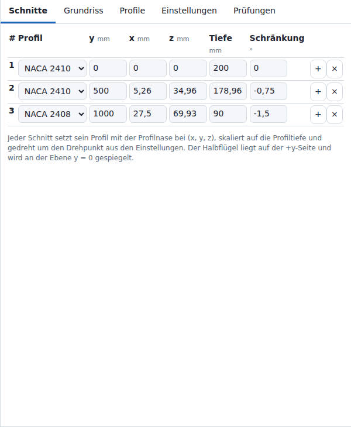

Ein Schnitt setzt ein Profil:

- in seine Schnittebene (**Einstellungen** (Settings) > **Schnittebenen** (Section planes)): auf Gehrung, rechtwinklig zu den benachbarten Feldern, oder senkrecht (y = konst.);
- mit der Profilnase bei (x, y, z);
- skaliert auf die Profiltiefe;
- um den Schränkungswinkel gedreht; Drehpunkt: **Einstellungen** > **Drehpunkt der Schränkung** (Twist pivot), Vorgabe 0,25 = 25 % der Profiltiefe.

Berechnung: [[Geometrie|Geometrie]].

| Spalte | Einheit | Schritt | Grenze | Wirkung |
| --- | --- | --- | --- | --- |
| # | – | – | – | Schnittnummer; 1 = Wurzel |
| **Profil** (Airfoil) | – | – | Profile des Projekts | Profil dieses Schnitts |
| y | mm | 5 | 0 bis 1 000 000 | Spannweitenposition. Die Schnitte werden nach y neu sortiert. |
| x | mm | 1 | −1 000 000 bis 1 000 000 | Lage der Profilnase in Profiltiefenrichtung; positiv = nach hinten (Pfeilung nach hinten) |
| z | mm | 1 | −1 000 000 bis 1 000 000 | Höhe der Profilnase (V-Form) |
| **Tiefe** (Chord) | mm | 1 | 1 bis 100 000 | Profiltiefe (Maßstab des Profils) |
| **Schränkung** (Twist) | ° | 0,1 | −360 bis 360 | Drehung um den Drehpunkt; positiv = Nase hoch. |
| **Feldwinkel** (Panel angle) | ° | 0,1 | −89,9999 bis 89,9999 oder leer | Nur mit **Schnittebenen** = **Auf Gehrung** und **Linear** oder **Gerade Felder**. Winkel des Feldes zum nächsten Schnitt, den die Schnittebenen verwenden. Leer: die V-Form aus y und z der beiden Schnitte, angezeigt als `auto 1,5` (1 Nachkommastelle); die Pfeiltasten nach oben und unten gehen von ihr aus. Die Randzeile hat kein Feld; ihre Zelle bleibt leer. Der XFLR5-Import füllt ihn, wo ein Profil die Schnitte eines Feldes verschieden verschiebt. |

| Schaltfläche | Wirkung |
| --- | --- |
| **+** | Fügt einen Schnitt auf halbem Weg zum nächsten ein: Mittelwert von y, x, z, Profiltiefe und Schränkung; Profil und Feldwinkel des aktuellen Schnitts. In der Randzeile: Kopie des Randschnitts, eine Feldlänge weiter außen (mindestens 10 mm). Gesperrt bei 20 000 Schnitten (Tooltip `Höchstens 20.000 Schnitte: Bei mehr geht einem Browser-Tab auf dem Desktop der Speicher aus.`). |
| **×** | Löscht den Schnitt. Gesperrt, solange nur 2 Schnitte vorhanden sind. |

**+** weist das Einfügen mit einer Fehlermeldung ab, wenn:

- der Mittelwert der y-Werte der beiden Nachbarschnitte nicht echt zwischen ihnen liegt oder sich sein Spannweitenanteil nicht von denen beider Nachbarn unterscheidet (unterscheidbar: mehr als 4 Einheiten der letzten Stelle und mehr als 2^-1021, wie unter [Prüfungen](#prüfungen)): `Zwischen y = … mm und y = … mm liegt keine Spannweitenposition. Zuerst die beiden Schnitte auseinanderschieben.`
- die Kopie des Randschnitts jenseits von y = 1 000 000 mm läge: `Ein Schnitt weiter außen als der Randschnitt läge jenseits von y = 1.000.000 mm.`
- die Kopie des Randschnitts die Spannweite so weit verlängert, dass sich die Spannweitenanteile zweier benachbarter Schnitte nicht mehr unterscheiden: `Ein Schnitt bei y = … mm weiter außen als der Randschnitt macht die Spannweite zu lang für die Schnitte bei y = … mm und y = … mm. Zuerst die beiden Schnitte auseinanderschieben.` Das Ziehen des Randschnitts in der Registerkarte **Grundriss** (Planform) hält unter derselben Bedingung an.

Tooltip von **+**: `Einen Schnitt nach diesem einfügen`. Ergibt das Einfügen mehr als 200 Schnitte, ergänzt der Tooltip die Schätzung aus Abschnitt [Projektgröße](#projektgröße): `Einen Schnitt nach diesem einfügen. Mit … Schnitten: Jede Änderung dauert … und belegt … Arbeitsspeicher.`

- Ein y, das ein anderer Schnitt bereits hat, wird mit einer Fehlermeldung abgewiesen (`Ein anderer Schnitt liegt bereits bei y = … mm; …`). Das Eingabefeld behält seinen vorherigen Wert.
- Ein eingegebener Wert außerhalb der Grenze wird auf die nächste Grenze gesetzt, z. B. wird ein negatives y zu 0 und eine Profiltiefe unter 1 mm zu 1 mm. Schritte mit den Pfeiltasten enden an den Grenzen. Die Grenzen gelten auch für Projektdateien ([[Dateiformate|Dateiformate]]).
- Ein Klick irgendwo in eine Zeile außerhalb ihrer Eingabefelder, Auswahllisten und Schaltflächen wählt den Schnitt aus, auch in der Kartenansicht schmaler Bildschirme. Die Zeile wird markiert, die 3D-Ansicht zeichnet die Schnittkontur rot, der Grundriss-Editor Tiefenlinie und Griffe des Schnitts rot. Die Auswahl baut den Flügel nicht neu auf: Sie braucht 2 ms JavaScript bei 200 Schnitten und 100 bis 110 ms bei 20 000 Schnitten.
- Profil-Auswahllisten: Bei mehr als 20 000 Listeneinträgen (Schnitte × Projektprofile) enthält jede Liste nur ihr gewähltes Profil, bis sie den Fokus erhält oder angeklickt wird; dann listet sie alle Projektprofile.
- Ändert sich y von Wurzel- oder Randschnitt, skalieren die y-Werte der Leitkurvenpunkte linear auf den geänderten Bereich von Wurzel bis Rand.
- Zwischen den Schnitten werden x, z, Profiltiefe, Schränkung und Profilform entlang der Spannweite interpoliert (**Einstellungen** > **Interpolation in Spannweitenrichtung** (Spanwise interpolation)).

Mit eingeschalteter Leitkurve verwendet der Flügel den Wert der Leitkurve statt des eingegebenen Werts. Der verwendete Wert steht unter dem Eingabefeld als `Leitkurve: 12,3`, wenn er um mehr als 0,05 mm abweicht:

| Eingeschaltete Leitkurven | Überschriebene Spalte |
| --- | --- |
| Nasenlinie oder Endlinie | x |
| Nasenlinie und Endlinie | x und **Tiefe** |

Mit **Einstellungen** > **Flügelende** (Wing tip) = **Spitz** (Pointed) verwendet der Flügel die eingegebene Randtiefe nicht. Die Zelle **Tiefe** der Randzeile zeigt die verwendete Randtiefe mit 2 Nachkommastellen, z. B. `Randtiefe: 1,25`. `(min.)` folgt, wenn die Untergrenze von 1 mm greift, z. B. `Randtiefe: 1,00 (min.)`.

### Winglet

**Winglet …** unter der Tabelle öffnet einen Dialog, der außen am Randschnitt ein integriertes Winglet anfügt. Das Winglet besteht aus gewöhnlichen Schnitten: Die Bezugslinie (Nasenleisten in y und z) dreht sich entlang eines Kreisbogens auf die Neigung und führt dann gerade bis zur Wingletspitze. **Winglet anfügen** (Add winglet) fügt sie als ein Rückgängig-Schritt an.

| Feld | Einheit | Schritt | Grenze | Vorgabe | Wirkung |
| --- | --- | --- | --- | --- | --- |
| Höhe entlang des Winglets | mm | 5 | 5 bis 100.000 | größter Wert aus 5 mm, 1/10 der Halbspannweite, Randtiefe | Länge der Bezugslinie vom Randschnitt bis zur Wingletspitze: Übergangsbogen plus gerades Stück |
| Neigung | ° | 1 | −89 bis 89 | 75 | Winkel des geraden Stücks zur y-Achse; 0 = in der Flügelebene, positiv = nach oben, negativ = nach unten |
| Übergangsradius | mm | 1 | 0 bis 100.000 | 0,3 × Randtiefe, mindestens 1 mm | Radius des Bogens in der y-z-Ebene; 0 ergibt einen Knick am Randschnitt |
| Pfeilung der Nasenleiste | ° | 1 | −60 bis 80 | 30 | x wächst um tan(Pfeilung) je mm Bezugslinie |
| Spitzentiefe | % der Randtiefe | 5 | 5 bis 200 | 60 | Profiltiefe der Wingletspitze; die Tiefe ändert sich linear entlang der Bezugslinie |
| Anstellung | ° | 0,5 | −15 bis 15 | 0 | Zusätzliche Schränkung an der Wingletspitze, linear entlang der Bezugslinie; positiv = Nasenleiste nach oben |
| Profil der Wingletspitze | – | – | Profile des Projekts | Profil des Randschnitts | Profil des Schnitts an der Wingletspitze; die Bogenschnitte behalten das Profil des Randschnitts |

- Der Bogen beginnt tangential zum letzten Feld und dreht in Schritten von höchstens 15°; jeder Schritt endet in einem Schnitt. **Sport** mit den Vorgaben: 1,5° bis 75° in 5 Schritten, 6 Schnitte, Wingletspitze 117,7 mm über und 63,4 mm außerhalb des Randschnitts.
- Ein Bogenschnitt, der in y weniger als 1 mm von seinem Nachbarn entfernt liegt, entfällt.
- Die Vorschau zeigt die äußeren 60 % der Spannweite von vorn, das Winglet in der Akzentfarbe, und nennt die Zahl der Schnitte und die Lage der Wingletspitze. Ein Baufehler der Vorschau steht stattdessen dort und sperrt **Winglet anfügen**.

**Winglet anfügen** ist gesperrt, mit dem Grund unter der Vorschau, wenn:

- ein Feld außerhalb seiner Grenze liegt oder das Profil nicht im Projekt ist;
- eine Leitkurve eingeschaltet ist (`Zuerst die Leitkurven ausschalten: …`);
- **Einstellungen** > **Flügelende** = **Spitz** (`… Ein Winglet braucht ein flaches Flügelende.`);
- **Einstellungen** > **Schnittebenen** nicht **Auf Gehrung** ist;
- der Übergangsbogen nicht kürzer als die Höhe ist (`Winglet: Der Übergangsbogen ist … mm lang, …`);
- ein Wingletfeld in y weniger als 1 mm reicht (`Wingletfeld … reicht … mm in y, …`), so bei ±89° ohne Übergangsradius;
- die Schnitte 20.000 überschreiten, eine Koordinate ±1.000.000 mm überschreitet, eine Profiltiefe 1 bis 100.000 mm verlässt oder eine Schränkung ±360° verlässt.

Konstruktion: [[Geometrie|Geometrie]], Abschnitt 9.

## Grundriss

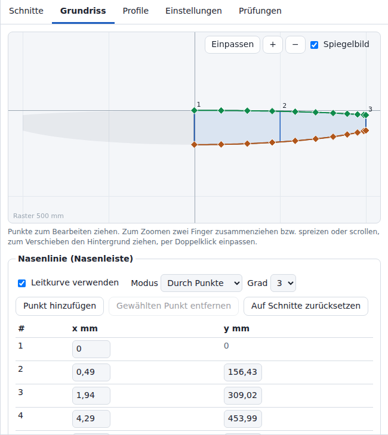

Der Grundriss-Editor zeigt den Halbflügel von oben: Spannweite y nach rechts, Profiltiefe x nach unten, y = 0 auf der senkrechten Achse. Die Rasterbeschriftung (`Raster … mm`) nennt den Rasterabstand in mm (Reihe 1-2-5, mindestens 60 px Abstand: 60 bis 150 px).

| Werkzeugleiste | Wirkung |
| --- | --- |
| **Einpassen** (Fit) | Passt die Schnitte, Punkte und Kurven der eingeschalteten Leitkurven, den aufgebauten Umriss und bei eingeschaltetem **Spiegelbild** (Mirror) das Spiegelbild in die Zeichenfläche ein |
| **+** / **−** | Zoom um Faktor 1,25 / 0,8 um die Mitte der Zeichenfläche |
| **Spiegelbild** | Graues Spiegelbild der anderen Hälfte. Nur Anzeige; Vorgabe: an; wird nicht gespeichert. |

| Griff | Sichtbar, wenn | Wirkung beim Ziehen |
| --- | --- | --- |
| Blaues Quadrat an der Profilnase eines Schnitts | Nasenlinie aus; nicht an einem Randschnitt mit **Spitz** (Pointed), solange die Endlinie an ist | Verschiebt x und y des Schnitts; x bleibt innerhalb von ±1 000 000 mm. Die Endleiste bleibt stehen (Endlinie an: die Endlinie beim geänderten y); die Profiltiefe ändert sich im Bereich 1 bis 100 000 mm. y hält 1 mm Abstand zu den Nachbarschnitten (Nachbarn näher als 4 mm: ein Viertel der Lücke). Der Wurzelschnitt behält sein y. y des Randschnitts bleibt höchstens 1 000 000 mm. Ein y, dessen Spannweitenanteil sich nicht von dem eines Nachbarn unterscheiden würde (4 Einheiten der letzten Stelle, 2^-1021), wird nicht übernommen; der Schnitt behält sein y. |
| Blauer Kreis an der Endleiste eines Schnitts | Endlinie aus; nicht an einem Randschnitt mit **Spitz** | Setzt die Profiltiefe (1 bis 100 000 mm) |
| Raute auf einer Leitkurve (grün: Nasenlinie, braun: Endlinie) | Leitkurve an | Verschiebt den Punkt; x bleibt innerhalb von ±1 100 000 mm. Wurzel- und Randpunkt bewegen sich nur in x. Innere Punkte halten in y 0,5 mm Abstand zu ihren Nachbarn (Nachbarn näher als 2 mm: ein Viertel der Lücke). Ein y, dessen normierter Wert sich nicht von dem eines Nachbarn unterscheiden würde, lässt das y des Punkts unverändert; die Punkttabelle wendet dieselbe Regel an. |

- Gezogene Werte werden auf 0,1 mm gerundet.
- Die Zeile unter der Zeichenfläche zeigt die Werte während des Ziehens.
- Der ausgewählte Schnitt und der ausgewählte Leitkurvenpunkt sind rot. Ein Klick auf den Hintergrund, **Auf Schnitte zurücksetzen** (Reset to sections) und das Ein- oder Ausschalten der Leitkurve heben die Auswahl des Leitkurvenpunkts auf.
- Ein Randschnitt mit **Spitz** hat keinen Griff an der Endleiste: Seine Profiltiefe ist die skalierte Profiltiefe des vorigen Schnitts. Bei eingeschalteter Endlinie hat er auch keinen Griff an der Profilnase: Sein x der Profilnase ist x der Endlinie minus Profiltiefe.
- Das Ziehen eines Schnitts setzt ausgeschaltete, nicht bearbeitete Leitkurven auf die neuen Schnittkanten, wie eine Änderung in der Tabelle der Registerkarte **Schnitte** (Sections). Nach einem Neuladen beginnt eine solche Leitkurve beim Einschalten an den gezogenen Kanten.

### Leitkurven

Eine Leitkurve ist eine ebene NURBS-Kurve in der Grundrissebene (x, y). Die Nasenlinie legt die Nasenleiste fest, die Endlinie die Endleiste, auch zwischen den Schnitten. Berechnung: [[Geometrie|Geometrie]].

| Nasenlinie | Endlinie | x der Profilnase | Profiltiefe |
| --- | --- | --- | --- |
| aus | aus | x der Schnitte, interpoliert | Profiltiefe der Schnitte, interpoliert |
| an | aus | Nasenlinie | Profiltiefe der Schnitte, interpoliert |
| aus | an | Endlinie − Profiltiefe | Profiltiefe der Schnitte, interpoliert |
| an | an | Nasenlinie | Endlinie − Nasenlinie |

Leitkurven wirken mit **Linear** und **Glatt**. Mit **Gerade Felder** (Straight panels) stoppt eine eingeschaltete Leitkurve den Aufbau (Abschnitt [Einstellungen](#einstellungen)).

Einschränkungen und Fehler:

- Der y-Bereich einer Leitkurve wird linear auf die Spannweite von Wurzel bis Rand gestreckt. Wurzel- und Randpunkt folgen Wurzel- und Randschnitt.
- x der Leitkurvenpunkte: innerhalb von ±1 100 000 mm. Das ist das x der Endleiste eines Schnitts bei x = 1 000 000 mm mit 100 000 mm Profiltiefe. Eine ausgeschaltete, unbearbeitete Endlinie liegt auf den Endleisten der Schnitte.
- Fehler: Die y-Werte der Punkte steigen von Wurzel zu Rand nicht streng an.
- Fehler: Die Kurve läuft in y zurück (geprüft an 401 Kurvenpunkten). Abhilfe: Punkte weiter auseinanderlegen oder **Kontrollpunkte** (Control points) verwenden.
- Fehler: Ein Kontrollpunkt der Kurve liegt jenseits von x = ±1 200 000 mm (Grenze der Leitkurven plus größte Profiltiefe). Mit **Durch Punkte** (Through points) schwingt die Kurve über, wenn die Punkte in y ungleichmäßig verteilt sind. Abhilfe: Punkte in y gleichmäßiger verteilen oder **Kontrollpunkte** verwenden.
- Fehler: Profiltiefe unter 1 mm an einer geprüften Spannweitenposition. Mit beiden Leitkurven an heißt das: Nasenlinie und Endlinie kommen sich näher als 1 mm, berühren oder kreuzen sich. Geprüft an 257 gleichmäßig verteilten Spannweitenpositionen sowie an jeder Station, jedem Kontrollpunkt und jedem Knoten der Leitkurven (die geprüften Spannweitenpositionen).
- Fehler: An einer geprüften Spannweitenposition liegt x der Profilnase, x der Endleiste oder z jenseits von ±1 200 000 mm, oder die Profiltiefe ist größer als 100 000 mm. Beispiel: Nasenlinie bei x = −1 100 000 mm, Endlinie bei x = 1 100 000 mm (Profiltiefe 2 200 000 mm).
- Mit **Einstellungen** (Settings) > **Flügelende** (Wing tip) = **Spitz** bleibt die Profiltiefe im letzten Feld mindestens gleich der Randtiefe. Nasenlinie und Endlinie dürfen sich dann am Rand treffen.
- Stationen: jeder Schnitt. Mit eingeschalteter Leitkurve oder mit **Glatt** (Smooth) wird jedes Feld in **Stationen je Feld** (Spanwise stations per panel) Intervalle geteilt (Vorgabe 8, Kosinusverteilung); Entwurfstyp **Segelflugmodell** (Glider): 17 Stationen.
- Flächengitter: Stationen × (2 · N + 1) Konturpunkte vor den hinzugefügten Stationen (N = **Stationen je Profilseite** (Chordwise stations per surface)). Stationen: Felder × **Stationen je Feld** + 1 mit eingeschalteter Leitkurve oder mit **Glatt**. Sonst eine je Schnitt, und **Stationen je Feld** in jedem Feld mit **Linear**, dessen beide Schnitte in Gehrungsebenen verschiedener Neigung liegen. **Einstellungen** zeigt die Anzahl (`Flächengitter: … Punkte.`).
- Über 60 000 Gitterpunkten ergänzt der Aufbau die Warnung `Großes Projekt` (Abschnitt [Projektgröße](#projektgröße)). Bis 5 000 000 Gitterpunkte verwendet der Flügel die Einstellungen wie eingegeben.
- Über 5 000 000 Gitterpunkten verwendet der Flügel weniger Intervalle je Feld, mit Warnung. Überschreitet auch ein Intervall je Feld 5 000 000 Gitterpunkte, bricht der Aufbau mit einem Fehler ab ([Prüfungen](#prüfungen)).
- Beispiele mit **Glatt**, 40 Intervallen je Feld und N = 200: 20 Schnitte: 761 Stationen, 305 161 Gitterpunkte; 1000 Schnitte: 12 Intervalle je Feld, 11 989 Stationen, 4 807 589 Gitterpunkte. Mit N = 200 überschreiten mehr als 12 468 Schnitte bei einer Station je Feld 5 000 000 Gitterpunkte; mit N = 60 (Vorgabe) ergeben 20 000 Schnitte 2 420 000 Gitterpunkte.
- Hinzugefügte Stationen: bis zu 32 in höchstens 6 Durchläufen; über 60 000 Punkten im Flächengitter 1 Durchlauf, denn jeder Durchlauf passt die ganze Fläche neu an. Die App setzt sie an den geprüften Spannweitenpositionen, an denen die Fläche um mehr als 0,5 mm oder 10 % der örtlichen Profiltiefe (der kleinere Wert gilt; Abstand im Raum) vom vorgesehenen Profil abweicht: je eine Station an jedem lokalen Maximum der Abweichung im Verhältnis zu dieser Toleranz. Verglichene Punkte: Profilnase, oberer Endleistenpunkt und jede k-te Tiefenstation je Profilseite, k = **Stationen je Profilseite** / 6, abgerundet (5 Tiefenstationen bei der Vorgabe 60). Auch Schränkung zwischen den Stationen fügt Stationen hinzu: Entwurfstyp **Pfeilnurflügel** (Swept flying wing), 3 Schnitte, 2 hinzugefügte Stationen.
- Behaltene Anpassung: Von den Anpassungen vor und nach jedem Durchlauf behält der Aufbau die mit der kleinsten größten Abweichung im Verhältnis zu ihrer Toleranz, bei Gleichstand die Anpassung vor dem Durchlauf. Dicht beieinander hinzugefügte Stationen können die Anpassung ausschwingen lassen. Beispiel: 2 Schnitte, Nasenlinie mit einer Beule von 4 mm Höhe und 0,06 mm Breite: 3,67 mm Abweichung ohne hinzugefügte Stationen, 18 797 mm nach 32 hinzugefügten Stationen; der Aufbau behält die Anpassung ohne hinzugefügte Stationen und zeigt die Abweichungswarnung.
- Fehler zwischen den Stationen, geprüft an den geprüften Spannweitenpositionen und bei 0,25, 0,5 und 0,75 jedes Intervalls zwischen benachbarten Stationen: Die Profiltiefe der angepassten Fläche, gemessen in der vorgesehenen Profiltiefenrichtung, fällt unter 0,9 mm oder kehrt sich um (die Fläche faltet sich oder schnürt sich ein); die örtliche Dicke an einer verglichenen Tiefenstation fällt unter 0 (die Fläche stülpt sich um); die örtliche Dicke an einer verglichenen Tiefenstation zwischen 1 % und 99 % der Profiltiefe beträgt höchstens 0,001 % der Profiltiefe (Dicke null).
- Die hinzugefügten Stationen und die Abweichungswarnung verwenden nur die geprüften Spannweitenpositionen, nicht die Punkte bei 0,25, 0,5 und 0,75 der Stationsintervalle.

Bedienelemente je Leitkurve (Kästen **Nasenlinie (Nasenleiste)** (Nose line (leading edge)) und **Endlinie (Endleiste)** (End line (trailing edge))):

| Bedienelement | Verfügbar | Werte | Vorgabe | Wirkung |
| --- | --- | --- | --- | --- |
| **Leitkurve verwenden** (Use guide curve) | immer | an, aus | aus | An: Die Kurve legt die Kante fest. Eine nie bearbeitete Leitkurve startet an den aktuellen Schnittkanten; eine bearbeitete Leitkurve behält ihre Punkte. Aus: Die Kante folgt den Schnitten. Solange sie aus ist, folgt eine unbearbeitete Leitkurve den Schnittkanten; eine bearbeitete behält ihre Punkte. Bearbeitet: ein Punkt wurde verschoben (Ziehen oder Punkttabelle), hinzugefügt oder gelöscht. Leitkurven aus dem Assistenten gelten als unbearbeitet, bis die Seite neu geladen oder das Projekt aus einer Datei geöffnet wird: Aus- und erneutes Einschalten ersetzt ihre Punkte durch die Schnittkanten (**Rückgängig** (Undo) stellt sie wieder her). Nach dem Neuladen oder nach **Öffnen** (Open) gilt eine ohne den Zustand „bearbeitet“ gespeicherte Leitkurve als bearbeitet, wenn ihre Punkte von den Schnittkanten abweichen: andere Punktanzahl oder eine Koordinate mehr als 1e-9 mm daneben. |
| **Modus** (Mode) | Leitkurve an (sonst gesperrt) | **Durch Punkte**, **Kontrollpunkte** | **Durch Punkte** | **Durch Punkte**: Die Kurve läuft durch jeden Punkt. **Kontrollpunkte**: Die Punkte bilden das Kontrollpolygon (gestrichelt). Die Kurve beginnt und endet im ersten und letzten Punkt und liegt sonst in der konvexen Hülle des Kontrollpolygons. |
| **Grad** (Degree) | Leitkurve an (sonst gesperrt) | 1 bis 5 | 3 | Polynomgrad; begrenzt auf Punktanzahl − 1 |
| **Punkt hinzufügen** (Add point) | Leitkurve an (sonst ausgeblendet); gesperrt bei 20 000 Punkten (Tooltip `Höchstens 20.000 Punkte je Leitkurve.`) | – | – | Fügt einen Punkt in der Mitte der größten Lücke in y ein. Tooltip: `Punkt in der größten Lücke hinzufügen`; bekäme die Kurve mehr als 500 Punkte, `Punkt in der größten Lücke hinzufügen. Mit … Punkten: Jede Änderung dauert … und belegt … Arbeitsspeicher.` (Abschnitt [Projektgröße](#projektgröße)) |
| **Gewählten Punkt entfernen** (Remove selected point) | Leitkurve an (sonst ausgeblendet); bedienbar, solange ein innerer Punkt ausgewählt ist | – | – | Löscht den ausgewählten inneren Punkt. Wurzel- und Randpunkt lassen sich nicht löschen. |
| **Auf Schnitte zurücksetzen** | Leitkurve an (sonst ausgeblendet) | – | – | Setzt alle Punkte auf die Schnittkanten und hebt den Zustand „bearbeitet“ auf |
| Punkttabelle | Leitkurve an (sonst ausgeblendet) | x, y in mm | – | x für jeden Punkt bearbeitbar, innerhalb von ±1 100 000 mm; y für innere Punkte bearbeitbar. y von Wurzel- und Randpunkt ist schreibgeschützt. |

## Profile

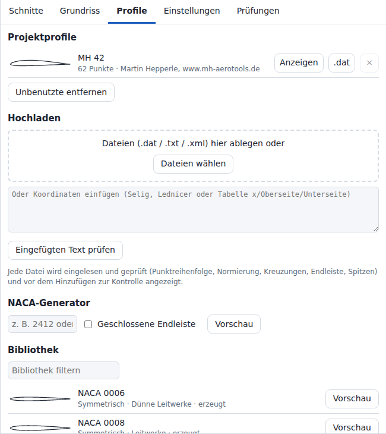

Die Registerkarte **Profile** (Airfoils) hat die Bereiche **Projektprofile** (Project airfoils), **Hochladen** (Upload), **NACA-Generator** (NACA generator) und **Bibliothek** (Library).

### Projektprofile

| Element | Wirkung |
| --- | --- |
| Listeneintrag | Kontur, Name, Punktanzahl, Quellenangabe, `unbenutzt`, wenn kein Schnitt das Profil verwendet |
| **Anzeigen** (View) | Öffnet die Vorschau; Name und Quellenangabe sind schreibgeschützt. Einzige Schaltfläche ist **Schließen** (Close). |
| **.dat** | Lädt das Profil als Selig-Datei `.dat` mit 7 Nachkommastellen herunter (mehr bei Konturen kleiner als 1, siehe [[Dateiformate]]) |
| **×** | Entfernt das Profil. Gesperrt, solange ein Schnitt es verwendet. |
| **Unbenutzte entfernen** (Remove unused) | Entfernt alle Profile, die kein Schnitt verwendet |

Das Hinzufügen eines Profils und das Entfernen eines Profils, das kein Schnitt verwendet, aktualisiert die Profillisten, die Größenwarnung und die automatische Sicherung, ohne den Flügel neu aufzubauen.

**Zum Projekt hinzufügen** (Add to project) legt keinen zweiten Eintrag an, behält den vorhandenen Eintrag und verwirft den neuen Namen und die neue Quellenangabe, wenn:

- ein Projektprofil denselben Namen und dieselben Punkte hat;
- ein Projektprofil ein erzeugtes NACA-Profil mit derselben Bezeichnung und derselben Einstellung **Geschlossene Endleiste** (Closed trailing edge) ist (Name beliebig) und seine gespeicherten Punkte die der NACA-Gleichungen sind (innerhalb von 1e-9) oder den neuen Punkten gleichen (den geprüften Punkten der Vorschau).

Die Meldung lautet dann `Das Projekt enthält dieses Profil bereits als „…“.` statt `Profil „…“ hinzugefügt.`, und der Bearbeitungsverlauf erhält keinen Schritt.

Grenzen der Projektprofile (Abschnitt [Projektgröße](#projektgröße)):

| Grenze | Registerkarte **Profile** (Hochladen von Dateien, Einfügen von Text, NACA-Generator, Bibliothek) | **Öffnen** (Open) |
| --- | --- | --- |
| 10 000 Profile | Bei 10 000 Profilen öffnet sich keine Vorschau: rote Meldung `Das Projekt enthält 10.000 Profile und hat damit die Grenze erreicht; „Unbenutzte entfernen“ schafft Platz.` | Mehr Profile: `Höchstens 10.000 Profile werden unterstützt (… gefunden).` |
| 1 000 000 Profilpunkte insgesamt | Ein Profil, das die Summe über 1 000 000 brächte, öffnet keine Vorschau und wird nicht hinzugefügt: rote Meldung `Mit diesem Profil enthalten die Projektprofile … Punkte; die Grenze liegt bei 1.000.000. „Unbenutzte entfernen“ gibt Punkte frei.` | Mehr Punkte: `Die Profile enthalten zusammen … Punkte; die Grenze liegt bei 1.000.000.` |
| 100 000 Punkte je Profil | Fehler `too-many-points` in der Vorschau ([[Dateiformate]]) | Mehr Punkte: `Profil … hat … Punkte; die Grenze liegt bei 100.000.` |

- Über 200 Profilen oder über 100 000 Profilpunkten insgesamt ergänzt der Flügelaufbau die Warnung `Großes Projekt`.
- Listen und Meldungen zeigen von einem längeren Profilnamen die ersten 200 Zeichen, gefolgt von `…`.

### Hochladen

| Eingabe | Regel |
| --- | --- |
| Dateien | `.dat`, `.txt`, `.cor`, `.xml`, `.htm`, `.html`, `.csv`. Auf die Ablagefläche ziehen oder **Dateien wählen** (Choose files) verwenden. Mehrere Dateien öffnen nacheinander je eine Vorschau. Eine Datei über 20 MB wird nicht gelesen: rote Meldung `<Datei>: … MB; Profildateien sind auf 5.000.000 Zeichen begrenzt.` Ein XFLR5-Projekt erhält auch über 20 MB den Hinweis auf **Öffnen** (Abschnitt [XFLR5-Dateien beim Hochladen von Profilen](#xflr5-dateien-beim-hochladen-von-profilen)). Eine Datei, die der Browser nicht lesen kann: rote Meldung `<Datei>: Der Browser konnte die Datei nicht lesen (NotReadableError).` |
| Eingefügter Text | Koordinaten in den Textbereich einfügen, dann **Eingefügten Text prüfen** (Check pasted text). |
| XFLR5-Dateien | Werden abgewiesen: Abschnitt [XFLR5-Dateien beim Hochladen von Profilen](#xflr5-dateien-beim-hochladen-von-profilen). |
| Zeichenkodierung | UTF-8 (Unicode Transformation Format, 8 Bit); eine Datei, die kein gültiges UTF-8 ist, wird als Windows-1252 gelesen. |
| Aufbau und Prüfungen | Selig, Lednicer, Tabelle x/Oberseite/Unterseite, XML, HTML (HyperText Markup Language): siehe [[Dateiformate]] |

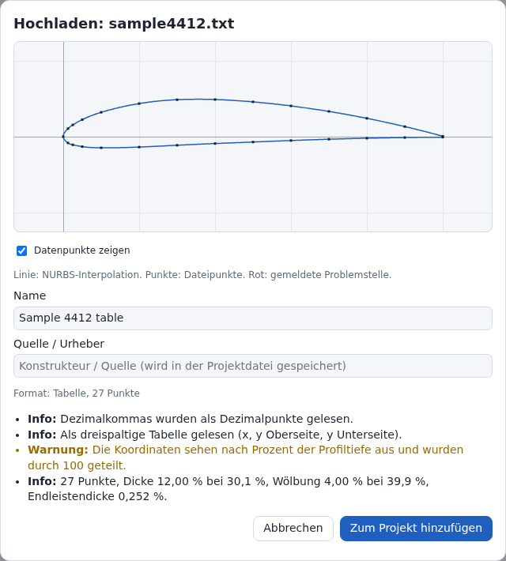

| Element der Vorschau | Inhalt |
| --- | --- |
| Zeichnung | Linie: NURBS-Interpolation; bei einem Fehler der Plausibilitätsprüfungen gerade Strecken durch die Dateipunkte. Punkte: Dateipunkte (**Datenpunkte zeigen** (Show data points), Vorgabe an). Rote Kreise: Ort eines gemeldeten Problems. Verschieben und Zoomen wie im Grundriss-Editor. |
| **Name** | Aus der Namenszeile der Datei, sonst der Dateiname; eingefügter Text ohne Namenszeile: `Eingefügtes Profil` (englische Oberfläche: `pasted`). Bearbeitbar. |
| **Quelle / Urheber** (Source / attribution) | Wird in der Projektdatei gespeichert. Vorbelegt für Namen, die mit `HS` und einem Leerzeichen oder Bindestrich beginnen (`HS 3.4`, `HS-1.4`): `Hartmut Siegmann, www.aerodesign.de`. Vorbelegt für Namen, die mit `MH`, einem optionalen Leerzeichen oder Bindestrich und einer Ziffer beginnen (`MH45`, `MH 60`): `Martin Hepperle, www.mh-aerotools.de`. Groß- und Kleinschreibung spielt keine Rolle. Vorbelegt für eine mitgelieferte Bibliotheksdatei mit ihrem Autor aus `index.json`. |
| Formatzeile | Erkanntes Format und Punktanzahl (`Format: Tabelle, 27 Punkte`; die Formate `selig`, `lednicer` und `xml` erscheinen unübersetzt) |
| Meldungen | **Fehler** (Error): verhindert das Hinzufügen. **Warnung** (Warning): Hinzufügen möglich. **Info**: Fakten, z. B. Dicke, Wölbung und Endleistendicke in % der Profiltiefe oder die Anzahl entfernter Punkte, die näher als das 1e-9-Fache der Profiltiefe am vorherigen Punkt liegen. Über 5000 Punkten: Warnung `… Punkte (Warnung über 5.000): Die Prüfungen und der erste Aufbau eines Flügels, der das Profil verwendet, dauern ….` Eine Profilseite, die an mehr als 50 Punkten in x zurückläuft: Fehler `Die Oberseite läuft an … Punkten in x zurück; die Grenze liegt bei 50.` (für die Unterseite: `Die Unterseite läuft an … Punkten in x zurück; die Grenze liegt bei 50.`). Nach bestandenen Plausibilitätsprüfungen weist die Vorschau zusätzlich eine NURBS-Kurve ab, die sich selbst kreuzt oder in x zurückläuft, und Punkte, an denen die NURBS-Interpolation scheitert (`Die NURBS-Interpolation durch die Punkte ist fehlgeschlagen (…).`). Alle drei sind Fehler `curve-shape` ([[Dateiformate]]). |
| **Zum Projekt hinzufügen** | Fügt das Profil hinzu. Gesperrt und mit **Hinzufügen nicht möglich (Fehler)** (Cannot add (errors)) beschriftet, solange ein Fehler vorliegt. |

### NACA-Generator

| Bedienelement | Werte | Wirkung |
| --- | --- | --- |
| Eingabefeld für die Bezeichnung | 4 oder 5 Ziffern, Präfix `NACA` optional (`2412`, `NACA 23012`) | Profilbezeichnung |
| **Geschlossene Endleiste** | an, aus (Vorgabe aus) | Aus: Standard-Dickengleichung, offene Endleiste. An: Koeffizient −0,1036 statt −0,1015, geschlossene Endleiste. |
| **Vorschau** (Preview) | – | Öffnet die Vorschau |

| Reihe | Gültige Bezeichnung |
| --- | --- |
| 4-stellig | Ziffern 3–4 (Dicke) größer als 00; Ziffern 1 und 2 beide 0 oder beide ungleich 0 |
| 5-stellig, Standard | Ziffer 1: 1–9; Ziffer 2: 1–5; Ziffer 3: 0; Ziffern 4–5 größer als 00 |
| 5-stellig, S-Schlag | Ziffer 1: 1–9; Ziffer 2: 2–5; Ziffer 3: 1; Ziffern 4–5 größer als 00 |

- Erzeugte Profile haben 161 Punkte (81 je Seite, Kosinusverteilung) und den Namen `NACA <Bezeichnung>`.
- Offene und geschlossene Variante einer Bezeichnung tragen denselben Namen. Zur Unterscheidung in der Schnittliste eine davon im Eingabefeld **Name** der Vorschau umbenennen.

### Bibliothek

- **Bibliothek filtern** (Filter library) durchsucht Name, Kategorie und Verwendungstext.
- Die Bibliothek enthält 17 erzeugte NACA-Profile und 6 mitgelieferte Koordinatendateien (`public/airfoils/index.json`, in die App eingebunden, sodass die Bibliothek keinen Netzzugang braucht). Die Liste zeigt zuerst die NACA-Profile, dann die Dateien in der Reihenfolge des Index.
- Text unter jedem Namen: NACA-Profil: Kategorie, Verwendung, `erzeugt`. Mitgelieferte Datei: Kategorie, Verwendungstext, Autor, Lizenzkennung.
- Jeder Eintrag: **Vorschau** öffnet die Vorschau. NACA-Einträge folgen dem Kontrollkästchen **Geschlossene Endleiste** des NACA-Generators. Eine mitgelieferte Datei wird von `airfoils/<file>` unter der eigenen Adresse der App geladen.
- **Zum Projekt hinzufügen** speichert bei einer mitgelieferten Datei das Feld **Quelle / Urheber** (vorbelegt mit dem Autor), die Lizenzkennung, die Quelladresse und die Adresse der Bedingungen im Projektprofil (Objekt `source`, [[Dateiformate|Dateiformate]]).
- Die deutsche Oberfläche zeigt Kategorie, Verwendungstext und `erzeugt` auf Deutsch, die englische auf Englisch. **Bibliothek filtern** durchsucht Kategorie und Verwendungstext in der angezeigten Sprache. Name, Autor und Lizenzkennung lauten in beiden Sprachen gleich. Die Tabellen unten nennen die deutschen Texte.

NACA-Profile:

| Bezeichnung | Kategorie | Verwendung |
| --- | --- | --- |
| 0006 | Symmetrisch | Dünne Leitwerke |
| 0008 | Symmetrisch | Leitwerke |
| 0009 | Symmetrisch | Leitwerke, Seitenflossen |
| 0010 | Symmetrisch | Leitwerke, Randprofile von Nurflügeln |
| 0012 | Symmetrisch | Kunstflugflügel, Seitenruder |
| 0015 | Symmetrisch | Dicke Kunstflugflügel |
| 2408 | Gewölbt | Dünne Sportflügel |
| 2410 | Gewölbt | Sportflügel, Randprofile |
| 2412 | Gewölbt | Trainer und Sportmodelle |
| 2415 | Gewölbt | Langsame Trainer |
| 4412 | Gewölbt | Langsamflieger, hoher Auftrieb |
| 4415 | Gewölbt | Langsamflieger, Scale-Modelle |
| 6409 | Gewölbt | Modelle mit hohem Auftrieb bei niedriger Geschwindigkeit |
| 23012 | Gewölbt | Scale- und Sportmodelle |
| 23015 | Gewölbt | Dicke Scale-Flügel |
| 23112 | S-Schlag | Fünfstelliges S-Schlag-Profil (Nurflügel-Versuche) |
| 24112 | S-Schlag | Fünfstelliges S-Schlag-Profil |

Mitgelieferte Dateien (Verwendungstext gekürzt; Dicke aus dem Verwendungstext):

| Name | Kategorie | Verwendung | Dicke | Punkte | Quelle | Lizenzkennung |
| --- | --- | --- | --- | --- | --- | --- |
| Clark Y | Gewölbt | Modellflugzeuge von Freiflug-Segelflugmodellen bis zu ferngesteuerten Scale-Modellen | 11,7 % der Profiltiefe | 33 | NACA Report No. 502, Table I; Profil von Virginius E. Clark | `public-domain` |
| NACA 8-H-12 | S-Schlag | Profil für Hubschrauber-Rotorblätter; verwendet an den manntragenden schwanzlosen Segelflugzeugen Kasper Bekas und Brochocki BKB-1; Verwendung an Modellen: in den geprüften Quellen nicht belegt | 12,0 % der Profiltiefe | 51 | NACA Technical Note 1998, Table I | `public-domain` |
| NACA M-6 | S-Schlag | S-Schlag-Profil, nickstabil, mit kleiner Druckpunktwanderung; mögliches Profil für Nurflügel | 12,0 % der Profiltiefe | 35 | NACA Report No. 221, Table XXIX | `public-domain` |
| RAF 34 | Gewölbt | Flügelprofil manntragender Flugzeuge wie der Comper Streak und, in abgewandelter Form, der de Havilland DH-98 Mosquito; für Scale-Modelle solcher Flugzeuge | 12,6 % der Profiltiefe | 33 | Tabelle des Royal Aircraft Establishment (RAE) in NACA Report No. 286 | `public-domain` |
| S9104 | Gewölbt | Profil für hohe Zuladung und hohen Auftrieb | 12,1 % der Profiltiefe | 81 | Michael Selig, University of Illinois Urbana-Champaign | `CC-BY-4.0` |
| USA 35B | Gewölbt | Flügelprofil der manntragenden Piper J-3 Cub und PA-18 Super Cub; für Scale-Modelle dieser Flugzeuge | 11,6 % der Profiltiefe | 33 | NACA Report No. 233, Table XXXVI | `public-domain` |

- Quelle, Rechtsgrundlage, Bedingungen und Text der Quellenangabe je Datei: [NOTICE.md](https://github.com/subtilitas/Wingdesigner/blob/main/public/airfoils/NOTICE.md).
- Clark Y, NACA 8-H-12, NACA M-6, RAF 34 und USA 35B: in den Vereinigten Staaten gemeinfrei (public domain). Ihr Status außerhalb der Vereinigten Staaten ist nicht geklärt.
- S9104: Lizenz Creative Commons Attribution 4.0 International (CC BY 4.0). Die Projektdatei behält die Quellenangabe. Der `.dat`-Download und die 3D-Modelldateien aus [Export](#export) enthalten keine; wer eine solche mit S9104 erstellte Datei weitergibt, fügt den Text der Quellenangabe aus NOTICE.md hinzu.
- RAF 34: 7 Werte des Quellscans sind unsicher, um bis zu 0,20 % der Profiltiefe (0,40 mm bei 200 mm Profiltiefe). NOTICE.md führt sie auf.
- Clark Y und USA 35B behalten die veröffentlichte Basislinie: Die Profilnase liegt 3,50 % bzw. 2,76 % der Profiltiefe über der x-Achse. Die Vorschau zeigt die Warnung `Die Linie von der Profilnase zur Endleiste ist um -1,97 Grad geneigt; …` (USA 35B: -1,51). Die Schränkung bezieht sich auf die x-Achse der Datei: Bei gleicher Schränkung steht die Profilsehne von Clark Y um 1,97° und die von USA 35B um 1,51° stärker Nase hoch als die eines Profils mit der Sehne auf der x-Achse.
- Nicht mitgeliefert: Daten unter Share-Alike-Lizenz (JX-Bibliothek, Creative Commons Attribution-ShareAlike 4.0), Copyleft-Daten (Mark Drela, GNU General Public License 2.0 oder neuer; GNU: „GNU’s Not Unix“) und die PROFOIL-Testprofile. Entscheidungen mit Begründung: [RECORD.md](https://github.com/subtilitas/Wingdesigner/blob/main/RECORD.md).

### Externe Quellen

Der Kasten **Weitere Profile (extern, nicht mitgeliefert)** (More airfoils (external, not bundled)) verlinkt 3 Sammlungen. Die App liefert keine Dateien daraus mit; die mitgelieferte Datei S9104 stammt von der eigenen Seite des Konstrukteurs, nicht aus der Datenbank der University of Illinois Urbana-Champaign (UIUC). Datei dort herunterladen, dann im Bereich **Hochladen** einlesen. Bedingungen und Zitate: [[Profilquellen|Profilquellen]].

| Link | Inhalt | Bedingungen (Kurzfassung) |
| --- | --- | --- |
| aerodesign.de - Hartmut Siegmann | HS-Profile und Kataloge für Brettnurflügel, Pfeilnurflügel und Segelflugmodelle | Privat, im Verein, kleingewerblich und wissenschaftlich mit Namen und Quelle; Großserien und industrielle Anwendungen brauchen eine schriftliche Nutzungsvereinbarung; Weiterverbreitung durch Dritte zum Teil eingeschränkt |
| MH-AeroTools - Martin Hepperle | MH-Profile, z. B. MH 45 und MH 60 für Nurflügel, MH 32 für Segelflugmodelle | Persönlicher Gebrauch; Veröffentlichungen nennen die Quelle; eine Neuzusammenstellung darf nicht über den Herstellungskosten verkauft werden |
| UIUC Airfoil Coordinates Database (University of Illinois Urbana-Champaign) | Etwa 1650 Profile im Selig-Format (Anzahl laut Koordinatenseite) | Keine Lizenz für die Koordinatendateien angegeben; es gelten die Rechte des jeweiligen Konstrukteurs |

- Die Hinweise in der App lauten „Etwa 1.600 Profile“ (UIUC) und „gewerbliche Nutzung braucht eine schriftliche Erlaubnis“ (aerodesign.de). Es gelten die zitierten Bedingungen in [[Profilquellen|Profilquellen]].

## Einstellungen

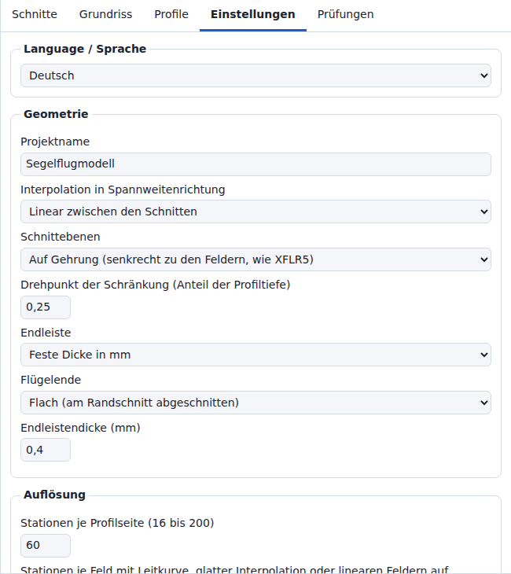

Die Registerkarte **Einstellungen** (Settings) hat die Gruppen **Language / Sprache**, **Geometrie** (Geometry), **Auflösung** (Resolution) und **Anzeige** (Display).

| Gruppe | Einstellung | Werte | Vorgabe | Wirkung |
| --- | --- | --- | --- | --- |
| **Language / Sprache** | Auswahlliste | **English**, **Deutsch** | Deutsch, wenn die erste Sprache des Browsers Deutsch ist, sonst Englisch | Sprache aller Texte der Oberfläche. Abschnitt [Sprache](#sprache). |
| **Geometrie** | **Projektname** (Project name) | Text | Name des Entwurfstyps | Name in der Projektdatei; Grundlage der Dateinamen von **Speichern** (Save) und **Exportieren** (Export). `.dat`-Downloads verwenden den Profilnamen. Ein Name über 200 Zeichen ergänzt `ein Name mit … Zeichen (Warnung über 200)` in der Warnung `Großes Projekt`, sobald der Name übernommen ist; ein kürzerer Name entfernt es. |
| **Geometrie** | **Interpolation in Spannweitenrichtung** (Spanwise interpolation) | **Linear zwischen den Schnitten** (Linear between sections), **Gerade Felder (gerade Linien zwischen den Schnitten, wie XFLR5)** (Straight panels (straight lines between sections, as XFLR5)), **Glatt (formerhaltende kubische Kurve durch die Schnitte)** (Smooth (shape-preserving cubic through sections)) | Linear; XFLR5-Import: Gerade Felder | Übergang der Schnittwerte entlang der Spannweite. Siehe Liste unten. |
| **Geometrie** | **Schnittebenen** (Section planes) | **Auf Gehrung (senkrecht zu den Feldern, wie XFLR5)** (Mitred (square to the panels, as XFLR5)), **Senkrecht (y = konstant)** (Vertical (y = const)) | Auf Gehrung; Projektdateien des Formats Version 1: Senkrecht; XFLR5-Import: siehe Abschnitt [Importieren, Abbrechen und Rückgängig](#importieren-abbrechen-und-rückgängig) | Ebene, in der jeder Schnitt liegt. Siehe Liste unten. |
| **Geometrie** | **Drehpunkt der Schränkung (Anteil der Profiltiefe)** (Twist pivot (fraction of chord)) | 0 bis 1, Schritt 0,05 | 0,25 | Punkt auf der Profilsehne, um den die Schränkung dreht |
| **Geometrie** | **Endleiste** (Trailing edge) | **Wie in den Profildateien** (As in the airfoil files), **Geschlossen (scharf)** (Closed (sharp)), **Feste Dicke in mm** (Fixed thickness in mm) | Feste Dicke (Assistent, Beispielflügel); Wie in den Profildateien für Projektdateien ohne diese Einstellung | Endleistendicke jeder Station |
| **Geometrie** | **Flügelende** (Wing tip) | **Flach (am Randschnitt abgeschnitten)** (Flat (cut at the tip section)), **Spitz (Randprofil verkleinert)** (Pointed (tip profile scaled down)) | Flach; Assistent: dessen Eingabefeld **Flügelende** (Tip) | Flach: Der Flügel endet am Randschnitt. Spitz: siehe Liste unten. |
| **Geometrie** | **Maßstab des Randprofils 1 : N der Tiefe des vorherigen Schnitts** (Tip profile scale 1 : N of the previous section chord) | N = 100 bis 1000, Schritt 50 | 200 | Nur sichtbar mit **Spitz** |
| **Geometrie** | **Endleistendicke (mm)** (Trailing-edge thickness (mm)) | ≥ 0, Schritt 0,1 | Assistent: 0,2 % der Wurzeltiefe, mindestens 0,3; Beispielflügel: 0,5; Projektdatei ohne den Wert: 0,4 | Nur sichtbar mit **Feste Dicke in mm** |
| **Geometrie** | **Einstellwinkel des Teils (°, positiv = Nasenleiste hoch)** (Part tilt (°, positive = leading edge up)) | −180 bis 180, Schritt 0,5 | 0; XFLR5-Import: der Einstellwinkel des Flügels | Starre Drehung des ganzen Teils um die y-Achse durch den Drehpunkt. Siehe Liste unten. |
| **Geometrie** | **Rollwinkel des Teils (°, positiv = rechter Randbogen hoch)** (Part roll (°, positive = right tip up)) | −180 bis 180, Schritt 0,5 | 0 | Starre Drehung des ganzen Teils um die x-Achse durch den Drehpunkt, vor dem Einstellwinkel. Siehe Liste unten. |
| **Geometrie** | **Linke Hälfte** (Left half) | **Spiegelbild der gedrehten rechten Hälfte** (Mirror image of the turned right half), **Mit der rechten Hälfte gedreht (ganzer Flügel, wie flow5)** (Turned with the right half (whole wing, as flow5)) | Spiegelbild; flow5-Import eines gerollten zweiseitigen Flügels: Gedreht | Wie die linke Hälfte dem **Rollwinkel des Teils** folgt. Siehe Liste unten. |
| **Auflösung** | **Stationen je Profilseite** (Chordwise stations per surface) | 16 bis 200, Schritt 4 | 60 | Neuabtastung der Profile: N Stationen ergeben 2 · N + 1 Punkte je Kontur (60 → 121) |
| **Auflösung** | **Stationen je Feld mit Leitkurve, glatter Interpolation oder linearen Feldern auf Gehrung** (Spanwise stations per panel with guides, smooth mode or mitred linear panels) | 3 bis 40 | 8 | Intervalle je Feld, Kosinusverteilung; nur wirksam mit eingeschalteter Leitkurve, mit **Glatt** und in einem Feld mit **Linear** zwischen Gehrungsebenen verschiedener Neigung. Weniger Intervalle erst über 5 000 000 Punkten im Flächengitter (Abschnitt [Leitkurven](#leitkurven)). |
| **Auflösung** | **Parametrisierung der Profile** (Profile parametrization) | **Zentripetal (empfohlen)** (Centripetal (recommended)), **Sehnenlänge** (Chord length), **Gleichabständig** (Uniform) | Zentripetal | Parameterverteilung der NURBS-Interpolation der Profile, im Flügelaufbau und in der Profilvorschau |
| **Anzeige** | **Gespiegelte Hälfte zeigen (y < 0)** (Show mirrored half (y < 0)) | an, aus | an | Nur 3D-Ansicht. Die Registerkarte **Prüfungen** (Checks), die Statusleiste und der Assistent nennen immer beide Hälften. Wird im Projekt gespeichert. |
| **Anzeige** | **NURBS-Kontrollnetz zeigen** (Show NURBS control net) | an, aus | aus | Nur 3D-Ansicht; wird nicht gespeichert. Über 100 000 Netzsegmenten zeichnet die Ansicht jede k-te Kontrolllinie in jeder Richtung, erste und letzte eingeschlossen. Überschreiten schon die erste und letzte Linie 100 000 Segmente (z. B. 33 × 151 000 Kontrollpunkte), verläuft jede gezeichnete Linie zudem nur durch jeden k-ten Kontrollpunkt, erster und letzter eingeschlossen. |
| **Anzeige** | **Schnittkonturen zeigen** (Show section outlines) | an, aus | an | Nur 3D-Ansicht; wird nicht gespeichert. Über 100 000 Kontursegmenten (2 · N je Schnitt, 2 · N + 1 bei offener Endleiste) zeichnet die Ansicht jede k-te Kontur, Wurzel und Rand eingeschlossen; der ausgewählte Schnitt wird immer gezeichnet. |

Unter **Stationen je Feld** nennt ein Hinweis die Punkte im Flächengitter bei den aktuellen Einstellungen (Abschnitt [Leitkurven](#leitkurven)), z. B. Entwurfstyp **Segelflugmodell** (Glider): `Flächengitter: 2.057 Punkte.`

- Nach einer Verringerung über 5 000 000 Gitterpunkten ergänzt der Hinweis `, … Stationen je Feld in Spannweitenrichtung statt …` (bei einer Station `, 1 Station je Feld in Spannweitenrichtung statt …`).
- Über 60 000 Gitterpunkten erscheint der Hinweis in Warnfarbe und ergänzt die Schätzung aus Abschnitt [Projektgröße](#projektgröße): `Flächengitter: … Punkte; über 60.000: Jede Änderung dauert … und belegt … Arbeitsspeicher.`

Interpolation in Spannweitenrichtung:

- **Linear** ohne Leitkurve, in einem Feld, dessen zwei Schnitte in Ebenen gleicher Neigung liegen (mit **Senkrecht** immer): Stationen an den Schnitten und hinzugefügte Stationen (Abschnitt [Leitkurven](#leitkurven)); gerade Linien zwischen den Stationen (Grad 1 in Spannweitenrichtung). Zwischen Gehrungsebenen verschiedener Neigung: **Stationen je Feld**-Intervalle und Grad 3 (Liste Schnittebenen unten). Zwischen zwei Schnitten gehen Profil, Profiltiefe und Schränkung getrennt ineinander über; ändert sich die Profiltiefe zusammen mit dem Profil oder der Schränkung, biegt sich das Feld, und die hinzugefügten Stationen folgen der Biegung.
- **Gerade Felder**: Stationen nur an den Schnitten, keine hinzugefügten Stationen; jeder Punkt eines Schnitts ist mit dem Punkt desselben Profiltiefenanteils des nächsten Schnitts durch eine gerade Linie verbunden (Grad 1 in Spannweitenrichtung). So baut XFLR5 seine Felder; der XFLR5-Import setzt diese Option. Beispiel: NACA 0014 bei 400 mm Profiltiefe bis NACA 0008 bei 100 mm Profiltiefe: in der Mitte 32,0 mm dick mit **Gerade Felder**, 27,5 mm mit **Linear**. Eine eingeschaltete Leitkurve stoppt den Aufbau mit `Gerade Felder folgen keinen Leitkurven: die Leitkurven in der Registerkarte Grundriss ausschalten oder Einstellungen > Interpolation in Spannweitenrichtung auf „Linear“ oder „Glatt“ setzen.`
- **Linear** mit eingeschalteter Leitkurve: **Stationen je Feld** Intervalle je Feld; Grad 3 innerhalb jedes Felds, Knick an jedem Schnitt möglich. Senkt die Grenze des Flächengitters die Intervalle je Feld auf 2 oder 1, ist der Grad 2 oder 1 (z. B. 4200 Schnitte mit 200 **Stationen je Profilseite**: 2 Intervalle, Grad 2).
- **Glatt**: Die Schnittwerte folgen einer formerhaltenden kubischen Kurve: in jedem Feld ein kubisches Polynom durch die Werte seiner beiden Schnitte, mit den Steigungen eines natürlichen kubischen Splines durch alle Schnitte, so begrenzt, dass der Wert zwischen den Werten der beiden Schnitte bleibt ([[Geometrie]], Abschnitt 3.1). Die Steigung ist an den Schnitten stetig. Ein Schnitt mit dem größten oder kleinsten Wert einer Größe (zum Beispiel der größten Profiltiefe) erhält dort die Steigung 0; ein Feld zwischen zwei gleichen Werten bleibt konstant. Das Profil wird als Mittellinie und Dicke interpoliert, daher bleibt die Dicke zwischen den Dicken der beiden Schnitte. Ungleichmäßig verteilte Schnitte, etwa ein Profilwechsel zwischen zwei Schnitten im Abstand 0,5 mm aus dem XFLR5-Import, werden ohne Überschwingen gebaut. **Stationen je Feld** Intervalle je Feld (Vorgabe 8); Grad 3 in Spannweitenrichtung, jedes Feld für sich interpoliert.
- Bei 2 Schnitten ergeben beide dieselben Werte für x, z, Profiltiefe und Schränkung.
- Die Flächen unterscheiden sich, wo sich Profil oder Schränkung entlang der Spannweite ändern. Eine gleichzeitige Änderung der Profiltiefe vergrößert den Unterschied.
- Ab 3 Schnitten unterscheiden sich die Flächen auch dort, wo x, z, Profiltiefe oder Schränkung an einem Schnitt ihre Steigung ändern. Beispiel: Entwurfstyp **Sportmodell** (Sport) mit 3 Schnitten, mittlere Profiltiefe 150 mm statt 192 mm, ein Profil, keine Schränkung: 8,08 mm.
- Ein Profil, keine Schränkung und eine von Wurzel bis Rand linear veränderte Profiltiefe ergeben keinen Unterschied.
- Größter Abstand der 2 Flächen bei gleichen Flächenparametern, Entwurfstypen des Assistenten, Schnittebenen **Senkrecht**: **Pfeilnurflügel** (Swept flying wing) 0,56 mm, **Sportmodell** 0,34 mm, **Segelflugmodell** 0,20 mm, **Trainer** 0,00 mm, **Brettnurflügel** (Plank) 0,00 mm, **Leitwerk** (Tail surface) 0,00 mm.
- Berechnung: [[Geometrie|Geometrie]].

Schnittebenen:

- **Auf Gehrung** (Mitred): Der Wurzelschnitt steht senkrecht; ein Schnitt zwischen zwei Feldern liegt in der winkelhalbierenden Ebene der beiden Felder; der Randschnitt steht rechtwinklig zum letzten Feld. Jedes Profil wird in der Dicke um 1/cos des Winkels zwischen seiner Ebene und dem Feld gestreckt, sodass der Flügel quer zu jedem Feld so dick ist wie sein Profil, wie in XFLR5. Die Ebenen folgen den Schnittpositionen: Ein in z verschobener Schnitt dreht seine Ebene und die Ebenen seiner Nachbarn. Ein Feldwinkel in der Tabelle **Schnitte** ersetzt die V-Form aus den Positionen; er bleibt, wenn ein Schnitt verschoben wird.
- Zwei Schnitte, die in y weniger als 1 mm auseinanderliegen (ein Profilwechsel, wie ihn XFLR5-Dateien schreiben), teilen sich eine Ebene: die winkelhalbierende Ebene der Felder um sie herum.
- **Senkrecht** (Vertical): Jeder Schnitt liegt in einer Ebene y = konst. Quer zu einem Feld mit der V-Form δ hat der Flügel cos δ der Dicke des Profils: 99,6 % bei 5°, 81,9 % bei 35°.
- Ein Flügel ohne V-Form ist in beiden Modi gleich.
- **Linear** mit **Auf Gehrung**: Ein Feld, dessen beide Schnitte in Ebenen verschiedener Neigung liegen, erhält **Stationen je Feld** Intervalle und den Grad 3 in Spannweitenrichtung, sodass jede Station das überblendete Profil in ihrer eigenen Ebene trägt. Jeder Unterschied der Neigung zählt: Eine V-Form von 1e-6° statt 0° kann die Fläche um bis zu 0,17 mm verschieben, wo sich Profiltiefe, Profil und Schränkung entlang des Feldes ändern. Die Entwurfstypen **Sportmodell**, **Trainer** und **Brettnurflügel** bauen 9 Stationen statt 2 mit **Senkrecht**, der Beispielflügel 17 statt 3; das **Segelflugmodell** hat in beiden Modi 17 (Leitkurven). Der Flügel des **Sportmodells** (NACA 2412 bei 240 mm bis NACA 2410 bei 144 mm) folgt dann genau der Überblendung bei **Linear** und hat 1,4 % weniger Volumen als der senkrechte Aufbau, der die 2 Schnitte mit geraden Linien 0,343 mm neben dieser Überblendung verbindet.
- **Gerade Felder** mit **Auf Gehrung**: Die geraden Linien verbinden die Schnitte in ihren Ebenen, die Fläche von XFLR5.
- **Glatt** mit **Auf Gehrung**: Die Schnitte liegen in denselben Ebenen wie bei **Linear**. Dazwischen folgt die Neigung der glatten Kurve durch die Neigungen der Schnitte, und die Dickenstreckung folgt der Steigung der glatten Kurve durch die Schnittpositionen, sodass der Flügel quer zu dieser Kurve so dick bleibt wie sein Profil. Die Entwurfstypen mit V-Form liegen bis zu 1,9 mm neben einem Aufbau mit **Glatt** und Ebenen **Senkrecht** (**Hochleistungssegler**). An der Wurzel bleibt die Ebene senkrecht, während die glatte Kurve die Wurzel bis zu 3-mal so steil wie das erste Feld verlassen kann: Eine Ebene mehr als 60° schräg zu dieser Kurve stoppt den Aufbau (Abschnitt [Prüfungen](#prüfungen)).
- Fehler mit **Auf Gehrung**: eine Ebene mehr als 60° schräg zu ihrem Feld (das Profil würde mehr als auf das 2-Fache gestreckt), und Ebenen benachbarter Schnitte oder Stationen, die sich innerhalb der Profile schneiden, was die Fläche faltet (Abschnitt [Prüfungen](#prüfungen)). **Senkrecht** baut beide.
- Die Schränkung dreht jeden Schnitt in seiner Ebene. Entlang x gesehen trifft ein um 35° geneigter Schnitt mit 2° Schränkung die Anströmung unter 1,64°.
- Berechnung: [[Geometrie|Geometrie]], Abschnitt 3.8.

Einstellwinkel und Rollwinkel des Teils:

- Das Teil dreht sich als starrer Körper: erst der Rollwinkel um die x-Achse, dann der Einstellwinkel um die y-Achse, beide durch den Drehpunkt. Ein positiver Einstellwinkel hebt die Nasenleiste, ein positiver Rollwinkel hebt den rechten Randbogen.
- **Linke Hälfte**: **Spiegelbild der gedrehten rechten Hälfte** (Vorgabe) hält den Flügel symmetrisch zu y = 0; ein Rollwinkel hebt beide Randbögen. **Mit der rechten Hälfte gedreht (ganzer Flügel, wie flow5)** dreht den ganzen Flügel als einen Körper: Ein positiver Rollwinkel hebt den rechten Randbogen und senkt den linken. Ohne Rollwinkel sind beide gleich. Ein Projekt mit **Mit der rechten Hälfte gedreht** wird im Format Version 4 gespeichert, das Wingdesigner 0.4.0 abweist.
- Unter den beiden Feldern nennt eine Zeile den Drehpunkt. Ein Projekt des XFLR5- oder flow5-Imports dreht sich um den Drehpunkt, den es speichert, den Ursprung des Flügels (bei einem XFLR5-Seitenleitwerk, das unter seinen Ursprung reicht, ein Punkt daneben, [[Dateiformate]], Abschnitt Seitenleitwerk): `Das Teil dreht sich als starrer Körper um x = 650,0 mm, y = 0,0 mm, z = 40,0 mm, den beim Import gespeicherten Drehpunkt: erst der Rollwinkel um die x-Achse, dann der Einstellwinkel um die y-Achse.` Sonst ist der Drehpunkt die Nasenleiste des Wurzelschnitts, hier des Entwurfstyps **Sportmodell** (Sport): `Das Teil dreht sich als starrer Körper um die Nasenleiste des Wurzelschnitts (x = 0,0 mm, y = 0,0 mm, z = 0,0 mm): erst der Rollwinkel um die x-Achse, dann der Einstellwinkel um die y-Achse.`
- Eingegebene Werte außerhalb von ±180° werden auf −180° oder 180° gesetzt. Jede Änderung ist ein Rückgängig-Schritt.
- Gedreht: die 3D-Ansicht, STEP, STL und 3MF sowie die Positionen unter **Prüfungen** (Spannweite, Lage der MAC, 25 % MAC). Im Koordinatensystem des Teils: die Tabelle der Registerkarte **Schnitte**, die Registerkarte **Grundriss**, der Schaumschnitt-Assistent und die Projektdatei.
- Ein gedrehtes Teil außerhalb von ±1 200 000 mm ist ein Fehler (Abschnitt [Prüfungen](#prüfungen)).
- Berechnung: [[Geometrie|Geometrie]], Abschnitt 3.9.

Spitzes Flügelende (**Flügelende** = **Spitz**):

- Randtiefe = max(c_prev / N, 1 mm). c_prev ist die verwendete Profiltiefe am vorletzten Schnitt.
- Die eingegebene Randtiefe wird nicht verwendet.
- Im letzten Feld bleibt die Profiltiefe mindestens gleich der Randtiefe. Zusammenlaufende Leitkurven enden im verkleinerten Randprofil.
- Mit eingeschalteter Nasenlinie und Endlinie legt ihr Abstand am Rand die Randtiefe fest, wenn er größer als die verkleinerte Randtiefe ist. Ist er mehr als 0,5 mm größer, erscheint eine Warnung.
- Entwurfstyp **Segelflugmodell** mit dem Eingabefeld **Flügelende** = **Spitz**: Randtiefe 1,00 mm (Untergrenze 1 mm), 22 Stationen (17 + 5 hinzugefügt), größte Abweichung an den geprüften Spannweitenpositionen 0,263 mm, keine Warnung. Auch die übrigen Entwurfstypen des Assistenten mit **Flügelende** = **Spitz** ergeben keine Warnung.
- Innerhalb von 2 mm vor einem spitzen elliptischen Flügelende (Entwurfstypen des Assistenten) weichen x von Nasen- und Endleiste der Fläche höchstens 0,031 mm vom vorgesehenen Grundriss ab (2001 Spannweitenpositionen); die übrigen Konturpunkte dort sind nicht gemessen. Die Abweichungswarnung erfasst diese Positionen nicht.

Regeln für die Endleiste:

- Feste Dicke größer als 5 % der örtlichen Profiltiefe: an dieser Station auf 5 % begrenzt. Eine Warnung nennt die Anzahl der Stationen. Stationen im letzten Feld eines spitzen Flügelendes werden ohne Warnung begrenzt.
- Gemischte Endleisten, Bedingung: Nicht jede Station ist geschlossen, und mindestens eine Station hat eine Endleistendicke unter 0,01 mm. Beispiele: **Wie in den Profildateien** mit Profilen, die an einigen Stationen geschlossen und an anderen offen sind; **Feste Dicke in mm** über 0 und unter 0,01 mm.
- Gemischte Endleisten, Wirkung: Diese Stationen werden auf 0,01 mm geöffnet, mit Warnung. Die Warnung nennt `an manchen Stationen geschlossen und an anderen offen` auch dann, wenn keine Station geschlossen ist.
- Fehler: Die Einstellung zieht die Oberseite unter die Unterseite. Bedingung: **Geschlossen** oder **Feste Dicke** bei einem Profil, das innen dünner ist als seine Endleistendicke.
- Fehler: Die Einstellung lässt Oberseite und Unterseite sich berühren. Bedingung: **Geschlossen** oder **Feste Dicke**, Dicke höchstens 0,001 % der Profiltiefe zwischen 1 % und 99 % der Profiltiefe.

Einfluss der Auflösung auf Rechenzeit und Größe der STEP-Datei (STEP: Standard for the Exchange of Product model data):

| Fall | Stationen je Profilseite | Aufbau (Profile im Cache) | STEP-Export | STEP-Größe |
| --- | --- | --- | --- | --- |
| Entwurfstyp Segelflugmodell, elliptische Leitkurven, 17 Stationen in Spannweitenrichtung, beide Hälften | 60 | 36 ms | 6 ms | 445 KB |
| Entwurfstyp Segelflugmodell, elliptische Leitkurven, 17 Stationen in Spannweitenrichtung, beide Hälften | 200 | 89 ms | 19 ms | 1398 KB |

- Mittelwert aus 10 Läufen nach 2 Aufwärmläufen (STEP-Export: 3 Läufe); Node.js 24.21, Intel Xeon x86-64, 2,10 GHz, 4 Kerne, Load Average 3,3 (andere Prozesse liefen); 29.09.2026.
- 1 KB = 1024 Byte.
- Große Projekte im Browser: Abschnitt [Projektgröße](#projektgröße).
- Vollständige Messbedingungen und weitere Fälle: [[Entwicklung|Entwicklung]], Abschnitt Build- und Exportzeiten.
- Smartphones: nicht gemessen.

## Prüfungen

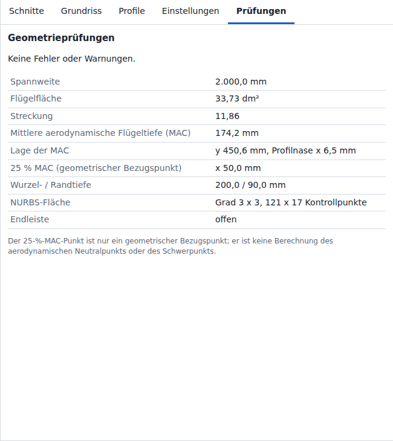

Die Registerkarte **Prüfungen** (Checks) trägt die Überschrift **Geometrieprüfungen** (Geometry checks). Jeder Eintrag der Liste beginnt mit **Fehler:** (Error), **Warnung:** (Warning) oder **Info:** (Info).

| Zeile | Inhalt |
| --- | --- |
| Liste der Fehler und Warnungen | Alle Fehler und Warnungen des Flügels, dann die Info-Zeilen, sonst `Keine Fehler oder Warnungen.` Info-Zeilen zählen in der Statusleiste nicht mit. |
| **Spannweite** (Span) | 2 × y des Randschnitts, in mm; bei einem gedrehten Teil 2 × |y| der gedrehten Nasenleiste am Rand |
| **Flügelfläche** (Wing area) | beide Hälften, in dm² |
| **Streckung** (Aspect ratio) | Spannweite² / Flügelfläche |
| **Mittlere aerodynamische Flügeltiefe (MAC)** (Mean aerodynamic chord (MAC)) | mm |
| **Lage der MAC** (MAC position) | Spannweitenposition y der MAC und x ihrer Profilnase (`y … mm, Profilnase x … mm`); bei einem gedrehten Teil beide mit dem Teil gedreht |
| **25 % MAC (geometrischer Bezugspunkt)** (25 % MAC (geometric reference)) | x des Punkts bei 25 % der MAC; bei einem gedrehten Teil mit dem Teil gedreht |
| **Wurzel- / Randtiefe** (Root / tip chord) | mm |
| **NURBS-Fläche** (Surface) | NURBS-Grad (Profiltiefenrichtung × Spannweitenrichtung) und Anzahl der Kontrollpunkte (`Grad … x …, … x … Kontrollpunkte`) |
| **Endleiste** (Trailing edge) | `geschlossen` oder `offen` |

- Flügelfläche, MAC und Lage der MAC: 5-Punkt-Gauß-Legendre-Quadratur des vorgesehenen Grundrisses (Profiltiefe und Nasenleiste über y) in jedem Intervall zwischen benachbarten Teilungspunkten: Wurzel, Rand, Schnitte und jeder Knoten und Kontrollpunkt einer eingeschalteten Leitkurve. Exakt für gerade Felder sowie für **Glatt** (Smooth) mit flachem Flügelende und ohne Leitkurven.
- Mit Leitkurven, Quadraturfehler der Flügelfläche gegenüber der Mittelpunktregel mit 200 000 Intervallen: −2,2 × 10⁻¹⁰ % (Entwurfstyp **Segelflugmodell** (Glider)), −2,1 × 10⁻⁹ % (Entwurfstyp **Segelflugmodell** mit spitzem Flügelende). Weitere Werte: [[Geometrie|Geometrie]].
- Wurzelschnitt nicht bei y = 0: Die Lücke zwischen den Hälften zählt zur Spannweite, nicht zur Flügelfläche.
- Ein gedrehtes Teil: Flügelfläche, MAC sowie Wurzel- und Randtiefe im Koordinatensystem des Teils; Spannweite, Lage der MAC und 25 % MAC in den Achsen des Flugzeugs, mit der Profilnase der MAC gedreht in der Höhe z der Stationen. Ein Rollwinkel, der den Rand hebt, verkürzt die Spannweite.
- Der 25-%-MAC-Punkt ist ein geometrischer Bezugspunkt. Er ist keine Berechnung von Neutralpunkt oder Schwerpunkt. Die Registerkarte sagt es so: `Der 25-%-MAC-Punkt ist nur ein geometrischer Bezugspunkt; er ist keine Berechnung des aerodynamischen Neutralpunkts oder des Schwerpunkts.`

| Meldung | Schweregrad | Bedingung |
| --- | --- | --- |
| `Profil „…“: …` | Fehler | das Profil besteht die Plausibilitätsprüfungen nicht ([[Dateiformate]]), z. B. in einer geöffneten Projektdatei. Mit **Parametrisierung der Profile** (Profile parametrization) **Sehnenlänge** (Chord length) oder **Gleichabständig** (Uniform) endet jede Meldung `Profil „…“` mit `Die Einstellung „Zentripetal“ unter Einstellungen > Parametrisierung der Profile folgt den Punkten genauer.` |
| `Profil „…“: Die NURBS-Interpolation ist fehlgeschlagen (…).` | Fehler | die NURBS-Interpolation des Profils schlägt fehl |
| `Profil „…“: Die NURBS-Kurve durch die Punkte überschneidet sich selbst nahe x = … % der Profiltiefe; …` | Fehler | die Kurve durch die Profilpunkte kreuzt sich selbst. Die Kreuzung teilt die Kontur in 2 Teile; der Teil mit der kleineren Diagonale des Hüllrechtecks hat eine mittlere Breite (Fläche / Diagonale des Hüllrechtecks) über 0,05 % der Profiltiefe. Ein Profil, das bei einer Profiltiefe über 200 mm verwendet wird, scheitert auch, wenn diese Breite bei seiner größten Profiltiefe 0,1 mm übersteigt; die Meldung lautet dann `…; die Schleife ist bei … mm Profiltiefe … mm breit, über 0,1 mm. …` |
| `Profil „…“: Die Profilseite läuft in x um … % der Profiltiefe zurück, nahe x = … % der Profiltiefe; …` | Fehler | die Kurve durch die Profilpunkte läuft um mehr als 0,01 % der Profiltiefe in x zurück. Im Einlesetest mit 1964 realen Profildateien weist diese Prüfung mit **Zentripetal** (Centripetal) 4 Dateien ab, mit **Sehnenlänge** 12 und mit **Gleichabständig** 82 ([[Profilquellen]], Abschnitt Einlesetest). |
| `Profil „…“: Die Oberseite läuft an … Punkten in x zurück; die Grenze liegt bei 50.` (ebenso `Die Unterseite …`) | Fehler | eine Seite des Profils läuft an mehr als 50 Punkten in x zurück (Prüfung `folds`, [[Dateiformate]]) |
| `Nasenlinie: …` / `Endlinie: …` | Fehler | y der Leitkurvenpunkte steigt nicht streng an, oder die Kurve läuft in y zurück; Modus **Durch Punkte** (Through points): `Die Punkte … und … bei y = … mm und y = … mm liegen für die Kurvenparameter zu dicht beieinander; die Punkte auseinanderschieben.`, wenn zwei normierte y-Werte höchstens 4 Einheiten der letzten Stelle des größeren Werts oder höchstens 2^-1021 (etwa 4,5e-308) auseinanderliegen; `Die Kurvenanpassung ist singulär; die Punkte in y weiter auseinanderschieben oder den Modus „Kontrollpunkte“ verwenden.`, wenn die Interpolation Punkte, deren normierte y-Werte enger liegen, als sie auflöst, nicht lösen kann, z. B. 1e-300 der Spannweite |
| `Nasenlinie: Die Kurve durch die Punkte erreicht x = … mm, jenseits von ±1.200.000 mm; die Punkte in y gleichmäßiger verteilen oder den Modus „Kontrollpunkte“ verwenden.` (ebenso `Endlinie`) | Fehler | ein Kontrollpunkt der Leitkurve liegt jenseits von x = ±1 200 000 mm |
| `Die Schnittwerte ergeben bei y = … mm nicht endliche Koordinaten; …` | Fehler | x der Profilnase, Profiltiefe, z oder Schränkung einer geprüften Spannweitenposition ergibt eine nicht endliche Koordinate, z. B. bei **Glatt** mit 3 Schnitten bei y = 0, 1e-304 und 600 mm und x der Profilnase 0, 1 000 000 und 0 mm, wo die Steigung zwischen den ersten beiden Schnitten die größte Gleitkommazahl doppelter Genauigkeit übersteigt. **Öffnen** (Open) und die Tabelle der Registerkarte **Schnitte** (Sections) akzeptieren solche Positionen; die Tabelle weist nur ein y ab, das dem eines anderen Schnitts gleicht. |
| `Bei y = … mm verlässt der Flügel die Projektgrenzen (x der Profilnase … mm, z … mm, Profiltiefe … mm; Grenzen ±1.200.000 mm und 100.000 mm Profiltiefe). Die Leitkurven prüfen.` | Fehler | an einer geprüften Spannweitenposition: x der Profilnase, x der Endleiste oder z jenseits von ±1 200 000 mm, oder Profiltiefe über 100 000 mm; nur Leitkurven führen dorthin, zum Beispiel Nasenlinie und Endlinie mehr als 100 000 mm voneinander entfernt |
| `Das neu abgetastete Profil hat bei y = … mm, x = … % der Profiltiefe eine negative Dicke (… % der Profiltiefe): …` | Fehler | Ober- und Unterseite eines Schnittprofils kreuzen sich an einer Tiefenstation. Hinter 99 % der Profiltiefe gelten Kreuzungen bis 0,01 % der Profiltiefe, höchstens 0,1 mm, als Dicke null. |
| `Die Endleisteneinstellung zieht die Oberseite bei y = … mm unter die Unterseite (… % der Profiltiefe); …` | Fehler | **Geschlossen** (Closed) oder **Feste Dicke** (Fixed thickness) bei einem Profil, das innen dünner ist als seine Endleistendicke |
| `Ober- und Unterseite des interpolierten Profils berühren sich bei y = … mm, x = … % der Profiltiefe (Dicke … % der Profiltiefe); …` | Fehler | **Wie in den Profildateien** (As in the airfoil files): Dicke höchstens 0,001 % der Profiltiefe zwischen 1 % und 99 % der Profiltiefe |
| `Die Endleisteneinstellung lässt Ober- und Unterseite sich bei y = … mm, x = … % der Profiltiefe berühren (Dicke … % der Profiltiefe); …` | Fehler | **Geschlossen** oder **Feste Dicke**: Dicke höchstens 0,001 % der Profiltiefe zwischen 1 % und 99 % der Profiltiefe |
| `Die Profiltiefe sinkt bei y = … mm auf … mm; Nasenlinie und Endlinie dürfen sich nicht berühren oder kreuzen.` | Fehler | Profiltiefe unter 1 mm an einer geprüften Spannweitenposition (relative Rundungsfehler bis 1e-9 zählen nicht, sodass Schnitte mit genau 1 mm aufgebaut werden). Ohne beide Leitkurven ist die Profiltiefe die Überblendung der Schnitttiefen, die zwischen ihnen bleibt. Flacher Rand mit dem Minimum am Rand und über −0,01 mm: Die Meldung ergänzt `Für ein Flügelende, das in einer Spitze endet, Einstellungen > Flügelende auf „Spitz“ setzen.` |
| `Die angepasste Fläche hat nicht endliche Koordinaten; …` | Fehler | eine Koordinate eines Kontrollpunkts der angepassten Fläche ist keine endliche Zahl |
| `Die angepasste Fläche stülpt sich zwischen den Stationen bei y = … mm um (örtliche Dicke … % der Profiltiefe): …` | Fehler | örtliche Dicke der angepassten Fläche unter 0 an einer verglichenen Tiefenstation; geprüft an den geprüften Spannweitenpositionen und bei 0,25, 0,5 und 0,75 jedes Stationsintervalls |
| `Die angepasste Fläche hat zwischen den Stationen bei y = … mm die Dicke null (örtliche Dicke … % der Profiltiefe): …` | Fehler | örtliche Dicke der angepassten Fläche höchstens 0,001 % der Profiltiefe an einer verglichenen Tiefenstation zwischen 1 % und 99 % der Profiltiefe; dieselben Positionen |
| `Die angepasste Fläche faltet sich oder schnürt sich zwischen den Stationen bei y = … mm ein (Profiltiefe … mm in der vorgesehenen Profiltiefenrichtung, Minimum 1 mm): …` | Fehler | Profiltiefe der angepassten Fläche nach den hinzugefügten Stationen unter 0,9 mm oder in Gegenrichtung; dieselben Positionen |
| `Die Fläche überschneidet sich selbst bei y = … mm nahe x = … mm: …` | Fehler | eine Flächenzeile kreuzt sich zwischen den neu abgetasteten Punkten selbst; mittlere Breite des kleineren Teils wie bei Profilen, über 0,05 % der örtlichen Profiltiefe oder über 0,1 mm, je nachdem, was kleiner ist. Geprüfte Zeilen: jeder Schnitt, die Mitte zwischen 2 Schnitten und die Mitte zwischen 2 benachbarten Stationen in den 64 breitesten Stationsintervallen. |
| `Das Flächengitter braucht … Punkte bei einer Station je Feld (… Schnitte, … Stationen je Profilseite); die Grenze liegt bei 5.000.000. Die Stationen je Profilseite verringern oder Schnitte entfernen.` | Fehler | Schnitte × (2 · **Stationen je Profilseite** (Chordwise stations per surface) + 1) über 5 000 000, z. B. mehr als 12 468 Schnitte bei 200 Tiefenstationen ([Leitkurven](#leitkurven)) |
| `Schnitt …: Seine Gehrungsebene liegt …° schräg zum benachbarten Feld, das streckt das Profil auf das …-Fache (Grenze 2, 60°). Die Änderung der V-Form dort verringern oder Einstellungen > Schnittebenen auf „Senkrecht“ setzen.` | Fehler | **Auf Gehrung**: mehr als 60° zwischen einer Schnittebene und einem benachbarten Feld, z. B. ein erstes Feld steiler als 60°. Eine Ebene, die gerundet 60,0° schräg liegt, wird gebaut. Die Dickenstreckung hat 3 Nachkommastellen: Ein erstes Feld mit 65° ergibt `… liegt 65,0° schräg … auf das 2,366-Fache …` |
| `Schnitte … und …: Ihre Gehrungsebenen schneiden sich … mm von der Position (y, z) von Schnitt … entfernt, innerhalb der Profile, daher faltet sich die Fläche zwischen ihnen. Das Feld verlängern, die Änderung der V-Form verringern oder Einstellungen > Schnittebenen auf „Senkrecht“ setzen.` | Fehler | **Auf Gehrung**, **Gerade Felder**: Die Ebenen von 2 benachbarten Schnitten schneiden sich innerhalb ihrer Profile, z. B. ein kurzes Feld zwischen zwei großen Änderungen der V-Form. Ein Feld, das in y weniger als 1 mm breit ist, zählt nicht: Seine Schnitte teilen sich eine Ebene |
| `Die Fläche faltet sich zwischen den Stationen bei y = … mm und y = … mm (Feld von Schnitt … bis …): Ihre Schnittebenen kreuzen sich innerhalb der Profile. Das Feld verlängern, die Änderung der V-Form verringern oder Einstellungen > Schnittebenen auf „Senkrecht“ setzen.` | Fehler | **Auf Gehrung**: Die Ebenen von 2 benachbarten Stationen kreuzen sich nach der Anpassung innerhalb der Profile |
| `Interner Fehler: …` | Fehler | Ausnahme im Flügelaufbau (Programmfehler) |
| `Großes Projekt: … (Warnung über …). Jede Änderung dauert … und belegt … Arbeitsspeicher.` | Warnung | eine Projektgröße über ihrer Warnschwelle; die Meldung nennt jede solche Größe, z. B. `1.000 Schnitte (Warnung über 200) und 121.000 Punkte im Flächengitter (Warnung über 60.000)`. Dauert der erste Aufbau mindestens 1 s länger als eine Änderung, endet die Meldung mit `Das Öffnen des Projekts oder eine Änderung der Parametrisierung der Profile dauert ….` Schwellen und Schätzung: Abschnitt [Projektgröße](#projektgröße). |
| `Stationen je Feld von … auf … verringert: … Schnitte mit … Stationen je Profilseite halten die Fläche bei höchstens 5.000.000 Gitterpunkten.` | Warnung | Flächengitter über 5 000 000 Punkten mit dem eingestellten Wert **Stationen je Feld** (Spanwise stations per panel), mit eingeschalteter Leitkurve oder mit **Glatt** ([Leitkurven](#leitkurven)) |
| `Spitzes Flügelende: Nasenlinie und Endlinie enden … mm voneinander entfernt, daher beträgt die Randtiefe … mm statt … mm; …` | Warnung | spitzes Flügelende, beide Leitkurven an, Abstand am Rand mehr als 0,5 mm größer als die verkleinerte Randtiefe |
| `Die Endleistendicke … mm übersteigt 5 % der Profiltiefe an … Stationen; dort wird sie auf 5 % begrenzt.` | Warnung | feste Dicke größer als 5 % der örtlichen Profiltiefe |
| `Die Endleiste ist an manchen Stationen geschlossen und an anderen offen; … Stationen wurden auf 0,01 mm geöffnet.` | Warnung | nicht jede Station geschlossen, und mindestens eine Station mit einer Endleistendicke unter 0,01 mm |
| `Der Einstellwinkel von …° des XFLR5-Imports ist in die Schnittwerte eingerechnet, was nur für senkrechte Schnittebenen genau ist: Mit Schnittebenen auf Gehrung liegt das Teil bis zu etwa … mm neben dem von XFLR5 (0,75 · Profiltiefe · sin(Einstellwinkel) · sin(Neigung)). Einstellungen > Schnittebenen „Senkrecht“ hält den Import genau.` | Warnung | ein Projekt des Formats Version 2 aus dem XFLR5-Import, dessen Einstellwinkel in die Schnitte eingerechnet bleibt (eine Leitkurve eingeschaltet oder bearbeitet, oder eine Schränkung ohne ihn außerhalb von ±360°; Abschnitt [Speicherung](#speicherung)), auf **Auf Gehrung** gestellt, mit einer Schnittebene, die nicht senkrecht ist ([[Dateiformate]], Abschnitt XFLR5-Import) |
| `Ein Einstellwinkel des XFLR5-Imports im Format Version 1 kann in die Schnittwerte eingerechnet sein; der Winkel ist nicht gespeichert. Die Einrechnung ist nur für senkrechte Schnittebenen genau: Mit Schnittebenen auf Gehrung liegt das Teil bis zu 0,75 · Profiltiefe · sin(Einstellwinkel) · sin(Neigung) neben dem von XFLR5. Einstellungen > Schnittebenen „Senkrecht“ hält den Import genau; ein erneuter Import der XFLR5-Datei ergibt den starren Einstellwinkel.` | Warnung | ein Projekt, das aus einer Datei der Version 1 geöffnet wurde (`foldedTiltUnknown`), auf **Auf Gehrung** gestellt, mit einer Schnittebene, die nicht senkrecht ist ([[Dateiformate]], Abschnitt XFLR5-Import) |
| `Das gedrehte Teil reicht bis x = … mm, y = … mm, z = … mm, außerhalb von ±1.200.000 mm; Einstellwinkel oder Rollwinkel des Teils verkleinern oder das Teil näher an seinen Drehpunkt legen.` | Fehler | **Einstellwinkel des Teils** oder **Rollwinkel des Teils** nicht 0, und ein mit dem Teil gedrehter Kontrollpunkt der Fläche liegt außerhalb von ±1 200 000 mm in x, y oder z (mit **Linke Hälfte** gedreht auch der linken Hälfte) |
| `Schnitte … und …: Bei y = … mm liegt die Gehrungsebene …° schräg zur glatten Bezugslinie, das streckt das Profil auf das …-Fache (Grenze 2, 60°). Die Änderung der V-Form dort verringern, Schnitte hinzufügen oder Einstellungen > Schnittebenen auf „Senkrecht“ setzen.` | Fehler | **Auf Gehrung**, **Glatt**: Zwischen zwei Schnitten oder an der Wurzel biegt sich die glatte Kurve durch die Schnittpositionen mehr als 60° von der Ebene einer Station weg |
| `Schnitte … und …: Bei y = … mm drehen sich die Gehrungsebenen zwischen ihnen schneller, als die Profile es zulassen, daher faltet sich die Fläche. Das Feld verlängern, die Änderung der V-Form verringern oder Einstellungen > Schnittebenen auf „Senkrecht“ setzen.` | Fehler | **Auf Gehrung**, **Linear** oder **Glatt**: Entlang eines Feldes drehen sich die Ebenen mit der Neigung; bei y wandert ein Punkt des Profils rückwärts durch die Ebene seiner Station, z. B. ein dickes Profil auf einem kurzen Feld zwischen großen Änderungen der V-Form. An einem Schnitt werden beide benachbarten Felder geprüft |
| `Die Fläche weicht nach … hinzugefügten Stationen bei y = … mm um bis zu … mm von der vorgesehenen Fläche ab; die Stationen je Feld erhöhen.` | Warnung | Abweichung vom vorgesehenen Profil (Profilnase, oberer Endleistenpunkt, jede k-te Tiefenstation je Profilseite, k = **Stationen je Profilseite** / 6, abgerundet: 5 bei 60) über 0,5 mm (oder 10 % der örtlichen Profiltiefe, wenn kleiner) an einer geprüften Spannweitenposition bleibt nach den hinzugefügten Stationen (höchstens 32 in 6 Durchläufen, 1 Durchlauf über 60 000 Punkten im Flächengitter). Die Meldung nennt die Anpassung, die der Aufbau behält (die kleinste größte Abweichung im Verhältnis zur Toleranz), und deren hinzugefügte Stationen ([Leitkurven](#leitkurven)). |

- Geprüfte Spannweitenpositionen: Abschnitt [Leitkurven](#leitkurven).
- Bei genau 1 Station steht die Einzahl: `an 1 Station`, `1 Station wurde auf 0,01 mm geöffnet`, `nach 1 hinzugefügten Station`. Ohne hinzugefügte Stationen beginnt die letzte Meldung mit `Die Fläche weicht ohne hinzugefügte Stationen bei y = …`.

Aufbaufehler, die die Bedienelemente und **Öffnen** verhindern (nur über Programmcode erreichbar). Der Aufbau meldet die Grenzen von **Öffnen** für Schnitte und Leitkurven ebenfalls als Fehler:

| Meldung | Bedingung | Verhindert durch |
| --- | --- | --- |
| `Mindestens 2 Schnitte sind erforderlich.` | weniger als 2 Schnitte | **×** ist bei 2 Schnitten gesperrt; **Öffnen** weist die Datei ab |
| `Schnitt …: Profiltiefe darf höchstens 100.000 mm betragen.` / `Schnitt …: x muss innerhalb von ±1.000.000 mm liegen.` (ebenso y, z) / `Schnitt …: Schränkung muss innerhalb von ±360 Grad liegen.` | Profiltiefe über 100 000 mm; x, y oder z außerhalb von ±1 000 000 mm; Schränkung außerhalb von ±360° | die Tabelle der Registerkarte **Schnitte** begrenzt eingegebene Werte auf diese Grenzen; Ziehen im Grundriss bleibt innerhalb der Grenzen; **Öffnen** weist die Datei ab |
| `Höchstens 20.000 Schnitte werden unterstützt (… gefunden).` | mehr als 20 000 Schnitte | **+** ist bei 20 000 Schnitten gesperrt; **Öffnen** weist die Datei ab |
| `guides.….points: höchstens 20.000 Punkte (… gefunden).` / `guides.….points: x muss innerhalb von ±1.100.000 mm und y innerhalb von ±1.000.000 mm liegen.` | eine Leitkurve mit mehr als 20 000 Punkten, mit einem Punkt-x außerhalb von ±1 100 000 mm oder einem Punkt-y außerhalb von ±1 000 000 mm | **Punkt hinzufügen** (Add point) ist bei 20 000 Punkten gesperrt; Ziehen und Punkttabelle halten x innerhalb von ±1 100 000 mm; **Öffnen** weist die Datei ab |
| `Der Schnitt bei y = … mm liegt auf der gespiegelten Seite; …` | y des Wurzelschnitts unter 0 | das Eingabefeld y setzt negative Werte auf 0; **Öffnen** weist die Datei ab |
| `Die Schnitte … und … haben dieselbe Spannweitenposition y = … mm.` | zwei Schnitte mit gleichem y | die Schnitttabelle weist den Wert ab; **Öffnen** weist die Datei ab |
| `Die Schnitte … und … bei y = … mm und y = … mm liegen für die Flächenparameter zu dicht beieinander (Spannweitenanteile … und …); die Schnitte auseinanderschieben.` | zwei Schnitte, deren Spannweitenanteile (y − y Wurzel) / (y Rand − y Wurzel) sich höchstens um 4 Einheiten der letzten Stelle des größeren Werts oder höchstens um 2^-1021 (etwa 4,5e-308) unterscheiden, z. B. y = 714063,9936875999 und 714063,9936876 mm zwischen Wurzel bei 169026,9 mm und Rand bei 816583,4 mm | einen der beiden Schnitte verschieben |
| `Die Flächenanpassung ist singulär: Die Schnitte … und … bei y = … mm und y = … mm liegen zu dicht beieinander; die Schnitte auseinanderschieben.` | die Flächeninterpolation kann Stationen, deren Spannweitenanteile enger liegen, als sie auflöst, nicht lösen; die Meldung nennt die 2 nächstgelegenen Schnitte | einen der beiden Schnitte verschieben |
| `Der Schnitt bei y = … mm verwendet das unbekannte Profil „…“.` | Profil-ID fehlt im Projekt | **×** ist für verwendete Profile gesperrt; **Öffnen** weist die Datei ab |

Bei einem Fehler wird der Flügel nicht aufgebaut: 3D-Ansicht und Kennwerte bleiben leer, und **Exportieren** (Export) bietet nur das Projekt-JSON an.

## Projektgröße

Über einer Warnschwelle arbeitet die App wie gewohnt. Der Flügelaufbau ergänzt eine Warnung in der Registerkarte **Prüfungen** (Checks), die die Statusleiste mitzählt:

`Großes Projekt: <Größen>. Jede Änderung dauert … und belegt … Arbeitsspeicher.`

- Jede Größe lautet z. B. `1.000 Schnitte (Warnung über 200)`.
- Dauert der geschätzte erste Aufbau mindestens 1 s länger als eine Änderung, endet die Warnung mit `Das Öffnen des Projekts oder eine Änderung der Parametrisierung der Profile dauert ….` Der erste Aufbau läuft nach **Öffnen** (Open), für das wiederhergestellte Projekt beim nächsten Aufruf und nach einer Änderung von **Parametrisierung der Profile** (Profile parametrization); er prüft und interpoliert jedes Profil neu, das ein Schnitt verwendet. Profile ohne Schnitt gehen nicht ein.
- Eine Meldung mit demselben Text erscheint, wenn eine Größe ihre Schwelle überschreitet: nach einer Änderung, nach **Öffnen** und für das wiederhergestellte Projekt beim nächsten Aufruf.
- Die festen Grenzen liegen dort, wo einem Browser-Tab am Desktop der Speicher ausgeht oder eine Änderung etwa eine Minute dauert.

| Größe | Warnung über | Feste Grenze | An der festen Grenze |
| --- | --- | --- | --- |
| Schnitte | 200 | 20 000 | **+** gesperrt; **Öffnen** weist die Datei ab |
| Projektprofile | 200 | 10 000 | die Registerkarte **Profile** (Airfoils) fügt kein Profil hinzu; **Öffnen** weist die Datei ab |
| Punkte eines Profils | 5000 | 100 000 | Fehler `too-many-points` in der Vorschau; **Öffnen** weist die Datei ab |
| Profilpunkte insgesamt | 100 000 | 1 000 000 | die Registerkarte **Profile** fügt kein Profil hinzu; **Öffnen** weist die Datei ab |
| Punkte einer eingeschalteten Leitkurve | 500 | 20 000 (jede Leitkurve) | **Punkt hinzufügen** (Add point) gesperrt; **Öffnen** weist die Datei ab |
| Punkte im Flächengitter | 60 000 | 5 000 000 | weniger Stationen je Feld; Aufbaufehler, wenn eine Station je Feld die Grenze überschreitet |
| Dreiecke eines Exports als STL (Stereolithografie) oder 3MF (3D Manufacturing Format) | 2 000 000 (Exportdialog) | 10 000 000 | **Herunterladen** (Download) gesperrt |
| Kontrollpunkte eines STEP-Exports | 1 000 000 (Exportdialog) | 3 000 000 | **Herunterladen** gesperrt |
| Zeichen des Projektnamens oder eines Profilnamens | 200 | 10 000 | Namensfelder nehmen höchstens 10 000 Zeichen an; der Profil-Parser behält die ersten 10 000; **Öffnen** weist die Datei ab |
| Projektdatei | – | 100 MB | **Öffnen** weist die Datei ungelesen ab; **Speichern** (Save) lässt die abgeleiteten NURBS-Daten weg; ein Projekt, das auch ohne sie über 100 MB liegt, wird nicht gespeichert |

- Ein Projekt innerhalb aller Grenzen kann als Datei 100 MB überschreiten, wenn seine Namen und Quelltexte nahe an ihren Grenzen liegen. Beispiel: 10 000 Profile mit Namen von 10 000 Zeichen enthalten 100 000 000 Namenszeichen; mit 5 Punkten je Profil belegt die Datei 100,8 MB. **Speichern** schreibt dann keine Datei und zeigt `Speichern fehlgeschlagen: Das Projekt belegt als Datei 100,8 MB, mehr als die 100 MB, die „Öffnen“ liest.`; **Exportieren** (Export) > **Projekt-JSON** (Project JSON) zeigt `Export fehlgeschlagen: Das Projekt belegt als Datei 100,8 MB, …`. Projekte mit kürzeren Namen und Quelltexten passen: 1 000 000 Profilpunkte belegen etwa 40 MB.

Die Schätzung in der Warnung ist eine lineare Anpassung an Messungen in Chromium 141 auf 4 Kernen eines Xeon-Server-Prozessors (CPU, Central Processing Unit) mit 2,1 GHz (JavaScript-Zeit, ohne Zeichnen der 3D-Ansicht):

| Anteil | Zeit | Arbeitsspeicher |
| --- | --- | --- |
| Grundwert jeder Änderung | 0,2 s | 15 MB |
| Je 1000 Punkte im Flächengitter | 11,5 ms | 0,65 MB |
| Je Punkt einer eingeschalteten Leitkurve (der mit mehr Punkten) | 0,11 ms | 0,05 MB |
| Je 1000 Profilpunkte | 1,5 ms | 0,2 MB |
| Je 1000 Einträge der Profil-Auswahllisten in der Tabelle der Registerkarte **Schnitte** (Sections) (Schnitte × Profile; über 20 000 einer je Schnitt) | 8,5 ms | 0,5 MB |
| Nur erster Aufbau, zusätzlich zu einer Änderung: je Profil, das ein Schnitt verwendet | 4,4 ms | nicht geschätzt |
| Nur erster Aufbau, zusätzlich zu einer Änderung: je 1000 Profilpunkte | 30 ms | nicht geschätzt |

- Zeiten lauten `unter 1 s`, `etwa 1,5 s` (halbe Sekunden unter 10 s) oder `etwa 14 s`; der Speicher hat 2 signifikante Stellen, z. B. `etwa 94 MB`, `etwa 1,6 GB`.
- Anteile des ersten Aufbaus: gemessen in Node.js 24, nicht im Browser: 7,4 ms je Profil mit 99 Punkten bei 1000 und 2000 Profilen, davon 3 ms durch den Punktanteil. Beispiel: 20 000 Schnitte (**Linear**, 16 **Stationen je Profilseite** (Chordwise stations per surface): 660 000 Punkte im Flächengitter) und 10 000 Profile mit 99 Punkten: `Jede Änderung dauert etwa 9,5 s und belegt etwa 650 MB Arbeitsspeicher. Das Öffnen des Projekts oder eine Änderung der Parametrisierung der Profile dauert etwa 83 s.`
- Das Zeichnen der 3D-Ansicht kommt mit der Zeit der Grafikkarte hinzu. Smartphones: nicht gemessen.

Gemessen je Änderung einer Profiltiefe im Browser: Chromium 141 headless, Software-Rendering, 4 geteilte Kerne, Load Average 2 bis 8; **Linear**, 1 Profil, 60 Tiefenstationen; JavaScript-Zeit und JavaScript-Heap nach der Änderung.

| Schnitte | Punkte im Flächengitter | Schätzung | Zeit | Speicher |
| --- | --- | --- | --- | --- |
| 1000 | 121 000 | etwa 1,5 s, etwa 94 MB | 1,5 bis 1,6 s | 78 bis 91 MB |
| 5000 | 605 000 | etwa 7 s, etwa 410 MB | 6,9 bis 7,4 s | 345 bis 361 MB |
| 10 000 | 1 210 000 | etwa 14 s, etwa 810 MB | 15,8 bis 16,4 s | 490 MB |
| 15 000 | 1 815 000 | etwa 21 s, etwa 1,2 GB | 19 bis 23 s | 678 MB |
| 20 000 | 2 420 000 | etwa 28 s, etwa 1,6 GB | 24 s | 969 MB |

- 20 000 Schnitte: 57 s Seitenzeit je Änderung mit Software-Rendering; Öffnen der Datei: 24 s JavaScript, 59 s Seitenzeit.
- Auswahl eines Schnitts: 2 ms JavaScript bei 200 Schnitten, 100 bis 110 ms bei 20 000 Schnitten.
- Vollständige Messbedingungen und weitere Fälle: [[Entwicklung|Entwicklung]].

## Export

Der Exportdialog trägt den Titel **Exportieren** (Export).

| Format | Bedeutung | Inhalt |
| --- | --- | --- |
| STEP | Standard for the Exchange of Product model data; Textdatei nach ISO 10303-21 (ISO: International Organization for Standardization), Anwendungsprotokoll 214 | Exakte B-Spline-Flächen, geschlossene Volumenkörper |
| STL | Stereolithografie | Binäres Dreiecksnetz |
| 3MF | 3D Manufacturing Format | Zip-Paket mit Dreiecksnetz |
| Projekt-JSON | Projektdatei dieser App | Profile, Schnitte, Kurven, Einstellungen, NURBS-Daten |

| Gruppe | Option | Vorgabe |
| --- | --- | --- |
| **Format** | **STEP (AP214, exakte NURBS-Volumenkörper)** (STEP (AP214, exact NURBS solids)) | ausgewählt, wenn der Flügel fehlerfrei ist |
| **Format** | **STL (binäres Dreiecksnetz)** (STL (binary triangle mesh)) | – |
| **Format** | **3MF (Dreiecksnetz für den 3D-Druck)** (3MF (triangle mesh for 3D printing)) | – |
| **Format** | **Projekt-JSON (Profile, Schnitte, Kurven, Einstellungen, NURBS-Daten)** (Project JSON (airfoils, sections, curves, settings, NURBS data)) | ausgewählt, wenn der Flügel Fehler hat; dann einziges Format |
| **Flügelhälften** (Wing halves) | **Beide Hälften als getrennte Körper** (Both halves as separate bodies) | ausgewählt |
| **Flügelhälften** | **Ganzer Flügel als ein Körper (Netzformate, Wurzel bei y = 0)** (Full wing as one body (mesh formats, root at y = 0)) | – |
| **Flügelhälften** | **Nur rechte Hälfte** (Right half only) | – |
| **Flügelhälften** | **Nur linke Hälfte** (Left half only): die linke Hälfte allein, so wie **Linke Hälfte** unter **Einstellungen** sie baut; bei einem einseitigen flow5-Flügel die Hälfte, die flow5 baut | – |
| **Netzdichte (STL, 3MF)** (Mesh density (STL, 3MF)) | **Normal** | ausgewählt |
| **Netzdichte (STL, 3MF)** | **Fein (4-fache Dreiecksanzahl)** (Fine (4x triangles)): verdoppelt die Unterteilung in beiden Flächenrichtungen | – |
| Kontrollkästchen | **Fusion-360-Korrektur: Y nach oben (auch SolidWorks)** (Fusion 360 fix: Y up (also SolidWorks)): STEP, STL und 3MF mit Y als Hochachse, das Teil um −90° um x gedreht | aus, außer es war beim letzten Export als STEP, STL oder 3MF an |

Fusion-360-Korrektur:

- Die App rechnet mit x in Profiltiefenrichtung zur Endleiste, y in Spannweitenrichtung zum rechten Flügelende und z nach oben. Ein CAD-Programm mit Y als Hochachse liest eine solche Datei mit der Spannweite nach oben und der Oberseite nach vorn. Beispiel: Fusion 360 mit **Preferences** > **General** > **Design** > **Default modeling orientation** „Y up“ (Bezeichnungen der englischen Oberfläche von Fusion 360) zeigt in seiner Draufsicht die Seite des Flügels.
- Mit eingeschaltetem Kontrollkästchen schreibt der Export jeden Punkt als (x, z, −y): Die Oberseite zeigt nach +Y, die Profiltiefe bleibt entlang X, die rechte Hälfte liegt bei Z ≤ 0 und die linke bei Z ≥ 0. Der Hinweis unter den Optionen nennt die Achsen der Datei: `Einheiten: Millimeter. Achsen: x in Profiltiefenrichtung zur Endleiste, y nach oben, z in Spannweitenrichtung zum linken Flügelende.`
- Die Korrektur gilt für STEP, STL und 3MF. Die Projekt-JSON behält die Achsen der App.
- Das Kontrollkästchen beginnt so, wie es beim letzten Export als STEP, STL oder 3MF war, im Browser unter `wingdesigner.upAxis` gespeichert (`y` für an, `z` für aus). Ohne Browserspeicher beginnt es ausgeschaltet.
- Andere Wege in Fusion 360: vor dem Öffnen einer Datei ohne Korrektur die **Default modeling orientation** auf „Z up“ stellen, oder den Körper um −90° um die X-Achse drehen (**Modify** > **Move/Copy**).

Für STL und 3MF nennt ein Hinweis unter der Netzdichte die Dreiecke und die Dateigröße für Format, Flügelhälften und Netzdichte der Auswahl, z. B. Entwurfstyp **Segelflugmodell** (Glider), STL, beide Hälften, **Normal**: `0,02 Millionen Dreiecke, Datei etwa 1,2 MB.` Projekt-JSON zeigt keinen Hinweis.

| Dreiecke | Hinweis | **Herunterladen** (Download) |
| --- | --- | --- |
| bis 2 000 000 | `… Millionen Dreiecke, Datei ….` | bedienbar |
| über 2 000 000 | Warnfarbe; ergänzt `Der Export dauert … und belegt … Arbeitsspeicher.` | bedienbar |
| über 10 000 000 | Fehlerfarbe: `… Millionen Dreiecke, Datei …: über der Grenze von 10 Millionen Dreiecken, ab der einem Browser-Tab auf dem Desktop der Speicher ausgeht. Netzdichte „Normal“, eine Hälfte oder weniger Stationen je Profilseite oder je Feld verwenden.` | gesperrt |

- Schätzung je Million Dreiecke: STL 0,8 s, 210 MB Arbeitsspeicher, 50 MB Datei; 3MF 5,8 s, 110 MB Arbeitsspeicher, 11,5 MB Datei. Die Speicherschätzung addiert 15 MB.
- Gemessen (Chromium 141, 4 Kerne eines Xeon-Server-Prozessors mit 2,1 GHz): STL mit 8,5 Millionen Dreiecken: 6,9 s, 423 MB Datei, 2,7 GB Arbeitsspeicher in der Spitze; 3MF mit 8,5 Millionen Dreiecken: 49 s, 97 MB Datei; STL mit 20 Millionen Dreiecken scheiterte.

Für STEP nennt der Hinweis die Kontrollpunkte der Flächen in der Datei und die Dateigröße für die gewählten Flügelhälften (die linke Hälfte verdoppelt die Anzahl; die Netzdichte gilt nicht), z. B. Entwurfstyp **Segelflugmodell**, beide Hälften: `4.114 Kontrollpunkte, Datei etwa 1 MB.` Über 1 000 000 Kontrollpunkten lautet die Anzahl `… Millionen`.

| Kontrollpunkte | Hinweis | **Herunterladen** |
| --- | --- | --- |
| bis 1 000 000 | `… Kontrollpunkte, Datei ….` | bedienbar |
| über 1 000 000 | Warnfarbe; ergänzt `Der Export dauert … und belegt … Arbeitsspeicher.` | bedienbar |
| über 3 000 000 | Fehlerfarbe: `… Millionen Kontrollpunkte, Datei …: über der Grenze von 3 Millionen Kontrollpunkten, ab der die Datei mehr Speicher braucht, als ein Browser-Tab auf dem Desktop bietet. Eine Hälfte oder weniger Stationen je Profilseite oder je Feld verwenden.` | gesperrt |

- Schätzung je Million Kontrollpunkte: 2,5 s, 620 MB Arbeitsspeicher, 98 MB Datei. Die Speicherschätzung addiert 15 MB.
- Gemessen: 3,3 Millionen Kontrollpunkte (4161 Stationen) schrieben eine Datei von 330 MB in 8,4 s (Chromium 141); Node.js 24 brauchte je Kontrollpunkt 1,6 bis 3,4 µs, 98 Byte Datei und 620 Byte Speicher in der Spitze. Etwa 5,4 Millionen Kontrollpunkte überschreiten die Grenze des Browsers von 512 MB je Zeichenkette. Zwischen 3,3 und 5,4 Millionen: nicht gemessen.

| Schaltfläche | Wirkung |
| --- | --- |
| **Herunterladen** | Schreibt die Datei mit den gewählten Optionen. |
| **Abbrechen** (Cancel) | Schließt den Dialog ohne Datei. |

| Format | Beide Hälften | Ganzer Flügel | Rechte Hälfte |
| --- | --- | --- | --- |
| STEP | 2 Volumenkörper | 2 Volumenkörper | 1 Volumenkörper |
| STL | 1 Datei, 2 geschlossene Hüllen | 1 geschlossene Hülle | 1 geschlossene Hülle |
| 3MF | 2 Objekte: `Wing right`, `Wing left` | 1 Objekt: `Wing` | 1 Objekt: `Wing right` |
| Projekt-JSON | vollständiges Projekt | vollständiges Projekt | vollständiges Projekt |

- **Ganzer Flügel als ein Körper** setzt den Wurzelschnitt bei y = 0 und den **Rollwinkel des Teils** 0° voraus. Sonst schreiben STL und 3MF 2 Körper wie bei **Beide Hälften als getrennte Körper**: Eine gerollte Wurzel verlässt die Ebene y = 0.
- STEP, STL und 3MF enthalten das Teil, gedreht um **Einstellwinkel des Teils** und **Rollwinkel des Teils**, die linke Hälfte so, wie **Linke Hälfte** sie einstellt; die Projekt-JSON enthält die Schnitte im Koordinatensystem des Teils.
- STEP hat keinen zusammengefügten Körper: **Ganzer Flügel als ein Körper** schreibt 2 Volumenkörper.
- Das Projekt-JSON enthält das vollständige Projekt. Ohne Flügelfehler enthält es zusätzlich die abgeleiteten NURBS-Daten: Profilkurven, Leitkurven, Stationen in Spannweitenrichtung und die NURBS-Fläche des Flügels.
- Brächten die abgeleiteten NURBS-Daten die Datei über 100 MB, die größte Datei, die **Öffnen** (Open) liest, lassen **Speichern** (Save) und Projekt-JSON sie weg und melden `Die Datei lässt die abgeleiteten NURBS-Daten weg: Mit ihnen wäre sie größer als die 100 MB, die „Öffnen“ höchstens liest. „Öffnen“ berechnet sie neu; der STEP-Export schreibt die exakten Flächen.`
- Dateiname: Projektname mit ausgeschriebenen Umlauten (ä → ae, ö → oe, ü → ue, Ä → Ae, Ö → Oe, Ü → Ue, ß → ss), andere Akzente entfernt; jede Folge von Zeichen außerhalb von `A–Z a–z 0–9 . _ -` wird zu einem `_`; `_` am Anfang und Ende entfällt; die ersten 120 Zeichen bleiben. Endung `.step`, `.stl`, `.3mf` oder `.json`. Leerer Name: `wing`.
- Einheit: mm in allen Formaten. Achsen wie in der App.
- Reicht der Speicher des Browsers nicht oder wird eine eigene Größengrenze des Browsers erreicht, bricht der Export mit der roten Meldung `Export fehlgeschlagen: <Grund>.` ab, bei STL und 3MF gefolgt von `Netzdichte „Normal“ oder weniger Stationen je Profilseite und je Feld verwenden.`, bei STEP von `Eine Hälfte oder weniger Stationen je Profilseite und je Feld verwenden.`
- STL und 3MF speichern 32-Bit-Koordinaten. Fällt durch die Rundung ein bei dieser Auflösung sichtbares Dreieck zusammen oder kippt es um, schreibt der Export keine Datei und zeigt die rote Meldung `STL speichert 32-Bit-Koordinaten: Bei … mm beträgt ihr Rasterabstand … mm, und … von … Dreiecken fallen zusammen oder kehren sich um. Den Flügel zum Ursprung hin verschieben oder als STEP exportieren.` (3MF: `3MF-Leseprogramme speichern 32-Bit-Koordinaten: …`). `Bei … mm` nennt die größte Koordinate der beschädigten Dreiecke.
- Fällt das erste beschädigte Dreieck auch dann zusammen oder kippt um, wenn seine x- und z-Werte neben 0 und die Wurzel auf y = 0 verschoben sind (bei gespiegeltem Flügel beide Hälften), ist schon sein Abstand zur Wurzel zu grob: Schnitte oder Stationen liegen dichter beieinander als der 32-Bit-Abstand, und Verschieben des Flügels hilft nicht. Der letzte Satz lautet dann `Schnitte oder Stationen nahe y = … mm liegen dichter beieinander als der Rasterabstand dort (… mm); sie auseinanderschieben oder als STEP exportieren.` Beispiel: 4 Schnitte, 2 davon bei y = 300 mm und y = 300,00001 mm: `STL speichert 32-Bit-Koordinaten: Bei 300 mm beträgt ihr Rasterabstand 0,000031 mm, und 484 von 1.928 Dreiecken fallen zusammen oder kehren sich um. Schnitte oder Stationen nahe y = 300 mm liegen dichter beieinander als der Rasterabstand dort (0,000031 mm); sie auseinanderschieben oder als STEP exportieren.`
- Dateiinhalte: [[Dateiformate|Dateiformate]].

## Schaumschnitt

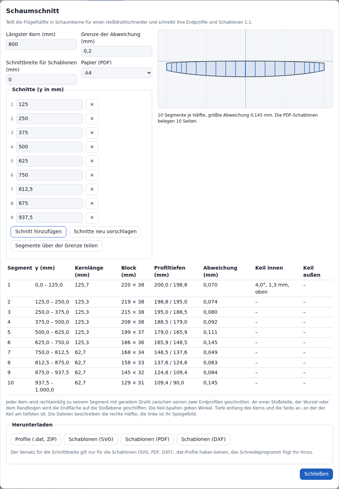

**Schaum** (Foam) in der Kopfleiste öffnet den Schaumschnitt-Assistenten für den aktuellen Flügel, einen Dialog mit dem Titel **Schaumschnitt** (Foam cutting). Er teilt den Halbflügel in Segmente. Jedes Segment ist ein Schaumkern, den ein Heißdraht entlang gerader Linien zwischen seinen beiden Endprofilen schneidet. Der Assistent schreibt diese Endprofile für Schneideprogramme und als Schablonen 1:1. Das Projekt ändert er nicht.

| Begriff | Bedeutung |
| --- | --- |
| Schnitt | Spannweitenposition y (mm), an der ein Kern endet und der nächste beginnt. Die Schnitte dieses Dialogs sind nicht die Schnitte der Registerkarte **Schnitte** (Sections); diese heißen in diesem Abschnitt Profilschnitte. |
| Segment, Kern | der Flügel zwischen zwei benachbarten Schnitten oder zwischen Wurzel oder Rand und einem Schnitt |
| Inneres Ende, äußeres Ende | das Ende eines Kerns näher an der Wurzel, näher am Rand |
| Endfläche | ebenes Ende des Kerns, rechtwinklig zur Kernachse; beide Endflächen sind parallel |
| Stoßebene | die Ebene, in der zwei Kerne aneinanderstoßen oder ein Kern an Wurzel oder Rand endet (an einem Profilschnitt seine Schnittebene, sonst die winkelhalbierende Ebene der beiden Kernachsen) |
| Keil | Material zwischen Endfläche und Stoßebene, das vor dem Verkleben der Kerne abgeschliffen wird |
| Abweichung | größter Abstand (mm) zwischen dem geradlinigen Kern und dem Flügel |
| Schnittbreite | Breite der Fuge, die der Heißdraht ausschmilzt (mm) |

Geometrie, Formeln und Beispiele: [[Geometrie|Geometrie]], Abschnitt 8 „Schaumkerne“.

### Einstellungen

| Feld | Bereich | Vorgabe | Wirkung |
| --- | --- | --- | --- |
| **Längster Kern (mm)** (Longest core (mm)) | 20 bis 5000 | 800 | Arbeitsbreite des Heißdrahtschneiders oder Länge des Schaumblocks. Eine Änderung schlägt die Schnitte neu vor; bearbeitete Schnitte werden ersetzt. |
| **Grenze der Abweichung (mm)** (Deviation limit (mm)) | 0,01 bis 10 | 0,2 | Segmente darüber werden markiert; **Segmente über der Grenze teilen** (Split segments over the limit) fügt Schnitte hinzu, damit sie die Grenze einhalten. |
| **Schnittbreite für Schablonen (mm)** (Kerf for templates (mm)) | 0 bis 5 | 0 | Die Umrisse der Schablonen (SVG: Scalable Vector Graphics, PDF: Portable Document Format, DXF: Drawing Exchange Format) werden um die Hälfte davon nach außen versetzt. Die `.dat`-Profile bleiben ohne Versatz. |
| **Papier (PDF)** (Paper (PDF)) | A4, A3, Letter | A4 | Seitengröße der PDF-Schablonen |

- Ein Wert außerhalb seines Bereichs wird abgewiesen: Das Feld zeigt wieder den gespeicherten Wert.
- Die 4 Einstellungen werden im Browser unter `wingdesigner.foam` gespeichert. Die Schnitte werden nicht gespeichert: Jedes Öffnen schlägt sie aus **Längster Kern** neu vor.

### Schnitte

Der Vorschlag setzt einen Schnitt an jeden Profilschnitt zwischen Wurzel und Rand. Jedes Stück dazwischen teilt er in gleiche Teile, die höchstens so lang sind wie **Längster Kern**, entlang der V-Form gemessen. Profilschnitte, die weniger als 5 mm auseinanderliegen, ergeben einen Schnitt. Die Kernlänge enthält zusätzlich die Keiltiefen an ihren Enden und kann **Längster Kern** um diese überschreiten: **Sportmodell** (Sport) als ein Kern, Bezugslinie 600,2 mm, Kern 600,5 mm.

| Bedienelement | Wirkung |
| --- | --- |
| Feld **Schnitt i, y in mm** (Cut i, y in mm) | Verschiebt Schnitt i. Die Liste wird neu sortiert. |
| **×** neben einem Schnitt | Entfernt ihn. |
| **Schnitt hinzufügen** (Add cut) | Fügt einen Schnitt in der Mitte des längsten Segments hinzu. |
| **Schnitte neu vorschlagen** (Propose cuts again) | Ersetzt die Liste durch den Vorschlag. |
| **Segmente über der Grenze teilen** (Split segments over the limit) | Teilt jedes Segment über **Grenze der Abweichung** in der Mitte und wiederholt das, bis kein Segment von 10 mm oder mehr darüber liegt oder 200 Segmente erreicht sind. Ein Segment unter 10 mm wird nicht geteilt. |

- Jede Änderung berechnet die Segmente im nächsten Animations-Frame neu. 200 Segmente dauern etwa 1 s (Node.js 24 auf einer Server-CPU mit 2,1 GHz; im Browser nicht gemessen).
- Ein Schnitt, der näher als 5 mm an einem anderen Schnitt, der Wurzel oder dem Rand liegt, wird entfernt, mit `1 Schnitt wurde entfernt: näher als 5 mm an einem anderen Schnitt, der Wurzel oder dem Randbogen.`
- Höchstens 200 Segmente je Halbflügel.
- Enter in einem Feld übernimmt den Wert und lässt den Dialog offen.

### Segmenttabelle und Zusammenfassung

| Spalte | Inhalt |
| --- | --- |
| **Segment** | Nummer, von der Wurzel an |
| **y (mm)** | innerer und äußerer Schnitt |
| **Kernlänge (mm)** (Core length (mm)) | Abstand der Endflächen entlang der Kernachse; Warnfarbe über **Längster Kern** |
| **Block (mm)** | Breite in Profiltiefenrichtung × Höhe des Schablonenrahmens: der kleinste Block, der beide Endprofile enthält, plus 10 mm auf jeder Seite |
| **Profiltiefen (mm)** (Chords (mm)) | Profiltiefe des inneren / äußeren Endprofils |
| **Abweichung (mm)** (Deviation (mm)) | größter Abstand zwischen dem geradlinigen Kern und dem Flügel; Warnfarbe über **Grenze der Abweichung** |
| **Keil innen** (Wedge inboard), **Keil außen** (Wedge outboard) | Winkel, Tiefe entlang des Kerns und die Seite, an der der Keil am tiefsten ist (`oben`, `unten`); `–` ohne Keil |

Die Zusammenfassung unter dem Grundriss nennt die Anzahl der Segmente und die größte Abweichung, die Kerne, die länger als **Längster Kern** sind, die Segmente über **Grenze der Abweichung**, entfernte Schnitte und die Anzahl der PDF-Seiten. Beispiel, Entwurfstyp **Sportmodell** mit den Vorgaben: `1 Segment je Hälfte, Abweichung 0,341 mm. 1 Segment weicht mehr als 0,20 mm vom Flügel ab; Segmente über der Grenze teilen fügt Schnitte hinzu. Die PDF-Schablonen belegen 2 Seiten.` Nach **Segmente über der Grenze teilen**: 2 Segmente, größte Abweichung 0,085 mm.

Der Grundriss zeigt beide Hälften mit der Wurzel, den Schnitten und dem Rand als blaue Linien.

### Downloads

| Schaltfläche | Datei | Inhalt |
| --- | --- | --- |
| **Profile (.dat, ZIP)** (Profiles (.dat, ZIP)) | `<name>_foam_profiles.zip` | Je Segmentende eine `.dat`-Datei in mm (Ordner `mm/`) und eine auf Profiltiefe 1 normierte (Ordner `normalized/`); `segments.csv`; `README.txt` |
| **Schablonen (SVG)** (Templates (SVG)) | `<name>_foam_templates.svg` | Alle Schablonen auf einem Blatt im Maßstab 1:1, Breite und Höhe in mm |
| **Schablonen (PDF)** (Templates (PDF)) | `<name>_foam_templates.pdf` | Die Schablonen im Maßstab 1:1 auf Seiten der Größe **Papier (PDF)** |
| **Schablonen (DXF)** (Templates (DXF)) | `<name>_foam_templates.dxf` | Die Schablonen als DXF von AutoCAD R12, mm |

`<name>`: der Projektname, wie beim Export umgeformt (Abschnitt [Export](#export)). Dateiinhalte: [[Dateiformate|Dateiformate]], Abschnitt Schaumschnitt-Dateien.

Jede Schablone zeigt:

- Textzeilen, bei der Rahmenbreite umbrochen (mindestens bei 150 mm): Segment und Ende; y, Kernlänge und Blockgröße; Profiltiefe und Anstellwinkel; den abzuschleifenden Keil. Bei einem schmalen Rahmen verteilt sich ein Text auf 2 Zeilen.
- Einen Rahmen: den Blockquerschnitt plus 10 mm auf jeder Seite. Beide Schablonen eines Segments haben denselben Rahmen.
- Das Endprofil, um die halbe Schnittbreite nach außen versetzt.
- 21 nummerierte Marken (0 bis 20) an Punkten mit demselben Index auf beiden Schablonen eines Segments. Marken mit gleicher Nummer werden gleichzeitig durchfahren.

Das Blatt beginnt mit einem 100-mm-Maßstab und den Anweisungen. Jede PDF-Seite wiederholt den Maßstab mit `100 mm. Seite <i> von <n>.`

PDF-Seiten:

- Rand 10 mm. Die untersten 12 mm des bedruckbaren Bereichs enthalten den Maßstab und die Seitenbeschriftung.
- Die Schablonen folgen einander vom oberen Rand einer Seite an und beginnen eine neue Seite, wo sie nicht mehr passen.
- Eine Schablone, die breiter oder höher als der bedruckbare Bereich ist, wird in Streifen geteilt, die sich um 10 mm überlappen. Jeder Streifen trägt die Beschriftung `<Schablone>: Teil <i> von <n> (Zeile <r>, Spalte <c>)`. Kreuze in der Überlappung stehen auf beiden Streifen einer Stoßstelle, damit sich die Streifen passgenau zusammenkleben lassen.
- Ausrichtung: die mit weniger in Streifen geteilten Schablonen, dann die mit weniger Seiten; bei Gleichstand Hochformat. Die 260 mm breiten Schablonen des Entwurfstyps **Sportmodell** passen ungeteilt auf A4 quer (277 mm bedruckbare Breite).

Beispiel, **Längster Kern** 800 mm, auf 0,2 mm geteilt: **Sportmodell** 3 Seiten auf A4, 1 auf A3, 4 auf Letter; **Segelflugmodell** (Glider) 10 Seiten auf A4, 4 auf A3, 10 auf Letter.

### Schneiden

- Die Dateien beschreiben die rechte Hälfte. Die linke Hälfte ist ihr Spiegelbild: dieselben Profile mit getauschtem innerem und äußerem Ende, dieselben Schablonen umgedreht.
- Jeder Kern wird mit parallelen Endflächen rechtwinklig zu seiner Achse geschnitten. An einer Stoßstelle mit Keil die Endfläche auf die Stoßebene schleifen: Die Keil-Spalten, `segments.csv` und die Schablone nennen Winkel, Tiefe und Seite.
- Die `.dat`-Dateien haben keinen Versatz für die Schnittbreite; das Schneideprogramm fügt ihn hinzu.
- Punkt i der inneren `.dat`-Datei und Punkt i der äußeren Datei liegen auf einer Geraden des Kerns. Ein Schneideprogramm, das die Punkte nach ihrem Index paart, schneidet den berechneten Kern.

Ein Flügel mit Fehlern öffnet den Dialog mit `Der Flügel hat Fehler; diese zuerst beheben, dann die Schaumkerne planen.` und ohne Downloads.
