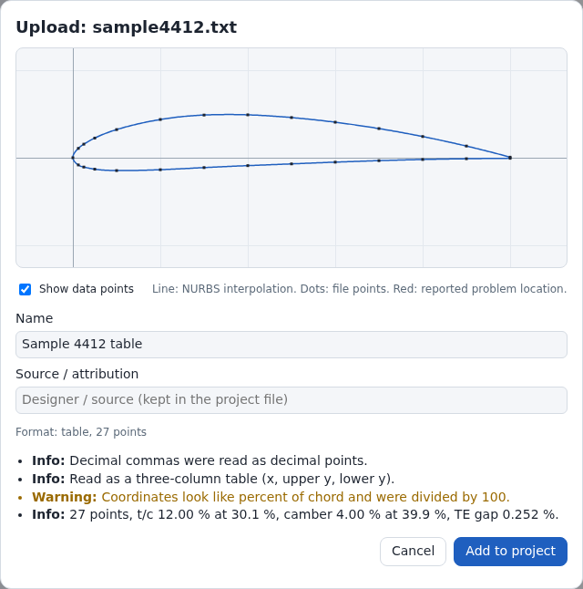
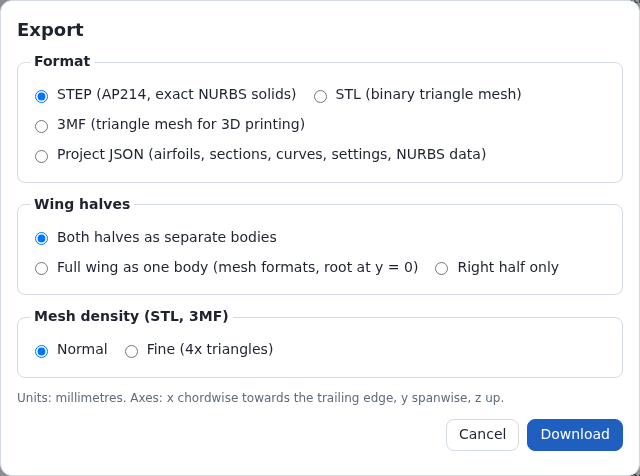

English: [[File Formats|File-Formats]]

# Dateiformate

| Richtung | Inhalt | Format | Endung | Bedienelement |
| --- | --- | --- | --- | --- |
| Import | Profilkoordinaten | Selig, Lednicer, Tabelle x/Oberseite/Unterseite, XML, HTML | `.dat` `.txt` `.cor` `.xml` `.htm` `.html` `.csv` | **Airfoils** > **Upload** (Hochladen): **Choose files** (Dateien wählen), Ablagefläche oder **Check pasted text** (eingefügten Text prüfen) |
| Import | Projekt | JSON | `.json` | **Open** (Öffnen) |
| Export | Projekt | JSON | `.json` | **Save** (Speichern), **Export** |
| Export | Flügel, exakte NURBS-Flächen | STEP, AP214 | `.step` | **Export** |
| Export | Flügel, Dreiecksnetz | binäres STL | `.stl` | **Export** |
| Export | Flügel, Dreiecksnetz | 3MF | `.3mf` | **Export** |
| Export | ein Profil | Selig | `.dat` | **Airfoils** > **.dat** |

| Abkürzung | Bedeutung |
| --- | --- |
| JSON | JavaScript Object Notation |
| ISO | Internationale Organisation für Normung (International Organization for Standardization) |
| STEP | Standard for the Exchange of Product model data, ISO 10303 |
| AP214 | STEP-Anwendungsprotokoll 214 (Application Protocol 214) |
| STL | Stereolithografie |
| 3MF | 3D Manufacturing Format |
| NURBS | Non-Uniform Rational B-Spline, nicht-uniformer rationaler B-Spline |
| XML | Extensible Markup Language |
| HTML | HyperText Markup Language |
| LE, TE | leading edge (Profilnase), trailing edge (Endleiste); nur in Formelzeichen (y_LE) und JSON-Schlüsseln (`xLE`) |
| UTC | koordinierte Weltzeit (Coordinated Universal Time) |

## Dateinamen beim Export

1. Den Projektnamen nehmen. Für eine Profil-`.dat`: den Profilnamen. Leerer Name: `wing`.
2. Akzente entfernen.
3. Jede Folge von Zeichen außerhalb `A–Z a–z 0–9 . _ -` durch ein `_` ersetzen.
4. `_` am Anfang und am Ende entfernen.
5. Auf 120 Zeichen kürzen.
6. Leeres Ergebnis: `wing`.
7. Die Endung anhängen.

Beispiel: `Sport wing 1500` → `Sport_wing_1500.step`.

Name in STEP-, STL- und 3MF-Dateien, unten `<name>` geschrieben: Projektname; leerer Name: `wing`.

| Datei | Wo `<name>` steht |
| --- | --- |
| STEP | Name in `FILE_NAME`, `PRODUCT`, `ADVANCED_BREP_SHAPE_REPRESENTATION`, Volumenkörper `<name> right` und `<name> left` |
| STL | Kopf `Wingdesigner <name>` |
| 3MF | Metadaten `Title`. Die Objektnamen sind fest: Tabelle „Körper je Datei“. |

## Profildateien (Import)

### Einlesen

| Eigenschaft | Regel |
| --- | --- |
| Erkennung | Nach dem Inhalt. Die Dateiendung wird nicht ausgewertet. |
| Größengrenze | Höchstens 5 000 000 Zeichen; größere Eingabe: Fehler `too-large`. Höchstens 100 000 Punkte; mehr: Fehler `too-many-points`. Bei mehr als 100 001 Zahlenzeilen (100 000 Punkte und eine Lednicer-Anzahlzeile) endet das Einlesen, mit der Meldung `More than 100,001 coordinate lines; the limit is 100,000 points.` Hochgeladene Dateien über 20 MB (20 000 000 Byte, höchstens 4 Byte je UTF-8-Zeichen) werden nicht gelesen: rote Meldung `<file>: <size> MB; airfoil files are limited to 5,000,000 characters.`, keine Vorschau. Über 5000 Punkten fügen die Plausibilitätsprüfungen die Warnung `many-points` hinzu. |
| Filter der Dateiauswahl | `.dat` `.txt` `.cor` `.xml` `.htm` `.html` `.csv` `text/plain`. Beim Ziehen und Ablegen (Drag-and-drop) wird jede Datei angenommen. |
| Zeichenkodierung | UTF-8 (Unicode Transformation Format, 8 Bit) mit oder ohne Byte-Order-Mark (BOM). Eine Datei, die kein gültiges UTF-8 ist, wird als Windows-1252 gelesen. |
| Zeilenenden | CR, LF oder CR LF (Carriage Return, Line Feed) |
| Kommentare | `#` bis zum Zeilenende. Ausnahme: die Namenszeile (Zeile Name). |
| Zahlenzeile | 2 oder mehr Zahlen, sonst nichts |
| Trennzeichen | Leerzeichen, Tabulator, Komma, Semikolon |
| Dezimalkomma | `0,125  1,250` wird als `0.125  1.250` gelesen. Bedingungen: Mindestens 2 Werte. Trennzeichen: Leerzeichen, Tabulatoren oder Semikolons. Jeder Wert ist eine Dezimalkommazahl oder eine ganze Zahl, jeweils mit optionalem Exponent (`e`, `E`, `d` oder `D`), z. B. `1,25e-1`. Mindestens 1 Wert enthält ein Komma. Eine Zeile mit 1 Feld, z. B. `0,5`, wird am Komma getrennt: Werte `0` und `5`. |
| Zahlenschreibweise | Vorzeichen optional, Dezimalpunkt, Exponent mit `e`, `E`, `d` oder `D` (`1.0D-3`). Werte in XML-`<x>` und `<y>` folgen derselben Schreibweise und der Regel für Dezimalkommas; anderer Text, z. B. `0x1`, ist keine Zahl (Fehler `non-finite`). |
| Name | Erste Nicht-Zahlenzeile vor der ersten Zahlenzeile. Die Namenszeile behält einen `#`-Kommentar: `NACA 0012 # from UIUC` → Name `NACA 0012 # from UIUC`. HTML: der `<title>`, wenn er nicht leer ist. XML: das erste `<name>`-Element. Kein Name gefunden: Dateiname ohne Endung; eingefügter Text: `pasted` (deutsche Oberfläche: „Eingefügtes Profil“). Ein Name mit mehr als 10 000 Zeichen wird auf die ersten 10 000 gekürzt (Info `long-name`). |
| Spaltenkopfzeilen | 2 oder 3 Wörter, die mit `x`, `y` oder `z` beginnen, getrennt durch Leerzeichen, Tabulatoren, Kommas oder Semikolons (`x y`, `x;y`, `X Yo Yu`, `x/c y/c`, `X Y_upper Y_lower`). Nach der Namenszeile: ohne Meldung übersprungen. Als erste Nicht-Zahlenzeile vor der ersten Zahlenzeile: wird als Name übernommen (z. B. `X Yo Yu`), keine Info `no-name`. |
| Andere Nicht-Zahlenzeilen | Übersprungen, Warnung `ignored-lines` |

### Dateiaufbau

Geprüft in dieser Reihenfolge. Der erste Treffer gilt.

| Reihenfolge | Aufbau | Bedingung | Punktreihenfolge |
| --- | --- | --- | --- |
| 1 | XML | Text enthält `<coordinates>` | Liste `<point><x>…</x><y>…</y></point>` des ersten `<coordinates>`-Elements |
| 2 | HTML | Text enthält ein Tag `<html`, `<pre` oder `<body` | Text aller `<pre>`-Blöcke. Ohne `<pre>`: Seitentext; innerhalb einer `<table>` fallen Leerräume zusammen, jede Zeile (`<tr>`), Überschrift (`<caption>`), Zeilengruppe und `<br>` beginnt eine Zeile, und jede Zelle wird eine Spalte, gleich welches Markup sie enthält (`<p>`, `<div>`) und mit oder ohne End-Tags. Danach gelten die Regeln 3–5 für diesen Text. |
| 3 | Tabelle | jede Zahlenzeile hat 3 Werte, 3 oder mehr Zeilen, x streng steigend oder streng fallend, y_oben ≥ y_unten in ≥ 90 % der Zeilen | x, y_oben, y_unten je Zeile (z. B. Tabellen „X Yo Yu“); eine Tabelle mit fallendem x wird in umgekehrter Reihenfolge gelesen |
| 4 | Lednicer | alle 3 Lednicer-Bedingungen unten | Anzahlzeile, Oberseite Profilnase → Endleiste, Unterseite Profilnase → Endleiste |
| 5 | Selig | alle anderen Dateien | obere Endleiste → Profilnase → untere Endleiste |

Lednicer-Bedingungen:

- Die erste Zahlenzeile enthält 2 ganze Zahlen ≥ 2 (z. B. `61. 61.`).
- Mindestens 1 weitere Zahlenzeile folgt.
- Das x der nächsten Zeile liegt höchstens 1 % des x-Bereichs über dem kleinsten x aller folgenden Zeilen: Die Oberseite beginnt an der Profilnase.
- Auch die Unterseite beginnt höchstens 1 % des x-Bereichs über dem kleinsten x: an der angekündigten Trennung, wenn die Anzahlen mit der Zahl der folgenden Zeilen übereinstimmen, sonst am ersten x-Rücksprung (Regel unten), der mindestens 2 Punkte je Seite lassen muss. Eine Selig-Datei in Prozent, deren Endleistenzeile 2 ganze Zahlen enthält, z. B. `100 2`, erfüllt diese Bedingungen nicht und wird als Selig gelesen.

Weitere Regeln:

- XML und HTML: Dekodiert werden die Entitäten `&lt;` `&gt;` `&quot;` `&apos;` `&amp;`, `&nbsp;` (als Leerzeichen gelesen), `&#NNN;` und `&#xHHHH;` (als Unicode-Codepunkte, in einem Durchgang, sodass `&amp;lt;` zu `&lt;` wird). Ein Verweis auf ein Ersatzzeichen (Surrogat) oder über U+10FFFF bleibt wie geschrieben. Ohne `<pre>` entfällt der Inhalt von `<head>`, `<title>`, `<script>` und `<style>`.
- Lednicer: Passen die Anzahlen nicht zur Punktzahl, werden die Seiten am ersten x-Rücksprung getrennt. x-Rücksprung: x fällt um mehr als 25 % des vorherigen x.
- Zeilen mit mehr als 2 Werten, die keine Tabelle bilden: Spalten 1 und 2 werden verwendet.

### Nach dem Einlesen

Schritte in dieser Reihenfolge:

1. Ein Wert, der keine endliche Zahl ist, bricht den Import ab (Fehler `non-finite`).
2. Kein Punkt gefunden: Der Import bricht ab (Fehler `no-points`).
3. Mehr als 100 000 Punkte: Der Import bricht ab (Fehler `too-many-points`: `<n> points; the limit is 100,000.`).
4. Aufeinanderfolgende doppelte Punkte (gleiches x und gleiches y) werden entfernt (Info `duplicates`), sodass ein doppelt geschriebener Schlusspunkt in Schritt 5 einmal zählt.
5. Geschlossene Kontur mit stumpfer Endleiste: Punkte auf der gezeichneten Endleistenstirn werden entfernt (Warnung `closing-point`, Regeln unten). Endleistenstirn: der steile Abschluss einer stumpfen Endleiste.
6. Größtes x über 5 und höchstens 110: Die Koordinaten gelten als Prozent der Profiltiefe und werden durch 100 geteilt.
7. Punkte im Uhrzeigersinn (Unterseite zuerst): Die Reihenfolge wird in Selig-Reihenfolge umgedreht. Die vorzeichenbehaftete Fläche wird relativ zum ersten Punkt in Einheiten der Konturausdehnung summiert, sodass der Test bei jedem Maßstab dasselbe ergibt.
8. Die Plausibilitätsprüfungen laufen (Abschnitt „Plausibilitätsprüfungen“).

Regeln für Schritt 5. Sie gelten bei mehr als 4 Punkten, wenn der letzte Punkt gleich dem ersten Punkt ist (gleiches x und gleiches y).

| Begriff | Definition |
| --- | --- |
| a, b, c | a = vorletzter Punkt, b = erster Punkt, c = zweiter Punkt |
| steil(p, q) | \|Δx\| ≤ 0,2 · \|Δy\| und \|Δy\| > 1e-6 des x-Bereichs |
| nahe Endleiste | x_max − x ≤ 1 % des x-Bereichs |

| Fall | Bedingung | Ergebnis |
| --- | --- | --- |
| 1 | a→b und b→c steil; a und c nahe Endleiste; y verläuft durch b in einer Richtung | Die Kontur beginnt auf der Endleistenstirn. Der erste und der letzte Punkt werden entfernt. |
| 2 | nicht Fall 1; a→b steil; a nahe Endleiste | Der letzte Punkt wird entfernt. |
| – | keiner der Fälle | Keine Änderung. |

### Meldungen beim Einlesen

Ein Fehler beim Einlesen bricht den Import ab. Die Plausibilitätsprüfungen laufen dann nicht.

| Code | Schweregrad | Bedingung |
| --- | --- | --- |
| `too-large` | Fehler | Eingabe länger als 5 000 000 Zeichen |
| `no-points` | Fehler | kein Koordinatenpunkt: keine Zahlenzeile oder kein `<point>` im XML-Element `<coordinates>` |
| `non-finite` | Fehler | eine Koordinate ist keine endliche Zahl, z. B. ein `<point>` ohne `<x>` oder `<y>` |
| `too-many-points` | Fehler | mehr als 100 000 Punkte; Textformate: das Einlesen endet bei mehr als 100 001 Zahlenzeilen |
| `xml-malformed` | Fehler | `<coordinates>` ohne schließendes Tag |
| `multi-element` | Warnung | mehr als 1 `<coordinates>`-Element; nur das erste wird gelesen |
| `ignored-lines` | Warnung | Nicht-Zahlenzeilen außer Namenszeile und Spaltenkopfzeilen. HTML mit `<title>`: jede Nicht-Zahlenzeile außer Spaltenkopfzeilen. |
| `extra-columns` | Warnung | Zeilen mit mehr als 2 Werten, die keine Tabelle bilden; Spalten 1 und 2 werden verwendet |
| `lednicer-count` | Warnung | Lednicer-Anzahlen weichen von der Punktzahl ab; Seiten am x-Rücksprung getrennt |
| `closing-point` | Warnung | Punkt auf der gezeichneten Endleistenstirn an einem oder beiden Enden entfernt |
| `percent` | Warnung | größtes x über 5 und höchstens 110; Koordinaten durch 100 geteilt |
| `reversed` | Warnung | Punkte im Uhrzeigersinn; Reihenfolge umgedreht |
| `xml` | Info | als XML gelesen |
| `html` | Info | aus einer HTML-Seite gelesen |
| `table` | Info | als Tabelle x/Oberseite/Unterseite gelesen |
| `decimal-comma` | Info | Dezimalkommas als Dezimalpunkte gelesen |
| `duplicates` | Info | aufeinanderfolgende doppelte Punkte entfernt |
| `no-name` | Info | kein Name gefunden; der Dateiname wird verwendet |
| `long-name` | Info | Name länger als 10 000 Zeichen; die ersten 10 000 werden verwendet. Meldung: `The name line has <n> characters; the first 10,000 are used.` |



### Plausibilitätsprüfungen

| Schweregrad | Wirkung |
| --- | --- |
| Fehler | Die Schaltfläche zeigt **Cannot add (errors)** (Hinzufügen nicht möglich) und ist gesperrt. Ein Profil mit Fehler blockiert den Flügelaufbau, sobald ein Profilschnitt es verwendet. |
| Warnung | **Add to project** (zum Projekt hinzufügen) ist freigegeben. |
| Info | Nur Kennwerte. |

Die Prüfungen laufen:

- beim Hochladen einer Datei;
- bei **Check pasted text**;
- in der Vorschau eines Bibliotheks- oder NACA-Profils (National Advisory Committee for Aeronautics);
- bei **View** (Anzeigen) eines Projektprofils (**Airfoils** > **Project airfoils**);
- beim Flügelaufbau für jedes Profil, das ein Profilschnitt verwendet.

| Begriff | Definition |
| --- | --- |
| Doppelte Punkte | Aufeinanderfolgende Punkte, die näher als 1e-9 des x-Bereichs (x_max − x_min, der Profiltiefe) am vorigen Punkt liegen, werden zuerst entfernt (Info `duplicates`: `<n> consecutive point(s) closer than 1e-9 chord to the previous point removed.`), auch bei Punkten aus einer Projektdatei. |
| Normierung | x → (x − x_min) / c, y → (y − y_LE) / c, c = x_max − x_min; keine Drehung |
| Profilnase | Punkt mit dem größten Abstand zur Endleistenmitte (Mittel aus erstem und letztem Punkt); quadrierte Abstände, die relativ höchstens 1e-15 unter dem größten liegen, gelten als gleich, und von diesen gilt der Punkt mit dem kleinsten x; y_LE ist ihr y |
| % der Profiltiefe | Anteil der normierten Profiltiefe 1 |
| Prüfungen auf Rohkoordinaten (Dateien: nach den Schritten beim Einlesen) | `too-few-points`, `too-many-points`, `many-points`, `coarse`, `zero-chord`, `not-normalized`, `rotated`, `te-missing` |
| Prüfungen auf normierten Koordinaten | alle übrigen Prüfungen, beginnend mit `outline-length`; `curve-shape` prüft die NURBS-Kurve durch die normierten Punkte |
| Herkunft der Schwellwerte | `LIMITS` in `src/airfoil/sanity.js`; `WARN.pointsPerAirfoil` in `src/model/budget.js`; feste Werte in `checkAirfoil()`; `CROSSING_TOLERANCE` und `REVERSAL_TOLERANCE` in `src/geom/profile.js` |

| Code | Schweregrad | Bedingung | Schwellwert |
| --- | --- | --- | --- |
| `too-few-points` | Fehler | weniger Punkte als das Minimum | 5 Punkte |
| `too-many-points` | Fehler | mehr Punkte als das Maximum. Meldung: `<n> points; the limit is 100,000.` | 100 000 Punkte |
| `zero-chord` | Fehler | alle Punkte haben dasselbe x | – |
| `outline-length` | Fehler | Länge der normierten Kontur (Summe der Abschnittslängen) über dem Schwellwert. Läuft nach der Normierung, vor `self-intersection`; beendet die übrigen Prüfungen. Meldung: `The outline is … chords long; an airfoil outline is about 2 chords long.` | 10 Profiltiefen |
| `folds` | Fehler | Anzahl der Punkte, an denen die Ober- oder Unterseite (an der Profilnase getrennt) in x zurückläuft (von der Profilnase zur Endleiste: x kleiner als am vorigen Punkt), über dem Schwellwert. Läuft nach `outline-length`, vor `self-intersection`; beendet die übrigen Prüfungen. Meldung: `The upper surface runs back in x at <n> points; the limit is 50.` (`lower` entsprechend). | 50 Punkte |
| `self-intersection` | Fehler | 2 nicht benachbarte Konturabschnitte kreuzen sich. Die Abschnitte werden in ein Gitter mit etwa 1 Zelle je Abschnitt einsortiert; ein Paar einsortierter Abschnitte wird einmal geprüft, in der linken unteren Zelle, die beide Hüllrechtecke gemeinsam haben; ein Abschnitt, der mehr als 16 Zellen überdeckt, wird gegen jeden Abschnitt geprüft; eine Zelle mit mehr als 32 Abschnitten wird mit einem eigenen Gitter erneut durchsucht, höchstens 6 Ebenen tief. Die Suche endet bei 10 Kreuzungen; die Meldung zählt dann `10+`. | – |
| `one-surface` | Fehler | Ober- oder Unterseite (an der Profilnase getrennt) hat weniger Punkte als das Minimum | 3 Punkte |
| `crossed-surfaces` | Fehler | Dicke an einer von 199 inneren, kosinusverteilten x-Positionen unter dem Schwellwert | −0,01 % der Profiltiefe |
| `surfaces-touch` | Fehler | Ober- und Unterseite berühren sich: Dicke an einem Dateipunkt oder einer kosinusverteilten Stützstelle zwischen 1 % und 99 % der Profiltiefe höchstens gleich dem Schwellwert. An jedem x zählen der tiefste Punkt der Oberseite und der höchste Punkt der Unterseite (senkrechte Abschnitte, in x zurücklaufende Profilseiten). Nur ohne `crossed-surfaces` gemeldet. | 0,001 % der Profiltiefe |
| `te-crossed` | Fehler | Endleistendicke (y des ersten Punkts − y des letzten Punkts) unter dem Schwellwert | −0,01 % der Profiltiefe |
| `te-missing` | Fehler | der erste oder der letzte Punkt liegt um mehr als den Schwellwert vor x_max (die Selig-Reihenfolge beginnt und endet an der Endleiste). Meldung: `The first point lies at <x> % chord, not at the trailing edge; the point order is probably not Selig, or a surface is incomplete.` (`last` entsprechend). | 5 % der Profiltiefe |
| `curve-shape` | Fehler | die NURBS-Kurve durch die Punkte kreuzt sich selbst, oder eine Profilseite der Kurve läuft in x zurück, oder die NURBS-Interpolation durch die Punkte scheitert (Meldung der Vorschau: `The NURBS interpolation through the points failed (…).`). Läuft nach bestandenen übrigen Prüfungen, in der Vorschau und beim Flügelaufbau, beide mit der **Profile parametrization** des Projekts (`settings.parametrization`). Schleifengröße: mittlere Breite = Fläche / Diagonale des Hüllrechtecks des Teils mit dem kleineren Hüllrechteck ([[Geometrie|Geometrie]], Abschnitt 1.4). | Schleifengröße über 0,05 % der Profiltiefe; Rücklauf in x über 0,01 % der Profiltiefe |
| `many-points` | Warnung | mehr Punkte als der Schwellwert. Meldung: `<n> points (warning above 5,000): the checks and the first build of a wing that uses the airfoil take <time>.` <time>: `under 1 s` oder `about <t> s`, 30 µs je Punkt. | 5000 Punkte |
| `coarse` | Warnung | weniger Punkte als der Schwellwert | 20 Punkte |
| `not-normalized` | Warnung | x_min oder x_max der Datei weicht um mehr als den Schwellwert von 0 bzw. 1 ab; die Koordinaten werden auf Profiltiefe 1 skaliert | 0,02 |
| `rotated` | Warnung | Linie von der Profilnase zur Endleistenmitte um mehr als den Schwellwert geneigt. Die Koordinaten bleiben erhalten; die Schränkung bezieht sich daher auf die x-Achse der Datei. | 0,5° |
| `non-monotonic` | Warnung | x fällt entlang Ober- oder Unterseite von der Profilnase zur Endleiste um mehr als den Schwellwert | 0,0001 % der Profiltiefe |
| `te-gap` | Warnung | Endleistendicke über dem Schwellwert | 2 % der Profiltiefe |
| `te-base` | Warnung | Endleiste geschlossen: \|Endleistendicke\| < 1e-6 der Profiltiefe. Erster oder letzter Abschnitt steil: \|Δx\| ≤ 0,2 · \|Δy\|, \|Δy\| > 1e-6 der Profiltiefe, Endpunkt höchstens 1 % der Profiltiefe vor der Endleiste. Typische Ursache: Die gezeichnete Endleistenstirn wird als Konturpunkte gelesen. | – |
| `thin` | Warnung | größte Dicke unter dem Schwellwert | 1 % der Profiltiefe |
| `thick` | Warnung | größte Dicke über dem Schwellwert | 30 % der Profiltiefe |
| `spike` | Warnung | die Kontur knickt an einem Punkt um mehr als den Schwellwert; Punkte bis 2 Positionen neben der Profilnase werden übersprungen | 90° |
| `uneven-spacing` | Info | Längenverhältnis zweier benachbarter Konturabschnitte über dem Schwellwert | 25 |
| `stats` | Info | Punktzahl; größte Dicke (t/c) und ihre Lage, größte Wölbung und ihre Lage, Endleistendicke, in % der Profiltiefe. Wölbung: Mittel aus Ober- und Unterseite, gemessen von der Profilsehne (Profilnase bis Endleistenmitte). NACA-Profile zeigen weniger als die Nennwölbung: NACA 4415 3,74 % bei 42,2 %. | – |

- Roter Kreis in der Vorschau: Profilnase (`rotated`), erster kreuzender Abschnitt (`self-intersection`), erster Knickpunkt (`spike`), erster Punkt (`te-base`).

### Aktuelle Einschränkungen

| Bedingung | Ergebnis |
| --- | --- |
| HTML-Tabellenzellen mit anderen benannten Entitäten, z. B. `&ensp;` | Die Zeile gilt als Nicht-Zahlenzeile. Sind alle Zeilen betroffen: Fehler `no-points`. |
| XML-Datei mit mehr als 1 `<coordinates>`-Element | Nur das erste wird gelesen (Warnung `multi-element`). |

### Test mit echten Dateien

| Eigenschaft | Wert |
| --- | --- |
| Datum | 29.09.2026 |
| Dateien | 1964: mh-aerotools.de 56 HTML-Seiten und 55 XML-Dateien; aerodesign.de 188 (154 `.dat`, 34 `.txt`); UIUC (University of Illinois Urbana-Champaign) 1665 `.dat` |
| Dateien im Repository | keine (Lizenz) |
| Ergebnisse je Testmenge, abgelehnte Dateien und Fehlermeldungen | [[Profilquellen|Profilquellen]], Abschnitt Einlesetest |

## Profilexport (`.dat`)

| Eigenschaft | Wert |
| --- | --- |
| Aufbau | Selig: Namenszeile, dann eine Zeile `x y` je Punkt. Ein Name, der sich als Koordinatenzeile oder als Kommentar liest (z. B. `123 456` oder `# custom`, da der Leser `#` bis zum Zeilenende verwirft), erhält das Präfix `Airfoil `; `<` vor `coordinates>` oder vor `html`, `pre` oder `body`, gefolgt von Leerzeichen, `>` oder dem Ende des Namens, wird als `‹` geschrieben, damit die Datei nicht als XML oder HTML gelesen wird. |
| Punkte | die gespeicherten Punkte des Profils, Selig-Reihenfolge |
| Zahlen | 7 Nachkommastellen bei einer Ausdehnung der Kontur von 1 oder mehr (Ausdehnung: der größere Wert aus x-Bereich und y-Bereich); darunter 7 − floor(log10(Ausdehnung)) Nachkommastellen, z. B. 13 bei 1e-6 Profiltiefe mit beliebigem x-Versatz; mehr, wenn 2 aufeinanderfolgende verschiedene Punkte auf dieselbe Zeile gerundet würden: mindestens 1 − floor(log10(d)) Nachkommastellen, d = kleinster von 0 verschiedener Koordinatenabstand aufeinanderfolgender Punkte; über 100 Nachkommastellen 17 signifikante Stellen. Jeder Wert rechtsbündig in mindestens 10 Zeichen, 1 Leerzeichen zwischen x und y |
| Zeilenende | LF, auch nach der letzten Zeile |
| Kodierung | UTF-8 |
| Herkunft und Lizenz | nicht geschrieben; die Namenszeile enthält nur den Profilnamen. `source` bleibt im Projekt-JSON. |

## Projekt-JSON

| Eigenschaft | Wert |
| --- | --- |
| Geschrieben von | **Save** und **Export** > **Project JSON**; gleicher Inhalt |
| Gelesen von | **Open** |
| Kodierung | UTF-8, Einrückung 1 Leerzeichen; jedes Zahlen-Array (ein Punkt, ein Knotenvektor) auf einer Zeile |
| Von **Open** gelesene Größe | höchstens 100 MB (100 000 000 Byte) |
| Einheiten | mm, Winkel in Grad (°) |
| Achsen | x in Profiltiefenrichtung zur Endleiste, y in Spannweitenrichtung zum rechten Flügelende, z nach oben; Spiegelebene y = 0 |
| Zahlen in `derived` | volle 64-Bit-Genauigkeit: die kürzeste Dezimalzahl, die denselben Wert ergibt (bis 17 signifikante Stellen) |

### Schlüssel der obersten Ebene

| Schlüssel | Typ | Geschrieben | Bei **Open** |
| --- | --- | --- | --- |
| `format` | `"wingdesigner-project"` | immer | Pflicht, muss übereinstimmen |
| `version` | ganze Zahl `1` | immer | Pflicht, muss 1 sein |
| `generator` | `{ "name": "Wingdesigner", "version": "<App-Version>" }` | immer | ignoriert |
| `exportedAt` | Zeitpunkt nach ISO 8601, UTC | immer | ignoriert |
| `name` | Zeichenkette | immer | keine Zeichenkette: `Imported wing`; höchstens 10 000 Zeichen |
| `units` | `"mm"` | immer | optional; jeder andere Wert wird abgelehnt |
| `coordinateSystem` | Text, Achsen wie oben | immer | ignoriert |
| `airfoils` | Array | immer | Pflicht, 1 bis 10 000 Einträge; insgesamt höchstens 1 000 000 Punkte |
| `sections` | Array | immer | Pflicht, 2 bis 20 000 Einträge |
| `guides` | Objekt mit `nose` und `end` | immer | optional; `null` gilt als fehlend; eine fehlende Leitkurve wird aus den Schnittkanten erzeugt, ausgeschaltet |
| `settings` | Objekt | immer, alle Schlüssel | optional; ein fehlender Schlüssel erhält seine Vorgabe; ein unbekannter Schlüssel entfällt |
| `derived` | Objekt | nur wenn der Flügel ohne Fehler aufgebaut wird und die Datei höchstens 100 MB groß bleibt | ignoriert; wird neu berechnet |

**Open** verwirft unbekannte Schlüssel samt Inhalt: auf der obersten Ebene und in `airfoils[]`, `airfoils[].source`, `sections[]`, `guides`, `guides.nose`, `guides.end` und `settings`.

### `airfoils[]`

| Schlüssel | Regel |
| --- | --- |
| `id` | nicht leere Zeichenkette, höchstens 200 Zeichen, eindeutig; referenziert von `sections[].airfoil` |
| `name` | Anzeigename, Zeichenkette mit höchstens 10 000 Zeichen; fehlt er oder besteht er nur aus Leerraum: die `id` |
| `points` | 5 bis 100 000 Paare `[x, y]` aus endlichen Zahlen, Selig-Reihenfolge, beliebiger Maßstab (der Flügelaufbau normiert sie). Alle Profile zusammen: höchstens 1 000 000 Punkte. Werte nach dem zweiten Wert eines Paars entfallen bei **Open**. |
| `source` | Herkunft: Objekt mit den Schlüsseln `kind`, `id`, `file`, `attribution`, `license`, `url`, `terms`, `note`, `code`, `closedTE`. Jeder Wert ist eine Zeichenkette mit höchstens 2000 Zeichen, `true`, `false` oder `null`. Andere Schlüssel entfallen bei **Open**. |

Von der App erzeugte IDs:

1. Den Namen in Kleinbuchstaben nehmen.
2. Akzente entfernen.
3. Jede Folge von Zeichen außerhalb `a–z 0–9` durch `-` ersetzen.
4. `-` am Anfang und am Ende entfernen.
5. Auf 40 Zeichen kürzen.
6. Leeres Ergebnis: `airfoil`.
7. ID schon vergeben: `-2`, `-3` … anhängen.

- Gleicher Name und identische Punkte wie ein Profil im Projekt: Die vorhandene ID wird verwendet; kein neuer Eintrag.
- Assistent und Beispielflügel: `naca<code>`.
- Erzeugtes NACA-Profil (`source.code` gesetzt) mit derselben Bezeichnung und demselben `source.closedTE` wie ein Profil im Projekt, dessen gespeicherte Punkte dieses Profil sind (Punkte des Generators auf 1e-9 genau, oder dieselben Punkte wie beim hinzugefügten Profil): Die vorhandene ID wird verwendet, unabhängig vom Namen; kein neuer Eintrag. Gespeicherte Punkte, die von beiden abweichen (z. B. in einer geöffneten Datei bearbeitet): neuer Eintrag.
- Projekt mit 10 000 Profilen (`LIMITS.maxAirfoils`): kein neuer Eintrag. Die Registerkarte **Airfoils** lehnt das nächste Profil vor der Vorschau ab, mit der Meldung `The project holds 10,000 airfoils, the limit; "Remove unused" frees places.`
- Profil, mit dem die Punkte aller Profile 1 000 000 überschreiten würden (`LIMITS.maxAirfoilPoints`): kein neuer Eintrag. Meldung: `With this airfoil the project airfoils hold <n> points; the limit is 1,000,000. "Remove unused" frees points.`

| `source.kind` | Weitere Schlüssel |
| --- | --- |
| `naca` | NACA-Generator, Bibliothek, Assistent: `license`, `url`, `code` (Bezeichnung, z. B. `"2412"`), `closedTE` (`true` oder `false`). Beispielflügel: `note`. |
| `upload` | `file` (nur bei Dateien), `attribution` |
| `library` | `id`, `attribution`, `license`, `url`, `terms`, übernommen aus dem Eintrag im mitgelieferten Bibliotheksindex `public/airfoils/index.json` (`attribution`: `source.author` des Eintrags, angezeigt und änderbar im Feld **Source / attribution** der Vorschau). Index: 6 Dateien. `public-domain` (in den Vereinigten Staaten; Status außerhalb der Vereinigten Staaten nicht geklärt): Clark Y, NACA 8-H-12, NACA M-6, RAF 34, USA 35B. `CC-BY-4.0`: S9104. Herkunft, Rechtsgrundlage, Bedingungen und Quellenangabe je Datei: `public/airfoils/NOTICE.md`. |

### `sections[]`

| Schlüssel | Einheit | Regel |
| --- | --- | --- |
| `id` | – | nicht leere Zeichenkette, höchstens 200 Zeichen, eindeutig; fehlt sie: `s<n>`, n = Position im Array ab 1 |
| `airfoil` | – | `id` eines Eintrags in `airfoils` |
| `x` | mm | Lage der Profilnase in Profiltiefenrichtung; −1 000 000 bis 1 000 000 mm |
| `y` | mm | Spannweitenposition, 0 bis 1 000 000 mm, verschieden von jedem anderen Schnitt |
| `z` | mm | Höhe der Profilnase; −1 000 000 bis 1 000 000 mm |
| `chord` | mm | Profiltiefe, 1 bis 100 000 mm |
| `twist` | ° | Schränkung: Drehung um den Tiefenpunkt bei `settings.twistPivot`; positiv = Nase hoch; −360 bis 360° |

- Jeder Wert ist eine endliche Zahl.
- Grenzen: `LIMITS` in `src/model/project.js` (`minChord`, `maxChord`, `maxCoordinate`, `maxTwist`, `maxSections`, `maxAirfoils`, `maxAirfoilPoints`, `maxGuidePoints`, `maxGuideCoordinate`, `maxExtent`, `maxName`, `maxId`, `maxText`); Punkte je Profil: `MAX_POINTS` in `src/airfoil/parse.js`; Namen: `MAX_NAME` in `src/airfoil/parse.js`.
- Der Flügelaufbau prüft dieselben Grenzen (`limitErrors`); ein Projekt, das nicht gespeichert werden kann, kann daher nicht exportiert werden. Ziehen im Grundriss bleibt innerhalb der Grenzen: Profiltiefe 1 bis 100 000 mm, x der Profilnase innerhalb von ±1 000 000 mm, y eines Schnitts höchstens 1 000 000 mm, x eines Leitkurvenpunkts innerhalb von ±1 100 000 mm.
- Die Reihenfolge im Array ist frei. Der Flügelaufbau sortiert die Schnitte nach `y`.

### `guides.nose`, `guides.end`

`nose` ist die Nasenlinie (Nasenleiste im Grundriss), `end` die Endlinie (Endleiste im Grundriss).

| Schlüssel | Regel | Fehlt bei **Open** |
| --- | --- | --- |
| `enabled` | `true` schaltet die Leitkurve ein, `false` aus; jeder andere Wert wird abgelehnt | `false` |
| `edited` | `true`, nachdem ein Punkt verschoben, hinzugefügt oder gelöscht wurde; `false` nach **Reset to sections**; jeder andere Wert wird abgelehnt. Wird ein Schnitt hinzugefügt oder gelöscht oder ändert sich sein y, x oder `chord` in der Tabelle **Sections**, wird eine Leitkurve mit `enabled` `false` und `edited` ungleich `true` auf die Schnittkanten zurückgesetzt. | `true`, wenn die Punkte von den Schnittkanten abweichen (andere Punktzahl oder eine Koordinate um mehr als 1e-9 mm verschoben), sonst `false` |
| `mode` | `"fit"`: Kurve durch die Punkte; `"control"`: die Punkte bilden das Kontrollpolygon | abgelehnt |
| `degree` | ganze Zahl 1–5 (Grad) | `3` |
| `points` | 2 bis 20 000 Paare `[x, y]` in mm, Grundrisskoordinaten; x −1 100 000 bis 1 100 000 mm (eine ausgeschaltete Endlinie folgt x + `chord` der Schnitte), y −1 000 000 bis 1 000 000 mm. y muss streng steigen (geprüft beim Flügelaufbau). Der y-Bereich wird auf die Spannweite von der Wurzel bis zum Rand gestreckt. | abgelehnt |

### `settings`

| Schlüssel | Werte | Vorgabe | Bedienelement in **Settings** |
| --- | --- | --- | --- |
| `spanwise` | `"linear"`, `"smooth"` | `"linear"` | **Spanwise interpolation** |
| `twistPivot` | `0`–`1`, Anteil der Profiltiefe | `0.25` | **Twist pivot (fraction of chord)** |
| `trailingEdge.mode` | `"asis"`, `"closed"`, `"thickness"` | `"asis"` | **Trailing edge** |
| `trailingEdge.thickness` | ≥ 0 mm; wirkt bei `"thickness"`; begrenzt auf 5 % der örtlichen Profiltiefe | `0.4` | **Trailing-edge thickness (mm)** |
| `tip.mode` | `"flat"`, `"pointed"` | `"flat"` | **Wing tip** |
| `tip.ratio` | `0.001`–`0.01` (Randprofil 1/1000 bis 1/100 der Profiltiefe des vorherigen Schnitts); Randtiefe mindestens 1 mm (`LIMITS.minChord`) | `0.005` (1/200) | **Tip profile scale 1 : N** |
| `chordSamples` | ganze Zahl `16`–`200` | `60` | **Chordwise stations per surface** |
| `panelStations` | ganze Zahl `3`–`40`; der Flügelaufbau verwendet nur dann weniger, wenn das Flächengitter 5 000 000 Punkte überschreiten würde ([[Geometrie|Geometrie]], Abschnitt 3.2) | `8` | **Spanwise stations per panel with guides or smooth mode** |
| `parametrization` | `"uniform"`, `"chord"`, `"centripetal"` | `"centripetal"` | **Profile parametrization** |
| `mirror` | `true`, `false`; nur 3D-Ansicht, ohne Wirkung auf Exporte | `true` | **Show mirrored half (y < 0)** |

Unbekannte Schlüssel in `settings` entfallen bei **Open**. **Save** schreibt die Schlüssel dieser Tabelle.

### `derived` (nur Export)

| Schlüssel | Inhalt |
| --- | --- |
| `profiles[]` | ein Eintrag je Profil, das ein Profilschnitt verwendet: `airfoil` (ID), `name`, `curve`, `leadingEdgeParameter` (Kurvenparameter an der Profilnase) |
| `guides.nose`, `guides.end` | Leitkurve, Kontrollpunkte `[x, y]` in mm; `null` bei ausgeschalteter Leitkurve |
| `stations[]` | jede Station in Spannweitenrichtung: `y` (mm), `v` (Spannweitenanteil 0–1), `xLE`, `z`, `chord` (mm), `twist` (°) |
| `surface` | Fläche des rechten Halbflügels: `degreeU` (3), `degreeV` (1: `spanwise` `"linear"` ohne Leitkurven; `"linear"` mit eingeschalteter Leitkurve: 3, oder 2 bzw. 1, wenn die Grenze des Flächengitters die Stationen je Feld auf 2 oder 1 senkt; `"smooth"`: 3), `knotsU`, `knotsV`, `controlPoints`, `leadingEdgeU`, `closedTrailingEdge` |

- Kurvenobjekt: `degree`, `knots` (Knotenvektor), `controlPoints`. Alle Kurven und die Fläche sind nicht-rational; ein Schlüssel `weights` wird nicht geschrieben.
- `profiles[].curve.controlPoints`: `[x, y]` in normierten Profilkoordinaten (Profiltiefe 1).
- `surface.controlPoints[i][j]`: `[x, y, z]` in mm. i läuft entlang u: u = 0 obere Endleiste, u = `leadingEdgeU` Profilnase, u = 1 untere Endleiste. j läuft entlang v: v = 0 Wurzel, v = 1 Rand.
- Algorithmen: [[Geometrie|Geometrie]].
- Größe: **Save** und **Export** > **Project JSON** schätzen die Zeichen von `derived`: Anzahl der Zahlen mal mittlere Länge der Koordinaten von höchstens 1000 über die Fläche verteilten Kontrollpunkten, zuzüglich 2 Zeichen je Zahl. Bis 110 MB nach dieser Schätzung schreiben sie die Datei mit `derived` und messen sie. Überschreitet die Schätzung 110 MB oder die geschriebene Datei 100 MB, lassen sie `derived` weg und zeigen die Meldung `The file leaves out the derived NURBS data: with it, the file would exceed 100 MB, the largest project file Open reads. Open recomputes it; STEP export writes the exact surfaces.`
- Ohne `derived` wird ein Text über 100 MB ohne Einrückung geschrieben. Überschreitet er auch dann 100 MB (Namen und Quelltexte nahe an ihren Grenzen, z. B. 10 000 Profile mit Namen von 10 000 Zeichen), entsteht keine Datei; **Save** zeigt `Save failed: the project takes … MB as a file, above the 100 MB that Open reads.`

### Prüfungen bei **Open**

Die Datei wird abgelehnt, und die ersten 3 Meldungen erscheinen, wenn:

- der Text kein gültiges JSON ist;
- `format`, `version` oder `units` nicht der Tabelle oben entsprechen;
- die Datei größer als 100 MB ist (100 000 000 Byte; **Open** prüft die Dateigröße vor dem Einlesen und zeigt `Cannot open <file>: <size> MB; project files are limited to 100 MB.`);
- `settings` kein Objekt ist, oder `settings.trailingEdge` oder `settings.tip` vorhanden, nicht `null` und kein Objekt ist;
- `guides` weder ein Objekt noch `null` ist;
- `airfoils` leer ist oder mehr als 10 000 Einträge hat, oder `sections` weniger als 2 oder mehr als 20 000 Einträge hat;
- die Profile zusammen mehr als 1 000 000 Punkte enthalten;
- ein Eintrag in `airfoils` oder `sections` kein Objekt ist;
- eine Profil-`id` keine nicht leere Zeichenkette ist, länger als 200 Zeichen ist oder doppelt vorkommt;
- eine Schnitt-`id` keine nicht leere Zeichenkette ist, länger als 200 Zeichen ist oder doppelt vorkommt;
- `name` länger als 10 000 Zeichen ist, oder der `name` eines Profils vorhanden und keine Zeichenkette oder länger als 10 000 Zeichen ist;
- `source` eines Profils vorhanden, nicht `null` und kein Objekt ist, oder ein bekannter Schlüssel in `source` etwas anderes als eine Zeichenkette, `true`, `false` oder `null` enthält oder eine Zeichenkette mit mehr als 2000 Zeichen;
- ein Profil weniger als 5 oder mehr als 100 000 Punkte hat oder ein Punkt kein Paar `[x, y]` aus endlichen Zahlen ist;
- `x`, `y`, `z`, `chord` oder `twist` eines Schnitts keine endliche Zahl ist;
- `chord` < 1 mm oder > 100 000 mm, `y` < 0, 2 Schnitte dasselbe `y` haben oder `airfoil` eine unbekannte ID nennt;
- `x`, `y` oder `z` eines Schnitts außerhalb von −1 000 000 bis 1 000 000 mm liegt oder `twist` außerhalb von −360 bis 360°;
- ein Wert in `settings` außerhalb der Tabelle oben liegt;
- `guides.nose` oder `guides.end` weder ein Objekt noch `null` ist;
- `enabled` einer Leitkurve weder `true` noch `false` ist, oder `edited` einer Leitkurve vorhanden und weder `true` noch `false` ist;
- `mode` einer Leitkurve weder `"fit"` noch `"control"` ist;
- eine Leitkurve weniger als 2 oder mehr als 20 000 Punkte hat, ein Punkt kein Paar aus endlichen Zahlen ist, das x eines Punkts außerhalb von −1 100 000 bis 1 100 000 mm oder sein y außerhalb von −1 000 000 bis 1 000 000 mm liegt;
- `degree` einer Leitkurve keine ganze Zahl 1–5 ist.

Anzahlen werden vor den Inhalten geprüft. Mehr als 10 000 Profile oder mehr als 20 000 Schnitte: Die Datei wird abgelehnt, ohne einen Eintrag zu lesen. Mehr als 1 000 000 Profilpunkte insgesamt: Die Datei wird abgelehnt, bevor ein Punkt gelesen wird. Ein Profil mit mehr als 100 000 Punkten oder eine Leitkurve mit mehr als 20 000 Punkten: Ihre Punkte werden nicht gelesen.

Größen über einer Warnschwelle und innerhalb dieser Grenzen (`WARN` in `src/model/budget.js`: 200 Schnitte, 200 Profile, 5000 Punkte in einem Profil, 100 000 Profilpunkte insgesamt, 500 Punkte in einer eingeschalteten Leitkurve, 60 000 Punkte im Flächengitter, ein Name mit 200 Zeichen) öffnen mit einer Warnung in der Registerkarte **Checks**. Die Warnung nennt die erwartete Zeit und den Speicherbedarf jeder Änderung: `Large project: <sizes>. Each change takes <time> and <memory> of browser memory.` Eine Meldung zeigt denselben Text, wenn eine Größe ihre Schwelle überschreitet.

Erst beim Flügelaufbau geprüft, in dieser Reihenfolge:

- die Plausibilitätsprüfungen der Profile;
- `curve-shape`: Die NURBS-Profilkurve kreuzt sich selbst (Schleifengröße, mittlere Breite, über 0,05 % der Profiltiefe) oder läuft in x zurück (über 0,01 % der Profiltiefe);
- Leitkurven: y streng steigend; die Kurve läuft in Spannweitenrichtung nicht zurück; x jedes Kontrollpunkts der Kurve innerhalb von ±1 200 000 mm;
- interpolierte Schnittwerte sind endliche Zahlen (x der Profilnase, Profiltiefe, z, Kosinus der Schränkung);
- interpoliertes x der Profilnase, x der Endleiste und z innerhalb von ±1 200 000 mm, Profiltiefe höchstens 100 000 mm;
- `spanwise` `"smooth"`: ein interpolierter Wert (x der Profilnase, Profiltiefe, z, Schränkung oder Höhe eines Konturpunkts) liegt um mehr als das 2-Fache des Bereichs seiner Schnittwerte außerhalb dieses Bereichs;
- Dicke des interpolierten Profils unter 0 (`spanwise` `"smooth"`: Überschwingen; `"linear"`: Ober- und Unterseite eines Profils kreuzen sich);
- Dicke nach der Endleisteneinstellung unter 0;
- Ober- und Unterseite berühren sich nach der Interpolation oder nach der Endleisteneinstellung: Dicke an einer Tiefenstation zwischen 1 % und 99 % der Profiltiefe höchstens 0,001 % der Profiltiefe;
- Profiltiefe unter 1 mm;
- angepasste Fläche mit nicht endlichen Koordinaten;
- angepasste Fläche stülpt sich zwischen den Stationen um (örtliche Dicke unter 0) oder hat dort die Dicke 0 (höchstens 0,001 % der Profiltiefe zwischen 1 % und 99 % der Profiltiefe);
- Profiltiefe der angepassten Fläche zwischen den Stationen unter 0,9 mm (die Fläche faltet sich oder schnürt sich ein);
- Flächenzeile kreuzt sich an einem Schnitt, in der Mitte zwischen 2 Schnitten oder in der Mitte zwischen den 2 Stationen eines der 64 breitesten Stationsintervalle (Schleifengröße, mittlere Breite, über 0,05 % der örtlichen Profiltiefe).

Mit `parametrization` `"chord"` oder `"uniform"` endet ein Profilfehler beim Flügelaufbau (Plausibilitätsprüfung oder `curve-shape`) mit `Settings > Profile parametrization "centripetal" follows the points more closely.`

Ein Fehler blockiert den Flügel und den Export nach STEP, STL und 3MF. Meldungen: [[Benutzerhandbuch|Benutzerhandbuch]], Abschnitt Prüfungen.

### Beispiel

Beispielflügel `Sport wing 1500`, gekürzt; `"..."` markiert ausgelassene Einträge:

```json
{
 "format": "wingdesigner-project",
 "version": 1,
 "generator": { "name": "Wingdesigner", "version": "0.1.0" },
 "exportedAt": "2026-09-29T12:00:00.000Z",
 "name": "Sport wing 1500",
 "units": "mm",
 "coordinateSystem": "x chordwise towards the trailing edge, y spanwise towards the right tip, z up; mirror plane y = 0",
 "airfoils": [
  { "id": "naca2412", "name": "NACA 2412",
    "points": [[1.00008381395326, 0.001257209298899305], "..."],
    "source": { "kind": "naca", "note": "Generated from the NACA 4/5-digit equations (NACA Report 824)." } },
  "..."
 ],
 "sections": [
  { "id": "root", "twist": 0, "z": 0, "airfoil": "naca2412", "x": 0, "y": 0, "chord": 240 },
  { "id": "mid", "twist": -0.8, "z": 12, "airfoil": "naca2412", "x": 12, "y": 450, "chord": 205 },
  { "id": "tip", "twist": -2.5, "z": 33, "airfoil": "naca2410", "x": 55, "y": 750, "chord": 130 }
 ],
 "guides": {
  "nose": { "enabled": false, "mode": "fit", "degree": 3, "points": [[0, 0], [12, 450], [55, 750]] },
  "end": { "enabled": false, "mode": "fit", "degree": 3, "points": [[240, 0], [217, 450], [185, 750]] }
 },
 "settings": {
  "spanwise": "linear", "twistPivot": 0.25,
  "trailingEdge": { "mode": "thickness", "thickness": 0.5 },
  "tip": { "mode": "flat", "ratio": 0.005 },
  "chordSamples": 60, "panelStations": 8, "parametrization": "centripetal", "mirror": true
 },
 "derived": {
  "profiles": [
   { "airfoil": "naca2412", "name": "NACA 2412",
     "curve": { "degree": 3, "knots": [0, 0, 0, 0, 0.00328475901275, "..."], "controlPoints": [[1, 0.00125710393605], "..."] },
     "leadingEdgeParameter": 0.500163244987 },
   "..."
  ],
  "guides": { "nose": null, "end": null },
  "stations": [
   { "y": 0, "v": 0, "xLE": 0, "z": 0, "chord": 240, "twist": 0 },
   { "y": 450, "v": 0.6, "xLE": 12, "z": 12, "chord": 205, "twist": -0.8 },
   { "y": 750, "v": 1, "xLE": 55, "z": 33, "chord": 130, "twist": -2.5 }
  ],
  "surface": {
   "degreeU": 3, "degreeV": 1,
   "knotsU": [0, 0, 0, 0, 0.00508170557159, "..."], "knotsV": [0, 0, 0.6, 1, 1],
   "controlPoints": [[[240.020113789, 0, -0.123958345176], "..."], "..."],
   "leadingEdgeU": 0.501704806629, "closedTrailingEdge": false
  }
 }
}
```

Anzahlen in dieser Datei: 161 Punkte je Profil, 165 Knoten je Profilkurve, 121 × 3 Kontrollpunkte der
Fläche, 125 Werte in `knotsU`.

### Kopie im Browser (`localStorage`)

| Eigenschaft | Wert |
| --- | --- |
| Schlüssel | `wingdesigner.project.v1` |
| Gespeicherte Schlüssel | wie im Projekt-JSON, ohne `generator`, `exportedAt`, `coordinateSystem` und `derived` |

| Ereignis | Verhalten |
| --- | --- |
| Änderung in der App | nur gespeichert, wenn das Projekt die Prüfungen bei **Open** besteht; sonst bleibt die letzte gültige Kopie |
| Seite vor dem nächsten Animations-Frame verborgen oder verlassen (Neuladen, Schließen des Tabs) | die ausstehende Änderung wird sofort gespeichert (`pagehide`, `visibilitychange`) |
| Assistent des ersten Aufrufs offen | nichts gespeichert; ein Neuladen öffnet den Assistenten erneut |
| Gespeicherte Kopie besteht die Prüfungen beim Laden nicht | Text in den Schlüssel `wingdesigner.project.v1.rejected` kopiert, rote Meldung mit dem ersten Problem, der Assistent des ersten Aufrufs öffnet sich über dem Beispielflügel `Sport wing 1500` |
| `localStorage` nicht verfügbar oder voll | keine Kopie; das Projekt existiert nur im geöffneten Browser-Tab |

## Körper je Datei

| Option **Wing halves** (Flügelhälften) | STEP | STL | 3MF |
| --- | --- | --- | --- |
| **Both halves as separate bodies** (beide Hälften als getrennte Körper) | 2 Volumenkörper | 1 Datei, 2 geschlossene Hüllen | 2 Objekte: `Wing right`, `Wing left` |
| **Full wing as one body (mesh formats, root at y = 0)** (ganzer Flügel als ein Körper) | 2 Volumenkörper | 1 geschlossene Hülle | 1 Objekt: `Wing` |
| **Right half only** (nur rechte Hälfte) | 1 Volumenkörper | 1 geschlossene Hülle | 1 Objekt: `Wing right` |

- **Full wing** setzt den Wurzelschnitt bei genau y = 0 mm voraus. Sonst enthalten STL und 3MF 2 Hüllen, wie bei **Both halves**.
- **Mesh density (STL, 3MF)** (Netzdichte): **Normal** oder **Fine (4x triangles)** (fein). **Fine** teilt jedes u-Intervall (Profiltiefenrichtung) und jedes v-Intervall (Spannweitenrichtung) des **Normal**-Netzes in 2. Gemessene Dreieckszahl: 3,0- bis 3,9-fach gegenüber **Normal** (Tabelle „Dateigrößen“).
- Aufbau der Dreiecksnetze und Dreieckszahlen: [[Geometrie|Geometrie]], Abschnitt 5 „Dreiecksnetze“.



## STEP

| Eigenschaft | Wert |
| --- | --- |
| Datei | Textdatei nach ISO 10303-21 |
| Schema | `AUTOMOTIVE_DESIGN { 1 0 10303 214 1 1 1 1 }` (AP214) |
| `FILE_DESCRIPTION` | `(('Wingdesigner wing'),'2;1')` |
| `FILE_NAME` Name | `<name>` (Abschnitt „Dateinamen beim Export“) |
| `FILE_NAME` Zeit | Exportzeit in UTC, `YYYY-MM-DDThh:mm:ss` |
| `FILE_NAME` Autor, Organisation | leer |
| `FILE_NAME` Präprozessor, Ursprungssystem | `Wingdesigner` |
| Produkt | `PRODUCT` mit `<name>`, Kategorie `part` |
| Einheiten | Millimeter, Radiant, Steradiant |
| Toleranz | 1e-7 mm (`distance_accuracy_value`) |
| Volumenkörper | 1 `MANIFOLD_SOLID_BREP` (Volumenkörper in Randdarstellung, boundary representation) je Hälfte |
| Namen der Volumenkörper | `<name> right` (y ≥ 0), `<name> left` (gespiegelt, y ≤ 0) |
| Formdarstellung | 1 `ADVANCED_BREP_SHAPE_REPRESENTATION` mit dem Namen `<name>` enthält alle Volumenkörper |
| Flächen | `B_SPLINE_SURFACE_WITH_KNOTS`, nicht-rational: Oberseite, Unterseite, offene Endleiste. `PLANE`: Wurzel und Rand. |
| Kantenkurven | `B_SPLINE_CURVE_WITH_KNOTS` |
| Zahlen | kürzeste Dezimaldarstellung, die den 64-Bit-Gleitkommawert exakt wiedergibt, immer mit Dezimalpunkt, Exponent `E` |
| Zeichenketten | `'` und `\` verdoppelt. Zeichen außerhalb U+0020–U+007E als `\X2\hhhh\X0\` oder `\X4\hhhhhhhh\X0\`. Ein einzelnes UTF-16-Ersatzzeichen (Surrogat, U+D800–U+DFFF) wird als U+FFFD (Ersetzungszeichen) geschrieben. |

Flächen, Kanten, Orientierungsflags und die Prüfung mit OpenCascade: [[Geometrie|Geometrie]],
Abschnitt 6 „STEP-Topologie“.

## STL

| Eigenschaft | Wert |
| --- | --- |
| Variante | binär, Little-Endian |
| Kopf | 80 Byte: `Wingdesigner <name>` (Abschnitt „Dateinamen beim Export“), UTF-8, bei 80 Byte abgeschnitten, mit Nullbytes aufgefüllt |
| Dreieckszahl | `uint32` |
| Je Dreieck | 50 Byte: Normale (3 × `float32`), 3 Eckpunkte (9 × `float32`), Attribut `uint16` = 0 |
| Dateigröße | 84 + 50 × Dreieckszahl Byte |
| Einheiten | mm. STL hat kein Einheitenfeld. |
| Normalen | Länge 1, aus den Eckpunkten berechnet; Eckpunkte von außen gesehen gegen den Uhrzeigersinn, Normalen zeigen nach außen |

## 3MF

| Eigenschaft | Wert |
| --- | --- |
| Paket | Zip, Deflate-Stufe 6: `[Content_Types].xml`, `_rels/.rels`, `3D/3dmodel.model` |
| Namensraum | `http://schemas.microsoft.com/3dmanufacturing/core/2015/02` (3MF Core) |
| `<model>` | `unit="millimeter"`, `xml:lang="en-US"` |
| Metadaten | `Title` = `<name>` (Abschnitt „Dateinamen beim Export“), `Application` = `Wingdesigner` |
| Objekte | 1 `<object type="model">` je Hülle, 1 `<build><item>` je Objekt; Namen: Tabelle „Körper je Datei“ |
| Eckpunkte | 9 signifikante Stellen (genug für jede 32-Bit-Gleitkommazahl), kürzeste Form ohne Nullen am Ende, z. B. `1000000.12`, `0.123456789`, `12`; Beträge unter 1e-6 mm in Exponentenschreibweise, z. B. `-1e-7`; null als `0` |
| Dreiecke | `v1`, `v2`, `v3`: Eckpunktindizes ab 0, von außen gesehen gegen den Uhrzeigersinn |
| Datum der Zip-Einträge | fest 01.01.2026 00:00 UTC, gespeichert in der Ortszeit des Browsers; nicht die Exportzeit |

## Dateigrößen

Gemessen am 29.09.2026 mit **Both halves as separate bodies** und Vorgabeauflösung (60 Stationen je
Profilseite in Profiltiefenrichtung). 1 KB = 1024 Byte. Dreieckszahlen in Klammern.

| Projekt | Schnitte | Stationen in Spannweitenrichtung | STEP | STL **Normal** | STL **Fine** | 3MF **Normal** | 3MF **Fine** | JSON |
| --- | --- | --- | --- | --- | --- | --- | --- | --- |
| Beispielflügel `Sport wing 1500` | 3 | 3 | 122 KB | 71 KB (1444) | 235 KB (4812) | 20 KB | 61 KB | 63 KB |
| Entwurfstyp **Sport** im Assistenten | 2 | 2 | 99 KB | 47 KB (960) | 141 KB (2884) | 11 KB | 38 KB | 56 KB |
| Entwurfstyp **Glider** im Assistenten, elliptische Leitkurven | 3 | 17 | 444 KB | 1158 KB (23708) | 4566 KB (93500) | 279 KB | 1099 KB | 175 KB |
