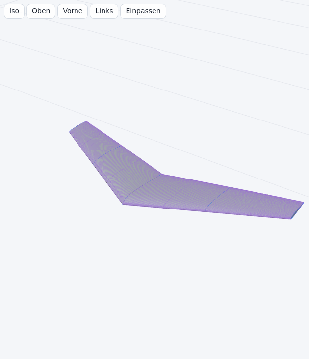

English: [[Geometry|Geometry]]

# Geometrie

## Konventionen

| Konvention | Wert |
| --- | --- |
| Längen | Millimeter (mm) |
| Winkel | Grad (°); Schränkung positiv = Nase hoch |
| Achsen | x in Profiltiefenrichtung, positiv zur Endleiste; y in Spannweitenrichtung, positiv zum rechten Flügelende; z nach oben |
| Berechnete Geometrie | rechter Halbflügel (y ≥ 0); der linke Halbflügel ist sein Spiegelbild an der Ebene y = 0 |
| Kurven und Flächen | NURBS (Non-Uniform Rational B-Spline, nicht-uniformer rationaler B-Spline) mit allen Gewichten 1, d. h. nicht-rationale B-Splines |
| Algorithmusnummern (A2.1 …) und Gleichungsnummern | Piegl und Tiller, *The NURBS Book*, 2. Auflage, Springer 1997 |
| Meldungen | Die auf dieser Seite zitierten Meldungen sind die deutschen Texte der App; Ausnahme: der englische Text der Ausnahme in Abschnitt 1.2. Die englische Oberfläche schreibt sie auf Englisch ([[Geometry]]). Prüfungen, Grenzen und Ergebnisse sind in beiden Sprachen gleich. |
| Optionen von Auswahllisten | Im Text steht eine Option mit dem ersten Wort ihrer Beschriftung: **Linear** und **Glatt** (Smooth) für Optionen von **Interpolation in Spannweitenrichtung** (Spanwise interpolation), **Flach** (Flat) und **Spitz** (Pointed) für Optionen von **Flügelende** (Wing tip). Die Optionen von **Schnittebenen** (Section planes) stehen als **Auf Gehrung** (Mitred) und **Senkrecht** (Vertical). Die vollständigen Beschriftungen stehen in den Abschnitten 3.1, 3.5 und 3.8. |

## Symbole

| Symbol | Bedeutung |
| --- | --- |
| LE, TE | Nasenleiste (leading edge), Endleiste (trailing edge); als Index: x_LE, x_TE |
| N | Anzahl der Tiefenintervalle je Profilseite (N + 1 Stationen je Profilseite, Nase und Endleiste eingeschlossen): **Einstellungen** (Settings) > **Stationen je Profilseite** (Chordwise stations per surface), Vorgabe 60, Bereich 16 bis 200 |
| K | Stationen je Feld in Spannweitenrichtung: **Einstellungen** > **Stationen je Feld mit Leitkurve, glatter Interpolation oder linearen Feldern auf Gehrung** (Spanwise stations per panel with guides, smooth mode or mitred linear panels), Vorgabe 8, Bereich 3 bis 40; die Gittergrenze aus Abschnitt 3.2 kann K verringern |
| c | Profiltiefe in mm |
| f_pivot | Drehpunkt der Schränkung als Anteil der Profiltiefe: **Einstellungen** > **Drehpunkt der Schränkung (Anteil der Profiltiefe)** (Twist pivot (fraction of chord)), Vorgabe 0,25, Bereich 0 bis 1 |
| δ | V-Form eines Feldes: atan2(z_(i+1) − z_i, y_(i+1) − y_i) seiner beiden Schnittpositionen, in Grad. Die Schnittebenen verwenden stattdessen den Feldwinkel, den ein Schnitt speichern kann (Abschnitt 3.8) |
| φ | Neigung einer Schnittebene um die x-Achse (Abschnitt 3.8); φ = 0 ist die Ebene y = konst. |
| m | Dickenstreckung eines platzierten Profils (Abschnitt 3.8); 1 in einer senkrechten Ebene |
| n | Index des letzten Punkts einer Punktliste (Punkte 0 … n) |
| p | Grad einer Kurve |
| u | Flächenparameter um das Profil: 0 obere Endleiste, u_LE Profilnase, 1 untere Endleiste |
| v | Flächenparameter entlang der Spannweite: 0 Wurzel, 1 Rand |
| Feld | Spannweitenabschnitt zwischen zwei benachbarten Schnitten |
| Station | eine platzierte Profilkontur an der Spannweitenposition y; jeder Schnitt ist eine Station |

Ableitungen werden als dx/du und d²x/du² geschrieben. Indizes sind Punktnummern (Q_k, x_N) oder
Bezeichner (x_LE, x_norm).

## Ablauf

| Schritt | Code | Algorithmen aus The NURBS Book |
| --- | --- | --- |
| 1. Profil als NURBS-Kurve | `src/airfoil/geometry.js`, `src/geom/profile.js` | A2.1, A2.2, A2.3, A3.1, A3.2, A9.1 |
| 2. Gemeinsame Tiefenstationen | `src/geom/profile.js`, `src/geom/wing.js` | A3.1 |
| 3. Stationen in Spannweitenrichtung | `src/geom/wing.js`, `src/geom/spanwise.js`, `src/geom/guide.js` | A9.1 |
| 4. Fläche | `src/geom/wing.js`, `src/geom/nurbs.js` | A9.1 je Zeile und Spalte (gleichwertig zu A9.4), A3.5 |
| 5. Dreiecksnetze | `src/geom/mesh.js`, `src/geom/triangulate.js` | A3.5 |
| 6. STEP-Topologie (STEP: Standard for the Exchange of Product model data) | `src/export/step.js` | A5.1 |
| 7. Grundrisskennwerte | `src/geom/stats.js`, `src/geom/wing.js` (`planformAt`) | – |
| 8. Schaumkerne | `src/geom/foam.js` | A3.5 (je Spaltenkurve) |

Die starre Lage des Teils (Abschnitt 3.9, `src/geom/part.js`) dreht das Ergebnis der Schritte 3 und 4 für die Schritte 5 bis 7.

## 1. Profil als NURBS-Kurve

Eingabe: Profilpunkte in Selig-Reihenfolge (obere Endleiste → Profilnase → untere Endleiste), die die
Plausibilitätsprüfungen bestehen ([[Dateiformate|Dateiformate]]). Ein Fehler der
Plausibilitätsprüfungen, eine sich selbst überschneidende Kurve (Abschnitt 1.4) oder ein Rücklauf in x
(Abschnitt 1.5) blockiert den Flügelaufbau, Warnungen nicht. Die Plausibilitätsprüfungen entfernen
zuerst aufeinanderfolgende Punkte, die näher als 1e-9 des x-Bereichs beieinander liegen (Info
`duplicates`): Ihre Parameter u_k (Abschnitt 1.2) können auf denselben Wert gerundet werden und machen
das lineare Gleichungssystem singulär.

### 1.1 Normierung

- Profilnase der Datei P: der Dateipunkt mit dem größten Abstand zur Endleistenmitte (Mittel aus erstem
  und letztem Punkt). Quadrierte Abstände, die relativ höchstens 1e-15 unter dem größten liegen, gelten als
  gleich; dann gilt der Punkt mit kleinerem x, sodass jede Skalierung derselben Kontur denselben Punkt
  wählt.
- Nur Verschiebung und gleichmäßige Skalierung. Das Profil wird nicht gedreht.

```
c_file = x_max − x_min
x_norm = (x − x_min) / c_file
z_norm = (z − z_P)  / c_file
```

- Geneigte Profile: Die Linie von P zur Endleistenmitte behält ihren Winkel. Über 0,5° melden die
  Plausibilitätsprüfungen die Warnung `rotated`. Die Schränkung bezieht sich dann auf die x-Achse der
  Datei.

### 1.2 Interpolation

| Eigenschaft | Wert |
| --- | --- |
| Verfahren | globale Kurveninterpolation durch jeden Punkt Q_0 … Q_n (A9.1) |
| Grad | 3 |
| Parameter | **Einstellungen** (Settings) > **Parametrisierung der Profile** (Profile parametrization): Vorgabe **Zentripetal (empfohlen)** (Centripetal (recommended)), dazu **Sehnenlänge** (Chord length) oder **Gleichabständig** (Uniform) (Gl. 9.3 bis 9.6) |
| Knotenvektor | geklemmt (clamped), durch Mittelwertbildung (averaging, Gl. 9.8) |
| Lineares Gleichungssystem | Band-LU-Zerlegung (lower-upper) ohne Pivotsuche; Zeile k enthält die p + 1 Basiswerte des Knotenintervalls von u_k, alle übrigen Einträge sind 0; Kollokationsmatrizen von B-Splines sind bei nicht fallenden Parametern total positiv, daher ist die Elimination ohne Zeilentausch stabil (de Boor und Pinkus 1977); fallende Parameter brechen die Interpolation mit einer Ausnahme ab; ihr englischer Text „Interpolation parameters must be nondecreasing.“ wird nicht übersetzt und steht in der Klammer der Meldung „Die NURBS-Interpolation … ist fehlgeschlagen (…).“ |
| Parameterbereich | u = 0 an der oberen Endleiste, u = 1 an der unteren Endleiste |

```
d_k = |Q_k − Q_(k−1)|^e          e = 1 (Sehnenlänge), e = 0.5 (Zentripetal)
u_0 = 0,  u_k = u_(k−1) + d_k / Σ d,  u_n = 1
Gleichabständig:  u_k = k / n
Knoten:   U_(j+p) = (u_j + … + u_(j+p−1)) / p,   j = 1 … n − p,   je p + 1 Endknoten bei 0 und bei 1
```

### 1.3 Profilnase der Kurve

Der Schnittursprung ist der Punkt der Kurve mit minimalem x: u_LE mit dx/du(u_LE) = 0.

| Eigenschaft | Wert |
| --- | --- |
| Startwert | Parameter des Dateipunkts mit minimalem x |
| Iteration | Newton-Schritt u ← u − (dx/du) / (d²x/du²), Ableitungen nach A2.3 und A3.2 |
| Intervall | Parameter der beiden benachbarten Dateipunkte; ein Schritt außerhalb wird zu einem Bisektionsschritt nach dem Vorzeichen von dx/du |
| Abbruch | \|dx/du\| < 1e-14, Schritt < 1e-14 oder 50 Iterationen |
| Rückfall | ist x(u_LE) größer als x des Dateipunkts mit minimalem x, gilt der Parameter dieses Dateipunkts |

### 1.4 Prüfung auf Selbstüberschneidung

Eine kubische Kurve kann zwischen Dateipunkten, die jede Plausibilitätsprüfung bestehen, eine Schleife
bilden, z. B. hinter der Endleiste einer grob aufgelösten Datei. Dieselbe Prüfung läuft für jede
Profilkurve und für die Flächenzeilen (Abschnitt 4).

| Eigenschaft | Profilkurve | Flächenzeile |
| --- | --- | --- |
| Kurve | NURBS-Kurve aus Abschnitt 1.2, normierte Koordinaten | Zeile v = konst. der Fläche S, projiziert in die Ebene ihrer Station: x und die Aufwärtsrichtung (0, −sin φ, cos φ) ihrer Neigung φ (die x-z-Ebene bei φ = 0, Abschnitt 3.8) |
| Geprüfte Zeilen | – | beim y jedes Schnitts, in der Mitte zwischen 2 benachbarten Schnitten und in der Mitte zwischen den 2 Stationen jedes der 64 breitesten Stationsintervalle (`MAX_STATION_ROWS`; jedes Intervall, wenn es höchstens 64 gibt; zusätzliche Stationen eingeschlossen); übrige Zeilen: Dickenprüfungen aus Abschnitt 3.6 |
| Abtastwerte je Knotenintervall | per = max(1, min(256, round(4000 · L_span / L_total))); L_span = Länge des Kontrollpolygons des Knotenintervalls (p Strecken), L_total = Summe über die nicht leeren Knotenintervalle | 4 |
| Abtastwerte insgesamt | Σ per + 1, etwa 4001 | 4 · spans + 1 |
| Test | echte Kreuzungen nicht benachbarter Polygonsegmente; jede gefundene Kreuzung wird vermessen; Kreuzungen bis zur Toleranz zählen nicht; die Suche endet nach 20 Kreuzungen über der Toleranz; die größte wird gemeldet | ebenso |
| Suche | Gitter aus etwa √n × √n Zellen über n Segmente, jede Zelle in x und in y mindestens doppelt so groß wie der Median der Segment-Begrenzungsrechtecke; nur Segmente mit einer gemeinsamen Zelle werden geprüft; eine Zelle mit mehr als 32 Segmenten erhält ein eigenes Gitter über den Bereich ihrer Segmente, höchstens 6 Ebenen tief (`selfIntersections` in `src/airfoil/geometry.js`) | ebenso |
| Größe einer Kreuzung (mittlere Breite) | die Kreuzung teilt das Polygon in 2 Teile; Teil P = der Teil mit der kleineren Diagonale des achsparallelen Hüllrechtecks; Größe = Fläche(P) / Diagonale(P), Fläche von P als geschlossenes Polygon (Gaußsche Trapezformel) | ebenso |
| Toleranz | Größe > 5e-4 der Profiltiefe (0,05 %) ist ein Fehler. Spitz auslaufende geschlossene Endleisten von 246 echten Dateien hinterlassen schmale Schleifen von höchstens 1,6e-5 der Profiltiefe (0,0016 %); die Schleife einer grob aufgelösten Datei mit 9 Punkten misst 2,5e-3 der Profiltiefe (0,25 %). Beim Flügelaufbau ist die Schleife außerdem auf 0,1 mm begrenzt (`CROSSING_LIMIT` in `src/geom/profile.js`), bei der größten Profiltiefe der Schnitte mit diesem Profil: Über 200 mm Profiltiefe ist eine Schleife breiter als 0,1 mm ein Fehler, und die Meldung ergänzt „die Schleife ist bei … mm Profiltiefe … mm breit, über 0,1 mm.“ | Größe > min(5e-4 · c, 0,1 mm), c = Profiltiefe beim y der Zeile |
| Meldung | „Die NURBS-Kurve durch die Punkte überschneidet sich selbst nahe x = … % der Profiltiefe“ | „Die Fläche überschneidet sich selbst bei y = … mm nahe x = … mm“ |
| Abhilfe | eine Datei mit mehr Punkten oder feinerer Verteilung an dieser Stelle | **Einstellungen** > **Stationen je Profilseite** (Chordwise stations per surface) erhöhen; die Meldung endet mit „Einstellungen > Stationen je Profilseite erhöhen.“ |

Die Profilvorschau führt die Prüfung der Profilkurve und die Prüfung auf Rücklauf in x (Abschnitt 1.5)
mit der Parametrisierung des Projekts aus (**Einstellungen** > **Parametrisierung der Profile**) und meldet einen
Befund als Fehler `curve-shape`. Eine gescheiterte Interpolation (Abschnitt 1.2) ist ebenfalls Fehler
`curve-shape`. Die Vorschau zeigt dann **Hinzufügen nicht möglich (Fehler)** (Cannot add (errors)) statt **Zum Projekt hinzufügen** (Add to project).

### 1.5 Rücklauf in x

Die Neuabtastung aus Abschnitt 2 löst x(u) = Zielwert je Profilseite. Eine Profilseite, die in x
zurückläuft, hat mehrere Lösungen; die Neuabtastung verliert den zurücklaufenden Teil.

| Eigenschaft | Wert |
| --- | --- |
| Abtastwerte | die Abtastwerte der Profilkurve aus Abschnitt 1.4 |
| Oberseite (u von 0 bis u_LE) | Rücklauf = x − bisheriges Minimum von x |
| Unterseite (u von u_LE bis 1) | Rücklauf = bisheriges Maximum von x − x |
| Toleranz | Rücklauf > 1e-4 der Profiltiefe (0,01 %) ist ein Fehler |
| Meldung | „Die Profilseite läuft in x um … % der Profiltiefe zurück, nahe x = … % der Profiltiefe“ |

## 2. Gemeinsame Tiefenstationen

Jedes Profil wird an denselben N + 1 Tiefenanteilen je Profilseite abgetastet. Die Verteilung ist
kosinusförmig: am feinsten an Nasen- und Endleiste.

```
s_k = (1 − cos(π k / N)) / 2          k = 0 … N
```

| N | Kleinster Schritt (an Nase und Endleiste) | Größter Schritt (Profilmitte) | Punkte je Schnitt |
| --- | --- | --- | --- |
| 16 | 0,961 % der Profiltiefe | 9,75 % der Profiltiefe | 33 |
| 60 (Vorgabe) | 0,0685 % der Profiltiefe | 2,62 % der Profiltiefe | 121 |
| 200 | 0,00617 % der Profiltiefe | 0,785 % der Profiltiefe | 401 |

Je Profilseite wird u aus x(u) = Zielwert auf dem Kurvenast bestimmt:

```
Oberseite:  Zielwert = x_LE + s_k (x(0) − x_LE)     u in [0, u_LE]
Unterseite: Zielwert = x_LE + s_k (x(1) − x_LE)     u in [u_LE, 1]
```

| Eigenschaft des Lösers | Wert |
| --- | --- |
| Verfahren | Regula falsi (Sekantenschritt im Intervall) |
| Bisektionsschritt | ersetzt den Sekantenschritt in jeder dritten Iteration und immer dann, wenn der Sekantenpunkt das Intervall verlässt |
| Abbruch | \|x(u) − Zielwert\| ≤ 1e-13, Intervallbreite ≤ 1e-13 oder 200 Iterationen (dann die Intervallmitte) |
| Kein Vorzeichenwechsel im Intervall | das Intervallende mit dem kleineren \|x(u) − Zielwert\| |

- k = 0 ist die Profilnase der Kurve, k = N der Kurvenendpunkt. Beide werden ohne Lösen übernommen.
- Ergebnis: 2N + 1 Punkte. Index 0 … N: Oberseite Endleiste → Nase. Index N … 2N: Unterseite
  Nase → Endleiste. Die Profilnase hat den Index N.

Einheitstiefe (`unitChord` in `src/geom/wing.js`):

```
x_TE,mid = (x_0 + x_2N) / 2
c_curve  = x_TE,mid − x_N
x_unit   = (x − x_N) / c_curve
z_unit   = (z − z_N) / c_curve
```

Ergebnis: Die NURBS-Profilnase liegt bei (0, 0), die Endleistenmitte bei x_unit = 1.

| Eigenschaft | Folge |
| --- | --- |
| Punkt k hat in jedem Schnitt denselben Tiefenanteil auf derselben Profilseite | Schnitte werden Punkt für Punkt interpoliert |
| Die Profilnase ist in jedem Schnitt Punkt N | die Nasenleiste liegt auf einem Flächenparameter u_LE |

Einschränkung: x(u) muss von der Profilnase zu jedem Endleistenendpunkt monoton steigen. Ein Rücklauf
über 1e-4 der Profiltiefe ist ein Fehler (Abschnitt 1.5). Bei einem kleineren Rücklauf liefert der
Löser für die betroffenen Stationen eine von mehreren Lösungen. Die Warnung `non-monotonic` der
Plausibilitätsprüfungen prüft nur die Dateipunkte (x-Abnahme > 1e-6 der Profiltiefe zwischen
benachbarten Punkten einer Profilseite), nicht die Kurve. Der Fehler `folds` der
Plausibilitätsprüfungen weist ein Profil ab, dessen Ober- oder Unterseite an mehr als 50 Punkten in x
zurückläuft: „Die Oberseite läuft an … Punkten in x zurück; die Grenze liegt bei 50.“ (Unterseite ebenso).

## 3. Stationen in Spannweitenrichtung

### 3.1 Interpolation der Schnittwerte

Jede Größe f eines Schnitts (x, z, Profiltiefe, Schränkung und die 2N + 1 Konturpunkte) wird entlang
der Spannweite interpoliert. **Linear** und **Gerade Felder** bilden eine gewichtete Summe mit
Gewichten w_i(y):

```
f(y) = Σ_i w_i(y) f_i          Σ_i w_i(y) = 1
```

| **Interpolation in Spannweitenrichtung** (Spanwise interpolation) | Interpolation | Bedingung |
| --- | --- | --- |
| **Linear zwischen den Schnitten** (Linear between sections) | Hutfunktionen: linear zwischen den beiden benachbarten Schnitten | jede Anzahl von Schnitten |
| **Gerade Felder (gerade Linien zwischen den Schnitten, wie XFLR5)** (Straight panels (straight lines between sections, as XFLR5)) | Hutfunktionen, wie **Linear**, für die Prüfstellen aus Abschnitt 3.6; die Fläche selbst verbindet die platzierten Schnitte mit geraden Linien (unten) | jede Anzahl von Schnitten; keine Leitkurve eingeschaltet |
| **Glatt (formerhaltende kubische Kurve durch die Schnitte)** (Smooth (shape-preserving cubic through sections)) | je Feld ein kubisches Hermite-Polynom durch die beiden Schnittwerte, mit den Steigungen eines natürlichen kubischen Splines durch alle Schnitte, so begrenzt, dass kein Wert den Bereich der beiden Schnitte seines Feldes verlässt (unten) | 3 oder mehr Schnitte; bei 2 Schnitten gelten die Hutfunktionen |

- y außerhalb von [y_root, y_tip] wird auf den Bereich begrenzt.
- **Linear** überblendet das normierte Profil, die Profiltiefe und die Schränkung getrennt: In der Mitte
  zwischen zwei Schnitten ist die Station das überblendete Profil, skaliert mit der überblendeten
  Profiltiefe und gedreht um die überblendete Schränkung. Ändert sich die Profiltiefe zusammen mit dem
  Profil oder der Schränkung, biegt das Produkt das Feld, und die zusätzlichen Stationen aus Abschnitt 3.2
  lassen die Fläche der Biegung folgen.
- **Gerade Felder** (Straight panels) verbinden die Punkte gleichen Profiltiefenanteils zweier
  benachbarter Schnitte mit geraden Linien, wie XFLR5 seine Felder baut:

  ```
  S(u_j, v) = (1 − t) P_j(y_i) + t P_j(y_(i+1))          t = (y − y_i) / (y_(i+1) − y_i)
  ```

  P_j(y_i) ist Punkt j des Schnitts i, im Raum platziert, in der Ebene des Schnitts (Abschnitt 3.8). Mit
  Schnittebenen **Auf Gehrung** ist das die Fläche von XFLR5; mit Schnittebenen **Senkrecht** sind die
  Schnitte quer zu einem Feld mit V-Form dünner (Abschnitt 3.8). Beispiel: NACA 0014 bei 400 mm
  Profiltiefe und NACA 0008 bei 100 mm Profiltiefe, 100 mm voneinander entfernt. In der Mitte ergeben
  **Gerade Felder** eine Dicke von 32,0 mm (der Mittelwert von 56 mm und 8 mm), **Linear** 27,5 mm
  (11 % von 250 mm), und die Fläche bei **Linear** liegt bis zu 2,3 mm neben den geraden Linien (3,1 mm
  bei einer Schränkung von −3° am Rand). Gemessen an der STL-Datei, die der Code von XFLR5 6.62 schreibt: Das
  Randfeld von `UltraStick120.xfl` (NACA 0014 bei 406,4 mm bis zu einer Profiltiefe von 12,7 mm,
  101,6 mm lang): Jeder Eckpunkt von XFLR5 liegt innerhalb von 0,04 mm der mit **Gerade Felder** gebauten
  Fläche (in der Mitte 100,03 % der Dicke von XFLR5) und bis zu 4,17 mm neben der mit **Linear** gebauten
  (69,75 %).
- **Gerade Felder** mit eingeschalteter Leitkurve stoppen den Aufbau: „Gerade Felder folgen keinen
  Leitkurven: die Leitkurven in der Registerkarte Grundriss ausschalten oder Einstellungen >
  Interpolation in Spannweitenrichtung auf „Linear“ oder „Glatt“ setzen.“
- **Glatt** (Smooth), Konstruktion (`src/geom/spanwise.js`), für jeden interpolierten Wert f mit den
  Schnittwerten f_i bei y_i, den Feldlängen h_i = y_(i+1) − y_i und den Sekanten
  d_i = (f_(i+1) − f_i) / h_i:
  1. Natürlicher kubischer Spline durch die Schnittwerte (zweite Ableitung 0 an Wurzel und Rand): Ein
     Tridiagonalsystem der Größe Schnitte − 2 (Thomas-Algorithmus, ohne Pivotsuche; das System ist
     diagonaldominant) liefert die zweiten Ableitungen D_i, eine rechte Seite je Wert. Steigung am
     Schnitt i: m_i = d_i − h_i (2 D_i + D_(i+1)) / 6; am Randschnitt m = d + h (D_(n−2) + 2 D_(n−1)) / 6
     des letzten Feldes.
  2. Begrenzung (Fritsch und Carlson, 1980): m_i = 0, wo die Sekanten der beiden Felder am Schnitt i
     verschiedene Vorzeichen haben oder eine von ihnen 0 ist; sonst wird |m_i| auf
     3 · min(|d_(i−1)|, |d_i|) begrenzt. Wurzel- und Randschnitt haben ein Feld. Eine übergelaufene
     Steigung (NaN, keine Zahl) wird 0.
  3. Im Feld i, mit t = (y − y_i) / h_i:

     ```
     f(y) = f_i H00(t) + f_(i+1) H01(t) + h_i m_i H10(t) + h_i m_(i+1) H11(t)
     H00 = (1 − t)² (1 + 2t)   H01 = t² (3 − 2t)   H10 = t (1 − t)²   H11 = −t² (1 − t)
     ```

  Liegen beide Steigungen eines Feldes zwischen dem 0- und dem 3-Fachen seiner Sekante, ist das
  kubische Polynom im Feld monoton und bleibt zwischen den beiden Schnittwerten. Die Steigung ist an
  den Schnitten stetig (C1). Wo die Steigungen des Splines die Grenzen schon einhalten, gleicht die
  Interpolation dem natürlichen kubischen Spline. n Schnitte mit m Werten: einmal O(n · m)
  Rechenschritte, dann O(m) je Spannweitenposition aus den beiden benachbarten Schnitten.
- **Glatt**, Profilform: Für jede Tiefenstation k interpoliert **Glatt** den Mittelwert
  (P_(N−k) + P_(N+k)) / 2 und die Differenz P_(N−k) − P_(N+k) des oberen und des unteren Punkts
  (Abschnitt 3.6: Dicke t_k), nicht die beiden Punkte einzeln. Die Dicke des interpolierten Profils
  bleibt zwischen den Dicken der beiden Schnitte des Feldes.
- **Glatt**, Folgen: x der Profilnase, Profiltiefe, z, Schränkung, Mittellinie und Dicke bleiben in
  jedem Feld innerhalb der Werte seiner beiden Schnitte. Ein Schnitt, an dem ein Wert ein lokales
  Maximum oder Minimum hat (die Profiltiefe eines gekrümmten Grundrisses, x einer gewellten Kante),
  erhält dort die Steigung 0. Ein Feld zwischen zwei gleichen Werten bleibt konstant, z. B. ein Profil,
  das von der Wurzel bis zum nächsten Schnitt gleich bleibt. Ein Profilwechsel, ein Tiefensprung oder
  ein Schränkungssprung zwischen zwei Schnitten im Abstand 0,5 mm, wie der XFLR5-Import sie legt
  (Schnitt um min(0,5 mm, 1/4 des Feldes) verschoben), findet innerhalb dieser 0,5 mm statt. Zum
  Vergleich: Der natürliche kubische Spline durch 250, 250, 200 und 150 mm Profiltiefe bei y = 0, 300,
  300,5 und 600 mm erreicht 6 018,68 mm bei y = 173,4 mm.
- **Glatt** gegen den natürlichen kubischen Spline durch dieselben Schnitte, größter Abstand der
  Stationspunkte beider Flächen (**Stationen je Feld** 8): Vorlagen des Assistenten mit 2 Schnitten
  (**Trainer**, **Sportmodell** (Sport), **Delta-Jet** (Delta jet), **Brettnurflügel** (Plank),
  **Leitwerk** (Tail surface)) 0 mm (Hutfunktionen); **Segelflugmodell** (Glider) 0,19 mm,
  **Doppeldelta** (Double delta) 0,19 mm und **Pfeilnurflügel** (Swept flying wing) 0,56 mm (das
  Profil des Wurzelfeldes, von der Wurzel bis Schnitt 2 gleich); **Hochleistungssegler** (Sailplane)
  2,55 mm (Profiltiefe des Wurzelfeldes: Der Spline erreicht 210,85 mm über der Wurzeltiefe von
  210 mm, die Interpolation bleibt höchstens bei ihr); **Batwing** 14,53 mm (Profiltiefe bei
  y = 267 mm: Der Spline erreicht 614,49 mm zwischen Schnitten mit 581,9 und 606,9 mm).
  XFLR5- und flow5-Testdateien (`test/fixtures/`), Flächen mit 3 oder mehr Schnitten: 0,95 bis 1,58 mm
  (Fixture A und B, `basic.fl5` 1,47 mm), `Rascal110.xfl` 1,36 mm (Flügel) und 5,74 mm
  (Höhenleitwerk), `UltraStick25e` 115,37 mm (Flügel; der Spline erreicht bei y = 484,8 mm eine
  Profiltiefe von 369,92 mm zwischen Schnitten mit 260,35 und 250,82 mm, die Interpolation 257,20 mm)
  und 85,15 mm (Höhenleitwerk).

### 3.2 Lage der Stationen

| Bedingung | Stationen je Feld | Verteilung im Feld | Grad der Fläche entlang v |
| --- | --- | --- | --- |
| **Linear**, keine Leitkurve eingeschaltet | 1 (der Schnitt) | – | 1 |
| **Gerade Felder** (keine Leitkurve) | 1 (der Schnitt) | – | 1 |
| **Linear**, eine Leitkurve eingeschaltet | K (der Schnitt und K − 1 Zwischenstationen) | kosinusförmig | min(3, K): 3 bei K ≥ 3; 2 oder 1, wenn die Grenze des Flächengitters K auf 2 oder 1 senkt |
| **Linear**, keine Leitkurve, **Schnittebenen** (Section planes) = **Auf Gehrung** (Mitred), die beiden Schnitte des Feldes in Ebenen verschiedener Neigung φ | K (der Schnitt und K − 1 Zwischenstationen) | kosinusförmig | wie oben; Felder ohne Zwischenstationen sind gerade Strecken, auf diesen Grad erhöht (Abschnitt 4) |
| **Glatt** | K (der Schnitt und K − 1 Zwischenstationen) | kosinusförmig | wie **Linear** mit Leitkurve |

Der Randschnitt ist die letzte Station. Anzahl der Stationen: D · K + (Schnitte − 1 − D) + 1, dazu die
zusätzlichen Stationen unten (**Linear** und **Glatt**; **Gerade Felder** fügen keine hinzu). D ist die
Anzahl der Felder mit K Stationen: Schnitte − 1 (alle Felder) mit eingeschalteter Leitkurve oder mit
**Glatt**; sonst die Felder mit **Linear** zwischen Gehrungsebenen verschiedener Neigung. Beispiele:
Entwurfstyp **Segelflugmodell** (Glider), 3 Schnitte, K = 8: 17 Stationen; Entwurfstyp **Sportmodell**
(Sport) (2 Schnitte, 1,5° V-Form, **Auf Gehrung**): 9 Stationen.

In einem Feld mit **Linear** zwischen Gehrungsebenen trägt jede Zwischenstation das überblendete Profil
in ihrer eigenen Ebene (Neigung und Dickenstreckung aus Abschnitt 3.8), wie mit einer Leitkurve. Mit
einer Station je Feld wäre die Fläche die Regelfläche von **Gerade Felder**. Die beiden unterscheiden
sich, wo sich die Profiltiefe zusammen mit dem Profil oder der Schränkung ändert: Beim Entwurfstyp
**Sportmodell** (NACA 2412 bei 240 mm, NACA 2410 bei 144 mm, −1° Schränkung am Rand) liegt die
Regelfläche bis zu 0,343 mm neben der Fläche bei **Linear**, und das Volumen unterscheidet sich um 1,4 %.
Derzeitige Einschränkung: Jeder Unterschied der Neigung schaltet ein Feld bei **Linear** von einer
Station auf K Stationen um. NACA 2412 bei 300 mm Profiltiefe bis NACA 0009 bei 100 mm Profiltiefe, −4°
Schränkung, 600 mm langes Feld: Eine V-Form von 1e-6° statt 0° verschiebt die Fläche um bis zu 0,17 mm
und ändert das Volumen um 0,25 %.

```
y_(i,k) = y_i + (y_(i+1) − y_i) (1 − cos(π k / K)) / 2          k = 0 … K − 1
```

Unterscheidbare Spannweitenanteile: a < b sind unterscheidbar, wenn b − a > max(4 ε · max(|a|, |b|), 2^-1021),
ε = 2^-52 (`paramsApart` in `src/geom/nurbs.js`). Zwei nicht unterscheidbare Schnitte sind ein Fehler;
eine Zwischenstation, die von der letzten behaltenen Station oder vom Rand nicht unterscheidbar ist, entfällt;
Leitkurven im Modus „Durch Punkte“ wenden dieselbe Regel auf das normierte y ihrer Punkte an.

Flächengitter (`loftGrid` in `src/model/budget.js`): Stationen mal Konturpunkte vor dem Einfügen
zusätzlicher Stationen, (D · K + (Schnitte − 1 − D) + 1) · (2N + 1) Punkte. Mit D = 0 (**Linear** ohne
Leitkurve und ohne Felder zwischen Gehrungsebenen verschiedener Neigung, und **Gerade Felder**) gilt
K_set = 1. Die Grenzen gelten in jedem Modus.

| Größe | Wert |
| --- | --- |
| Warnschwelle | über 60 000 Gitterpunkten (`WARN.gridPoints`): Der Aufbau ergänzt die Warnung „Großes Projekt: …“ mit „… Punkte im Flächengitter (Warnung über 60.000)“ und der erwarteten Zeit und dem Arbeitsspeicher jeder Änderung. **Einstellungen** (Settings) zeigt unter den Auflösungsfeldern „Flächengitter: … Punkte.“, über 60 000 mit Zeit und Speicher. |
| Grenze | 5 000 000 Gitterpunkte (`LIMITS.maxGridPoints` in `src/model/project.js`); darüber geht einem Browser-Tab auf einem Desktop-Rechner der Speicher aus |
| Verwendetes K | max(1, min(K_set, floor((5 000 000 / (2N + 1) − 1 − (Schnitte − 1 − D)) / D))), das größte K, dessen Gitter (D · K + (Schnitte − 1 − D) + 1) · (2N + 1) höchstens 5 000 000 Punkte hat; K_set = Wert in **Einstellungen**. K < K_set nur über 5 000 000 Gitterpunkten. |
| Warnung (K < K_set) | „Stationen je Feld von K_set auf K verringert: S Schnitte mit N Stationen je Profilseite halten die Fläche bei höchstens 5.000.000 Gitterpunkten.“ |
| Fehler (mehr als 5 000 000 Gitterpunkte mit dem verwendeten K) | „Das Flächengitter braucht P Punkte bei einer Station je Feld (S Schnitte, N Stationen je Profilseite); die Grenze liegt bei 5.000.000. Die Stationen je Profilseite verringern oder Schnitte entfernen.“ Es wird keine Fläche aufgebaut. |
| Beispiel | 200 Schnitte, K_set = 8, N = 60 (Vorgaben): K = 8, 1593 Stationen, 192 753 Gitterpunkte: Warnung mit Zeit und Speicher |
| Beispiel | 2000 Schnitte, K_set = 8, N = 200: K = 6, 11 995 Stationen, 4 809 995 Gitterpunkte |
| Beispiel | 4200 Schnitte, K_set = 8, N = 200, **Linear** mit einer Leitkurve: K = 2, 8399 Stationen, 3 367 999 Gitterpunkte; Grad der Fläche entlang v 2 |
| Beispiel | 20 000 Schnitte, N = 200, jeder Modus: K = 1, 8 020 000 Gitterpunkte: Fehler |

Zusätzliche Stationen (**Linear** und **Glatt**): Die Fläche verläuft nur durch die Stationen. Zwischen
den Stationen kann sie von der vorgesehenen Fläche abweichen, auch durch Schränkung. **Gerade Felder**
überspringen den Vergleich: Die geraden Linien zwischen den Schnitten sind die vorgesehene Fläche, und
es wird keine Station hinzugefügt. Nach der Flächenanpassung (Abschnitt 4)
vergleicht der Aufbau Flächenpunkte mit den Punkten einer bei y platzierten Station (Abschnitte 3.4,
3.7, 3.8), im Raum (`probe` in `src/geom/wing.js`).

| Parameter | Wert |
| --- | --- |
| Verglichene Konturpunkte j | N (Profilnase), 0 (oberer Endleistenpunkt), N − k (Oberseite) und N + k (Unterseite) für k = s, 2s, … < N; s = max(1, floor(N / 6)) |
| Verglichene Tiefenstationen je Profilseite | N = 16: 7. N = 60: 5 (k = 10, 20, 30, 40, 50; s_k = 6,7 %, 25 %, 50 %, 75 %, 93,3 % der Profiltiefe). N = 200: 6. |
| Abweichung bei y | Maximum über j von \|S(u_j, v) − P_j\|, Abstand im Raum; u_j = Flächenparameter des Konturpunkts j (Abschnitt 4), P_j = Punkt j der bei y platzierten Station |
| Toleranz | min(0,5 mm; 0,1 · c(y)) |
| Einfügen | Abweichung an jeder Prüfposition y aus Abschnitt 3.6; je eine Station an jedem lokalen Maximum von Abweichung / Toleranz, an dem die Abweichung die Toleranz überschreitet (die Toleranz schrumpft mit der Profiltiefe, sodass die größte Abweichung unter ihrer Toleranz liegen kann, während kleinere weiter außen ihre überschreiten); eine neue Station hält mindestens 1e-6 · (y_tip − y_root) Abstand zu jeder anderen Station |
| Grenze | 6 Durchläufe, insgesamt 32 zusätzliche Stationen; über 60 000 Gitterpunkten (`WARN.gridPoints`) 1 Durchlauf, denn jeder Durchlauf passt die ganze Fläche neu an |
| Behaltene Anpassung | von den Anpassungen vor und nach jedem Durchlauf die mit dem kleinsten Maximum über die Prüfpositionen von Abweichung / Toleranz; bei Gleichstand die frühere. Dicht beieinander hinzugefügte Stationen können die kubische Anpassung ausschwingen lassen: 2 Schnitte, Nasenlinie mit einer Beule von 4 mm Höhe und 0,06 mm Breite (Kontrollpunkte): 3,67 mm ohne zusätzliche Stationen, 18 797 mm nach 32 zusätzlichen Stationen; der Aufbau behält die erste Anpassung und warnt |
| Nach der letzten Anpassung | Profiltiefe und örtliche Dicke der angepassten Fläche (Abschnitt 3.6) zusätzlich bei 0,25, 0,5 und 0,75 jedes Stationsintervalls (Viertelpunkte); sie gehen nur in die Fehler aus Abschnitt 3.6 ein: Dort wird keine Station eingefügt, und die Abweichung dort geht nicht in die Warnung ein |
| Abweichung über der Toleranz an einer Prüfposition | Warnung mit der größten Abweichung an den Prüfpositionen, deren y und Anzahl der zusätzlichen Stationen; Abhilfe: K erhöhen |

Derselbe Vergleich liefert die Profiltiefe und die örtliche Dicke der angepassten Fläche (Abschnitt 3.6).

Beispiel: Entwurfstyp **Pfeilnurflügel** (Swept flying wing) mit 3 Schnitten, **Linear** und Schränkung am Rand −4°:
2 zusätzliche Stationen bei y = 150,0 mm und y = 450,0 mm. Derselbe Entwurfstyp mit Schränkung am Rand 0°:
keine zusätzliche Station.

Spitze elliptische Flügelenden: Im Assistenten stehen **Grundriss** (Planform) auf **Elliptisch (mit Leitkurven)** (Elliptic (guide curves)) und **Flügelende** (Tip) auf
**Spitz (Maßstab 1/200)** (Pointed (1/200 scale)). Jeder der 6 Entwurfstypen mit geradem oder elliptischem Grundriss (Trainer, Sportmodell, Segelflugmodell, Pfeilnurflügel, Brettnurflügel, Leitwerk) ergibt 5 bis 9 zusätzliche Stationen. Größte Abweichung an den
Prüfpositionen: 0,077 mm (**Leitwerk** (Tail surface)) bis 0,371 mm (**Pfeilnurflügel**), unter der
Toleranz; keine Warnung. Nasenlinie und Endlinie enden ein Viertel und drei Viertel der Randtiefe um
die Pfeillinie, sodass der Randschnitt seinen Viertelpunkt auf dieser Linie behält. Innerhalb von
2 mm vor dem Flügelende weichen x von Nasen- und Endleiste der Fläche höchstens 0,031 mm
(**Pfeilnurflügel**; 2001 Spannweitenpositionen) vom vorgesehenen Grundriss ab; die übrigen
Konturpunkte dort sind nicht gemessen, und die Warnung erfasst diese Positionen nicht.

### 3.3 Leitkurven

Nasenlinie (Nasenleiste) und Endlinie (Endleiste): ebene B-Spline-Kurven in der Grundrissebene (x, y),
Punkte P_0 … P_n.

| Eigenschaft | **Durch Punkte** (Through points) (`fit`) | **Kontrollpunkte** (Control points) (`control`) |
| --- | --- | --- |
| Rolle der Punkte | die Kurve verläuft durch sie | Kontrollpolygon |
| Parameter | proportional zu y: t_k = (y_k − y_0) / (y_n − y_0) | – |
| Knotenvektor | geklemmt, durch Mittelwertbildung (Gl. 9.8) | geklemmt, gleichabständig, innere Knoten j / (n − p + 1) (Gl. 9.7) |
| **Grad** (Degree) | 1 bis 5, Vorgabe 3, höchstens n | 1 bis 5, Vorgabe 3, höchstens n |

Bedingungen (Verletzung = Fehler, keine Fläche):

- mindestens 2 Punkte, alle Werte endlich
- y von Punkt zu Punkt streng steigend
- y(t) nicht fallend, geprüft an 401 Parametern mit Toleranz 1e-9 mm
- x jedes Kontrollpunkts der Kurve innerhalb von ±1 200 000 mm (`LIMITS.maxExtent`); bei
  **Durch Punkte** sind das die Kontrollpunkte, die die Interpolation berechnet. Ein B-Spline liegt
  in der konvexen Hülle seiner Kontrollpunkte, daher bleibt die ganze Kurve in dieser Grenze. Meldung:
  „Nasenlinie: Die Kurve durch die Punkte erreicht x = … mm, jenseits von ±1.200.000 mm; die Punkte
  in y gleichmäßiger verteilen oder den Modus ‚Kontrollpunkte‘ verwenden.“ (Endlinie: „Endlinie: …“)

Mit **Durch Punkte** ist y(t) linear in t, weil ein Spline lineare Funktionen exakt wiedergibt.

Abbildung auf die Spannweite: Der y-Bereich der Leitkurve [y_first, y_last] wird linear auf
[y_root, y_tip] gestreckt.

```
f   = clamp((y − y_root) / (y_tip − y_root), 0, 1)
t   = Lösung von (y(t) − y_first) / (y_last − y_first) = f
      (Löser aus Abschnitt 2 auf dem normierten y, bis das t-Intervall höchstens 1e-15 breit ist)
x   = x(t)
```

**Auf Schnitte zurücksetzen** (Reset to sections) setzt die Punkte der Leitkurve auf die Kanten der
Schnitte:

| Leitkurve | Punkt je Schnitt |
| --- | --- |
| Nasenlinie | (x, y) der Profilnase |
| Endlinie | (x + c, y) der Endleiste |

Eine ausgeschaltete Leitkurve ohne Bearbeitung folgt diesen Punkten ([[Dateiformate|Dateiformate]],
Abschnitt `guides.nose`, `guides.end`). x eines Leitkurvenpunkts ist auf ±1 100 000 mm begrenzt
(`LIMITS.maxGuideCoordinate`): x eines Schnitts bis 1 000 000 mm plus eine Profiltiefe bis
100 000 mm.


Registerkarte **Grundriss**, Entwurfstyp **Segelflugmodell**. Bedienelemente: [[Benutzerhandbuch|Benutzerhandbuch]],
Abschnitt Grundriss.

### 3.4 Lage der Profilnase und Profiltiefe je Station

| Eingeschaltete Leitkurven | x_LE | Profiltiefe c |
| --- | --- | --- |
| keine | interpoliertes x | interpolierte Profiltiefe |
| Nasenlinie | x der Nasenlinie | interpolierte Profiltiefe |
| Endlinie | x der Endlinie − c | interpolierte Profiltiefe |
| beide | x der Nasenlinie | x der Endlinie − x der Nasenlinie |

z und Schränkung werden immer interpoliert.

### 3.5 Flügelende

| **Flügelende** (Wing tip) | Geometrie |
| --- | --- |
| **Flach (am Randschnitt abgeschnitten)** (Flat (cut at the tip section)) | der Flügel endet am Randschnitt mit einer ebenen Abschlussfläche |
| **Spitz (Randprofil verkleinert)** (Pointed (tip profile scaled down)) | der Randschnitt erhält die Profiltiefe c_tip (Vorgabe 1/200 von c(y_prev), mindestens 1 mm); der Flügel endet mit einer ebenen Abschlussfläche der Profiltiefe c_tip; mit beiden Leitkurven ist die Randtiefe der Abstand der Leitkurven bei y_tip, mindestens c_tip |

Spitzes Flügelende:

```
c_tip = max(r · c(y_prev), 1 mm)
```

| Größe | Wert |
| --- | --- |
| y_prev | Spannweitenposition des vorletzten Schnitts |
| c(y_prev) | Profiltiefe dort, nach Anwendung der Leitkurven |
| r | 1 / q. q: Wert von **Maßstab des Randprofils 1 : N der Tiefe des vorherigen Schnitts** (Tip profile scale 1 : N of the previous section chord). Bereich 100 bis 1000, Schritt 50, Vorgabe 200 (r = 0,005). |
| c_tip = 1 mm (r · c(y_prev) < 1 mm) | die Tabelle der Registerkarte **Schnitte** (Sections) zeigt `(min.)` hinter der Randtiefe; entfällt, wenn die Warnung unten greift |
| Letztes Feld | eine Profiltiefe unter c_tip und über −0,01 mm wird auf c_tip angehoben |
| Warnung | beide Leitkurven eingeschaltet und die Randtiefe (x der Endlinie − x der Nasenlinie bei y_tip) größer als c_tip + 0,5 mm; der Flügel endet dann mit dieser Profiltiefe; die Meldung nennt beide Werte |

Beispiel: Entwurfstyp **Segelflugmodell** (Leitkurven enden 90 mm voneinander entfernt) mit **Flügelende** =
**Spitz** (Pointed): c_tip = 1 mm, Randtiefe 90 mm, Warnung „Spitzes Flügelende: Nasenlinie und Endlinie enden
90,0 mm voneinander entfernt, daher beträgt die Randtiefe 90,0 mm statt 1,00 mm“.

### 3.6 Prüfungen beim Aufbau

Prüfpositionen y:

- jede Station aus Abschnitt 3.2
- 257 gleichmäßig verteilte Positionen: y_root + (y_tip − y_root) k / 256, k = 0 … 256
- y jedes Kontrollpunkts einer Leitkurve und des Kurvenpunkts an jedem Knoten, linear auf
  [y_root, y_tip] abgebildet

Dicke an einer Prüfposition als Anteil der Profiltiefe (oberer minus unterer Punkt an derselben
Tiefenstation):

```
t_k = z_unit,(N−k) − z_unit,(N+k)          k = 1 … N − 1
```

Tiefenstationen hinter 99 % der Profiltiefe (s_k > 0,99): Ein negatives t_k mit einem Betrag bis
min(1e-4, 0,1 mm / c) zählt als 0. Die neu abgetastete Endleiste eines spitz auslaufenden Profils kann
in einer Kreuzungsschleife liegen, die die Kurvenprüfung aus Abschnitt 1.4 zulässt (Schleifen mit einer
mittleren Breite bis 5e-4 der Profiltiefe, höchstens 0,1 mm).

Positionen der angepassten Fläche: die Prüfpositionen und die Viertelpunkte 0,25, 0,5 und 0,75 jedes
Stationsintervalls nach der letzten Anpassung (Abschnitt 3.2).

Örtliche Dicke der angepassten Fläche bei y, für die verglichenen Tiefenstationen k aus Abschnitt 3.2:
die Flächenpunkte S(u_(N−k), v) und S(u_(N+k), v), zurückgerechnet in das System mit Einheitstiefe der
Station bei y (Verschiebung, Neigung, Tiefenmaßstab, Schränkung und Dickenstreckung rückgängig gemacht),
oberes z minus unteres z.

Prüfungen in der Reihenfolge des Codes. Jede Zeile ist ein Fehler; es wird keine Fläche aufgebaut.

| Prüfung | Bedingung |
| --- | --- |
| Anzahl der Schnitte | weniger als 2 Schnitte |
| Projektgrenzen | Profiltiefe eines Schnitts über 100 000 mm, x, y oder z eines Schnitts außerhalb von ±1 000 000 mm, Schränkung außerhalb von ±360°, mehr als 20 000 Schnitte, oder eine Leitkurve (ein- oder ausgeschaltet) mit mehr als 20 000 Punkten, einem Punkt mit x außerhalb von ±1 100 000 mm oder y außerhalb von ±1 000 000 mm. Dieselben Grenzen wie bei **Öffnen** (Open) (`limitErrors` in `src/model/project.js`); ein Projekt, das nicht gespeichert werden kann, kann daher nicht exportiert werden. Jede überschrittene Grenze ergibt eine Meldung, z. B. „Schnitt 3: Schränkung muss innerhalb von ±360 Grad liegen.“ oder „Schnitt 2: Profiltiefe darf höchstens 100.000 mm betragen.“ Mehr als 20 000 Schnitte: nur die Meldung „Höchstens 20.000 Schnitte werden unterstützt (N gefunden).“, die Schnitte werden nicht gelesen. Eine Leitkurve mit mehr als 20 000 Punkten: „guides.nose.points: höchstens 20.000 Punkte (N gefunden).“ (Endlinie: `guides.end.points`). |
| Seite der Wurzel | erster Schnitt (nach Sortierung nach y) bei y < 0: „liegt auf der gespiegelten Seite“ |
| Lage der Schnitte | 2 Schnitte mit demselben y |
| Profilverweis | ein Schnitt verweist auf eine Profil-ID, die im Projekt fehlt |
| Profil | Fehler der Plausibilitätsprüfungen, fehlgeschlagene NURBS-Interpolation, sich selbst überschneidende NURBS-Kurve (Abschnitt 1.4) oder Rücklauf in x (Abschnitt 1.5). Bei Parametrisierung **Sehnenlänge** (Chord length) oder **Gleichabständig** (Uniform) endet die Meldung mit „Die Einstellung ‚Zentripetal‘ unter Einstellungen > Parametrisierung der Profile folgt den Punkten genauer.“ |
| Leitkurven | eine Bedingung aus Abschnitt 3.3 verletzt |
| Gerade Felder | **Gerade Felder** mit eingeschalteter Leitkurve (Abschnitt 3.1) |
| Schnittebenen, Dickenstreckung | Schnittebenen **Auf Gehrung**: ein Schnitt, dessen Ebene mehr als 60° schräg zu einem benachbarten Feld liegt (zu seinem Feldwinkel, Abschnitt 3.8), eine Dickenstreckung m über 2 (`MAX_STRETCH` in `src/geom/planes.js`): ein erstes Feld steiler als 60° oder eine Änderung der V-Form um mehr als 120° an einem Schnitt. Eine Ebene, die gerundet 60,0° schräg liegt, gilt als innerhalb der Grenze (unter 60,05°, `STRETCH_LIMIT`): Schnittpositionen haben 4 Nachkommastellen. Die Dickenstreckung wird nie begrenzt. Meldung, mit dem Winkel auf 1 und der Dickenstreckung auf 3 Nachkommastellen: „Schnitt n: Seine Gehrungsebene liegt …° schräg zum benachbarten Feld, das streckt das Profil auf das …-Fache (Grenze 2, 60°). Die Änderung der V-Form dort verringern oder Einstellungen > Schnittebenen auf „Senkrecht“ setzen.“ Beispiel: ein erstes Feld mit 65°: „… liegt 65,0° schräg … auf das 2,366-Fache …“. |
| Flächengitter | mehr als 5 000 000 Gitterpunkte mit den verwendeten Stationen je Feld (Abschnitt 3.2) |
| Schnittebenen, Faltung | Schnittebenen **Auf Gehrung**, **Gerade Felder**: Die Ebenen zweier benachbarter Schnitte verschiedener Neigung schneiden sich in einer Geraden parallel zu x. Die Fläche zwischen ihnen faltet sich, wenn diese Gerade durch eines der beiden platzierten Profile geht (seine Ausdehnung entlang der Aufwärtsrichtung seiner Ebene, mit Profiltiefe, Schränkung und Dickenstreckung), wenn die beiden Profile auf verschiedenen Seiten der Geraden liegen oder wenn das innere Profil weiter außen liegt als die Ebene des äußeren (`planeFold` in `src/geom/planes.js`). Meldung: „Schnitte a und b: Ihre Gehrungsebenen schneiden sich … mm von der Position (y, z) von Schnitt a entfernt, innerhalb der Profile, daher faltet sich die Fläche zwischen ihnen. Das Feld verlängern, die Änderung der V-Form verringern oder Einstellungen > Schnittebenen auf „Senkrecht“ setzen.“ Beispiel: Felder mit 0°, 40° (10 mm lang) und 80°, NACA 0012 bei 300 mm Profiltiefe: Die um 20° und 60° geneigten Ebenen schneiden sich 14,6 mm von Schnitt 2 entfernt, innerhalb seiner ±19,2 mm; bei 150 mm Profiltiefe (±9,6 mm) wird die Fläche gebaut. Felder bei **Linear**: die Prüfung „Schnittebenen, Drehung“. |
| Schnittwerte | x_LE, c, z oder cos(Schränkung) einer Prüfposition ist keine endliche Zahl. Meldung: „Die Schnittwerte ergeben bei y = … mm nicht endliche Koordinaten; Positionen, Profiltiefen und Schränkungen der Schnitte prüfen.“ |
| Ausdehnung der Geometrie | an einer Prüfposition: x_LE, x_LE + c (Endleiste) oder z außerhalb von ±1 200 000 mm (`LIMITS.maxExtent`) oder c über 100 000 mm. Die Interpolationen bleiben innerhalb der Schnittwerte (Abschnitt 3.1), daher sind die Ursachen Leitkurven: eine Leitkurve nahe ±1 200 000 mm, bei der die hinzugerechnete oder abgezogene Profiltiefe die Ausdehnung verlässt; Nasenlinie und Endlinie mehr als 100 000 mm voneinander entfernt. Meldung: „Bei y = … mm verlässt der Flügel die Projektgrenzen (x der Profilnase … mm, z … mm, Profiltiefe … mm; Grenzen ±1.200.000 mm und 100.000 mm Profiltiefe). Die Leitkurven prüfen.“ |
| Schnittebenen, glatte Dickenstreckung | Schnittebenen **Auf Gehrung**, **Glatt**, an jeder Prüfposition: die Dickenstreckung m = 1 / cos(φ − δ) aus Abschnitt 3.8, mit φ der kubischen Kurve und δ wie in Abschnitt 3.8 (gespeicherte Feldwinkel eingeschlossen), über 2 (eine Ebene, die gerundet 60,0° schräg liegt, wird gebaut) oder nicht über 0 (eine Ebene mehr als 90° schräg). Meldung, mit dem Winkel |φ − δ| auf 1 Nachkommastelle und der Dickenstreckung auf 3: „Schnitte a und b: Bei y = … mm liegt die Gehrungsebene …° schräg zur glatten Bezugslinie, das streckt das Profil auf das …-Fache (Grenze 2, 60°). Die Änderung der V-Form dort verringern, Schnitte hinzufügen oder Einstellungen > Schnittebenen auf „Senkrecht“ setzen.“ Beispiel: NACA 0012, Schnitte bei (y, z) = (0, 0), (54, −37) und (84, 67) mm, Felder mit −34,4° und 74,0°: Jede Schnittebene liegt innerhalb von 60° zu ihren Feldern, und **Linear** wird gebaut; die kubische Kurve verlässt die senkrechte Wurzelebene unter 63,7°, eine Dickenstreckung von 2,254. |
| Schnittebenen, Drehung | Schnittebenen **Auf Gehrung**, **Linear** oder **Glatt**: An einer Prüfposition in einem Feld, dessen zwei Ebenen verschieden sind, ändert sich die Neigung φ entlang y um dφ/dy = (φ_(i+1) − φ_i) / (y_(i+1) − y_i) mit **Linear**, um die Ableitung der kubischen Kurve mit **Glatt**. Ein Punkt in der Höhe t in der Ebene seiner Station (entlang der Aufwärtsrichtung, mit Profiltiefe, Schränkung und Dickenstreckung) wandert mit der Rate cos φ + tan δ · sin φ − t · dφ/dy je mm Spannweite durch diese Ebene; t ist der höchste Punkt des Profils bei dφ/dy > 0, der tiefste bei dφ/dy < 0; δ ist die V-Form aus den Schnittpositionen, die Richtung, in der sich die Station bewegt, auch wo das Feld einen Feldwinkel speichert; mit **Glatt** die V-Form der überblendeten Bezugslinie an der Position. An der Position eines Schnitts werden beide benachbarten Felder geprüft (**Linear**). Bei 0 oder darunter faltet sich die Fläche, auch wo sich die Ebenen der Stationen um die Position nicht schneiden. Meldung: „Schnitte a und b: Bei y = … mm drehen sich die Gehrungsebenen zwischen ihnen schneller, als die Profile es zulassen, daher faltet sich die Fläche. Das Feld verlängern, die Änderung der V-Form verringern oder Einstellungen > Schnittebenen auf „Senkrecht“ setzen.“ Beispiel: NACA 0018 mit 217 mm Profiltiefe, Neigungen 0° und 46,9° über ein 21,7 mm langes Feld: an der Wurzel 1 − 30,4 mm · 0,0377/mm < 0; die Ebenen der Feldenden schneiden sich 46 mm oberhalb in der Wurzelebene, außerhalb des Profils. **Gerade Felder** sind zwischen den Schnitten Regelflächen; für sie gilt die Prüfung „Schnittebenen, Faltung“. |
| Interpolierte Dicke | min t_k < −1e-9 an einer Prüfposition. Beide Interpolationen halten t_k zwischen den Werten der beiden Schnitte des Feldes (Abschnitt 3.1), daher ist die Ursache ein Schnittprofil, dessen Ober- und Unterseite sich an dieser Tiefenstation kreuzen; Abhilfe laut Meldung: Profile prüfen oder **Stationen je Profilseite** (Chordwise stations per surface) erhöhen. Die Meldung nennt y und x. |
| Dicke nach der Einstellung **Endleiste** (Trailing edge) | min t_k < −1e-9 nach der Änderung der Endleistendicke aus Abschnitt 3.7. Geprüft an Positionen mit c ≥ 1 mm. **Feste Dicke in mm** (Fixed thickness in mm): Endleistendicke auf 5 % der Profiltiefe begrenzt. Ursache: Das Profil ist innen dünner als die eingestellte Endleistendicke. |
| Berührung der Profilseiten | min t_k ≤ 1e-5 (0,001 % der Profiltiefe) an den Tiefenstationen s_k von 0,01 bis 0,99, nach der Einstellung **Endleiste** aus Abschnitt 3.7. Geprüft an Positionen mit c ≥ 1 mm. Die Meldung nennt y und x. **Wie in den Profildateien** (As in the airfoil files): Abhilfe **Linear** oder mehr Schnitte; andere Modi: Abhilfe **Wie in den Profildateien** oder eine dickere Endleiste. |
| Profiltiefe | kleinste Profiltiefe < 1 mm; die Meldung nennt Profiltiefe und zugehöriges y. Die Interpolationen halten die Profiltiefe zwischen den Profiltiefen der Schnitte von mindestens 1 mm, daher setzen nur Nasenlinie und Endlinie zusammen eine kleinere Profiltiefe (ihren Abstand). |
| Profiltiefe, Hinweis | wie oben, Minimum am Rand, Profiltiefe > −0,01 mm, **Flügelende** = **Flach** (Flat): die Meldung ergänzt „Für ein Flügelende, das in einer Spitze endet, Einstellungen > Flügelende auf ‚Spitz‘ setzen.“ |
| Stationsebenen | Schnittebenen **Auf Gehrung**, nach der Anpassung: Bei zwei benachbarten Stationen verschiedener Neigung liegt ein Punkt der äußeren Station, vom selben Punkt der inneren Station aus gesehen, nicht jenseits der Ebenen beider Stationen. Meldung: „Die Fläche faltet sich zwischen den Stationen bei y = … mm und y = … mm (Feld von Schnitt a bis b): Ihre Schnittebenen kreuzen sich innerhalb der Profile. Das Feld verlängern, die Änderung der V-Form verringern oder Einstellungen > Schnittebenen auf „Senkrecht“ setzen.“ |
| Angepasste Fläche, endlich | nach der Flächenanpassung und den zusätzlichen Stationen (Abschnitt 4): eine Koordinate eines Kontrollpunkts ist keine endliche Zahl. Meldung: „Die angepasste Fläche hat nicht endliche Koordinaten; Positionen, Profiltiefen und Schränkungen der Schnitte prüfen.“ |
| Dicke der angepassten Fläche | an jeder Position der angepassten Fläche: örtliche Dicke < −1e-9 (hinter 99 % der Profiltiefe: < −min(1e-4, 0,1 mm / c)) an einer verglichenen Tiefenstation („Die angepasste Fläche stülpt sich zwischen den Stationen … um“), oder ≤ 1e-5 (0,001 % der Profiltiefe) an einer verglichenen Tiefenstation von 1 % bis 99 % der Profiltiefe („Die angepasste Fläche hat zwischen den Stationen … die Dicke null“). Die Meldung nennt y und die Dicke. Ursache laut Meldung: Die Fläche durch die Stationen schwingt zwischen ihnen aus (schnell veränderliche Leitkurven). Abhilfe laut Meldung: Leitkurven glätten oder Schnitte hinzufügen. |
| Profiltiefe der angepassten Fläche | an jeder Position der angepassten Fläche: c_fit < 0,9 mm (1 mm Mindesttiefe abzüglich 10 %). c_fit = ((S(0, v) + S(1, v)) / 2 − S(u_LE, v)), im Raum auf die vorgesehene Profiltiefenrichtung der Station bei y projiziert. Meldung: „Die angepasste Fläche faltet sich oder schnürt sich zwischen den Stationen … ein“ |
| Selbstüberschneidung der Fläche | eine Flächenzeile an einem Schnitt, in der Mitte zwischen 2 benachbarten Schnitten oder in der Mitte zwischen den 2 Stationen eines der 64 breitesten Stationsintervalle (zusätzliche Stationen eingeschlossen) überschneidet sich in der Ebene ihrer Station (Abschnitt 1.4) mit einer Schleifengröße (mittlere Breite) über 5e-4 · c; 4 Abtastwerte je Knotenintervall (Abschnitt 1.4) |

### 3.7 Endleiste

Je Station, nach der Interpolation:

| **Endleiste** | Endleistendicke g als Anteil der Profiltiefe |
| --- | --- |
| **Wie in den Profildateien** (`asis`) | interpolierte Kontur unverändert |
| **Geschlossen (scharf)** (Closed (sharp)) (`closed`) | g = 0; beide Endpunkte rücken auf ihre Mitte |
| **Feste Dicke in mm** (`thickness`) | g = t / c, t = **Endleistendicke (mm)** (Trailing-edge thickness (mm)) (Vorgabe 0,4 mm), begrenzt auf 5 % der Profiltiefe |

| Projekt | **Endleiste** | t |
| --- | --- | --- |
| Vorgabe des Projektmodells (Projektdateien ohne diese Einstellung) | **Wie in den Profildateien** | 0,4 mm (ungenutzt) |
| Beispielflügel „Sportflügel 1500“ (englisch: „Sport wing 1500“; erster Besuch) | **Feste Dicke in mm** | 0,5 mm |
| Projekte aus dem Assistenten | **Feste Dicke in mm** | max(0,3 mm, 0,2 % der Wurzeltiefe), auf 0,01 mm gerundet; **Segelflugmodell** 0,4 mm, **Sportmodell** (Sport) 0,48 mm, **Leitwerk** 0,3 mm |

Änderung der Endleistendicke: Die Oberseite verschiebt sich um die halbe Änderung nach oben, die Unterseite
nach unten. Das Gewicht steigt linear von 0 an der Profilnase auf 1 an der Endleiste; die Profilnase
bleibt an ihrem Ort.

```
δ = (g − g_current) / 2
w = clamp((x − x_LE) / (x_TE,branch − x_LE), 0, 1)
Oberseite:  z ← z + δ w
Unterseite: z ← z − δ w
```

Eine negative Dicke nach dieser Änderung ist ein Fehler beim Aufbau (Abschnitt 3.6).

Topologie der Endleiste über alle Stationen:

| Stationen | Endleiste der Fläche |
| --- | --- |
| \|Endleistendicke\| < 1e-6 mm an jeder Station | geschlossen: beide Endpunkte an jeder Station zusammengelegt |
| sonst | offen: jede Station mit einer Endleistendicke unter min(0,01 mm, 5 % von c) wird auf diesen Wert geöffnet |

| Warnung | Bedingung |
| --- | --- |
| Dicke begrenzt | t / c > 5 % an 1 oder mehr Stationen; Stationen im letzten Feld eines spitzen Flügelendes zählen nicht |
| Stationen geöffnet | offene Endleiste und 1 oder mehr Stationen mit einer Endleistendicke unter dem Minimum |

### 3.8 Platzierung im Raum

Punkt mit Einheitstiefe (x_unit, z_unit) aus Abschnitt 2, Schränkung θ, Drehpunkt f_pivot, Neigung φ und
Dickenstreckung m der Schnittebene. Die Schränkung dreht das Profil in seiner Ebene um den Drehpunkt
(f_pivot, 0); die Dickenstreckung skaliert seine Dicke vor der Schränkung.

```
dx  = x_unit − f_pivot
r_x =  dx cos θ + m z_unit sin θ
r_z = −dx sin θ + m z_unit cos θ
X = x_LE + c (f_pivot + r_x)
Y = y − c r_z sin φ
Z = z + c r_z cos φ
```

Die Schnittebene verläuft durch die Schnittposition (y, z), die die ungeschränkte Profilnase, der
Drehpunkt und die Endleiste gemeinsam haben. Ihre Aufwärtsrichtung ist (0, −sin φ, cos φ), ihre Normale
(0, cos φ, sin φ). Mit φ = 0 und m = 1 liegt der Schnitt in der Ebene Y = y.

**Einstellungen** (Settings) > **Schnittebenen** (Section planes) (`settings.sectionPlanes`, `src/geom/planes.js`):

| Wert | Neigung φ | Dickenstreckung m |
| --- | --- | --- |
| **Auf Gehrung (senkrecht zu den Feldern, wie XFLR5)** (Mitred (square to the panels, as XFLR5)) (`mitred`, Vorgabe neuer Projekte) | Wurzel 0; ein Schnitt zwischen den Feldern i − 1 und i: (δ_(i−1) + δ_i) / 2, die winkelhalbierende Ebene; Rand: δ des letzten Feldes, rechtwinklig zu ihm. δ: der Feldwinkel (unten) | 1 / cos(φ − δ) mit δ des Feldes außerhalb des Schnitts (am Rand: das letzte Feld; an einer Winkelhalbierenden ergeben beide Felder denselben Wert): Wurzel 1 / cos δ_0, ein Knick 1 / cos((δ_i − δ_(i−1)) / 2), Rand 1 |
| **Senkrecht (y = konstant)** (Vertical (y = const)) (`vertical`) | 0 | 1 |

- Stationen zwischen Schnitten: φ wird wie die Schränkung überblendet (Abschnitt 3.1). **Linear**:
  m = 1 / cos(φ − δ) mit δ des Feldes der Station. **Glatt**: φ folgt der formerhaltenden kubischen
  Kurve durch die Neigungen der Schnitte, und δ ist die V-Form der überblendeten Bezugslinie an der
  Station, atan(dz/dy) der kubischen Kurve durch die Schnittpositionen z; m = 1 / cos(φ − δ). An einem
  Schnitt ist δ die Steigung der kubischen Kurve dort, nicht die V-Form eines Feldes, daher weicht die
  Dickenstreckung an den Schnitten von **Linear** ab. Gespeicherte Feldwinkel addieren ihren
  Unterschied zur V-Form ihres Feldes zu δ, entlang der Spannweite wie die Neigungen überblendet (an
  einem Schnitt der Mittelwert der beiden benachbarten Felder, an Wurzel und Rand der Wert seines einen Feldes; ein Feld schmaler als 1 mm in y trägt nichts bei), sodass δ stetig bleibt. Ein Feld
  schmaler als 1 mm in y nimmt den Winkel, den seine beiden Schnitte teilen (kurze Felder, unten), wie
  bei **Linear**. Die Prüfung „Schnittebenen,
  Drehung“ nimmt δ allein aus den Schnittpositionen.
- Dicke quer zu einem Feld, mit **Glatt** quer zur überblendeten Bezugslinie: m cos(φ − δ) = 1 der
  Profildicke mit **Auf Gehrung**, cos δ mit **Senkrecht**. 35°-V-Leitwerk: Die senkrechten Schnitte haben quer zum Feld 81,9 % der Dicke; die
  Wurzel auf Gehrung trägt das Profil auf das 1,221-Fache gestreckt.
- Die Schränkung dreht das Profil um die Normale seiner Ebene, wie in XFLR5 und flow5. Entlang x
  gesehen trifft ein um φ geneigter Schnitt mit der Schränkung θ die Anströmung unter
  atan(tan θ cos φ): 1,64° bei 2° Schränkung und 35°.
- Die Wurzelebene ist in beiden Modi senkrecht, daher treffen sich die beiden Hälften in der Ebene y = 0.
- **Glatt** verschiebt einen Flügel mit V-Form gegenüber **Linear**, wo die kubische Kurve die
  Bezugslinie biegt; die Vorlagen des Assistenten mit **Glatt** verschieben sich um bis zu 1,9 mm
  gegenüber senkrechten Ebenen (Hochleistungssegler, 10° V-Form außen). An der Wurzel bleibt die Ebene senkrecht,
  während die kubische Kurve sie bis zu 3-mal so steil wie das erste Feld verlassen kann (Abschnitt
  3.1); die Prüfung „Schnittebenen, glatte Dickenstreckung“ (Abschnitt 3.6) stoppt dort eine
  Dickenstreckung über 2.
- Feldwinkel: Ein Schnitt kann den Winkel des Feldes zum nächsten Schnitt speichern (Spalte
  **Feldwinkel** (Panel angle) der Registerkarte **Schnitte**, sichtbar mit **Auf Gehrung**;
  `panelAngle` in der Projektdatei, Grad, innerhalb von ±89,9999°).
  Die Ebenen verwenden ihn als δ dieses Feldes, für die Neigungen und für die Dickenstreckung. Leer: δ
  aus den Schnittpositionen; das Feld zeigt ihn als „auto …“. Der Randschnitt hat kein Feld. Der
  XFLR5-Import speichert die V-Formen von XFLR5 (unten).
- Die Ebenen folgen den Schnittpositionen. Ein in z verschobener Schnitt ändert die Neigung seiner Ebene
  und der Ebenen seiner Nachbarn. Ein gespeicherter Feldwinkel bleibt, wenn ein Schnitt verschoben
  wird. Ein in der Mitte eines Feldes eingefügter Schnitt übernimmt den Feldwinkel, den das Feld
  speichert.
- Kurze Felder: Ein Feld, das in y weniger als 1 mm breit ist (`SHORT_PANEL` in `src/geom/planes.js`),
  gilt als kein Feld. Die Schnitte an seinen Enden teilen sich eine Ebene: die winkelhalbierende Ebene
  der Felder um es herum; vor dem ersten Feld die senkrechte Ebene, nach dem letzten Feld die Ebene
  rechtwinklig zu ihm. Ihre Dickenstreckung bezieht sich auf diese Felder. XFLR5 überspringt Felder,
  die entlang der Spannweite kürzer als 0,1 mm sind, auf dieselbe Weise. Derzeitige Einschränkung: Ein
  Feld von 0,1 mm bis 1 mm Länge in einer XFLR5-Datei ist in XFLR5 ein Feld, in Wingdesigner keines;
  seine beiden Schnitte liegen in einer Ebene.
- Grenzen: Dickenstreckung höchstens 2 und keine Faltung zwischen benachbarten Ebenen (Abschnitt 3.6).
- Projektdateien des Formats Version 1 enthalten keine Einstellung der Schnittebenen und öffnen mit
  **Senkrecht** ([[Dateiformate|Dateiformate]]).

**Schnitte aus einem XFLR5-Import.** XFLR5 ist ein Programm zur Analyse von Profilen und Flügeln. Der Import setzt **Drehpunkt der Schränkung (Anteil der Profiltiefe)** (f_pivot) auf 0,25, den Punkt, um den XFLR5 einen Schnitt schränkt, **Interpolation in Spannweitenrichtung** auf **Gerade Felder**, die Bauweise der Felder von XFLR5 (Abschnitt 3.1), und **Schnittebenen** auf **Auf Gehrung**, die Ebenen von XFLR5. Ein Teil, dessen Gehrungsebenen sich falten würden, wird mit Schnittebenen **Senkrecht** importiert. Der Einstellwinkel des Flügels im XFLR5-Flugzeug wird zum **Einstellwinkel des Teils** um den Ursprung des Flügels (Abschnitt 3.9). Außerdem wendet er eine Regel der Profillage an. XFLR5 zeichnet die Koordinaten eines Profils, wie sie sind; der Aufbau legt die Profilnase der Kurve (Abschnitt 1.3) auf den Schnittursprung und skaliert das Profil auf die Profiltiefe 1 (Abschnitt 2). Sind die Koordinaten bekannt, die XFLR5 verwendet hat (ein Profil der `.xfl`-Datei, eine hochgeladene `.dat`-Datei, ein NACA-Schnitt), verschiebt und skaliert der Import den Schnitt um den Unterschied, sodass das Profil dort liegt, wo XFLR5 es zeichnet. Jeder Unterschied wird angewendet; der Bericht nennt die über 0,1 % der Profiltiefe. Die Verschiebung dreht ein Feld, dessen beide Schnitte sich verschieden verschieben (zwei Profile oder ein Profil mit zwei Schränkungen). Ein solcher Schnitt speichert die V-Form von XFLR5 als seinen Feldwinkel, wenn sie um mehr als 0,001° von der V-Form der verschobenen Schnitte abweicht; so bleiben die Ebenen und Dickenstreckungen die von XFLR5. Schnitte mit einem Bibliotheksprofil oder einem anderen Profil des aktuellen Projekts behalten die Werte der Datei. Wie der Import die Schnitte, den Drehpunkt und die Interpolation setzt, mit Regeln und Formeln: [[Dateiformate|Dateiformate]], Abschnitt XFLR5-Import, Unterabschnitt Abbildung auf Schnitte.

### 3.9 Starre Lage des Teils

**Einstellungen** > **Einstellwinkel des Teils (°, positiv = Nasenleiste hoch)** (Part tilt; t,
`settings.partTilt`) und **Rollwinkel des Teils (°, positiv = rechter Randbogen hoch)** (Part roll; r,
`settings.partRoll`) drehen den ganzen Halbflügel als starren Körper (`src/geom/part.js`). Beide
liegen innerhalb von ±180°, Vorgabe 0°. Die Abschnitte 3.1 bis 3.8, die Fläche aus Abschnitt 4 und die
Prüfungen beim Aufbau arbeiten im Koordinatensystem des Teils; die Transformation T wirkt auf die
angepasste Fläche.

Drehpunkt P = (P_x, P_y, P_z): `settings.partPivot`, wenn gespeichert (der XFLR5- und der flow5-Import speichern den
Ursprung des Flügels mit P_y = 0), sonst die Nasenleiste (x, y, z) des Wurzelschnitts. **Einstellungen**
nennt ihn unter den beiden Feldern.

```
erst der Rollwinkel r um die x-Achse durch P:
  x1 = x − P_x
  y1 = (y − P_y) cos r − (z − P_z) sin r
  z1 = (y − P_y) sin r + (z − P_z) cos r
dann der Einstellwinkel t um die y-Achse durch P:
  X = x1 cos t + z1 sin t + P_x
  Y = y1 + P_y
  Z = −x1 sin t + z1 cos t + P_z

T(p) = M (p − P) + P      M = | cos t    sin t sin r    sin t cos r |
                              | 0        cos r          −sin r      |
                              | −sin t   cos t sin r    cos t cos r |
```

- Vorzeichen: Ein positiver Einstellwinkel hebt die Nasenleiste (ein Punkt vor dem Drehpunkt, x < P_x,
  wandert nach oben); ein positiver Rollwinkel hebt den rechten Randbogen (ein Punkt außerhalb des
  Drehpunkts, y > P_y, wandert nach oben).
- Richtungen (Normalen von Ebenen, die Bezugsrichtung x einer Abschlussfläche) drehen sich nur mit M.
- Linke Hälfte, nach **Linke Hälfte** (Left half; `settings.leftHalf`), mit S(x, y, z) = (x, −y, z):
  - `"mirror"` (Vorgabe): S(T(p)), das Spiegelbild der gedrehten rechten Hälfte an der Ebene y = 0.
  - `"turned"`: T(S(p)), das Spiegelbild der ungedrehten rechten Hälfte, mit ihr gedreht: Der ganze
    Flügel dreht sich als ein Körper, so wie flow5 einen zweiseitigen Flügel um seinen Rollwinkel
    `Rx_angle` dreht. Die linke Hälfte rollt dann in die andere Richtung als mit `"mirror"`; der
    flow5-Import setzt `"turned"` für einen gerollten zweiseitigen Flügel ([[Dateiformate|Dateiformate]],
    Abschnitt flow5-Import).
  - Bei r = 0 stimmen beide überein: Eine Drehung um die y-Achse erhält die Ebene y = 0.
  - Eine gerollte Wurzel liegt nicht in der Ebene y = 0, daher fügen die Dreiecksnetze die Hälften nicht
    zusammen (Abschnitt 5).
  - Spannweite (Kennwerte): 2 |y| des gedrehten rechten Randbogens mit `"mirror"`; der Abstand in y der
    gedrehten Randbögen mit `"turned"`.
- Der flow5-Import speichert `Ry_angle` als t und `Rx_angle` als r: flow5 dreht einen Flügel erst um x,
  dann um y, beide um den Ursprung des Flügels, mit denselben Vorzeichen.
- Ausdehnung: Nach der Anpassung muss jeder mit T gedrehte Kontrollpunkt (mit **Linke Hälfte** `"turned"`
  auch jeder Kontrollpunkt der linken Hälfte, T(S(p))) in x, y und z innerhalb von ±1 200 000 mm liegen (`LIMITS.maxExtent`); die Fläche liegt in der konvexen Hülle ihrer
  Kontrollpunkte. Sonst bricht der Aufbau ab mit:
  `Das gedrehte Teil reicht bis x = … mm, y = … mm, z = … mm, außerhalb von ±1.200.000 mm; Einstellwinkel oder Rollwinkel des Teils verkleinern oder das Teil näher an seinen Drehpunkt legen.`
- Gedreht: die 3D-Ansicht (`partMatrix` in `src/ui/viewer3d.js`), die Dreiecksnetze für STL und 3MF
  (Abschnitt 5), die STEP-Volumenkörper (Abschnitt 6) und die Positionen der Kennwerte (Abschnitt 7). Im
  Koordinatensystem des Teils: die Tabelle der Registerkarte **Schnitte**, die Registerkarte
  **Grundriss**, die Projektdatei und die Schaumkerne (Abschnitt 8).
- Eine Drehung um y erhält Ebenen y = konst. Mit Schnittebenen **Senkrecht** baut ein in die
  Schnittwerte eingerechneter Einstellwinkel (jeder Drehpunkt der Schränkung um P gedreht, t zu jeder
  Schränkung addiert) dasselbe Teil wie der starre Einstellwinkel: innerhalb von 1e-6 mm in den
  Unit-Tests der Aktualisierung von Dateien der Version 2 ([[Dateiformate|Dateiformate]], Abschnitt
  Projekt-JSON). Mit Ebenen **Auf Gehrung** dreht nur der starre Einstellwinkel die Ebenen mit dem Teil,
  wie XFLR5.

## 4. Fläche

Tensorprodukt-B-Spline-Fläche S(u, v) durch das Stationsgitter Q (2N + 1 Punkte je Station).

| Richtung | Parameter | Grad | Knotenvektor |
| --- | --- | --- | --- |
| u (um das Profil) | Mittel der Parametrisierungen aller Stationen; u_0 = 0, u_2N = 1 | 3 | geklemmt, durch Mittelwertbildung; bei geschlossener Endleiste durch Mittelwertbildung für vorgegebene Endableitungen (The NURBS Book, Gl. 9.22) |
| v (Spannweite) | v = (y − y_root) / (y_tip − y_root) | 1, wenn kein Feld Zwischenstationen hat; sonst die kleinste Zahl von Stationsintervallen eines Feldes mit Zwischenstationen, höchstens 3 (min(3, K); 2 oder 1, wenn die Grenze des Flächengitters K senkt, Abschnitt 3.2) | eine Interpolation je Feld; ein Feld aus 2 Stationen ist die gerade Strecke zwischen ihnen, auf diesen Grad erhöht; Felder an den Schnitten mit innerer Knotenvielfachheit p verbunden (C0: stetig in der Lage, Knicke an den Schnitten) |

Mit **Glatt** haben die Stationswerte an den Schnitten eine stetige Steigung (Abschnitt 3.1); jedes
Feld wird trotzdem für sich interpoliert, daher ist die Fläche dort C0. Eine Interpolation über alle
Stationen schwingt neben einem kurzen Feld mit schneller Änderung aus: NACA 2415 auf NACA 2408 zwischen
Schnitten im Abstand 0,5 mm neben einem 300 mm langen Feld stülpt diese Fläche um (örtliche Dicke
−34,5 % der Profiltiefe bei y = 304,9 mm, **Stationen je Feld** 8).

Ablauf:

1. Jede Stationszeile entlang u interpolieren (eine Band-LU-Zerlegung gilt für alle Zeilen). Bei
   geschlossener Endleiste (`closedTE`) hat die Zeile zusätzlich vorgegebene Endableitungen: die
   Sekanten D_0 = (Q_1 − Q_0) / u_1 und D_2N = (Q_2N − Q_(2N−1)) / (1 − u_(2N−1)) zur ersten
   Profilstation (`secantEndInterpolation` in `src/geom/nurbs.js`; The NURBS Book, Abschnitt 9.2.2,
   Gl. 9.21).
2. Jede Spalte der erhaltenen Kontrollpunkte entlang v interpolieren (Band-LU, Abschnitt 1.2).
3. y der Kontrollpunkte bei v = 0 auf y_root setzen und die Kontrollpunkte bei v = 1 auf die Randebene
   projizieren (y = y_tip bei φ = 0). Das entfernt Rundungsfehler des Lösers: Die Zeilen an Wurzel und
   Rand liegen in ihren Ebenen (15 STEP-Fälle: innerhalb von 3e-13 mm, Abschnitt 6).

Endtangenten an einer geschlossenen Endleiste: Ohne vorgegebene Endableitungen nimmt jedes Ende seine
Tangente aus der Krümmung der Zeile weiter innen. An einer spitz auslaufenden Endleiste (Dicke und
Keilwinkel an der Endleiste 0) ist die erste Profilstation, bei N = 60 um 6,85e-4 der Profiltiefe von
der Endleiste entfernt, nur 9e-6 bis 5e-5 der Profiltiefe dick, und die Endtangente der Oberseite kann
dann unter der der Unterseite liegen. Beispiel `cusped-closed` (Abschnitt 6), Wurzeltiefe 240 mm:
Die erste Profilstation liegt 0,164 mm vor der Endleiste und ist 0,0022 mm dick, die Steigungen der
Sekanten zu ihr sind 0,7063 (oben) und 0,6928 (unten). Freie Enden ergeben Endsteigungen von 0,6962
und 0,7088: Die Oberseite liegt bis 0,046 mm vor der Endleiste unter der Unterseite (1,2e-4 mm tief),
und der Umriss der Wurzelfläche schneidet sich selbst. Sekanten als Endtangenten ergeben 0,7063 und
0,6928 und keine Überschneidung. Eine Endleiste mit Spalt behält freie Enden.

Eigenschaften:

- S verläuft durch jeden Stationspunkt: S(u_j, v_k) = Q_(j,k).
- Die Isokurve u = u_LE verläuft durch die Profilnase jeder Station.
- Kontrollpunkte je Halbflügel: (2N + 1) × Stationen; (2N + 3) × Stationen bei geschlossener Endleiste.
- Die Flächenzeilen an jedem Schnitt, in der Mitte zwischen benachbarten Schnitten und in
  der Mitte zwischen den Stationen der 64 breitesten Stationsintervalle werden auf
  Selbstüberschneidung geprüft (Abschnitt 1.4).



Entwurfstyp **Pfeilnurflügel** (Swept flying wing) mit 3 Schnitten, 2 zusätzlichen Stationen, **Linear** und ohne Leitkurve,
angezeigt mit **Einstellungen** (Settings) > **NURBS-Kontrollnetz zeigen** (Show NURBS control net). Die 121 Netzlinien entlang der Spannweite liegen in diesem
Maßstab so dicht, dass sie als Schattierung erscheinen.

| Entwurfstyp des Assistenten (N = 60, K = 8) | Stationen | Kontrollpunkte je Halbflügel | Grad u × v |
| --- | --- | --- | --- |
| **Sportmodell** (Sport) (1,5° V-Form, **Auf Gehrung**) | 9 | 121 × 9 | 3 × 3 |
| **Pfeilnurflügel** (keine V-Form) | 5 (2 zusätzlich, Abschnitt 3.2) | 121 × 5 | 3 × 1 |
| **Segelflugmodell** (Glider); elliptische Leitkurven, **Flügelende** (Tip) = **Flach** (Flat) | 17 | 121 × 17 | 3 × 3 |
| **Segelflugmodell**; elliptische Leitkurven, **Flügelende** = **Spitz (Maßstab 1/200)** (Pointed (1/200 scale)) | 22 (5 zusätzlich, Abschnitt 3.2; größte Abweichung 0,263 mm, keine Warnung) | 121 × 22 | 3 × 3 |

## 5. Dreiecksnetze

Dreiecksnetze für den Export als STL (Stereolithografie) und 3MF (3D Manufacturing Format) und für die
3D-Ansicht.

| Richtung | Abtastung |
| --- | --- |
| u | Stationsparameter u_j; jedes Intervall in d Teile geteilt |
| v | Stationsparameter v_k; jedes Intervall in r · d Teile geteilt; r = 1 (Grad 1 entlang v), r = 3 (Grad 2 oder 3) |

d = Wert von **Netzdichte (STL, 3MF)** (Mesh density (STL, 3MF)): 1 bei **Normal**, 2 bei **Fein (4-fache Dreiecksanzahl)** (Fine (4x triangles)). Die
3D-Ansicht tastet mit d = 1 ab. Die Anzahlen unten gelten für die Exportnetze.

Anzahlen je Halbflügel (n_u = 2N · d, V = Anzahl der Abtastwerte in v):

| Größe | Offene Endleiste | Geschlossene Endleiste |
| --- | --- | --- |
| Eckpunkte je Abtastwert in v | n_u + 1 | n_u (Endleistenpunkt gemeinsam) |
| Dreiecke der Fläche | 2 n_u (V − 1) | 2 n_u (V − 1) |
| Dreiecke des Endleistenstreifens | 2 (V − 1) | 0 |
| Dreiecke je Abschlussfläche (Wurzel, Rand) | n_u − 1 | n_u − 2 |

Beispiel: Entwurfstyp **Sportmodell** (Sport), N = 60, d = 1, offene Endleiste: Schnittebenen **Auf Gehrung** (9 Stationen, Grad 3 entlang v, V = 25): 3025 Eckpunkte, 6046 Dreiecke je Halbflügel; **Senkrecht** (2 Stationen, Grad 1, V = 2): 242 Eckpunkte, 480 Dreiecke.

- Orientierung: Jedes Dreieck zeigt nach außen (Normale S_v × S_u).
- Abschlussflächen: Die Konturen an Wurzel und Rand werden in der Ebene ihres Schnitts trianguliert (x
  und die Aufwärtsrichtung seiner Neigung φ; die x-z-Ebene bei φ = 0). Oberer Punkt k bildet ein Paar
  mit unterem Punkt k (dieselbe Tiefenstation): 2 Dreiecke je Stationsintervall, lineare Laufzeit.
- Andere Diagonale: Läuft ein Dreieck eines Vierecks nicht gegen den Uhrzeigersinn, verwendet das
  Viereck seine andere Diagonale (verfeinerte Tiefenstationen bilden keine genauen Paare). Mit nur einer
  Diagonale fällt eine Abschlussfläche bei **Fein** (Fine) mit geschlossener Endleiste (NACA 4415, 200
  Tiefenstationen je Profilseite) auf Ear Clipping zurück: 2,2 s.
- Rückfall für Abschlussflächen: Ear Clipping (Abschneiden von Ohren). Er greift, wenn ein Viereck mit
  keiner der beiden Diagonalen nur Dreiecke gegen den Uhrzeigersinn ergibt. Er greift auch, wenn die
  Dreiecksflächen um mehr als 1e-9 (relativ) von der Konturfläche abweichen. Beide Flächen werden relativ
  zu einem Eckpunkt der Kontur summiert, sodass ein Flügel 1 000 000 mm vom Ursprung entfernt die
  Streifen behält.
- Lage des Teils (Abschnitt 3.9): Die Eckpunkte des Halbflügels werden vor der Spiegelung mit T gedreht.
- Linker Halbflügel: y → −y, Umlaufsinn der Dreiecke umgekehrt. Mit **Linke Hälfte** `"turned"` und
  einem Rollwinkel des Teils kommt die Spiegelung zuerst, und T dreht die gespiegelten Eckpunkte
  (Abschnitt 3.9).

| **Flügelhälften** (Wing halves) | Hüllen |
| --- | --- |
| **Beide Hälften als getrennte Körper** (Both halves as separate bodies) | 2 geschlossene Hüllen, Abschlussflächen an der Wurzel enthalten |
| **Ganzer Flügel als ein Körper (Netzformate, Wurzel bei y = 0)** (Full wing as one body (mesh formats, root at y = 0)) | Wurzel bei genau y = 0 mm und **Rollwinkel des Teils** 0°: 1 geschlossene Hülle, die Hälften teilen die Wurzelpunkte, keine Abschlussflächen an der Wurzel; sonst 2 Hüllen |
| **Nur rechte Hälfte** (Right half only) | 1 geschlossene Hülle |
| **Nur linke Hälfte** (Left half only) | 1 geschlossene Hülle, die linke Hälfte |

## 6. STEP-Topologie

Datei im Format STEP nach ISO 10303 (ISO: International Organization for Standardization), Schema AP214 (Application Protocol 214). Jeder Halbflügel ist ein
`MANIFOLD_SOLID_BREP` (Volumenkörper in Randdarstellung, boundary representation) mit einer
`CLOSED_SHELL`. Namen der Volumenkörper: `<name> right`, `<name> left`. Kopfdaten, Einheiten und
Toleranz: [[Dateiformate|Dateiformate]].

| **Flügelhälften** (Wing halves) | Volumenkörper |
| --- | --- |
| **Nur rechte Hälfte** (Right half only), **Nur linke Hälfte** (Left half only) | 1 (`<name> right` oder `<name> left`) |
| beide anderen Optionen | 2 (im STEP-Export werden die Hälften nie zusammengefügt) |

Lage des Teils (Abschnitt 3.9): Jeder Punkt (Kontrollpunkte von Flächen und Kurven, Eckpunkte, die
Ursprünge der Ebenen der Abschlussflächen) wird mit T gedreht, jede Richtung (Normalen der
Abschlussflächen und Bezugsrichtungen) mit M; die linke Hälfte wird nach der Drehung gespiegelt, mit **Linke Hälfte** `"turned"` davor
(Abschnitt 3.9); danach dreht die
**Fusion-360-Korrektur** die Achsen. Lage und Drehung sind Rotationen und erhalten die
Orientierungsflags. Die Tabellen unten geben die Normalen im Koordinatensystem des Teils an.

Teilung: Die Fläche wird bei u_LE durch Knoteneinfügen (A5.1) bis zur Vielfachheit 3 in jeder v-Spalte
geteilt. Ein Teilungsparameter näher als 1e-10 an einem vorhandenen Knoten wird auf diesen Knoten
gesetzt. Beide Teile erhalten auf [0, 1] normierte Knotenvektoren.

| Teil | u = 0 | u = 1 |
| --- | --- | --- |
| Oberseite | obere Endleiste | Profilnase |
| Unterseite | Profilnase | untere Endleiste |

Flächen (Topologie) des rechten Halbflügels; (+) = Kante in eigener Richtung, (−) = umgekehrt:

| Fläche | Geometrie | Kantenschleife |
| --- | --- | --- |
| Oberseite | `B_SPLINE_SURFACE_WITH_KNOTS`, Grad 3 × Grad entlang v | obere Endleiste (+), Rand oben (+), Nasenleiste (−), Wurzel oben (−) |
| Unterseite | `B_SPLINE_SURFACE_WITH_KNOTS`, Grad 3 × Grad entlang v | Nasenleiste (+), Rand unten (+), untere Endleiste (−), Wurzel unten (−) |
| Endleiste (nur offene Endleiste) | B-Spline-Regelfläche, Grad 1 in u (Knotenvektor (0, 0, 1, 1)) zwischen der unteren und der oberen Endleisten-Kontrollpunktzeile | untere Endleiste (+), Randlinie (+), obere Endleiste (−), Wurzellinie (−) |
| Abschlussfläche Wurzel | `PLANE`, Normale −y (die Wurzelebene ist immer senkrecht), Ursprung an der Profilnase der Wurzel | Wurzel oben (+), Wurzel unten (+), Wurzellinie (+, nur offene Endleiste) |
| Abschlussfläche Rand | `PLANE`, Normale (0, cos φ_tip, sin φ_tip) (+y bei senkrechtem Rand), Ursprung an der Profilnase am Rand | Rand unten (−), Rand oben (−), Randlinie (−, nur offene Endleiste) |

| Endleiste | Flächen | Kanten | Knoten (Topologie) |
| --- | --- | --- | --- |
| Geschlossen | 4 | 6 | 4 |
| Offen | 5 | 9 | 6 |

- Geschlossene Endleiste: Obere und untere Endleiste sind eine Kante mit 2 gemeinsamen Knoten (Topologie).
- Kanten einer B-Spline-Fläche: die exakte Rand-Isokurve dieser Fläche (erste oder letzte
  Kontrollpunktzeile oder -spalte).
- Typ der Kantenkurven: `B_SPLINE_CURVE_WITH_KNOTS`. Wurzellinie und Randlinie haben den Grad 1.

Orientierungsflags:

| Flag | Rechter Halbflügel | Linker Halbflügel (gespiegelt) |
| --- | --- | --- |
| `same_sense` der B-Spline-Flächen | `.F.` (S_u × S_v zeigt nach innen) | `.T.` |
| `same_sense` der ebenen Flächen | `.T.` | `.T.` |
| Orientierung von `FACE_OUTER_BOUND` | `.T.` | `.F.` (jede Schleife umgekehrt) |
| Normale der Ebene | Wurzel −y, Rand (0, cos φ_tip, sin φ_tip) | als Vektoren gespiegelt: Wurzel +y, Rand (0, −cos φ_tip, sin φ_tip) (nach außen) |

Lage des Teils: Punkte und Richtungen der rechten Hälfte drehen sich mit T und M, die der linken Hälfte
mit S ∘ T oder T ∘ S (**Linke Hälfte**, Abschnitt 3.9). Die Flags bleiben wie in der Tabelle: Die
Spiegelung kehrt die Orientierung um, die Drehung erhält sie.

Prüfung: `scripts/validate_step.py` liest die von `scripts/export-step-cases.mjs` geschriebenen Dateien
mit OpenCascade. Fälle: die 15 Fälle aus `test/step-cases.js`, 1 davon mit geschlossener, spitz
auslaufender Endleiste (`cusped-closed`, Abschnitt 4), 6 davon mit Schnittebenen **Auf Gehrung**
(ein 35°-V-Leitwerk mit **Gerade Felder**, einmal ohne und einmal mit **Fusion-360-Korrektur** (Y nach
oben) geschrieben, ein Möwenflügel mit 15°/−5° mit **Linear** und mit **Glatt**, ein Profilwechsel mit **Gerade
Felder**: zwei Schnitte 0,5 mm auseinander in y in einer Ebene zwischen Feldern mit 0° und 10°, das
äußere Feld mit einem gespeicherten Feldwinkel von 10,5°, und `part-tilt-roll`: der Möwenflügel mit
**Einstellwinkel des Teils** 8° und **Rollwinkel des Teils** 12° um den Drehpunkt (50, 0, −20) mm). Bei
`part-tilt-roll` sind beide Volumenkörper gültig und geschlossen, das Volumen liegt innerhalb von
3,2e-5 des Netzvolumens und die Kanten der Abschlussflächen innerhalb von 1,9e-13 mm von ihren Ebenen.

**Fusion-360-Korrektur** des Exports (Dateiformate, Abschnitt „Körper je Datei“): Jeder Punkt und jede
Richtung des Teils wird als (x, z, −y) geschrieben. Die Drehung ist eine Rotation, daher
bleiben die Orientierungsflags.

Bestehenskriterien je Datei:

- Lesestatus `IFSelect_RetDone`
- Anzahl der Volumenkörper = erwartete Anzahl: 2; `root-offset-half` (**Nur rechte Hälfte**): 1
- je Volumenkörper: `BRepCheck_Analyzer` meldet ihn gültig
- je Volumenkörper: Hülle geschlossen (keine freien Kanten, keine fehlerhafte Orientierung)
- je Volumenkörper: Volumen > 0
- je Volumenkörper: Abweichung zum Netzvolumen ≤ 5e-4 (relativ) bei Verfeinerung u × 4 und v × 8
- je Volumenkörper: Jede Kante einer ebenen Fläche (der Abschlussflächen) liegt innerhalb von 1e-6 mm in
  ihrer Ebene, abgetastet an 51 Punkten je Kante. Eine senkrecht geschriebene Randfläche am Möwenflügel
  mit 15°/−5° liegt 0,67 mm neben ihren Kanten und ändert das Volumen nur um 0,0475 %, unter der
  Volumentoleranz.

## 7. Grundrisskennwerte

MAC: mittlere aerodynamische Flügeltiefe (mean aerodynamic chord). Die Integrale verwenden den
vorgesehenen Grundriss: x_LE(y) und c(y) aus Abschnitt 3.4, einschließlich Leitkurven und
Mindesttiefe eines spitzen Flügelendes (`planformAt` in `src/geom/wing.js`). Quadratur: 5-Punkt-Gauß-
Legendre, exakt für Polynome bis Grad 9, auf jedem Intervall [y_a, y_b] zwischen benachbarten
Teilungspunkten. Teilungspunkte: Wurzel, Rand, die Schnitte und für jede eingeschaltete Leitkurve
jeder Knoten und jeder Kontrollpunkt, auf die Spannweite des Flügels abgebildet (`planformBreaks` in
`src/geom/wing.js`). Stationen sind keine Teilungspunkte: Der vorgesehene Grundriss knickt dort
nicht, und die Teilung an 139 994 Stationen (20 000 Schnitte, Leitkurven mit 20 000 Punkten)
dauerte 27 s. Ein Intervall wird halbiert, solange die beiden Hälften eines der 4 Integrale um mehr
als 1e-10 seines Maßstabs ändern, höchstens 12-mal (`REL_TOLERANCE`, `MAX_DEPTH` in
`src/geom/stats.js`).

```
S_half   = ∫ c dy
MAC      = ∫ c² dy     / S_half
y_MAC    = ∫ c y dy    / S_half
x_LE,MAC = ∫ c x_LE dy / S_half
x_25     = x_LE,MAC + 0.25 · MAC
b        = 2 · y_tip           (Koordinatensystem des Teils; gedrehtes Teil: unten)
S        = 2 · S_half
AR       = b² / S

∫ f dy   ≈ Σ_intervals (Δy / 2) Σ_i w_i f(y_a + (1 + t_i) Δy / 2)
t_i      = 0, ±0.538469310105683, ±0.906179845938664
w_i      = 0.568888888888889, 0.478628670499366, 0.236926885056189

halbiere [a, b], solange |I_left + I_right − I_whole| > 1e-10 · max(s, 1) · (b − a) bei einem Integral,
                   höchstens 12-mal
s        = c_max, c_max², c_max · y_max, c_max · max(|x_LE| + c)   (je Integral, über die Stationen)
```

Ein gedrehtes Teil (Abschnitt 3.9) ergibt die Positionen in den Achsen des Flugzeugs: Die Profilnase
der MAC und der Punkt bei 25 % MAC drehen sich mit dem Teil, in der Höhe z der Stationen. S, MAC,
Wurzel- und Randtiefe und die Quadratur bleiben im Koordinatensystem des Teils.

```
z_MAC              = z bei y_MAC, linear zwischen benachbarten Stationen
y_MAC', x_LE,MAC'  = Y und X von T(x_LE,MAC, y_MAC, z_MAC)
x_25'              = X von T(x_LE,MAC + 0.25 · MAC, y_MAC, z_MAC)
b                  = 2 · Y von T(x_LE, y, z der Randstation)
AR                 = b² / S
```

- Mit einem Rollwinkel gilt b = 2 · |(y_tip − P_y) cos r − (z_tip − P_z) sin r + P_y|: Ein Rollwinkel, der den Rand hebt, verkürzt die Spannweite; über 90° liegt der rechte Rand bei y < 0, und die Ränder bleiben 2 |y| auseinander; z. B. 30° am Beispielflügel der Unit-Tests. Ein Einstellwinkel erhält b (Y = y ohne Rollwinkel).
- **Lage der MAC** zeigt y_MAC' und x_LE,MAC', **25 % MAC (geometrischer Bezugspunkt)** zeigt x_25'.

| Grundriss zwischen 2 benachbarten Teilungspunkten | Quadratur |
| --- | --- |
| **Linear** oder **Glatt** (Smooth), keine Leitkurve | exakt: c und x_LE haben in y höchstens Grad 3, die Integranden höchstens Grad 6 |
| eine Leitkurve eingeschaltet, oder Profiltiefe im letzten Feld eines spitzen Flügelendes auf c_tip angehoben | nicht auf jedem Intervall exakt: x(y) einer Leitkurve im Modus **Kontrollpunkte** (Control points) ist kein Polynom, die Mindesttiefe erzeugt einen Knick; die Halbierung verfeinert diese Intervalle |

Quadraturfehler gegenüber der Mittelpunktregel mit 200 000 Intervallen (Abweichungen dieser Größe liegen
innerhalb des Fehlers der Mittelpunktregel selbst):

| Fall | S | MAC | y_MAC | x_LE,MAC |
| --- | --- | --- | --- | --- |
| **Segelflugmodell** (Glider), **Flügelende** (Tip) = **Flach** (Flat) | −2,2e-10 % | −6,7e-12 % | −4,2e-10 % | 3,2e-12 mm |
| **Segelflugmodell**, **Flügelende** = **Spitz (Maßstab 1/200)** (Pointed (1/200 scale)) | −2,1e-9 % | 2,0e-9 % | −3,1e-9 % | −8,6e-10 mm |
| andere Grundrisse mit Leitkurven | nicht gemessen | nicht gemessen | nicht gemessen | nicht gemessen |

- b: Spannweite, S: Flügelfläche, AR (aspect ratio): Streckung. b, S und AR gelten für beide
  Halbflügel.
- MAC, y_MAC und x_LE,MAC beziehen sich auf einen Halbflügel.
- Mit y_root > 0 enthält b die Lücke 2 · y_root in der Mitte, S nicht.
- **Gespiegelte Hälfte zeigen (y < 0)** (Show mirrored half (y < 0)) ändert nur die Darstellung, nicht die Kennwerte.
- x_25 ist ein geometrischer Bezugspunkt, keine Berechnung von Neutralpunkt oder Schwerpunkt.
- Ein Aufbauergebnis ohne `planformAt` fällt auf die Trapezregel über die Stationen zurück;
  `buildWing` setzt `planformAt` immer.

| Zeile in **Prüfungen** (Checks) | Wert | Einheit, Nachkommastellen |
| --- | --- | --- |
| **Spannweite** (Span) | b | mm, 1 |
| **Flügelfläche** (Wing area) | S | dm², 2 |
| **Streckung** (Aspect ratio) | AR | –, 2 |
| **Mittlere aerodynamische Flügeltiefe (MAC)** (Mean aerodynamic chord (MAC)) | MAC | mm, 1 |
| **Lage der MAC** (MAC position) | y_MAC, x_LE,MAC | mm, 1 |
| **25 % MAC (geometrischer Bezugspunkt)** (25 % MAC (geometric reference)) | x_25 | mm, 1 |
| **Wurzel- / Randtiefe** (Root / tip chord) | c der ersten und der letzten Station | mm, 1 |
| **NURBS-Fläche** (Surface) | Grad u × Grad v; Kontrollpunkte (2N + 1) × Stationen, (2N + 3) × Stationen bei geschlossener Endleiste | – |
| **Endleiste** (Trailing edge) | „geschlossen“ oder „offen“ (Abschnitt 3.7) | – |

Beispiel: Entwurfstyp **Segelflugmodell** (**Flügelende** = **Flach**, N = 60, K = 8): **Spannweite** 2.000,0 mm, **Flügelfläche**
33,73 dm², **Streckung** 11,86, **Mittlere aerodynamische Flügeltiefe (MAC)** 174,2 mm, **Lage der MAC** y 450,6 mm,
Profilnase x 6,5 mm, **25 % MAC (geometrischer Bezugspunkt)** x 50,0 mm, **Wurzel- / Randtiefe** 200,0 / 90,0 mm,
**NURBS-Fläche** Grad 3 x 3, 121 x 17 Kontrollpunkte, **Endleiste** offen.


## 8. Schaumkerne

Der Schaumschnitt-Assistent ([[Benutzerhandbuch|Benutzerhandbuch]], Abschnitt Schaumschnitt) teilt den Halbflügel in
Segmente. Jedes Segment ist ein Schaumkern. Ein Heißdraht schneidet ihn als Regelfläche: gerade Linien
zwischen zwei Endprofilen. Code: `src/geom/foam.js`. Die Kerne liegen im Koordinatensystem des Teils:
**Einstellwinkel des Teils** und **Rollwinkel des Teils** (Abschnitt 3.9) ändern sie nicht.

### 8.1 Schnitte

Ein Schnitt ist eine Spannweitenposition y in mm. Wurzel und Rand sind die Enden; die Schnitte liegen
dazwischen. Ein Schnitt in diesem Abschnitt trennt zwei Kerne; die Schnitte des Projekts heißen hier
Profilschnitte.

| Regel | Wert |
| --- | --- |
| Vorschlag | Ein Schnitt an jedem Profilschnitt zwischen Wurzel und Rand. Jedes Stück dazwischen wird in n = min(ceil(L / L_max), floor(Δy / 5 mm)) Teile gleicher Länge entlang der Bezugslinie geteilt; eine gekrümmte Linie (**Glatt**) ergibt dort, wo sie steiler ist, kürzere Teile in y. L: Länge der Bezugslinie des Stücks; Δy: ihre Ausdehnung in y; L_max: **Längster Kern** (Longest core). Die zweite Schranke hält die Teile auf einem geraden Feld mindestens 5 mm in y auseinander; auf einer gekrümmten Linie entfällt ein Schnitt, der in y näher als 5 mm am vorigen liegt. Innerhalb von 200 Segmenten bleiben die Schnitte an den Profilschnitten; verlangen die Stücke mehr Schnitte als übrig sind, erhält jedes seinen Anteil im Verhältnis der verlangten Schnitte (größte Reste zuerst, dann innen) |
| Bezugslinie | (y, z) der Stationen, linear dazwischen. Ihre Länge berücksichtigt die V-Form: 600 mm in y bei 1,5° sind 600,2 mm |
| Kürzestes Segment | 5 mm in y. Ein Schnitt, der näher als 5 mm am vorigen Schnitt, an der Wurzel oder am Rand liegt, entfällt |
| Profilschnitte näher als 5 mm | Ein Schnitt, am ersten von ihnen |
| Segmente | höchstens 200 je Halbflügel; weitere Schnitte entfallen |

### 8.2 Bezugssystem eines Segments

```
z_ref(y)  = z der Stationen, linear in y dazwischen
α         = atan2(z_ref(y_b) − z_ref(y_a), y_b − y_a)       Achswinkel des Segments (°)
a         = (0, cos α, sin α)                               Achsrichtung
up        = (0, −sin α, cos α)                              Aufwärtsrichtung der Endflächen
```

y_a und y_b sind der innere und der äußere Schnitt. Ohne V-Form ist α = 0, a = (0, 1, 0) und up = (0, 0, 1).

### 8.3 Stoßebenen und Endflächen

Die Stoßebene an einem Schnitt ist die Ebene, in der zwei Kerne aneinanderstoßen oder ein Kern an Wurzel
oder Rand endet:

| Schnitt | Stoßebene |
| --- | --- |
| Wurzel, Rand, ein Profilschnitt | die Schnittebene der Station dort (Abschnitt 3.8): senkrecht oder um φ um x geneigt |
| Zwischen zwei Profilschnitten | die winkelhalbierende Ebene der beiden Segmentachsen: rechtwinklig zu beiden, wenn α auf beiden Seiten gleich ist |

```
n         = (0, cos φ, sin φ)                    Normale einer Schnittebene
n         = (a_k + a_(k+1)) / |a_k + a_(k+1)|    Winkelhalbierende der Segmente k und k + 1
q(u)      = Punkt der Flügelfläche in der Stoßebene, für jedes u der Fläche
d_in      = min über u von q_in(u) · a            innere Endfläche  {p : p · a = d_in}
d_out     = max über u von q_out(u) · a           äußere Endfläche  {p : p · a = d_out}
L_core    = d_out − d_in                          Kernlänge entlang der Achse
```

- Die Endflächen stehen rechtwinklig zur Achse und sind parallel: die Flächen eines Blocks, wie ihn ein
  Heißdrahtschneider schneidet.
- Jede Endfläche liegt dort, wo der kürzeste Kern endet, der das Stoßprofil q abdeckt. Der Kern ist dann
  mindestens so lang wie das Flügelsegment, und Schleifen bringt seine Endfläche auf die Stoßebene.
- Punkte des Flügels jenseits des Segmentendes stammen aus der Segmentfläche, gerade entlang ihrer
  Endtangente in v fortgesetzt. Ein Kern übernimmt über einen Knick der V-Form hinweg nicht die Form
  seines Nachbarn.

Keil zwischen Endfläche und Stoßebene:

```
Winkel    = acos |n · a|                                     (°); kein Keil unter 0.001°
Tiefe     = max über u von q(u) · a − min über u von q(u) · a   (mm, entlang der Achse)
Seite     = Oberseite oder Unterseite: wo q am weitesten von der Endfläche entfernt liegt
```

| Flügel | Stoßstelle | Keil |
| --- | --- | --- |
| Gerades Feld mit 10° V-Form, Schnittebenen **Auf Gehrung** (Mitred) | Wurzel (senkrechte Ebene) | 10°, h · tan 10° tief an der Oberseite (h: Höhe des Profils bei seiner Profiltiefe, rechtwinklig zum Feld: 24,31 mm bei 200 mm Profiltiefe des NACA 2412 ergeben 4,29 mm) |
| ebenso | Rand (rechtwinklig zum Feld) | keiner |
| ebenso, in der Mitte geschnitten | Winkelhalbierende gleicher Achsen | keiner |
| Möwenflügel: Felder mit 15° und −5°, **Auf Gehrung** | der Profilschnitt am Knick (winkelhalbierende Ebene) | 10° an der Unterseite, an beiden Kernen |
| Beispielflügel (Ebenen **Senkrecht** (Vertical), Felder mit 1,91° und 3,81°) | der Profilschnitt bei y = 300 mm (senkrecht) | 1,91° an der Unterseite (innerer Kern), 3,81° an der Oberseite (äußerer Kern) |

### 8.4 Endprofile

```
P(u)       = Punkt der Segmentfläche in der Endfläche {p : p · a = d}, für jedes u der Fläche
x          = P_x − x_0
h          = P · up − h_0
(x_0, h_0) = kleinstes x und kleinstes P · up über beide Endprofile des Segments
```

- u durchläuft die Flächenparameter des Aufbaus (2N + 1 Werte, 121 bei N = 60): obere Endleiste,
  Profilnase, untere Endleiste.
- Punkt i des inneren und Punkt i des äußeren Profils liegen auf einer Geraden der Regelfläche des Kerns.
  Ein Schneideprogramm, das beide Drahtenden von Punkt zu Punkt mit gleichem Index führt, schneidet
  den Kern als Regelfläche.
- Der Ursprung (x, h) = (0, 0) ist die vordere untere Ecke des kleinsten Blocks, der beide Profile
  enthält.
- Je Endprofil: LE = Punkt bei u_LE; TE = Mitte zwischen erstem und letztem Punkt; Profiltiefe =
  |TE − LE|; Anstellwinkel = atan2(h_LE − h_TE, x_TE − x_LE), positiv Nase hoch.
- Nullstellensuche je u: Die Spaltenkurve C_u(v) = Σ N_i(u) P_ij ist eine B-Spline-Kurve in v; Regula
  falsi mit Bisektionsschritten (`solveMonotonic`) auf 1e-10 mm in p · a. Außerhalb von [v_a, v_b]
  liefert die fortgesetzte Gerade den Punkt in einem Schritt.

Ein gerades Feld aus einem Profil bei 10° V-Form:

| Schnittebenen | Dicke des Endprofils |
| --- | --- |
| **Auf Gehrung** | das Profil bei seiner Profiltiefe: Die Wurzel ist um 1/cos 10° gestreckt und der Rand steht rechtwinklig zum Feld, daher ist jeder Schnitt rechtwinklig zum Feld das Profil |
| **Senkrecht** | cos 10° = 0,985 des Profils: Quer zum Feld hat der Flügel cos δ der Dicke (Abschnitt 3.8) |

### 8.5 Abweichung

Der Kern als Regelfläche wird in Ebenen parallel zu den Endflächen mit dem Flügel verglichen: in 7 Ebenen
bei s = 1/8 … 7/8 der Kernlänge und in je einer Ebene durch jede Station des Lofts innerhalb des Segments,
wo eine Leitkurve oder **Glatt** den Flügel zwischen den 7 Ebenen biegen kann. Jede Station liegt in einem
Segment, daher begrenzt die Grenze von 5 000 000 Gitterpunkten des Lofts auch die Ebenen. Die nächste Kante
von W_s zu R_s(u) wird vom selben Index u aus gesucht, in einem Fenster, das sich verdoppelt, solange die
nächste Kante an seinem Rand liegt.

```
d_s        = d_in + s · (d_out − d_in)
R_s(u)     = (1 − s) · A(u) + s · B(u)       Kern als Regelfläche: A, B inneres und äußeres Endprofil
W_s        = geschlossenes Polygon der Segmentfläche in der Ebene p · a = d_s, an jedem u
Abweichung = max über s und u des Abstands von R_s(u) zu W_s     (mm)
```

| Flügel | Abweichung |
| --- | --- |
| Gerade Felder (**Gerade Felder** (Straight panels) oder **Linear** mit Stationen nur an den Profilschnitten) | 0 bis auf Rundungsfehler (unter 1e-9 mm bei den getesteten Flügeln) |
| Entwurfstyp **Sportmodell** (Sport): Profiltiefe 240 bis 144 mm, NACA 2412 bis 2410, Schränkung 0 bis −1°, **Linear**, **Auf Gehrung**: 1 Kern, y = 0 bis 600 mm | 0,341 mm |
| ebenso, 2 Kerne, y = 0 bis 300 und 300 bis 600 mm | 0,085 mm |
| Entwurfstyp **Segelflugmodell** (Glider) (elliptisch, Leitkurven): 2 Kerne, y = 0 bis 500 und 500 bis 1000 mm | 1,348 und 2,489 mm |
| ebenso, auf 0,2 mm geteilt | 10 Kerne, höchstens 0,156 mm |

- Ein Feld mit **Linear** zwischen Schnittebenen **Auf Gehrung** verschiedener Neigung (mit V-Form
  mindestens das Wurzelfeld) erhält Stationen zwischen seinen Profilschnitten (Abschnitt 3.2). Seine
  Fläche folgt dann c(y) · Profil(y): Beide Faktoren sind linear in y, ihr Produkt nicht. Der Kern als
  Regelfläche verfehlt sie beim **Sportmodell** ohne Schränkung um bis zu 0,25 mm. Hat die Fläche
  Stationen nur an den Profilschnitten, ergeben Zuspitzung und Schränkung keine Abweichung: Das
  **Sportmodell** mit Ebenen **Senkrecht** weicht 0 mm ab.
- Die Abweichung fällt mit dem Quadrat der Segmentlänge: Ein halbierter Kern weicht etwa 1/4 so weit ab.
- Teilen (**Segmente über der Grenze teilen** (Split segments over the limit)): Jedes Segment von 10 mm
  oder mehr über der Grenze wird in der Mitte (in y) geteilt, und die ganze Menge wird neu berechnet;
  das wiederholt sich, bis kein solches Segment übrig ist oder 200 Segmente erreicht sind. Ein Segment
  unter 10 mm wird nicht geteilt.
- Zeit in Node.js 24 auf einem Server-Prozessor mit 2,1 GHz: 5 bis 19 ms für den Vorschlag der 6 Entwurfstypen mit geradem oder elliptischem Grundriss
  des Assistenten, etwa 1 s für 200 Segmente des **Segelflugmodells**.

## 9. Winglet

`src/model/winglet.js` fügt das Winglet als Schnitte an; der Loft behandelt sie wie jedes andere Feld. Eingang: der Randschnitt T (y_T, z_T, x_T, Tiefe c_T, Schränkung t_T), der Winkel a0 des letzten Feldes (sein gespeicherter **Feldwinkel**, sonst atan2(z_T − z_P, y_T − y_P) mit P dem Schnitt vor T) und die Parameter Höhe H, Neigung a1, Radius R, Pfeilung Λ, Anteil der Spitzentiefe k, Anstellung τ.

```
turn  = a1 − a0                          (Grad)
n     = ceil(|turn| / 15°)               Bogenschritte; 0 bei R = 0
L_arc = R · |turn| · π/180               muss kürzer als H sein
σ     = sign(turn)

Bogenschnitt j = 1 … n:   b_j = a0 + turn · j / n,   s_j = L_arc · j / n
  y_j = y_T + σ · R · (sin b_j − sin a0)
  z_j = z_T + σ · R · (cos a0 − cos b_j)

Wingletspitze:            s = H
  y = y_n + (H − L_arc) · cos a1,   z = z_n + (H − L_arc) · sin a1      (y_0 = y_T, z_0 = z_T)

bei Länge s:   x = x_T + s · tan Λ,   Tiefe = c_T + (k · c_T − c_T) · s / H,   Schränkung = t_T + τ · s / H
```

- Der Bogen berührt das letzte Feld in T tangential. Mit R = 0 knickt die Bezugslinie in T.
- Die Werte werden auf 0,01 mm und 0,01° gerundet. Ein Bogenschnitt, der in y weniger als 1 mm (`SHORT_PANEL`) vom Schnitt davor oder von der Wingletspitze entfernt liegt, entfällt.
- Die Neigung bleibt innerhalb ±89°: y ist der Spannweitenparameter des Lofts, jedes Feld muss in y fortschreiten. Ein Feld, das in y weniger als 1 mm reicht, wird abgelehnt.
- Die Schnittebenen sind die winkelhalbierenden Ebenen **Auf Gehrung** aus Abschnitt 3.8, senkrecht zur Bezugslinie. Mit **Senkrechten** Ebenen (y = konstant) wäre ein Feld mit der Neigung a quer zum Feld cos a so dick, 0,26-mal bei 75°; der Dialog verlangt **Auf Gehrung**.
- Leitkurven halten x und die Tiefe als Funktionen von y zwischen Wurzel und Rand; sie würden sich über das Winglet dehnen, deshalb verlangt der Dialog sie ausgeschaltet. Ein spitzes Flügelende (Abschnitt 3.5) würde das Profil der Wingletspitze verkleinern; der Dialog verlangt ein flaches Flügelende.
- Vorgabe des Radius 0,3 c_T: Bei engerem Radius faltet ein etwa 25 % dickes Profil die Fläche auf der Innenseite des Bogens. Geprüft: Der Flügel **Sport** mit Neigung −89°, −45°, 0°, 45°, 75°, 89° und Radius 0, 0,3 und 0,6 c_T baut mit **Linear** ohne Fehler; mit **Glatt** alle bis auf 2: Bei ±89° mit 0,3 c_T biegt die kubische Kurve die Bezugslinie dort, wo der Bogen in das gerade Stück übergeht, und die Prüfung „Schnittebenen, Drehung“ (Abschnitt 3.6) stoppt den Aufbau. Jeder andere Entwurfstyp mit flachem Flügelende und ausgeschalteten Leitkurven baut mit dem Vorgabe-Winglet einen geschlossenen Flügel, mit **Linear** und **Glatt**. **Batwing** endet spitz (Tiefe unter 1 mm bei flachem Flügelende) und wird abgelehnt.
