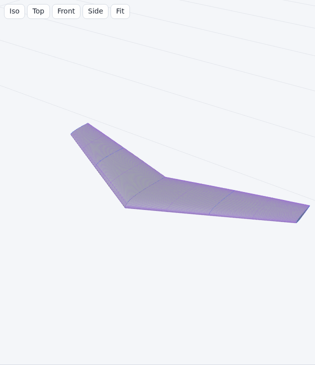

Deutsch: [[Geometrie|Geometrie]]

# Geometry

## Conventions

| Convention | Value |
| --- | --- |
| Lengths | millimetres (mm) |
| Angles | degrees (°); twist positive = leading edge up |
| Axes | x chordwise, positive towards the trailing edge; y spanwise, positive towards the right tip; z up |
| Computed geometry | right half wing (y ≥ 0); the left half is its mirror image at the plane y = 0 |
| Curves and surfaces | NURBS (Non-Uniform Rational B-Spline) with all weights 1, i.e. non-rational B-splines |
| Algorithm numbers (A2.1 …) and equation numbers | Piegl and Tiller, *The NURBS Book*, 2nd edition, Springer 1997 |
| Messages | The messages quoted on this page are the English texts of the app. The German interface writes them in German ([[Geometrie]]). The checks, limits and results are the same in both languages. |

## Symbols

| Symbol | Meaning |
| --- | --- |
| LE, TE | leading edge, trailing edge (used as subscripts: x_LE, x_TE) |
| N | number of chord intervals per surface (N + 1 stations per surface, LE and TE included): **Settings** > **Chordwise stations per surface**, default 60, range 16 to 200 |
| K | spanwise stations per panel: **Settings** > **Spanwise stations per panel with guides, smooth mode or mitred linear panels**, default 8, range 3 to 40; the grid limit of section 3.2 can reduce it |
| c | chord in mm |
| f_pivot | twist pivot as a fraction of the chord: **Settings** > **Twist pivot (fraction of chord)**, default 0.25, range 0 to 1 |
| δ | dihedral of a panel: atan2(z_(i+1) − z_i, y_(i+1) − y_i) of its two section positions, in degrees |
| φ | roll of a section plane about the x axis (section 3.8); φ = 0 is the plane y = const |
| m | thickness stretch of a placed airfoil (section 3.8); 1 in a vertical plane |
| n | index of the last point of a point list (points 0 … n) |
| p | degree of a curve |
| u | surface parameter around the profile: 0 upper TE, u_LE leading edge, 1 lower TE |
| v | surface parameter along the span: 0 root, 1 tip |
| Panel | span interval between two neighbouring sections |
| Station | one placed airfoil outline at span position y; every section is a station |

Derivatives are written dx/du and d²x/du². Subscripts are point indices (Q_k, x_N) or labels (x_LE, x_norm).

## Pipeline

| Step | Code | NURBS Book algorithms |
| --- | --- | --- |
| 1. Airfoil to NURBS curve | `src/airfoil/geometry.js`, `src/geom/profile.js` | A2.1, A2.2, A2.3, A3.1, A3.2, A9.1 |
| 2. Common chord stations | `src/geom/profile.js`, `src/geom/wing.js` | A3.1 |
| 3. Spanwise stations | `src/geom/wing.js`, `src/geom/spanwise.js`, `src/geom/guide.js` | A9.1 |
| 4. Surface | `src/geom/wing.js`, `src/geom/nurbs.js` | A9.1 per row and column (equivalent to A9.4), A3.5 |
| 5. Meshes | `src/geom/mesh.js`, `src/geom/triangulate.js` | A3.5 |
| 6. STEP (Standard for the Exchange of Product model data) topology | `src/export/step.js` | A5.1 |
| 7. Planform statistics | `src/geom/stats.js`, `src/geom/wing.js` (`planformAt`) | – |

## 1. Airfoil to NURBS curve

Input: airfoil points in Selig order (upper TE → leading edge → lower TE) that pass the sanity checks
([[File Formats|File-Formats]]). A sanity-check error, a self-crossing curve (section 1.4) or an x
reversal (section 1.5) blocks the wing build; warnings do not. The sanity checks first remove
consecutive points closer than 1e-9 of the x range (info `duplicates`): their parameters u_k (section
1.2) can round to the same value and make the linear system singular.

### 1.1 Normalization

- File leading edge P: the file point farthest from the TE midpoint (mean of the first and the last
  point). Squared distances within a relative 1e-15 of the largest count as ties; ties go to the smaller x,
  so every scale of the same outline picks the same point.
- Translation and uniform scaling only. The airfoil is not rotated.

```
c_file = x_max − x_min
x_norm = (x − x_min) / c_file
z_norm = (z − z_P)  / c_file
```

- Inclined airfoils: the line from P to the TE midpoint keeps its angle. Above 0.5° the sanity checks
  report the warning `rotated`. Twist then refers to the x axis of the file.

### 1.2 Interpolation

| Property | Value |
| --- | --- |
| Method | global curve interpolation through every point Q_0 … Q_n (A9.1) |
| Degree | 3 |
| Parameters | **Settings** > **Profile parametrization**: **Centripetal (recommended)** (default), **Chord length** or **Uniform** (eq. 9.3 to 9.6) |
| Knot vector | clamped, by averaging (eq. 9.8) |
| Linear system | band LU (lower-upper) factorization without pivoting; row k holds the p + 1 basis values of the knot span of u_k, all other entries are 0; B-spline collocation matrices are totally positive for nondecreasing parameters, so elimination without row exchanges is stable (de Boor and Pinkus 1977); decreasing parameters stop the interpolation with the error "Interpolation parameters must be nondecreasing." |
| Parameter range | u = 0 at the upper TE, u = 1 at the lower TE |

```
d_k = |Q_k − Q_(k−1)|^e          e = 1 (Chord length), e = 0.5 (Centripetal)
u_0 = 0,  u_k = u_(k−1) + d_k / Σ d,  u_n = 1
Uniform:  u_k = k / n
knots:    U_(j+p) = (u_j + … + u_(j+p−1)) / p,   j = 1 … n − p,   p + 1 end knots at 0 and at 1
```

### 1.3 Leading edge of the curve

The section origin is the minimum-x point of the curve: u_LE with dx/du(u_LE) = 0.

| Property | Value |
| --- | --- |
| Start value | parameter of the file point with minimum x |
| Iteration | Newton step u ← u − (dx/du) / (d²x/du²), derivatives by A2.3 and A3.2 |
| Bracket | parameters of the two neighbouring file points; a step outside the bracket becomes a bisection step on the sign of dx/du |
| Stop | \|dx/du\| < 1e-14, step < 1e-14, or 50 iterations |
| Fallback | if x(u_LE) is larger than x of the minimum-x file point, u_LE is the parameter of that file point |

### 1.4 Self-crossing check

A cubic curve can loop between file points that pass every sanity check, e.g. past the TE of a
coarse file. The same test runs on each airfoil curve and on the surface rows (section 4).

| Property | Airfoil curve | Surface row |
| --- | --- | --- |
| Curve | NURBS curve of section 1.2, normalized coordinates | row v = const of the surface S, projected to the plane of its station: x and the up direction (0, −sin φ, cos φ) of its roll φ (the x-z plane for φ = 0, section 3.8) |
| Rows tested | – | at the y of each section, halfway between 2 neighbouring sections and halfway between the 2 stations of each of the 64 widest station intervals (`MAX_STATION_ROWS`; every interval when there are at most 64; added stations included); other rows: the thickness checks of section 3.6 |
| Samples per knot span | per = max(1, min(256, round(4000 · L_span / L_total))); L_span = length of the control polygon of the span (p segments), L_total = sum over the non-empty knot spans | 4 |
| Samples in total | Σ per + 1, about 4001 | 4 · spans + 1 |
| Test | proper crossings of non-adjacent polyline segments; every crossing found is sized; crossings up to the tolerance do not count; the search stops after 20 crossings above the tolerance; the largest is reported | same |
| Search | grid of about √n × √n cells over n segments, each cell at least twice the median segment box in x and in y; only segments that share a cell are tested; a cell with more than 32 segments gets its own grid over the part its segments cover, at most 6 levels deep (`selfIntersections` in `src/airfoil/geometry.js`) | same |
| Size of a crossing (mean width) | the crossing splits the polyline into 2 parts; part P = the part with the smaller bounding-box diagonal; size = area(P) / diagonal(P), area of P as a closed polygon (shoelace formula) | same |
| Tolerance | size > 5e-4 of the chord (0.05 %) is an error. Cusped closed TEs of 246 real files leave slivers of at most 1.6e-5 of the chord (0.0016 %); the loop of a coarse 9-point file measures 2.5e-3 of the chord (0.25 %). In the wing build the loop is also limited to 0.1 mm (`CROSSING_LIMIT` in `src/geom/profile.js`) at the largest chord of the sections that use the airfoil: above 200 mm chord a loop wider than 0.1 mm is an error, and the message adds "the loop is … mm wide at … mm chord, above 0.1 mm." | size > min(5e-4 · c, 0.1 mm), c = chord at the y of the row |
| Message | "the NURBS curve through the points crosses itself near x = … % chord" | "The loft surface crosses itself at y = … mm near x = … mm" |
| Remedy | a file with more points or finer spacing near that position | raise **Settings** > **Chordwise stations per surface**; the message ends with "Increase Settings > Chord samples." |

The airfoil preview runs the airfoil-curve test and the x-reversal test (section 1.5) with the
project's **Settings** > **Profile parametrization** and reports a failure as error `curve-shape`.
A failed interpolation (section 1.2) is also error `curve-shape`. The preview then shows
**Cannot add (errors)** instead of **Add to project**.

### 1.5 x reversal

The resampling of section 2 solves x(u) = target on each surface. A surface that runs back in x has
several solutions, and the resampling drops the part that runs back.

| Property | Value |
| --- | --- |
| Samples | the airfoil-curve samples of section 1.4 |
| Upper surface (u from 0 to u_LE) | reversal = x − running minimum of x |
| Lower surface (u from u_LE to 1) | reversal = running maximum of x − x |
| Tolerance | reversal > 1e-4 of the chord (0.01 %) is an error |
| Message | "the surface runs back in x by … % chord near x = … % chord" |

## 2. Common chord stations

Every airfoil is resampled at the same N + 1 chord fractions per surface. Spacing is cosine: finest
at the LE and at the TE.

```
s_k = (1 − cos(π k / N)) / 2          k = 0 … N
```

| N | Smallest step (at LE and TE) | Largest step (mid-chord) | Points per section |
| --- | --- | --- | --- |
| 16 | 0.961 % of chord | 9.75 % of chord | 33 |
| 60 (default) | 0.0685 % of chord | 2.62 % of chord | 121 |
| 200 | 0.00617 % of chord | 0.785 % of chord | 401 |

Per surface, u is solved from x(u) = target on the curve branch:

```
upper surface:  target = x_LE + s_k (x(0) − x_LE)     u in [0, u_LE]
lower surface:  target = x_LE + s_k (x(1) − x_LE)     u in [u_LE, 1]
```

| Solver property | Value |
| --- | --- |
| Method | regula falsi (secant step inside the bracket) |
| Bisection step | replaces the secant step every third iteration and whenever the secant point leaves the bracket |
| Stop | \|x(u) − target\| ≤ 1e-13, bracket width ≤ 1e-13, or 200 iterations (then the bracket midpoint) |
| No sign change in the bracket | the bracket end with the smaller \|x(u) − target\| |

- k = 0 is the curve leading edge, k = N the curve end point. Both are taken without solving.
- Output: 2N + 1 points. Index 0 … N: upper surface TE → LE. Index N … 2N: lower surface LE → TE.
  The leading edge is index N.

Unit chord (`unitChord` in `src/geom/wing.js`):

```
x_TE,mid = (x_0 + x_2N) / 2
c_curve  = x_TE,mid − x_N
x_unit   = (x − x_N) / c_curve
z_unit   = (z − z_N) / c_curve
```

Result: the NURBS leading edge is at (0, 0), the TE midpoint at x_unit = 1.

| Property | Consequence |
| --- | --- |
| Point k has the same chord fraction on the same surface in every section | sections blend point by point |
| The leading edge is point N in every section | the leading edge lies on one surface parameter u_LE |

Limitation: x(u) must increase monotonically from the leading edge to each TE end point. A reversal
above 1e-4 of the chord is an error (section 1.5). With a smaller reversal the solver returns one of
several solutions for the affected stations. The sanity warning `non-monotonic` tests the file points
only (x decrease > 1e-6 of the chord between neighbouring points on one surface), not the curve.
The sanity error `folds` stops an airfoil whose upper or lower surface runs back in x at more than 50
points: "The upper surface runs back in x at … points; the limit is 50." (lower surface likewise).

## 3. Spanwise stations

### 3.1 Blending

Each section quantity f (x, z, chord, twist and the 2N + 1 shape points) is blended with weights w_i(y):

```
f(y) = Σ_i w_i(y) f_i          Σ_i w_i(y) = 1
```

| **Spanwise interpolation** | Weights w_i(y) | Condition |
| --- | --- | --- |
| **Linear between sections** | hat functions: linear between the two neighbouring sections | any section count |
| **Straight panels (straight lines between sections, as XFLR5)** | hat functions, as **Linear**, for the check positions of section 3.6; the surface itself joins the placed sections with straight lines (below) | any section count; no guide curve on |
| **Smooth (natural cubic spline through sections)** | cardinal functions of a natural cubic spline through the section positions y_i (second derivative 0 at root and tip) | 3 or more sections; with 2 sections the hat functions apply |

- y outside [y_root, y_tip] is clamped to the range.
- **Linear** blends the normalized airfoil, the chord and the twist apart: halfway between two sections
  the station is the blended airfoil, scaled by the blended chord and turned by the blended twist.
  Where the chord changes together with the airfoil or the twist, the product bends the panel, and the
  added stations of section 3.2 make the loft follow the bend.
- **Straight panels** join the points of equal chord fraction of two neighbouring sections with
  straight lines, as XFLR5 builds its panels:

  ```
  S(u_j, v) = (1 − t) P_j(y_i) + t P_j(y_(i+1))          t = (y − y_i) / (y_(i+1) − y_i)
  ```

  P_j(y_i) is point j of section i placed in 3D, in the plane of the section (section 3.8). With
  **Mitred** section planes this is XFLR5's surface; with **Vertical** section planes the sections
  are thinner across a panel with dihedral (section 3.8). Example: NACA 0014 at 400 mm chord and
  NACA 0008 at 100 mm chord, 100 mm apart. Halfway, **Straight panels** give a thickness of 32.0 mm
  (the mean of 56 mm and 8 mm), **Linear** 27.5 mm (11 % of 250 mm), and the **Linear** loft lies up to
  2.3 mm off the straight lines (3.1 mm with a tip twist of −3°). Measured against the STL that the code of XFLR5 6.62
  writes: the tip panel of `UltraStick120.xfl` (NACA 0014 at 406.4 mm to a 12.7 mm chord, 101.6 mm
  long): every XFLR5 vertex lies within 0.04 mm of the surface built with **Straight panels** (100.03 %
  of XFLR5's thickness halfway), and up to 4.17 mm off the one built with **Linear** (69.75 %).
- **Straight panels** with a guide curve on stop the build: "Straight panels do not follow guide
  curves: switch the guide curves off in the Planform tab, or set Settings > Spanwise interpolation to
  Linear or Smooth."
- **Smooth**: the build evaluates the spline of every blended value directly. One tridiagonal
  system of size sections − 2 (Thomas algorithm, no pivoting; the system is diagonally dominant)
  gives the second derivatives of all values at the sections, one right-hand side per value.
  n sections of m values: O(n · m) operations once, then O(m) per span position from the two
  neighbouring sections. The result equals the weighted sum with the cardinal functions up to
  round-off.
- **Smooth**: the cardinal functions leave [0, 1] between sections (3 evenly spaced sections: minimum
  weight −0.096). Large thickness or chord changes and uneven spacing increase the overshoot.
- **Smooth**, build errors (section 3.6): an interpolated value more than 2 × the range of its section
  values outside that range; a negative blended thickness; an interpolated leading-edge x,
  trailing-edge x or z beyond ±1,200,000 mm, or a chord above 100,000 mm.

### 3.2 Station positions

| Condition | Stations per panel | Spacing inside a panel | Surface degree along v |
| --- | --- | --- | --- |
| **Linear**, no guide curve enabled | 1 (the section) | – | 1 |
| **Straight panels** (no guide curve) | 1 (the section) | – | 1 |
| **Linear**, a guide curve enabled | K (the section and K − 1 intermediate stations) | cosine | min(3, K): 3 for K ≥ 3; 2 or 1 when the loft grid limit lowers K to 2 or 1 |
| **Linear**, no guide curve, **Section planes** = **Mitred**, the two sections of the panel in planes of different roll φ | K (the section and K − 1 intermediate stations) | cosine | as above; panels without intermediate stations are straight segments raised to that degree (section 4) |
| **Smooth** | K (the section and K − 1 intermediate stations) | cosine | 3 (stations − 1 below 4 stations) |

The tip section is the last station. Station count: D · K + (sections − 1 − D) + 1, plus the added
stations below (**Linear** and **Smooth**; **Straight panels** add none). D is the number of panels
with K stations: all sections − 1 with a guide curve on or **Smooth**; otherwise the **Linear** panels
between mitred planes of different roll. Examples: **Glider** preset, 3 sections, K = 8: 17 stations;
**Sport** preset (2 sections, 1.5° dihedral, **Mitred**): 9 stations.

In a **Linear** panel between mitred planes, every intermediate station holds the blended airfoil in
its own plane (roll and stretch of section 3.8), as with a guide curve. With one station per panel
the loft would be the ruled surface of **Straight panels**. The two differ where the chord changes
together with the airfoil or the twist: on the **Sport** preset (NACA 2412 at 240 mm, NACA 2410 at
144 mm, −1° twist at the tip) the ruled surface lies up to 0.343 mm off the **Linear** surface, and the
volume differs by 1.4 %.

```
y_(i,k) = y_i + (y_(i+1) − y_i) (1 − cos(π k / K)) / 2          k = 0 … K − 1
```

Distinct span fractions: a < b are distinct when b − a > max(4 ε · max(|a|, |b|), 2^-1021), ε = 2^-52
(`paramsApart` in `src/geom/nurbs.js`). Two sections that are not distinct are an error; an
intermediate station that is not distinct from the previous kept station or from the tip is left out;
through-point guide curves apply the same rule to the normalized y of their points.

Loft grid (`loftGrid` in `src/model/budget.js`): stations times profile points before stations are
added, (D · K + (sections − 1 − D) + 1) · (2N + 1) points. With D = 0 (**Linear** without a guide curve
and without panels between mitred planes of different roll, and **Straight panels**) K_set = 1.
The limits apply in every mode.

| Item | Value |
| --- | --- |
| Warning threshold | above 60,000 grid points (`WARN.gridPoints`): the build adds the warning "Large project: …" with "… loft grid points (warning above 60,000)" and the expected time and browser memory of each change. **Settings** shows "Loft grid: … points." under the resolution fields, with the time and memory above 60,000. |
| Limit | 5,000,000 grid points (`LIMITS.maxGridPoints` in `src/model/project.js`); beyond it a desktop browser tab runs out of memory |
| K used | max(1, min(K_set, floor((5,000,000 / (2N + 1) − 1 − (sections − 1 − D)) / D))), the largest K whose grid (D · K + (sections − 1 − D) + 1) · (2N + 1) stays within 5,000,000; K_set = **Settings** value. K < K_set only above 5,000,000 grid points. |
| Warning (K < K_set) | "Spanwise stations per panel reduced from K_set to K: S sections with N chord samples keep the loft within 5,000,000 grid points." |
| Error (more than 5,000,000 grid points with the K used) | "The loft grid needs P points with one station per panel (S sections, N chord samples); the limit is 5,000,000. Reduce the chord samples or the sections." No surface is built. |
| Example | 200 sections, K_set = 8, N = 60 (defaults): K = 8, 1,593 stations, 192,753 grid points: warning with time and memory |
| Example | 2,000 sections, K_set = 8, N = 200: K = 6, 11,995 stations, 4,809,995 grid points |
| Example | 4,200 sections, K_set = 8, N = 200, **Linear** with a guide curve: K = 2, 8,399 stations, 3,367,999 grid points; surface degree along v 2 |
| Example | 20,000 sections, N = 200, any mode: K = 1, 8,020,000 grid points: error |

Added stations (**Linear** and **Smooth**): the surface passes through the stations only. Between
stations it can deviate from the intended surface, also through twist. **Straight panels** skip the
comparison: the straight lines between the sections are the intended surface, and no station is
added. After the surface fit (section 4), the builder compares
surface points with the points of a station placed at y (sections 3.4, 3.7, 3.8), in 3D (`probe` in
`src/geom/wing.js`).

| Parameter | Value |
| --- | --- |
| Compared profile points j | N (leading edge), 0 (upper TE), N − k (upper surface) and N + k (lower surface) for k = s, 2s, … < N; s = max(1, floor(N / 6)) |
| Compared chord stations per surface | N = 16: 7. N = 60: 5 (k = 10, 20, 30, 40, 50; s_k = 6.7 %, 25 %, 50 %, 75 %, 93.3 % of the chord). N = 200: 6. |
| Deviation at y | max over j of \|S(u_j, v) − P_j\|, 3D distance; u_j = surface parameter of profile point j (section 4), P_j = point j of the station placed at y |
| Tolerance | min(0.5 mm, 0.1 · c(y)) |
| Insertion | deviation at every check position y of section 3.6; one station at each local maximum of deviation / tolerance where the deviation exceeds the tolerance (the tolerance shrinks with the chord, so the largest deviation can lie below its tolerance while smaller ones further out exceed theirs); a new station keeps at least 1e-6 · (y_tip − y_root) from every other station |
| Limit | 6 rounds, 32 added stations in total; above 60,000 grid points (`WARN.gridPoints`) 1 round, because each round fits the whole loft again |
| Kept fit | of the fits before and after each round, the one with the smallest max over the check positions of deviation / tolerance; on a tie the earlier one. Stations added close together can make the cubic fit swing: 2 sections, nose line with a bump 4 mm high and 0.06 mm wide (control points): 3.67 mm without added stations, 18,797 mm after 32 added stations; the build keeps the first fit and warns |
| After the final fit | fitted chord and local thickness (section 3.6) also at 0.25, 0.5 and 0.75 of every station interval (quarter points); they enter only the errors of section 3.6: no station is added there, and the deviation there does not enter the warning |
| Deviation above the tolerance at a check position | warning with the largest deviation at the check positions, its y and the number of added stations; remedy: raise K |

The same comparison gives the fitted chord and the local thickness of the fitted surface (section 3.6).

Example: **Swept flying wing** preset (3 sections, **Linear**, tip twist −4°): 2 added stations at
y = 150.0 mm and y = 450.0 mm. The same preset with tip twist 0°: no added station.

Pointed elliptic tips (wizard: **Planform** = **Elliptic (guide curves)**, **Tip** =
**Pointed (1/200 scale)**), every preset: 5 to 9 added stations. Largest deviation at the check
positions: 0.077 mm (**Tail surface**) to 0.371 mm (**Swept flying wing**), below the tolerance; no
warning. The nose line and the end line end a quarter and three quarters of the tip chord around
the sweep line, so the tip section keeps its quarter chord on that line. Within 2 mm of the tip the
leading and trailing edge x of the loft deviate at most 0.031 mm (**Swept flying wing**; 2,001 span
samples) from the intended planform; the other profile points there are not measured, and the
warning does not cover those positions.

### 3.3 Guide curves

Nose line (leading edge) and end line (trailing edge): 2D B-spline curves in the planform plane (x, y),
points P_0 … P_n.

| Property | **Through points** (`fit`) | **Control points** (`control`) |
| --- | --- | --- |
| Role of the points | the curve passes through them | control polygon |
| Parameters | proportional to y: t_k = (y_k − y_0) / (y_n − y_0) | – |
| Knot vector | clamped, by averaging (eq. 9.8) | clamped uniform, interior knots j / (n − p + 1) (eq. 9.7) |
| **Degree** | 1 to 5, default 3, at most n | 1 to 5, default 3, at most n |

Conditions (violation = error, no surface):

- at least 2 points, all values finite
- y strictly increasing from point to point
- y(t) non-decreasing, checked at 401 parameters with tolerance 1e-9 mm
- x of every control point of the curve within ±1,200,000 mm (`LIMITS.maxExtent`); with
  **Through points** these are the control points that the interpolation computes. A B-spline lies
  within the convex hull of its control points, so the whole curve stays within this bound. Message:
  "Nose line: the curve through the points reaches x = … mm, beyond ±1200000 mm; space the points
  more evenly in y or use control-point mode." (end line: "End line: …")

With **Through points**, y(t) is linear in t, because a spline reproduces linear functions.

Span mapping: the y range of the guide [y_first, y_last] is stretched linearly onto [y_root, y_tip].

```
f   = clamp((y − y_root) / (y_tip − y_root), 0, 1)
t   = solution of (y(t) − y_first) / (y_last − y_first) = f
      (solver of section 2 on the normalized y, until the t bracket is at most 1e-15 wide)
x   = x(t)
```

**Reset to sections** sets the guide points to the section edges:

| Guide curve | Point per section |
| --- | --- |
| nose line | (x, y) of the section leading edge |
| end line | (x + c, y) of the section trailing edge |

A disabled guide without edits follows these points ([[File Formats|File-Formats]], section
`guides.nose`, `guides.end`). Guide point x is limited to ±1,100,000 mm (`LIMITS.maxGuideCoordinate`):
section x up to 1,000,000 mm plus a chord up to 100,000 mm.


**Planform** tab, **Glider** preset. Controls: [[User Guide|User-Guide]], section Planform.

### 3.4 Leading-edge position and chord per station

| Enabled guide curves | x_LE | Chord c |
| --- | --- | --- |
| none | blended x | blended chord |
| nose line | nose line x | blended chord |
| end line | end line x − c | blended chord |
| both | nose line x | end line x − nose line x |

z and twist are always blended.

### 3.5 Wing tip

| **Wing tip** | Geometry |
| --- | --- |
| **Flat (cut at the tip section)** | the wing ends at the tip section with a planar cap |
| **Pointed (tip profile scaled down)** | the tip section gets the chord c_tip (default 1/200 of c(y_prev), at least 1 mm); the wing ends in a planar cap with chord c_tip; with both guide curves the tip chord is the guide gap at y_tip, at least c_tip |

Pointed tip:

```
c_tip = max(r · c(y_prev), 1 mm)
```

| Item | Value |
| --- | --- |
| y_prev | span position of the second-last section |
| c(y_prev) | chord there, after guide curves |
| r | 1 / q. q: value of **Tip profile scale 1 : N of the previous section chord**. Range 100 to 1000, step 50, default 200 (r = 0.005). |
| c_tip = 1 mm (r · c(y_prev) < 1 mm) | the **Sections** table shows `(min.)` after the tip chord; not shown when the warning below applies |
| Last panel | a chord below c_tip and above −0.01 mm is raised to c_tip |
| Warning | both guide curves enabled and the tip chord (end line x − nose line x at y_tip) larger than c_tip + 0.5 mm; the wing then ends with that chord; the message gives both chords |

Example: **Glider** preset (guide curves end 90 mm apart) with **Wing tip** = **Pointed**: c_tip =
1 mm, tip chord 90 mm, warning "nose line and end line end 90.0 mm apart, so the tip chord is 90.0 mm
instead of 1.00 mm".

### 3.6 Build checks

Check positions y:

- every station of section 3.2
- 257 evenly spaced positions: y_root + (y_tip − y_root) k / 256, k = 0 … 256
- y of every guide control point and of the guide curve point at every knot, mapped linearly onto
  [y_root, y_tip]

Thickness at a check position, as a fraction of the chord (upper minus lower point at the same chord
station):

```
t_k = z_unit,(N−k) − z_unit,(N+k)          k = 1 … N − 1
```

Chord stations beyond 99 % of the chord (s_k > 0.99): a negative t_k up to min(1e-4, 0.1 mm / c) in
magnitude counts as 0. The resampled TE of a cusped airfoil can lie in a crossing loop that the curve
check of section 1.4 accepts (loops with a mean width up to 5e-4 of the chord, at most 0.1 mm).

Fitted positions: the check positions plus the quarter points 0.25, 0.5 and 0.75 of every station
interval after the final fit (section 3.2).

Local thickness of the fitted surface at y, for the compared chord stations k of section 3.2: the
surface points S(u_(N−k), v) and S(u_(N+k), v) transformed back into the unit-chord frame of the
station at y (translation, roll, chord scale, twist and stretch undone), upper z minus lower z.

Checks in code order. Every row is an error; no surface is built.

| Check | Condition |
| --- | --- |
| Section count | fewer than 2 sections |
| Project limits | a section chord above 100,000 mm, a section x, y or z outside ±1,000,000 mm, a twist outside ±360°, more than 20,000 sections, or a guide curve (on or off) with more than 20,000 points, a point x outside ±1,100,000 mm or a point y outside ±1,000,000 mm. Same limits as on **Open** (`limitErrors` in `src/model/project.js`), so a project that cannot be saved cannot be exported. Every exceeded limit gives one message, e.g. "Section 3: twist must be within ±360 degrees." or "Section 2: chord must be at most 100000 mm." More than 20,000 sections: only the message "At most 20,000 sections are supported (found N).", the sections are not read. A guide curve above 20,000 points: "guides.nose.points: at most 20,000 points (found N)." (end line: `guides.end.points`). |
| Root side | first section (after sorting by y) at y < 0: "lies on the mirrored side" |
| Section positions | 2 sections with the same y |
| Airfoil reference | a section uses an airfoil id missing in the project |
| Airfoil | sanity-check error, failed NURBS interpolation, self-crossing NURBS curve (section 1.4) or x reversal (section 1.5). With **Chord length** or **Uniform** parametrization the message ends with 'Settings > Profile parametrization "centripetal" follows the points more closely.' |
| Guide curves | a condition of section 3.3 violated |
| Straight panels | **Straight panels** with a guide curve on (section 3.1) |
| Section planes, stretch | **Mitred** section planes (not with **Smooth**, section 3.8): a section whose plane lies more than 60° from a panel next to it, a stretch m above 2 (`MAX_STRETCH` in `src/geom/planes.js`): a first panel steeper than 60°, or a dihedral change of more than 120° at a section. The stretch is never clamped. Message: "Section n: its mitred plane lies …° from the panel next to it, which stretches the airfoil … times (limit 2, 60°). Reduce the dihedral change there or set Settings > Section planes to Vertical." |
| Loft grid | more than 5,000,000 grid points with the stations per panel used (section 3.2) |
| Section planes, fold | **Mitred** section planes: the planes of two neighbouring sections of different roll meet in a line parallel to x. The surface between them folds when that line passes through either placed airfoil (its extent along the up direction of its plane, with chord, twist and stretch), when the two airfoils lie on opposite sides of the line, or when the inner airfoil lies outboard of the plane of the outer one (`planeFold` in `src/geom/planes.js`). Message: "Sections a and b: their mitred planes meet … mm from the position (y, z) of section a, within the airfoils, so the surface between them folds. Lengthen the panel, reduce the dihedral change or set Settings > Section planes to Vertical." Example: panels of 0°, 40° (10 mm long) and 80°, NACA 0012 at 300 mm chord: the planes rolled 20° and 60° meet 14.6 mm from section 2, inside its ±19.2 mm; at 150 mm chord (±9.6 mm) the surface builds. |
| Section values | x_LE, c, z or cos(twist) of a check position is not a finite number. Message: "Section values give non-finite coordinates at y = … mm; check the positions, chords and twists of the sections." |
| Geometry extent | at a check position: x_LE, x_LE + c (trailing edge) or z beyond ±1,200,000 mm (`LIMITS.maxExtent`), or c above 100,000 mm. Causes: **Smooth** overshoot; a guide curve close to ±1,200,000 mm, where the chord added to it or taken from it leaves the extent; nose line and end line more than 100,000 mm apart. Message: "At y = … mm the wing leaves the project limits (leading-edge x … mm, z … mm, chord … mm; limits ±1200000 mm and 100000 mm chord). Check the guide curves, or use linear interpolation." |
| Section planes, turning | **Mitred** section planes, **Linear**: at a check position in a panel whose two planes differ, the roll φ changes along y by dφ/dy = (φ_(i+1) − φ_i) / (y_(i+1) − y_i). A point at height t in the plane of its station (along the up direction, with chord, twist and stretch) moves across that plane at the rate cos φ + tan δ · sin φ − t · dφ/dy per mm of span; t is the highest point of the airfoil where dφ/dy > 0, the lowest where dφ/dy < 0. At 0 or below the surface folds, also where the planes of the stations around the position do not cross. Message: "Sections a and b: at y = … mm the mitred section planes between them turn faster than the airfoils allow, so the surface folds. Lengthen the panel, reduce the dihedral change or set Settings > Section planes to Vertical." Example: NACA 0018 at 217 mm chord, rolls 0° and 46.9° over a 21.7 mm panel: at the root 1 − 30.4 mm · 0.0377/mm < 0; the end planes meet 46 mm up the root plane, beyond the airfoil. **Straight panels** are ruled between the sections; the check "Section planes, fold" covers them. |
| **Smooth** overshoot | **Smooth** only. At a check position an interpolated value lies more than 2 × (max − min) of its section values outside [min, max] (`OVERSHOOT_LIMIT` = 2). Values: x_LE (no guide curve on), chord (not both guide curves on), z, twist, and the height z_unit of every profile point k = 1 … 2N − 1. The message names the value with the largest overshoot (`leading-edge x`, `chord`, `z`, `twist`, `upper surface height at x = … % chord` or `lower surface height at x = … % chord`), its y, the section range and the smallest gap between 2 sections. Remedy in the message: **Linear**, more evenly spaced sections, or fewer closely spaced sections. |
| Blended thickness | min t_k < −1e-9 at a check position. **Smooth**: overshoot (section 3.1); remedy in the message: **Linear** or more sections. **Linear**: upper and lower surface of a section airfoil cross at that chord station; remedy in the message: check the airfoils or raise **Chordwise stations per surface**. The message gives y and x. |
| Thickness after the **Trailing edge** setting | min t_k < −1e-9 after the gap change of section 3.7. Checked at positions with c ≥ 1 mm. **Fixed thickness in mm**: gap limited to 5 % of the chord. Cause: the airfoil is thinner inside than the set TE gap. |
| Surface contact | min t_k ≤ 1e-5 (0.001 % of the chord) at chord stations s_k from 0.01 to 0.99, after the gap change of section 3.7. Checked at positions with c ≥ 1 mm. The message gives y and x. **As in the airfoil files**: remedy **Linear** or more sections; other modes: remedy **As in the airfoil files** or a thicker TE. |
| Chord | minimum chord < 1 mm; the message gives the chord and its y |
| Chord, hint | as above, minimum at the tip, chord > −0.01 mm, **Wing tip** = **Flat**: the message adds "set **Settings** > **Wing tip** to **Pointed**" |
| Station planes | **Mitred** section planes, after the fit: for two neighbouring stations of different roll, a point of the outer station does not lie beyond the planes of both stations, seen from the same point of the inner station. Message: "The surface folds between the stations at y = … mm and y = … mm (panel from section a to b): their section planes cross within the airfoils. Lengthen the panel, reduce the dihedral change or set Settings > Section planes to Vertical." |
| Fitted surface, finite | after the surface fit and the added stations (section 4): a control point coordinate is not a finite number. Message: "The fitted surface has non-finite coordinates; check the positions, chords and twists of the sections." |
| Fitted thickness | at every fitted position: local thickness of the fitted surface < −1e-9 (beyond 99 % chord: < −min(1e-4, 0.1 mm / c)) at a compared chord station ("The fitted surface turns inside out between stations"), or ≤ 1e-5 (0.001 % of the chord) at a compared chord station from 1 % to 99 % chord ("The fitted surface has zero thickness between stations"). The message gives y and the thickness. Cause in the message: the surface through the stations swings between them (guide curves that change fast, or unevenly spaced sections in **Smooth** mode). Remedy in the message: smooth the guide curves, space the sections more evenly or add sections. |
| Fitted chord | at every fitted position: c_fit < 0.9 mm (1 mm minimum chord less 10 %). c_fit = ((S(0, v) + S(1, v)) / 2 − S(u_LE, v)) projected onto the intended chord direction of the station at y, in 3D. Message: "The fitted surface folds or narrows between stations" |
| Surface self-crossing | the surface row at a section, halfway between 2 neighbouring sections or halfway between the 2 stations of one of the 64 widest station intervals (added stations included) crosses itself in the plane of its station (section 1.4) with a loop size (mean width) above 5e-4 · c; 4 samples per knot span (section 1.4) |

### 3.7 Trailing edge

Per station, after blending:

| **Trailing edge** | Gap g as a fraction of the chord |
| --- | --- |
| **As in the airfoil files** (`asis`) | blended shape unchanged |
| **Closed (sharp)** (`closed`) | g = 0; both end points move to their midpoint |
| **Fixed thickness in mm** (`thickness`) | g = t / c, t = **Trailing-edge thickness (mm)** (default 0.4 mm), limited to 5 % of the chord |

| Project | **Trailing edge** | t |
| --- | --- | --- |
| Default of the project model (project files without this setting) | **As in the airfoil files** | 0.4 mm (unused) |
| Sample wing "Sport wing 1500" (first visit) | **Fixed thickness in mm** | 0.5 mm |
| Projects from the wizard | **Fixed thickness in mm** | max(0.3 mm, 0.2 % of the root chord), rounded to 0.01 mm; **Glider** 0.4 mm, **Sport** 0.48 mm, **Tail surface** 0.3 mm |

Gap change: the upper surface moves up and the lower surface down by half the change. The weight
rises linearly from 0 at the leading edge to 1 at the TE, so the leading edge stays in place.

```
δ = (g − g_current) / 2
w = clamp((x − x_LE) / (x_TE,branch − x_LE), 0, 1)
upper surface:  z ← z + δ w
lower surface:  z ← z − δ w
```

Negative thickness after this change is a build error (section 3.6).

TE topology over all stations:

| Stations | TE of the surface |
| --- | --- |
| \|gap\| < 1e-6 mm at every station | closed: both end points merged at every station |
| otherwise | open: each station with a gap below min(0.01 mm, 5 % of c) is opened to that value |

| Warning | Condition |
| --- | --- |
| thickness limited | t / c > 5 % at 1 or more stations; stations in the last panel of a pointed tip are not counted |
| stations opened | open TE and 1 or more stations with a gap below the minimum |

### 3.8 Placement in 3D

Unit-chord point (x_unit, z_unit) from section 2, twist θ, pivot f_pivot, roll φ and stretch m of the
section plane. The twist turns the airfoil in its plane about the pivot (f_pivot, 0); the stretch scales
its thickness before the twist.

```
dx  = x_unit − f_pivot
r_x =  dx cos θ + m z_unit sin θ
r_z = −dx sin θ + m z_unit cos θ
X = x_LE + c (f_pivot + r_x)
Y = y − c r_z sin φ
Z = z + c r_z cos φ
```

The section plane passes through the section position (y, z), which the untwisted leading edge, the
pivot and the trailing edge share. Its up direction is (0, −sin φ, cos φ), its normal (0, cos φ, sin φ).
With φ = 0 and m = 1 the section lies in the plane Y = y.

**Settings** > **Section planes** (`settings.sectionPlanes`, `src/geom/planes.js`):

| Value | Roll φ | Stretch m |
| --- | --- | --- |
| **Mitred (square to the panels, as XFLR5)** (`mitred`, default of new projects) | root 0; a section between panels i − 1 and i: (δ_(i−1) + δ_i) / 2, the bisector plane; tip: δ of the last panel, square to it | 1 / cos(φ − δ) with δ of the panel outboard of the section (the tip: the last panel; at a bisector both panels give the same value): root 1 / cos δ_0, a break 1 / cos((δ_i − δ_(i−1)) / 2), tip 1 |
| **Vertical (y = const)** (`vertical`) | 0 | 1 |

- Stations between sections: φ is blended like the twist (section 3.1); m = 1 / cos(φ − δ) with δ of
  the panel of the station.
- Thickness across a panel: m cos(φ − δ) = 1 of the airfoil thickness with **Mitred**, cos δ with
  **Vertical**. 35° V-tail: the vertical sections are 81.9 % as thick across the panel; the mitred root
  holds the airfoil stretched 1.221 times.
- The twist turns the airfoil about the normal of its plane, as in XFLR5 and flow5. Seen along x, a
  section rolled φ with twist θ meets the flow at atan(tan θ cos φ): 1.64° for 2° twist at 35°.
- The root plane is vertical in both modes, so the two halves meet in the plane y = 0.
- **Smooth** builds vertical section planes: the mitred construction along a spline is not built. With
  **Mitred** and a wing with dihedral, the Checks tab shows the info line "Smooth spanwise interpolation
  builds vertical section planes; mitred section planes need Linear or Straight panels."
- The planes follow the section positions. A section moved in z changes the rolls of its planes and
  of its neighbours' planes.
- Limits: stretch at most 2 and no fold between neighbouring planes (section 3.6).
- Project files of format version 1 hold no section-plane setting and open with **Vertical**
  ([[File Formats|File-Formats]]).

**Sections written by an XFLR5 import.** XFLR5 is a program for the analysis of airfoils and wings. The import sets **Twist pivot (fraction of chord)** (f_pivot) to 0.25, the point about which XFLR5 twists a section, **Spanwise interpolation** to **Straight panels**, the construction of XFLR5's panels (section 3.1), and **Section planes** to **Mitred**, XFLR5's planes. A tilted part and a part whose mitred planes would fold import with **Vertical** section planes. It also applies a frame rule. XFLR5 draws the coordinates of an airfoil as they are; the build puts the leading edge of the airfoil curve (section 1.3) at the section origin and scales the airfoil to chord 1 (section 2). Where the coordinates that XFLR5 used are known (an airfoil of the `.xfl` file, an uploaded `.dat` file, a NACA section), the import moves and scales the section by the difference, so that the airfoil lies where XFLR5 draws it; a difference up to 0.1 % of the chord counts as none. Sections with a library airfoil or another airfoil of the current project keep the values of the file. How the import sets the sections, the pivot and the interpolation, with the rules and formulas: [[File Formats|File-Formats]], section XFLR5 import, subsection Mapping to sections.

## 4. Surface

Tensor-product B-spline surface S(u, v) through the station grid Q (2N + 1 points per station).

| Direction | Parameters | Degree | Knot vector |
| --- | --- | --- | --- |
| u (around the profile) | mean of the per-station parametrizations; u_0 = 0, u_2N = 1 | 3 | clamped, by averaging |
| v (span), **Linear**, **Straight panels** | v = (y − y_root) / (y_tip − y_root) | 1 when no panel has intermediate stations; otherwise the fewest station intervals of a panel with intermediate stations, at most 3 (min(3, K); 2 or 1 when the loft grid limit lowers K, section 3.2) | one interpolation per panel; a panel of 2 stations is the straight segment between them, raised to that degree; panels joined at the sections with interior knot multiplicity p (C0: position-continuous, kinks at sections) |
| v (span), **Smooth** | same | 3 (stations − 1 below 4 stations) | one interpolation over all stations, averaging (C2: continuous up to the second derivative) |

Procedure:

1. Interpolate each station row along u (one band LU factorization serves all rows).
2. Interpolate each column of the resulting control points along v (band LU, section 1.2).
3. Set y of the control points at v = 0 to y_root, and project the control points at v = 1 onto the
   tip plane (y = y_tip for φ = 0). This removes solver round-off: the root and tip rows lie in their
   planes (11 STEP cases: within 2e-13 mm, section 6).

Properties:

- S passes through every station point: S(u_j, v_k) = Q_(j,k).
- The iso-curve u = u_LE passes through the leading edge of every station.
- Control points per half: (2N + 1) × stations.
- The surface rows at each section, halfway between neighbouring sections and halfway between the
  stations of the 64 widest station intervals are tested for self-crossing (section 1.4).



**Swept flying wing** preset (3 sections, 2 added stations, **Linear**, no guide curve) with
**Settings** > **Show NURBS control net**. The 121 net lines along the span lie so close together at this scale that they appear
as shading.

| Wizard preset (N = 60, K = 8) | Stations | Control points per half | Degree u × v |
| --- | --- | --- | --- |
| **Sport** (1.5° dihedral, **Mitred**) | 9 | 121 × 9 | 3 × 3 |
| **Swept flying wing** (no dihedral) | 5 (2 added, section 3.2) | 121 × 5 | 3 × 1 |
| **Glider** (elliptic guide curves, **Tip** = **Flat**) | 17 | 121 × 17 | 3 × 3 |
| **Glider** (elliptic guide curves, **Tip** = **Pointed (1/200 scale)**) | 22 (5 added, section 3.2; largest deviation 0.263 mm, no warning) | 121 × 22 | 3 × 3 |

## 5. Meshes

Triangle meshes for STL (stereolithography) and 3MF (3D Manufacturing Format) export and for the 3D view.

| Direction | Samples |
| --- | --- |
| u | station parameters u_j; each interval divided into d parts |
| v | station parameters v_k; each interval divided into r · d parts; r = 1 (degree 1 along v), r = 3 (degree 2 or 3) |

d = **Mesh density (STL, 3MF)**: 1 (**Normal**) or 2 (**Fine (4x triangles)**). The 3D view samples
with d = 1. The counts below apply to the export meshes.

Counts per half (n_u = 2N · d, V = number of v samples):

| Item | Open TE | Closed TE |
| --- | --- | --- |
| Vertices per v sample | n_u + 1 | n_u (TE vertex shared) |
| Surface triangles | 2 n_u (V − 1) | 2 n_u (V − 1) |
| TE strip triangles | 2 (V − 1) | 0 |
| Triangles per cap (root, tip) | n_u − 1 | n_u − 2 |

Example: **Sport** preset, N = 60, d = 1, open TE: **Mitred** section planes (9 stations, degree 3 along v, V = 25): 3,025 vertices, 6,046 triangles per half; **Vertical** (2 stations, degree 1, V = 2): 242 vertices, 480 triangles.

- Orientation: every triangle faces outward (normal S_v × S_u).
- Caps: the root and tip outlines are triangulated in the plane of their section (x and the up
  direction of its roll φ; the x-z plane for φ = 0). Upper point k pairs with lower point k (same chord
  station): 2 triangles per station interval, linear time.
- Other diagonal: when a triangle of a quad is not counterclockwise, the quad uses its other diagonal
  (refined chord stations do not pair exactly). With one diagonal only, a **Fine** cap with a closed
  trailing edge (NACA 4415, 200 chord stations per surface) falls back to ear clipping: 2.2 s.
- Cap fallback: ear clipping. It applies when a quad has a triangle that is not counterclockwise with
  either diagonal. It also applies when the triangle areas differ from the outline area by more than
  1e-9 (relative). Both areas are summed relative to a vertex of the outline, so a wing 1,000,000 mm
  from the origin keeps the strips.
- Left half: y → −y, triangle winding reversed.

| **Wing halves** | Shells |
| --- | --- |
| **Both halves as separate bodies** | 2 closed shells, root caps included |
| **Full wing as one body (mesh formats, root at y = 0)** | root at exactly y = 0 mm: 1 closed shell, the halves share the root vertices, no root caps; otherwise 2 shells |
| **Right half only** | 1 closed shell |

## 6. STEP topology

STEP file as defined in ISO 10303 (ISO: International Organization for Standardization), schema AP214 (Application Protocol 214). Each half is one
`MANIFOLD_SOLID_BREP` (boundary representation solid) with one `CLOSED_SHELL`. Solid names:
`<name> right`, `<name> left`. Header, units and tolerance: [[File Formats|File-Formats]].

| **Wing halves** | Solids |
| --- | --- |
| **Right half only** | 1 |
| both other options | 2 (the halves are never merged in STEP) |

Split: the surface is split at u_LE by knot insertion (A5.1) up to multiplicity 3 on every v column.
A split parameter within 1e-10 of an existing knot snaps to that knot. Both parts get knot vectors
renormalized to [0, 1].

| Part | u = 0 | u = 1 |
| --- | --- | --- |
| Upper surface | upper TE | leading edge |
| Lower surface | leading edge | lower TE |

Faces of the right half; (+) = edge used in its own direction, (−) = reversed:

| Face | Surface | Edge loop |
| --- | --- | --- |
| Upper | `B_SPLINE_SURFACE_WITH_KNOTS`, degree 3 × degree along v | upper TE (+), tip upper (+), leading edge (−), root upper (−) |
| Lower | `B_SPLINE_SURFACE_WITH_KNOTS`, degree 3 × degree along v | leading edge (+), tip lower (+), lower TE (−), root lower (−) |
| TE (open TE only) | ruled B-spline surface, degree 1 in u (knot vector (0, 0, 1, 1)) between the lower and the upper TE control rows | lower TE (+), tip line (+), upper TE (−), root line (−) |
| Root cap | `PLANE`, normal −y (the root plane is always vertical), origin at the root leading edge | root upper (+), root lower (+), root line (+, open TE only) |
| Tip cap | `PLANE`, normal (0, cos φ_tip, sin φ_tip) (+y for a vertical tip), origin at the tip leading edge | tip lower (−), tip upper (−), tip line (−, open TE only) |

| TE | Faces | Edges | Vertices |
| --- | --- | --- | --- |
| Closed | 4 | 6 | 4 |
| Open | 5 | 9 | 6 |

- Closed TE: upper TE and lower TE are one edge with 2 shared vertices.
- Edges of a B-spline face: the exact boundary iso-curve of that surface (first or last control row
  or column).
- Edge curve type: `B_SPLINE_CURVE_WITH_KNOTS`. Root line and tip line have degree 1.

Orientation flags:

| Flag | Right half | Left half (mirrored) |
| --- | --- | --- |
| `same_sense` of the B-spline faces | `.F.` (S_u × S_v points inward) | `.T.` |
| `same_sense` of the plane faces | `.T.` | `.T.` |
| `FACE_OUTER_BOUND` orientation | `.T.` | `.F.` (every loop reversed) |
| Plane normal | root −y, tip (0, cos φ_tip, sin φ_tip) | mirrored as vectors: root +y, tip (0, −cos φ_tip, sin φ_tip) (outward) |

Validation: `scripts/validate_step.py` reads the files written by `scripts/export-step-cases.mjs`
with OpenCascade. Cases: the 11 cases of `test/step-cases.js`, 3 of them with **Mitred** section
planes (a 35° V-tail with **Straight panels**, written once without and once with the **Fusion 360
fix** (Y up), and a 15°/−5° gull with **Linear**).

**Fusion 360 fix** of the export (File Formats, section "Bodies per file"): every point and direction
of the part is written as (x, z, −y). The turn is a rotation, so the orientation flags stay.

Pass criteria per file:

- read status `IFSelect_RetDone`
- solid count = expected count: 2; `root-offset-half` (**Right half only**): 1
- per solid: `BRepCheck_Analyzer` reports it valid
- per solid: the shell is closed (no free edges, no bad orientation)
- per solid: volume > 0
- per solid: volume within 5e-4 (relative) of the mesh volume at u × 4 and v × 8 refinement
- per solid: every edge of a planar face (the caps) lies in its plane within 1e-6 mm, sampled at 51
  points per edge. A tip cap written vertical on the 15°/−5° gull lies 0.67 mm off its edges and
  changes the volume by only 0.0475 %, below the volume tolerance.

## 7. Planform statistics

MAC: mean aerodynamic chord. The integrals use the intended planform: x_LE(y) and c(y) of section 3.4,
including guide curves and the chord floor of a pointed tip (`planformAt` in `src/geom/wing.js`).
Quadrature: 5-point Gauss-Legendre, exact for polynomials up to degree 9, on each interval [y_a, y_b]
between neighbouring breakpoints. Breakpoints: root, tip, the sections and, for each enabled guide
curve, every knot and control point mapped to the wing span (`planformBreaks` in `src/geom/wing.js`).
Stations are no breakpoints: the intended planform does not bend there, and splitting at 139,994
stations (20,000 sections, guides of 20,000 points) took 27 s. An interval is halved while the two
halves change one of the 4 integrals by more than 1e-10 of its scale, at most 12 times
(`REL_TOLERANCE`, `MAX_DEPTH` in `src/geom/stats.js`).

```
S_half   = ∫ c dy
MAC      = ∫ c² dy     / S_half
y_MAC    = ∫ c y dy    / S_half
x_LE,MAC = ∫ c x_LE dy / S_half
x_25     = x_LE,MAC + 0.25 · MAC
b        = 2 · y_tip
S        = 2 · S_half
AR       = b² / S

∫ f dy   ≈ Σ_intervals (Δy / 2) Σ_i w_i f(y_a + (1 + t_i) Δy / 2)
t_i      = 0, ±0.538469310105683, ±0.906179845938664
w_i      = 0.568888888888889, 0.478628670499366, 0.236926885056189

halve [a, b] while |I_left + I_right − I_whole| > 1e-10 · max(s, 1) · (b − a) for one integral,
                   at most 12 halvings
s        = c_max, c_max², c_max · y_max, c_max · max(|x_LE| + c)   (per integral, over the stations)
```

| Planform between 2 neighbouring breakpoints | Quadrature |
| --- | --- |
| **Linear** or **Smooth**, no guide curve | exact: c and x_LE have degree ≤ 3 in y, the integrands degree ≤ 6 |
| a guide curve enabled, or the chord raised to c_tip in the last panel of a pointed tip | not exact on every interval: x(y) of a **Control points** guide is not a polynomial, the chord floor is a kink; the halving refines these intervals |

Quadrature error against the midpoint rule with 200,000 intervals (differences of this size lie
within the error of the midpoint rule itself):

| Case | S | MAC | y_MAC | x_LE,MAC |
| --- | --- | --- | --- | --- |
| **Glider**, **Tip** = **Flat** | −2.2e-10 % | −6.7e-12 % | −4.2e-10 % | 3.2e-12 mm |
| **Glider**, **Tip** = **Pointed (1/200 scale)** | −2.1e-9 % | 2.0e-9 % | −3.1e-9 % | −8.6e-10 mm |
| other planforms with guide curves | not measured | not measured | not measured | not measured |

- b: span, S: wing area, AR: aspect ratio. b, S and AR cover both halves.
- MAC, y_MAC and x_LE,MAC are computed on one half.
- With y_root > 0, b includes the centre gap 2 · y_root and S does not.
- **Show mirrored half (y < 0)** changes only the display; the values stay the same.
- x_25 is a geometric reference, not a neutral point or centre-of-gravity calculation.
- A build result without `planformAt` falls back to the trapezoid rule over the stations; `buildWing`
  always sets `planformAt`.

| **Checks** row | Value | Unit, decimals |
| --- | --- | --- |
| **Span** | b | mm, 1 |
| **Wing area** | S | dm², 2 |
| **Aspect ratio** | AR | –, 2 |
| **Mean aerodynamic chord (MAC)** | MAC | mm, 1 |
| **MAC position** | y_MAC, x_LE,MAC | mm, 1 |
| **25 % MAC (geometric reference)** | x_25 | mm, 1 |
| **Root / tip chord** | c of the first and of the last station | mm, 1 |
| **Surface** | degree u × degree v; control points (2N + 1) × stations | – |
| **Trailing edge** | `closed` or `open` (section 3.7) | – |

Example: **Glider** preset (**Tip** = **Flat**, N = 60, K = 8): **Span** 2000.0 mm, **Wing area**
33.73 dm², **Aspect ratio** 11.86, **MAC** 174.2 mm, **MAC position** y 450.6 mm, x 6.5 mm, **25 % MAC**
x 50.0 mm, **Root / tip chord** 200.0 / 90.0 mm, **Surface** degree 3 × 3, 121 × 17 control points,
**Trailing edge** `open`.


