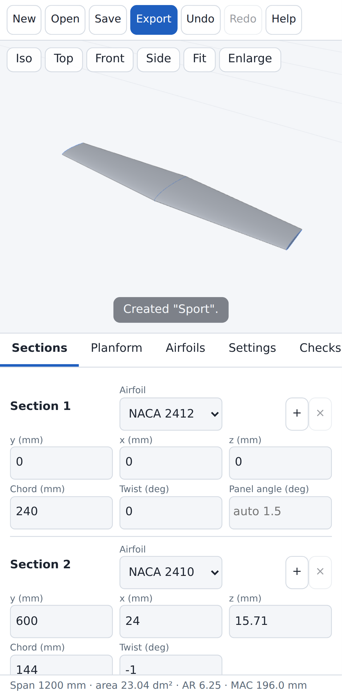
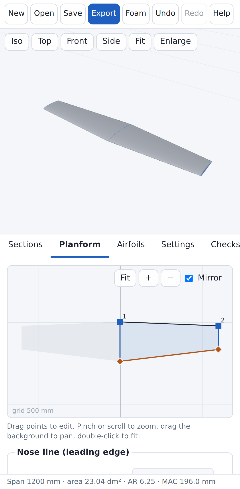
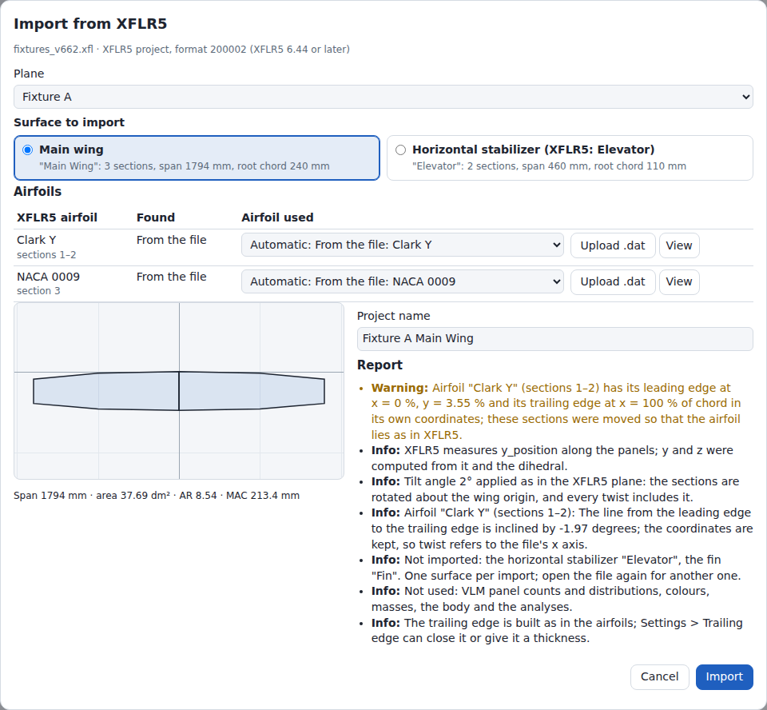
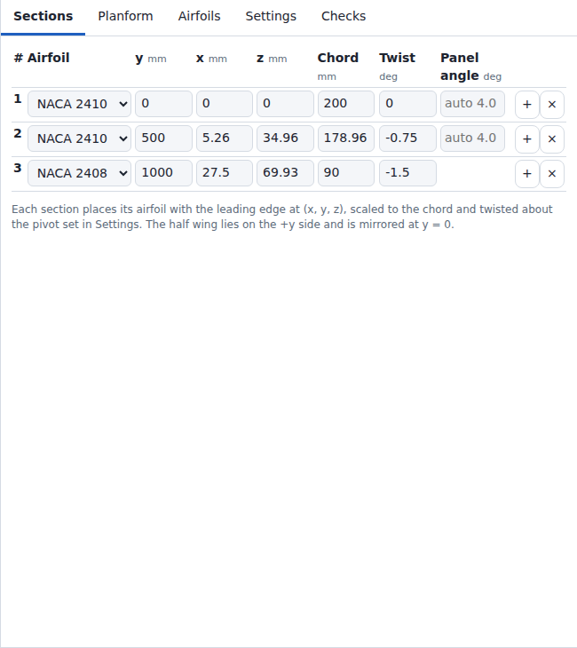
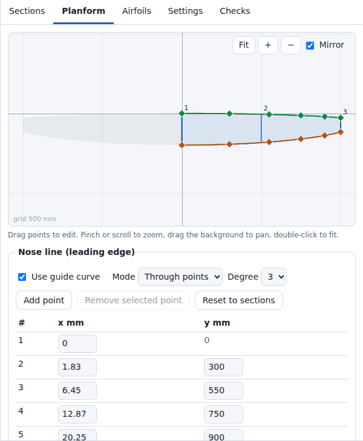
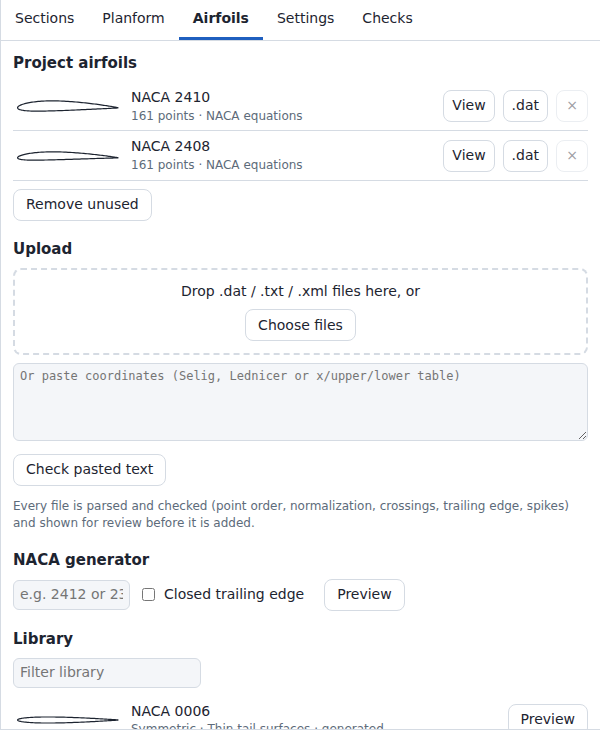
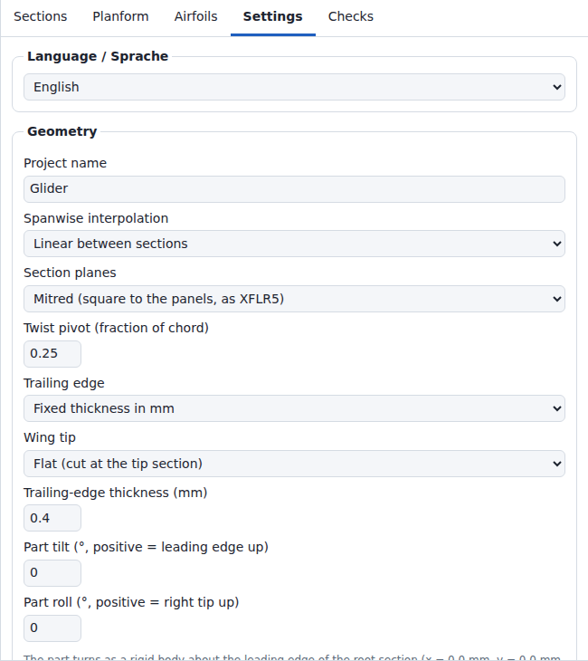
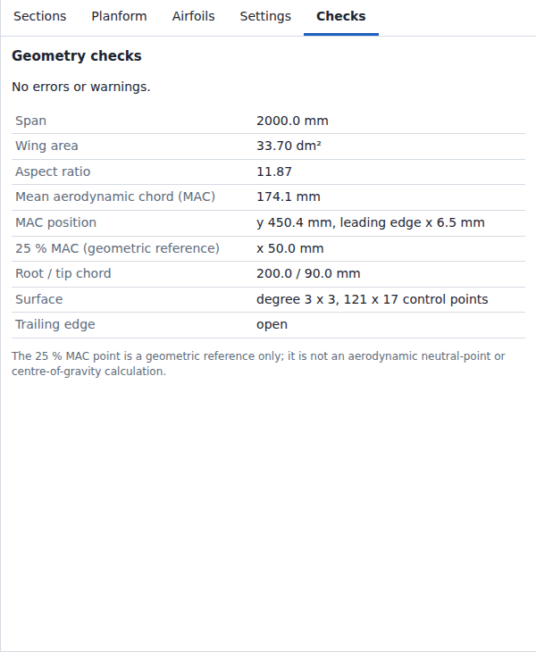
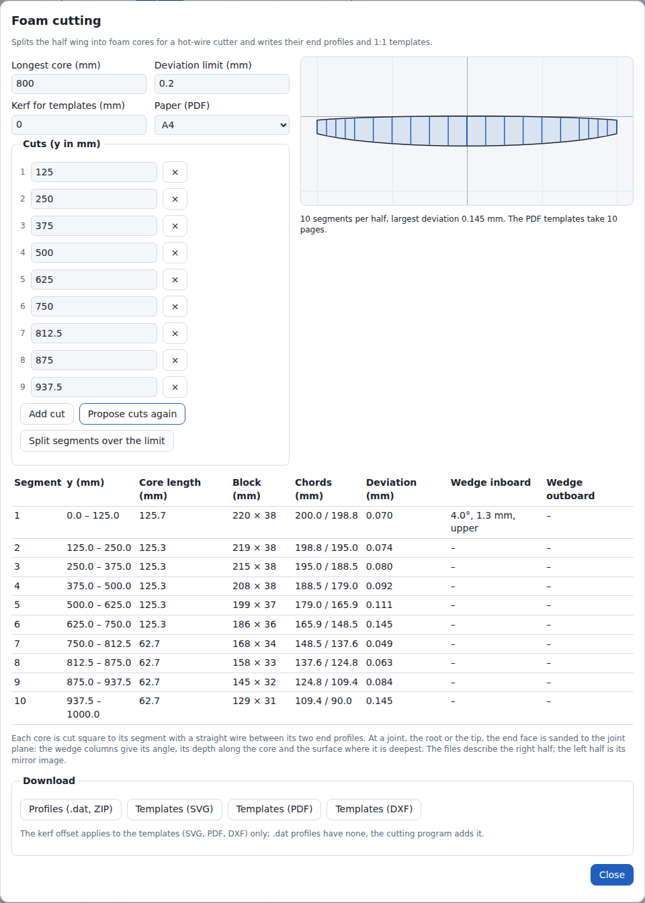

Deutsch: [[Benutzerhandbuch|Benutzerhandbuch]]

# User guide

| Convention | Value |
| --- | --- |
| Units | millimetres (mm), angles in degrees (°) |
| x | chordwise, positive towards the trailing edge |
| y | spanwise, positive towards the right tip |
| z | up |
| Edited geometry | right half wing (y ≥ 0), mirrored at the plane y = 0 |
| Twist sign | positive = leading edge up |
| Panel | span interval between two neighbouring sections |
| Station | one placed airfoil outline at span position y; every section is a station |

The interface speaks English or German (section [Language](#language)). This page names the controls by their English labels. The German user guide ([[Benutzerhandbuch]]) names them by their German labels.

## Screen layout

| Area | Content |
| --- | --- |
| Top bar | **New**, **Open**, **Save**, **Export**, **Foam**, **Undo**, **Redo**, **Help** |
| 3D view | Wing surface, section outlines (blue, selected section red), leading-edge and trailing-edge lines (grey), grid in the plane z = 0 (20 × 20 cells); view buttons |
| Side panel | Tabs **Sections**, **Planform**, **Airfoils**, **Settings**, **Checks**. Right of the 3D view, 360 to 650 px wide; the 3D view takes the rest of the width. |
| Status bar | Span, wing area, aspect ratio (AR), mean aerodynamic chord (MAC), warning count (only with 1 or more warnings). With errors: error count and first error message in red text. With autosave off: `Autosave off: use Save` in red text (section [Storage](#storage)). |
| Messages | Short notices (e.g. `Created "Glider".`) at the bottom of the 3D view for 4 s; a notice longer than 66 characters stays 60 ms per character. Error notices on red background. |

| Top bar button | Effect |
| --- | --- |
| **New** | Opens the wizard (section [Wizard](#wizard)). |
| **Open** | Loads a project file in JSON (JavaScript Object Notation) format, file extension `.json`. Opens the import dialog for an XFLR5 or flow5 file (extension `.xfl`, `.fl5` or `.xml`; XML: Extensible Markup Language; section [Import from XFLR5 and flow5](#import-from-xflr5-and-flow5)). The file chooser lists `.json`, `.xfl`, `.xml`, `.wpa` and `.fl5` files. Rejects JSON and XML files above 100 MB unread: `Cannot open <file>: … MB; project files are limited to 100 MB.` A file the browser cannot read (removed drive, revoked permission) shows `Cannot open <file>: the browser could not read the file (NotReadableError).` and keeps the current design. Rejects invalid JSON files and shows up to 3 error messages. Derived NURBS (non-uniform rational B-spline) data in the file is ignored and recomputed. A project file of format version 2 whose tilt angle the XFLR5 import folded into the sections opens with that angle as **Part tilt**; the notice after `Opened <file>.` says so (section [Storage](#storage)). |
| **Save** | Downloads the project JSON. Same file as **Export** > Project JSON. When the derived NURBS data would take the file above 100 MB, the file leaves it out (section [Export](#export)). A failure shows the red notice `Save failed: <reason>.` |
| **Export** | Opens the export dialog (section [Export](#export)). |
| **Foam** | Opens the foam-cutting wizard (section [Foam cutting](#foam-cutting)). |
| **Undo** / **Redo** | Steps through the edit history, kept in memory only: at most 100 steps and at most 64,000,000 characters of serialized project (undo and redo together); a project above 640,000 characters keeps fewer steps, at least 1. **New** and **Open** are undoable. |
| **Help** | App version, workflow, controls, links to this wiki, to the source code and to `LICENSES.txt` (**Licenses of this app and its libraries**: the MIT license of the app and the license texts of three.js and fflate). The link **Documentation (wiki)** opens the start page of this wiki in the English interface and the page Benutzerhandbuch in the German interface. |

### Narrow screens

At a window width of 860 px or less:

- The 3D view sits above the side panel: 42 % of the window height, at least 240 px.
- **Enlarge** appears in the 3D view. It hides the side panel and gives the 3D view the full height; a second tap restores the side panel.
- The section table turns into one card per section (3 columns, label above each value).
- The planform canvas is 260 px high.
- German interface: the status bar takes at most 2 lines (**Checks** shows the whole text). The top bar takes 2 rows at a window width of 637 px or less (measured in Chromium 141: 2 rows at 637 px, 1 row at 638 px).
- At a window width of 460 px or less, the top-bar buttons take 5 px of padding on each side instead of 8 px; at 402 px or less, 3 px with 2 px gaps.
- At a window width of 420 px or less, the 8 top-bar buttons of the English interface stay in 1 row. The row scrolls sideways when it is wider than the window: below 356 px (measured in Chromium 141). The German top bar wraps instead, and the buttons of a project airfoil move below its name.

On touch screens (coarse pointer), buttons and input fields are at least 40 px high.

## Import from XFLR5 and flow5

**Open** reads files of XFLR5 and of flow5 as well as project files. The import takes one surface from one plane of the file and replaces the current project with it: from an XFLR5 file the main wing or the horizontal stabilizer (XFLR5 calls it the elevator), from a flow5 file one of its wings (section [flow5 files](#flow5-files)). It reads files of XFLR5 6.10.01 to 6.62 and of flow5 7.50 to 7.57. Version 6.62 (2026-03-24) is the last release of XFLR5; flow5 is its successor (version 7).

### Files

- **Open** accepts `.xfl` (XFLR5 project), `.fl5` (flow5 project) and `.xml` (XFLR5 or flow5 plane or wing file) besides `.json`. The filter of the file chooser lists `.json`, `.xfl`, `.fl5` and `.xml` files, and `.wpa` files, which Open refuses with the reason (next item but one). Whether the file choosers of Android and iOS list `.xfl` and `.fl5` files with this filter is untested.
- An `.xfl` project holds the planes with airfoil coordinates. An XML file holds the wing geometry in the length unit set in XFLR5 and the airfoil names only. Project formats 200001 (XFLR5 6.10.01 to 6.43) and 200002 (6.44 to 6.62) and XML files of XFLR5 6.11 to 6.62 are read.
- Projects of XFLR5 6.09 and older (`.wpa`) are not read: red notice with the reason. flow5 files: section [flow5 files](#flow5-files).
- A file that cannot be imported gives the red notice `Cannot open <file>: <reason>`, e.g. `The file is damaged or cut off at byte 902 (in a wing).` The current design stays and the undo history gets no step.
- A `.xfl` file damaged after its planes still gives its planes. The airfoils are then missing, and the report holds the warning `The airfoils could not be read. The file is damaged or cut off at byte … (in the list of airfoils). Pick or upload them.`
- How **Open** picks the reader (extension, first bytes, text), the reasons for refusal and the limits (`.xfl` up to 2,000 MB, other files 100 MB): [[File Formats|File-Formats]], section XFLR5 import.

### Dialog

The dialog is modal. It opens at once. **Import** stays off while the app checks the airfoils of the wing. The report shows `Checking the airfoils …`, for many airfoils `Checking the airfoils … 236 of 1,000`. The checks run in slices of 50 ms, so **Cancel**, Escape and scrolling work meanwhile. Until they end, the airfoil table, the planform preview and the line below it are empty, and so is the project name unless one was typed. A change of plane or surface checks the airfoils of the new wing in the same way, and nothing of the previous wing stays; checks that end within 50 ms, such as those of airfoils checked before, show no progress line and empty nothing.

| Element | Content and effect |
| --- | --- |
| Title and source line | Title **Import from XFLR5**, or **Import from flow5** for a flow5 file. The line below gives the file name and the kind of file: `XFLR5 project, format 200002 (XFLR5 6.44 or later)`, `XFLR5 project, format 200001 (XFLR5 6.10 to 6.43)`, `XFLR5 plane file (XML), lengths in millimetres`, `XFLR5 wing file (XML), lengths in inches`. Length units: millimetres, centimetres, decimetres, metres, inches, feet. Another unit reads `lengths in units of 25 mm`. |
| **Plane** | Only when the file holds more than one plane. Lists the plane names (`Plane 2` for a plane without a name). The first plane is preselected. A change of plane keeps the chosen surface when the new plane has it, otherwise the preselection of that plane (the main wing, or the stabilizer when it is the only surface). |
| **Surface to import** | Two cards with radio buttons: **Main wing** and **Horizontal stabilizer (XFLR5: Elevator)**. A card shows the XFLR5 name of the wing, the number of sections, the span (2 × y of the tip section, in mm) and the root chord (mm): `"Main Wing": 3 sections, span 1794 mm, root chord 240 mm`. A surface that the plane does not have is disabled and gives its reason: `This plane has no elevator.` In a wing file the reason is `The wing in this file is a horizontal stabilizer (type ELEVATOR).` (main wing card) or `The wing in this file is not a horizontal stabilizer (type ELEVATOR).` Preselected: the main wing, or the stabilizer when it is the only surface. The fin and the second wing (biplane) are never offered. |
| **Airfoils** | The airfoil table (section [Airfoil table](#airfoil-table)). |
| Planform preview | Both halves of the wing. While an airfoil is missing, it draws the straight panels between the sections; otherwise the outline of the built wing. Below it: `Span … mm · area … dm² · AR … · MAC … mm` (AR and MAC as in section [Screen layout](#screen-layout)), when the wing builds. The preview fits after every choice. A double-click fits it, a drag pans, Ctrl+wheel zooms. A wheel turn without Ctrl scrolls the dialog. |
| **Project name** | Default: plane name and wing name, e.g. `Fixture A Main Wing`. A wing file has no plane name. Without any name: `Imported wing` (German interface: `Importierter Flügel`). At most 10,000 characters. The field follows the plane and the surface until a name is typed. An emptied field follows them again: the next choice fills in the default name, and **Import** with an empty field uses it. |
| **Report** | Every value that the import changes, converts or leaves out (section [Report](#report)). |
| **Cancel** | Closes the dialog. Nothing changes. |
| **Import** | Imports the surface as shown. Disabled while the report holds an error. The label is `Import` when every airfoil name has a usable airfoil, else `Import (1 airfoil missing)` or `Import (2 airfoils missing)`: the number of airfoil names without a usable airfoil. |

- Keyboard focus starts on **Plane**, or on the checked surface when the file holds one plane, not in **Project name**. Enter on a surface does not import. Enter in **Project name** imports while **Import** is on. Escape cancels.
- Every choice recomputes the wing: the airfoil table, the preview, the name, the report and **Import** follow it.
- A wing beyond the size warnings of section [Project size](#project-size) is not built in the dialog. The preview draws straight panels, and the report holds the `Large project` warning.

### Airfoil table

The table has one row per distinct airfoil name of the right side of the chosen wing, in the order of the sections.

| Column | Content |
| --- | --- |
| **XFLR5 airfoil** (**flow5 airfoil**) | The name as written in the file. It is matched with its leading, trailing and doubled spaces; the browser does not show these spaces. An empty name reads `(no name)`. Below it the sections that use it: `section 3` or `sections 1–2, 5` (1 = root). |
| **Found** | The source that the app found for the name (table below), or after a choice **Picked** or **Not usable** (red: the chosen airfoil fails the checks). |
| **Airfoil used** | A list. The first entry is the automatic choice, `Automatic: From the file: Clark Y`, or `Pick an airfoil` when nothing was found. Then follow the NACA (National Advisory Committee for Aeronautics) generator entries of the names in the table, the airfoils of the file, the uploaded files, the airfoils of the current project, the library airfoils and the NACA generator presets of section [Library](#library). A name that starts with a NACA designation, such as `NACA0014_Flap`, is not matched automatically; its list offers `NACA generator: NACA 0014` first. Above 20,000 entries (rows × airfoils), a list holds only its chosen entry until it is focused or pressed. |
| **Upload .dat** | Opens a file chooser (section below). |
| **View** | Opens the preview of the airfoil in use: name and attribution are read-only, the only button is **Close**. Disabled while no airfoil was found or picked for the row. With **Not usable**, the preview shows the picked file with its error; a refused file has no points. |

The column of the two buttons has the header **Actions**, visible to screen readers only.

The automatic choice is the first source in this order whose airfoil passes the checks:

| Order | **Found** | Source |
| --- | --- | --- |
| 1 | From the file | The airfoil of the `.xfl` file with exactly this name (a later airfoil of the same name replaces an earlier one). An empty name finds none. XML files hold no airfoils. |
| 2 | Uploaded file | A file uploaded in this dialog whose name line equals the name, or whose file name without extension does. Equal, then equal without the spaces at both ends. |
| 3 | Current project | An airfoil of the current project with this name (equal, then without the spaces at both ends). |
| 4 | Library | A library airfoil with this name (equal, then without the spaces at both ends). |
| 5 | NACA equations | The name is a NACA designation of the generator, e.g. `NACA 0009`, `NACA0009`, `0009` (valid codes: section [NACA generator](#naca-generator)). |
| 6 | Similar name | A name that equals the name of an uploaded, current-project or library airfoil once upper and lower case, spaces, `-` and `_` are ignored. The cell shows the warning colour and the report holds a warning. |
| – | Missing | No source passes. The cell is red and **Import** is off. |

- The checks are those of the preview in the Airfoils tab (section [Upload](#upload)), plus a test that the NURBS curve through the points neither crosses itself nor runs back in x. A source that fails is passed over. When no source passes, the error names the first one that failed and its problem.
- An airfoil of an `.xfl` file is its base shape without flap deflection. The report names a flap of the airfoil (section [Report](#report)).
- Above 200 airfoil names the table shows 200 rows, the rows without a usable airfoil and the picked rows first. Below it: `… more airfoil names are not listed; uploaded .dat files are matched to them by name.` Above 10,000 names, or when the airfoils of the file for the names without a pick hold more than 1,000,000 points, no name is resolved and the report holds the error `The airfoils of this wing exceed the limits of a project (10,000 airfoils, 1,000,000 points together).` Above 10,000 names the table is also empty.

**Upload .dat**:

- The file chooser takes the file types of the Airfoils upload (`.dat`, `.txt`, `.cor`, `.xml`, `.htm`, `.html`, `.csv`). A file above 20 MB is refused as in section [Upload](#upload).
- The file is read and checked as in the Airfoils tab. It becomes the choice of its row. The other rows find it by name (table above). It enters the project only when a section uses it.
- An unusable file shows **Not usable** in its row when a row uses it, otherwise an info line in the report.
- Each uploaded file stays in the list of every row as `Uploaded: <file>` until the dialog closes.
- **Upload .dat files…** above the table takes several files at once. Each row then finds its file by name (order 2 of the table above); no row picks one. The hint beside the button: `Each airfoil name takes the file whose airfoil or file name matches it.` The screen-reader line: `2 files uploaded; 2 airfoil names use them.`
- A status line, visible to screen readers only, announces the result: `test12.dat is used for "TEST 12".` or `test12.dat is not usable: <reason>`. Screen readers are untested.

### Airfoil position

XFLR5 draws the coordinates of an airfoil as they are: the x axis of the file lies on the chord line of the section. Wingdesigner puts the leading edge of an airfoil at the section point and scales the airfoil to a chord of 1. The import compensates when the coordinates that XFLR5 used are known:

| Airfoil | Sections |
| --- | --- |
| Airfoil of the `.xfl` file, uploaded `.dat` file, NACA section of the generator, airfoil of the current project generated from the NACA equations (sections of the NACA generator or the NACA presets of the **Airfoils** tab, of the wizard and of the sample wing; it gets the frame of the generated section of its NACA code) | Moved and scaled so that every airfoil point lies where XFLR5 draws it. A cambered NACA section is the one exception: the generator adds the thickness across the mean line, XFLR5 adds it vertically, so the shapes differ by 0.28 mm (NACA 2412) to 1.41 mm (NACA 23018) at 250 mm chord near the leading edge. |
| Other airfoil of the current project, library airfoil | Keep the values of the file: their coordinates in XFLR5 are unknown. A library airfoil with an inclined chord line (Clark Y 2.00°, USA 35B 1.57°) gets a warning: if XFLR5 used a copy with a level chord line, as the UIUC file `clarky.dat`, its sections sit that angle more nose up than in XFLR5. Upload the `.dat` file that XFLR5 used. |

- Example: `fixtures_v662.xfl`, plane Fixture A. The Clark Y of the file has its leading edge 3.55 % of the chord above the x axis. The root section (chord 240 mm) moves 8.53 mm along its normal. The Sections table then differs from the wing table of XFLR5 by this offset.
- Every offset applies, however small. The leading edge is the point of least x on the fitted curve, which can reach ahead of the nose point of the file: 0.0016 % of the chord for the Clark Y of the example, 0.003 to 0.1 % for cambered NACA sections. The sections move by that as well.
- The report names each airfoil that moves sections by more than 0.1 % of the chord (0.25 mm at 250 mm chord): info, and a warning above 2 % of the chord. Smaller moves apply without a report line.
- A library airfoil whose leading edge lies, in its own coordinates, more than 2 % of the chord from 0 in x or y, or whose chord differs from 1 by more than 2 %, gets an info line: bundled Clark Y 3.55 %, USA 35B 2.87 %. So does an airfoil of the current project taken from the library. Uploading the `.dat` file that XFLR5 used places the sections as XFLR5 does.
- An airfoil of the current project from an XFLR5 import or an upload is stored scaled to a chord of 1; its own coordinates are lost. It gets an info line: `Airfoil "Clark Y" (sections 1–2) of the current project is stored scaled to unit chord, with its leading edge at (0, 0), so these sections keep the table values. …` Example: the XML file of a plane opened while the project of its `.xfl` import is open.
- Coordinates that are not in chord units (x or y of the leading edge more than 10 % of the chord from 0, a chord below 0.5 or above 2, or a file read as percent of chord with a chord outside 98 to 102; e.g. a file in millimetres): an airfoil of an `.xfl` file fails the check (`The coordinates are not in chord units (leading edge at x = …, y = …; trailing edge at x = …).`), and the other sources of the table in section [Airfoil table](#airfoil-table) are tried. A source that passes is used, with the warning `Airfoil "<name>" from the file fails the check: … "<match>" is used instead.` Without one the row is missing: `Airfoil "<name>" (…) from the file fails the check: The coordinates are not in chord units (…). Upload a .dat file or pick an airfoil.` An uploaded file is used without a move, scaled to a chord of 1, with a warning.

### Report

The report lists every value that the import changes, converts or leaves out. Errors come first, then warnings, then info. Each line starts with its severity (**Error**, **Warning**, **Info**). Lines about sections name them by number (`section 3`, `sections 1–2, 5`; 1 = root).

- Lines of one kind about sections or panels show at most 5; one more line gives the count of the others (`Further sections moved apart: 3.`). The report shows at most 200 lines (`Further report lines not shown: 12.`).
- An error blocks **Import**. Warnings and info do not.
- Errors and warnings of the build of the wing (as in the **Checks** tab) appear as warnings: `The wing does not build yet: …`. They do not block **Import**, as with **Open**.

| Severity | Lines | Example |
| --- | --- | --- |
| Error | An airfoil name without a usable airfoil. A wing that cannot be mapped: fewer than 2 sections, `y_position` decreasing, chord 0 or below, a value that is no number, values beyond the limits of a project. More airfoils than a project holds. | `Airfoil "E423" (sections 1–2) is missing: upload a .dat file or pick an airfoil.` |
| Warning | A warning of the airfoil checks, once per airfoil in use. An airfoil found by a similar name. An airfoil that moves its sections by more than 2 % of the chord. A flap of an airfoil not at 0° (imported undeflected). A library airfoil with an inclined chord line. A panel with more than 10° dihedral in a part imported with **Vertical** section planes. Sections at one y, moved apart. A chord raised to 1 mm. Different airfoils left and right. An airfoil of the file that fails the check when another source is used. Airfoils of an `.xfl` that could not be read. Build warnings of the wing. Warnings of the XML reader. | `Airfoil "Clark Y" (sections 1–2) has its leading edge at x = 0 %, y = 3.55 % and its trailing edge at x = 100 % of chord in its own coordinates; these sections were moved so that the airfoil lies as in XFLR5.` |
| Info | What is converted or applied: dihedral, tilt angle, position, a root gap, whole turns of twist, length units, the section planes. An airfoil that moves its sections by at most 2 % of the chord. A flap at 0°. A library airfoil whose coordinates lie off (0, 0), also as an airfoil of the current project. An airfoil of the current project from an XFLR5 import or an upload. An unusable uploaded file that no row has picked. An inclined chord line of any other airfoil. Surfaces that are not imported. Data that is not used. The trailing edge. | `Tilt angle 2° applied as in the XFLR5 plane: the part turns as a rigid body about the wing origin (Settings > Part tilt).` |

- With two sections at one y XFLR5 changes the airfoil abruptly. Wingdesigner needs strictly increasing y: the inner section moves min(0.5 mm, ¼ of the inner panel) inwards, with the warning `Sections 3 and 4 share y = 250 mm; section 3 was moved 0.5 mm inwards.` With **Mitred** section planes both sections share the bisector plane of the panels around them, as in XFLR5.
- A part imported with **Vertical** section planes (one whose mitred planes would fold the surface or stretch an airfoil more than 2 times) gets for a panel with a dihedral above 10° `The panel from section 2 to 3 has 35° dihedral: the vertical sections are 82 % as thick across the panel as in XFLR5.` XFLR5 builds the sections in mitred planes, Wingdesigner then vertically: the thickness across the panel is cos(dihedral) of XFLR5's. With **Mitred** section planes the thickness is XFLR5's, and the warning does not appear.
- Every line with its condition, and the mapping of the values: [[File Formats|File-Formats]], section XFLR5 import.
- The last info lines of every report: `Not used: VLM panel counts and distributions, colours, masses, the body and the analyses.` (VLM: vortex lattice method, one of the analysis methods of XFLR5) and `The trailing edge is built as in the airfoils; Settings > Trailing edge can close it or give it a thickness.`

### Import, Cancel and Undo

**Import** replaces the current project, as **New** does: name, airfoils, sections, guide curves and settings. It is one undo step.

| Item | Result |
| --- | --- |
| Sections | One per XFLR5 section, root to tip; of two identical sections at one y only the outer one (ids `s1`, `s2`, … in the project file). Values rounded to 4 decimals (0.0001 mm, 0.0001°). With **Mitred** section planes, a section whose airfoil moves it (a cambered NACA section, an airfoil off (0, 0)) differently from the next section gets XFLR5's dihedral as its **Panel angle**, so the planes stay XFLR5's. |
| Airfoils | Every airfoil in use. Equal airfoils of several rows merge. An airfoil of an `.xfl` project shows `XFLR5: <file name>` under its name in the Airfoils tab, or its attribution, and the project file keeps a note with the origin, e.g. `Airfoil "Clark Y" from XFLR5 plane "Fixture A"; base shape without flap deflection.` Uploaded, library, NACA and current-project airfoils keep their own source. |
| **Twist pivot (fraction of chord)** | 0.25, the point about which XFLR5 twists a section |
| **Spanwise interpolation** | **Straight panels (straight lines between sections, as XFLR5)** |
| **Section planes** | **Mitred (square to the panels, as XFLR5)**, also for a tilted part. **Vertical (y = const)** where mitred planes would fold the surface or stretch an airfoil more than 2 times. The report says which and why: `Section planes: …` ([[File Formats]], section XFLR5 import, step 6). |
| **Part tilt (°, positive = leading edge up)** | the tilt angle of the wing in the XFLR5 plane, reduced by whole turns to −180 to 180°; the part turns about the wing origin, as XFLR5 turns it. The sections hold the values of the untilted part, moved by the position of the wing in the plane. **Part roll (°, positive = right tip up)**: 0. |
| **Trailing edge** | **As in the airfoil files** |
| **Wing tip** | **Flat (cut at the tip section)** |
| **Show mirrored half (y < 0)** | on |
| Guide curves | off, points at the section edges |
| Other settings | Defaults: 60 **Chordwise stations per surface**, 8 **Spanwise stations per panel with guides, smooth mode or mitred linear panels**, **Centripetal (recommended)** |

- The **Sections** tab opens, and the 3D view and the planform editor fit the new wing. Autosave stores the project (section [Storage](#storage)).
- **Undo** restores the previous project, **Redo** the import.
- The notice reads `Imported the main wing "Main Wing" of "Fixture A" from fixtures_v662.xfl: 3 sections, 2 airfoils.` For the stabilizer: `Imported the horizontal stabilizer "Elevator" of …`. A plane without a name gives `Imported the main wing "Main Wing" from <file>: …`. The first warning of the report follows in the same notice, and for more warnings `(2 more warnings in the import report.)`. The warnings of the XML reader stay in the report. The notice is longer than 66 characters, so it stays 60 ms per character (section [Screen layout](#screen-layout), row Messages).
- **Cancel** and Escape change nothing and add no undo step.

### flow5 files

- **Open** reads flow5 projects (`.fl5`) of project formats 500750 (flow5 7.50 to 7.53) and 500754 (7.54 to 7.57), and flow5 plane and wing files (`.xml`, root element `xflplane` or `xflwing`). Other formats are refused with the reason: `The file is a flow5 project of format 500006, written by flow5 7.26 or older: open it in a current flow5 and save it, or export the plane as XML.`
- The source line: `flow5 project, format 500754 (flow5 7.54 or later)`, `flow5 plane file (XML), lengths in millimetres`.
- **Plane** lists the planes of the file in its order; flow5 sorts them by name. A plane built from a triangle mesh (STL) has no wing and offers no surface; the report gives the error `Plane "Mesh plane" has no wing to import.` The dialog opens on the first plane with a wing.
- **Surface to import** lists every wing of the plane in file order: **Main wing**, **Horizontal stabilizer (flow5: Elevator)**, **Fin**, **Other wing**, numbered when a type occurs more than once (**Main wing 1**, **Main wing 2**). Every wing can be imported, except a one-sided wing turned about z, which a part placement cannot reproduce: `A one-sided wing turned 3° about z (Ry_angle): a part turns about x and y only.`
- A fin (a one-sided wing) is imported as the half that flow5 builds: the left half of the part, with **Part roll** 90° for a fin at −90°. Its mirrored right half lies on it; **Show mirrored half** off and the export option **Right half only** give one half.
- The wing's angles become the rigid placement of the part (**Settings** > **Part tilt** and **Part roll**, about the wing origin): `Ry_angle` the tilt, `Rx_angle` the roll. flow5 rolls both halves of a two-sided wing as one body: for a rolled wing the import sets **Settings** > **Left half** to **Turned with the right half (whole wing, as flow5)**, and the report says so. Both halves of the rolled wings of the test files lie within 0.01 mm of flow5's analysis mesh.
- A `.fl5` project holds the airfoils (**Found**: **From the file**). An XML file names them, or names `.dat` files next to it: flow5 7.54 and later write one `.dat` file per airfoil next to the XML file. Upload them with **Upload .dat files…**; each row takes the file of its name.
- Details: [[File Formats|File-Formats]], section flow5 import.

### Dialog on narrow screens

The dialog is at most as high as the window minus 16 px, and its content scrolls inside it.

- Up to a window width of 860 px, the planform preview lies above the project name and the report (1 column).
- Up to a window width of 800 px, each row of the airfoil table becomes a card without a header row: name, sections and **Found** in the first line, the list of **Airfoil used** over the full width below, then the buttons **Upload .dat** and **View**. The 4 columns need about 800 px.
- The two surface cards sit side by side when the dialog holds two cards of at least 220 px, otherwise one below the other.
- Tested in Chromium with the phone emulation of the Pixel 7 at a window of 360 × 780 px: the dialog and the page have no horizontal scroll, every control lies inside the dialog, **Import** can be tapped after scrolling, and the notice after the import lies inside the 3D view. Not tested on a phone.

### XFLR5 files in the Airfoils upload

The **Airfoils** tab refuses XFLR5 files as airfoils, with the red notice `<file> is an XFLR5 file, not an airfoil. Use Open to import a wing from it.`

- The refusal applies to `.xfl` projects of any size (the first 4 bytes are project format 200001 or 200002) and to any file up to 20 MB whose text contains the element `<explane` (XFLR5 plane and wing XML files). Any other file above 20 MB is refused for its size (section [Upload](#upload)).
- Files chosen with **Choose files** or dropped are checked one by one. A refused file opens no preview; the other files of the same choice still do.
- Pasted text is not checked for this.
- **Upload .dat** in the import dialog refuses the same files. The refused file becomes the choice of its row: the row shows **Not usable**, the report holds the error `Airfoil "<name>" (<sections>): the chosen airfoil fails the check: <file> is an XFLR5 file, not an airfoil. Use Open to import a wing from it.`, and **Import** stays off until the row gets another choice. The status line for screen readers reads the refusal. After another choice the refusal stays as an info line.

## Storage

- After every change the browser stores the project in `localStorage` under the key `wingdesigner.project.v1`. The next visit restores it.
- Only projects that pass the **Open** validation are saved. Otherwise the last valid project stays stored.
- A stored project that fails to load is kept under `wingdesigner.project.v1.rejected`. An error notice shows, and the wizard opens as on a first visit. Without room for that copy, the project stays under `wingdesigner.project.v1` and autosave stays off for the session; the status bar shows `Autosave off: use Save` from the start.
- The active tab is stored under `wingdesigner.tab`.
- The language is stored under `wingdesigner.language` (`en` or `de`) as soon as the user chooses one in **Settings** (section [Language](#language)).
- Without a stored project (first visit), the wizard opens. Nothing is stored while this first-run wizard is open; a reload shows the wizard again.
- With blocked storage (private window), the project exists only in the open browser tab. Use **Save** to keep it.
- When the browser refuses the project (browsers keep about 5,000,000 characters per site), the red notice `Autosave is off: browser storage refused the project (… characters; browsers keep about 5,000,000 per site). Use Save to keep it.` shows once. The status bar shows `Autosave off: use Save` until an autosave succeeds again; then the notice `Autosave works again.` shows.
- While autosave fails, the key `wingdesigner.project.v1.stale` holds the time of the first failure. The next visit restores the last stored project and shows `This is the project as last saved; autosave stopped at … because browser storage was full, and later edits were not saved.` When the restored project brings the `Large project` warning, both texts show in one notice in the error colour.
- The undo history is not stored.
- A stored project of format version 2 whose tilt angle the XFLR5 import folded into the sections is restored with that angle as **Part tilt** and the notice `The tilt angle of 3° that the XFLR5 import folded into the sections is a rigid tilt of the whole part (Settings > Part tilt); the sections hold the values of the untilted part.` **Open** of such a file adds the same text after `Opened <file>.`. With **Mitred** section planes the notice adds `With mitred section planes the shape changes: the folded tilt was exact for vertical planes only, the rigid tilt places the part as XFLR5 does.`
- The fold stays when a guide curve is on or edited: `The tilt angle of 3° of the XFLR5 import stays folded into the sections: a guide curve is on or edited, and guide curves hold x only.` It also stays when a twist would lie beyond ±360° without it: `The tilt angle of 3° of the XFLR5 import stays folded into the sections: without it a twist would lie beyond ±360°.` It also stays when a section would lie beyond ±1,000,000 mm without it (folded sections near the coordinate limit): `The tilt angle of 45° of the XFLR5 import stays folded into the sections: without it a section would lie beyond ±1000000 mm.` An upgraded restore is saved at once; the next start shows no note. Such a project keeps the warning of section [Checks](#checks) with **Mitred** section planes. Rules: [[File Formats|File-Formats]], section Project JSON, Upgrade of version 2 files.

## Language

The interface speaks English or German.

| Item | Behaviour |
| --- | --- |
| List | **Language / Sprache** in the first group of the **Settings** tab, with the values **English** and **Deutsch**. The group and the list carry the same label in both languages, so the list can be found in either. |
| Start | The choice stored in the browser. Without a stored choice: German when the first language of the browser is German, otherwise English. |
| German browser | The first entry of the browser language list is `de` or starts with `de-`, in any letter case (`de`, `de-AT`, `DE-ch`). Later entries do not count: the list `en-US`, `de` gives English. |
| Stored value | Only `en` and `de` count. Any other stored value is ignored, and the browser language decides. |
| Storage | Key `wingdesigner.language` in `localStorage`, written when the user chooses. With blocked storage the choice lasts until the page closes. Project files, autosave and exports carry no language setting. |
| First visit | The wizard opens in the start language. It is modal, so the list is reachable after **Create design** or **Skip (open sample wing)**. |
| Page | The `lang` attribute of the page is `en` or `de`. The page title `Wingdesigner` does not change. The `<noscript>` line, shown when JavaScript is off, names both languages. |

### Switching

A choice applies at once, without reloading the page.

Changes at once:

- the top bar, the tabs, the view buttons, the status bar, every tooltip and accessible label (`aria-label`) and the `description` of the page;
- the content of every tab, **Checks** among them: build errors, build warnings, airfoil messages and the `Large project` warning;
- the numbers (section [Numbers](#numbers));
- the wizard, **Export**, **Help** and airfoil preview dialogs the next time they open. Each is modal, so the list cannot be used while one is open.

Stays:

- the project, the selected section, the undo and redo history and the active tab;
- the keyboard shortcuts. The tooltips name the keys in the current language: `Undo (Ctrl+Z)`, in German `Rückgängig (Strg+Z)`.

The build after the switch:

- With an error or a warning other than the `Large project` warning in **Checks**, the wing is built again, because these messages come out of the build. The build takes as long as after a change (section [Project size](#project-size)).
- Otherwise the wing stays, and the `Large project` warning is written again.

Notices:

- A notice without red background that is showing disappears at the switch, and its text with it.
- An error notice (red background) stays visible in the language it was written in until its display time ends: 4 s, or 60 ms per character above 66 characters. At that time its text is removed if the language differs from the one it was written in.

### Numbers

| Number | English | German |
| --- | --- | --- |
| Decimal separator | point: `23.04 dm²` | comma: `23,04 dm²` |
| Counts, limits and computed values with 4 or more digits | grouped with a comma in some texts (`20,000`), not grouped in others (`1200 mm`) | grouped with a dot: `20.000`, `1.200 mm` |
| Values echoed from a field (positions, angles, parameters) | `y = 1000 mm`, `0.25` | not grouped: `y = 1000 mm`, `0,25` |

Example, status bar of the **Sport** preset:

| Language | Status bar |
| --- | --- |
| English | `Span 1200 mm · area 23.04 dm² · AR 6.25 · MAC 196.0 mm` |
| German | `Spannweite 1.200 mm · Fläche 23,04 dm² · AR 6,25 · MAC 196,0 mm` |

Number fields:

- A number field shows the shortest decimal that reads back to the stored value, without digit groups: `0.6`, `1500` in English, `0,6`, `1500` in German.
- A typed number is read in the current language, by these rules in this order:
  1. Spaces are dropped, also no-break and narrow no-break spaces: `1 500` is 1500.
  2. A leading `+` or `-` and an exponent are accepted: `-6,5`, `1e-7`, `1,5E3`.
  3. A number in the grouped form of the current language drops its groups: `1,500` and `1,234,567.5` in English, `1.500` and `1.234.567,5` in German. Groups have 3 digits; the first group has 1 to 3 digits and does not start with `0`.
  4. A number with both a point and a comma takes the last one as the decimal separator and the other one as group separator: `1.234,5` and `1,234.5` are 1234.5 in both languages. The decimal separator occurs once, and every group separator stands between digits.
  5. A single point or comma is the decimal separator in both languages: `0,7` is 0.7 also in English, `12.5` is 12.5 also in German, `0.500` is 0.5 in German.
  6. Any other text is no number, e.g. `1.2.3` (a point several times outside the grouped form), `12 mm`, `0x10`, `1e999` (beyond the range of a 64-bit floating-point number).

| Typed | English | German |
| --- | --- | --- |
| `0.7` | 0.7 | 0.7 |
| `0,7` | 0.7 | 0.7 |
| `1,500` | 1500 | 1.5 |
| `1.500` | 1.5 | 1500 |
| `1.234,5` | 1234.5 | 1234.5 |
| `1.2.3` | no number | no number |

- In a panel, a text that is no number and an empty field show the stored value again when the field applies its value (section [Controls](#controls)). In the wizard, they disable **Create design** (section [Wizard](#wizard)).
- Fields whose lower limit is 0 or more carry `inputmode="decimal"`, which asks the on-screen keyboard of a phone or tablet for a decimal keypad. The other fields keep the full keyboard: x, z and **Twist** in **Sections**, the guide point fields, and sweep, dihedral and tip twist in the wizard. They take negative values, and the decimal keypad of iOS has no minus key. The keypads themselves are not tested on a phone.
- For assistive technology a number field has the role `spinbutton`: `aria-valuenow` holds the typed number (absent while the text is no number), `aria-valuemin` and `aria-valuemax` the limits of the field.

### What stays as it is

- File contents: STEP (Standard for the Exchange of Product model data), STL (stereolithography), 3MF (3D Manufacturing Format), project JSON and `.dat` files. Numbers in them always have a decimal point. The 3MF object names `Wing right`, `Wing left` and `Wing` do not change.
- Names and attributions: the project name, airfoil names, every text the user types, attribution texts, license identifiers, source addresses, the names of the external sources, `LICENSES.txt` and `NOTICE.md`.
- Texts that the browser writes: its file dialogs, the name of a browser error such as `NotReadableError`, and the reason the browser gives when it runs out of memory or reaches a size limit of its own (after `Save failed:` or `Export failed:`).
- The reason inside `The NURBS interpolation through the points failed (…).` and the text after `Internal error:` come from the geometry code and stay English.
- The descriptions of the library entries and of the external sources are translated.

Names that the app writes itself are made in the language that is set when the name is created and stored as text. A later switch does not rename them:

| Name | English | German |
| --- | --- | --- |
| Project name from the wizard | preset name, e.g. `Sport` | preset name, e.g. `Sportmodell` |
| Project name from the wizard, name field empty | ` mm wing` | `Flügel  mm` |
| Sample wing (**Skip (open sample wing)**) | `Sport wing 1500` | `Sportflügel 1500` |
| Project file whose `name` is not a string | `Imported wing` | `Importierter Flügel` |
| Pasted coordinates without a name line | `pasted` | `Eingefügtes Profil` |

### File names

File names of downloads (**Save**, **Export**, airfoil `.dat`) write German umlauts out, in both languages: ä → ae, ö → oe, ü → ue, Ä → Ae, Ö → Oe, Ü → Ue, ß → ss. Other accents are dropped (é → e, ñ → n). `Sportflügel 1500` gives `Sportfluegel_1500.step`. The full rule: [[File Formats|File-Formats]], section Export file names.

## Controls

| Action | Mouse | Touch |
| --- | --- | --- |
| Rotate 3D view | left drag | one-finger drag |
| Zoom 3D view | wheel or middle drag | pinch |
| Pan 3D view | right drag | two-finger drag |
| Move a point in the planform editor | drag the point | drag the point |
| Pan planform editor, airfoil preview or wizard preview | drag the background | drag the background |
| Zoom planform editor, airfoil preview or wizard preview | wheel (centred on the cursor) | pinch |
| Fit planform editor | double-click, or **Fit** | **Fit** |
| Fit airfoil preview | automatic on open; double-click | automatic on open; no fit button |
| Fit wizard preview | automatic after each input change; double-click | automatic after each input change; no fit button |
| Undo | Ctrl+Z (macOS: Cmd+Z) | **Undo** |
| Redo | Ctrl+Shift+Z or Ctrl+Y (macOS: Cmd) | **Redo** |

- Pick radius for points in the planform editor: 9 px with mouse or pen, 18 px with touch. Within the radius the nearest point is picked.
- Keyboard shortcuts are inactive while the focus is in an input field, text area or drop-down list, or while a dialog is open.
- Keyboard focus stays on number fields, the airfoil lists of the **Sections** table, the lists of **Settings** and of the guide curves (**Mode**, **Degree**), the checkboxes of **Settings** and **Use guide curve**, the project name field and the row buttons **+** and **×** of the **Sections** table when the panel renders again after a change. Text and number fields also select their text again.
- Number fields apply a value on Enter, when the field loses focus, and on each arrow step. An empty field or a text that is no number (section [Numbers](#numbers)) reverts to the previous value.
- The Up and Down arrow keys step a number field from the typed number by the step of the field, e.g. 5 mm for y and 0.1° for twist in the **Sections** table, and stop at the limits of the field.
- A number field shows the shortest decimal that reads back to the stored value, e.g. `600.0000002` (German: `600,0000002`); a value is never rounded for display.
- One drag is one undo step, however long it pauses: its updates merge until the pointer is released.
- **Undo** or **Redo** during a drag ends the drag; further pointer movement until release moves nothing. **Redo** restores an undone drag or point.
- An action that changes nothing adds no undo step and keeps the redo steps, e.g. **Remove unused** while every airfoil is in use, **Add to project** of an airfoil the project already holds, or typing the value a field already has.

| 3D view button | Camera |
| --- | --- |
| **Iso** | From ahead of the leading edge, left and above |
| **Top** | From above (+z) |
| **Front** | From ahead of the leading edge (−x) |
| **Side** | From the left (−y) |
| **Fit** | Same direction as **Iso** |
| **Enlarge** | Only at widths ≤ 860 px; toggles the side panel |

**Iso**, **Top**, **Front**, **Side** and **Fit** also frame the whole wing.

## Wizard

The wizard builds a complete project from 12 inputs (table below). It generates sections, airfoils, the trailing-edge setting, the wing tip setting and, for an elliptic planform, both guide curves. With the planform **Panels (table)**, a panel table replaces 4 of the inputs (see Panels below). All values stay editable afterwards.

- Opens on the first visit (title "Start a new wing design") and with **New** (title "New wing design").
- Preselected preset: **Sport**. A click on a preset card loads its values.
- Airfoils are NACA 4-digit or 5-digit sections. Valid codes: section [NACA generator](#naca-generator).
- The number fields read a typed number as in section [Numbers](#numbers) and check it while it is typed. Leaving a field shows the number as read, e.g. `1500` for `1.500` typed in German. The Up and Down arrow keys step as in the panels; in a field that is empty or holds no number they step from the value of the selected preset.

| Field | Range | Effect |
| --- | --- | --- |
| Project name | text | Default: preset name. Empty: ` mm wing`. Both are made in the current language (section [Language](#language)). |
| Span (both halves) | 100 to 20,000 mm | Tip-to-tip span, measured along y. With a dihedral δ each half is span / 2 / cos δ long along its panel: 436 mm for 500 mm span at 55°. |
| Root chord | 10 to 3000 mm | Chord at y = 0 |
| Taper (tip / root chord) | 0.1 to 1.5 | Tip chord divided by root chord. Elliptic planform with flat tip: below 1. Elliptic planform with pointed tip: not used. Hidden with **Panels (table)**. |
| Sweep of the 25 % line | −45 to 60° | Sweep of the quarter-chord line; positive = swept back. Hidden with **Panels (table)**. |
| Dihedral per half | −60 to 60° | Section z = y · tan(dihedral). A V-tail takes the angle of each half, e.g. 55°; an inverted V-tail a negative angle. 60° is the steepest first panel that **Mitred** section planes build: the vertical root plane stretches the airfoil 1 / cos 60° = 2 times (section [Checks](#checks)). Hidden with **Panels (table)**. |
| Tip twist (negative = washout) | −15 to 15° | Twist changes linearly with y from 0° at the root to this value at the tip |
| Number of sections | 2 to 8, integer | Sections evenly spaced from root to tip. Hidden with **Panels (table)**. |
| Planform | **Straight taper**, **Elliptic (guide curves)**, **Panels (table)** | Chord law, see below; Panels: see Panels below |
| Tip | **Flat**, **Pointed (1/200 scale)**, **Elliptic (panels only)** | Flat: the wing ends at the tip section. Pointed: tip section chord = 1/200 of the chord at the previous section, at least 1 mm. Elliptic: the last panel ends in a quarter ellipse; planform **Panels (table)** only. |
| Root airfoil (NACA) | NACA code | Airfoil of every section except the tip |
| Tip airfoil (NACA) | NACA code | Airfoil of the tip section |

Chord laws (η = span fraction, 0 at the root, 1 at the tip; λ = taper; η_prev = span fraction of the section before the tip section):

| Planform | Tip | Chord c(η) | Guide curves |
| --- | --- | --- | --- |
| Straight taper | Flat | c_root · (1 + (λ − 1) · η) | off |
| Straight taper | Pointed | as Flat; tip section: max(c(η_prev) / 200, 1 mm) | off |
| Elliptic | Flat | c_root · √(1 − (1 − λ²) · η²) | nose line and end line on; 11 points each at η_i = sin(π i / 20), i = 0 … 10: 0, 0.156, 0.309, 0.454, 0.588, 0.707, 0.809, 0.891, 0.951, 0.988, 1 (closer together towards the tip) |
| Elliptic | Pointed | c_root · √(1 − η²); tip section: max(c(η_prev) / 200, 1 mm) | nose line and end line on; 11 points each at the same η as Flat; both lines end on the 25 % line |

Generated guide curves use **Through points** and degree 3. End line x: the rounded nose x plus the rounded chord. Largest chord deviation of the guide curves from the elliptic law, **Glider** preset, in % of the root chord: taper 0.1: 0.55 %; 0.2: 0.10 %; 0.3: 0.02 %; 0.45: 0.004 %; **Pointed**: 2.87 %, within the last 0.3 % of the span (1,000,001 span samples).

Generated values:

| Value | Rule |
| --- | --- |
| Leading-edge x | **Straight taper** and **Elliptic**: 0.25 · c_root + y · tan(sweep) − 0.25 · c(η); the quarter-chord points lie on the sweep line. **Panels (table)**: see Panels below. |
| Rounding | 0.01 mm, 0.01° |
| Trailing edge | **Fixed thickness in mm**: 0.2 % of the root chord, at least 0.3 mm |
| Wing tip | **Settings** > **Wing tip** = **Flat** for the tip **Flat**, **Pointed** for the tips **Pointed (1/200 scale)** and **Elliptic (panels only)**; tip profile scale 1 : 200 |

Panels: with **Planform** = **Panels (table)**, a table gives the half span as 1 to 24 panels from root to tip. **Taper (tip / root chord)**, **Sweep of the 25 % line**, **Dihedral per half** and **Number of sections** are then hidden and not used; they keep their values for a switch back to another planform.

| Column | Range | Effect |
| --- | --- | --- |
| Panel | 1 to 24 | Panel number, counted from the root |
| Span share (%) | 0.1 to 10,000 % | Share of the panel in the half span. The shares are scaled so that together they fill the half span: 2 panels of 100 % each take 50 % each. |
| Leading-edge sweep (deg) | −89.9 to 89.9° | Sweep of the leading edge along the panel; positive = swept back |
| Outer chord (% of root) | 0 to 300 % | Chord at the outer end of the panel, in % of **Root chord** |
| Dihedral (deg) | −60 to 60° | Dihedral of the panel |
| × | button | Removes the panel (name "Remove panel n"). Disabled with 1 panel. |

- **Add panel** appends a copy of the last panel. Disabled at 24 panels.
- The note below the table shows the sum of the shares, e.g. "Shares sum to 200.0 %; they are scaled to the half span."
- When **Planform** turns to **Panels (table)** and the design has no panel list yet, the table starts with one panel per interval between the sections of the planform it leaves (**Number of sections** − 1 panels, equal shares). Each panel ends at that section's leading edge with its chord: leading-edge sweep and outer chord unrounded (the table shows up to 6 decimals), dihedral = **Dihedral per half**. A straight planform keeps its sections, and a pointed tip its chord (1/200 of the section before); an elliptic planform becomes the polygon through its sections, without guide curves. **Sport**: 1 panel, 2.29061°, 60 %, 1.5°. **Glider** (3 sections): 2 panels, outer chords 89.477651 % and 45 %. A field that holds no number at the switch (an empty **Taper**, say) takes the value of the selected preset. Presets with panels, and a panel list edited earlier in the dialog, keep their panels.

Sections of the planform **Panels (table)** (b = half span; s_i = share of panel i divided by the sum of the shares):

| Value | Rule |
| --- | --- |
| Root section | Leading edge at x = 0, y = 0, z = 0; chord c_root |
| Section at the outer end of panel i | Δy = s_i · b; y = y_prev + Δy; leading-edge x = x_prev + Δy · tan(leading-edge sweep); z = z_prev + Δy · tan(dihedral); chord = outer chord · c_root |
| Twist | tip twist · y / b |
| Airfoils | Tip airfoil at the tip section; root airfoil at every other section |
| Tip **Pointed (1/200 scale)** | Tip section chord = max(c_prev / 200, 1 mm), c_prev = chord of the section before; the tip section keeps its quarter-chord point. |
| Tip **Elliptic (panels only)** | The last panel ends in a quarter ellipse of 6 sections at t = sin(π k / 12), k = 1 … 6 (t = 1 at k = 6): y = y_in + t · Δy; chord c(t) = c_in · √(1 − t²); the quarter-chord points lie on the straight line from the quarter-chord point of the inner section (y_in, x_in, z_in, chord c_in) at the leading-edge sweep of the panel: x = x_in + 0.25 · c_in + t · Δy · tan(leading-edge sweep) − 0.25 · c(t); z = z_in + t · Δy · tan(dihedral). The outer chord of the last panel is not used. The tip section takes max(c_prev / 200, 1 mm) as for **Pointed**. Example: **Sport** as 1 panel with this tip: 7 sections, the section before the tip 62.1 mm, the tip 1 mm (the floor). |

The preview shows the planform of both halves. The line below it lists wing area (dm²), aspect ratio, MAC with its span position, and tip chord.

The line turns red, lists the problems, and **Create design** is disabled when:

- a value is outside its range (column Range), or its field is empty or holds no number (section [Numbers](#numbers));
- **Number of sections** is not an integer (not with **Panels (table)**);
- a root or tip airfoil is not a valid NACA code;
- **Elliptic** with **Flat** tip has taper ≥ 1 (`An elliptic planform needs taper < 1.`);
- the tip is **Elliptic (panels only)** and the planform is not **Panels (table)** (`An elliptic tip needs the planform Panels.`);
- the panel list has fewer than 1 or more than 24 panels (`The planform Panels needs 1 to 24 panels.`);
- a panel value is outside its range, e.g. `Panel 2: leading-edge sweep must be between -89.9 and 89.9.` The message names `span share`, `leading-edge sweep`, `outer chord` or `dihedral`; span share and outer chord appear as ratios: 0.001 to 100 and 0 to 3;
- a panel spans less than 1 mm of the half span after the shares are scaled (`Panel 1 spans 0.0005 mm of the half span; a panel needs at least 1 mm.`);
- a section ends beyond ±1,000,000 mm in x or z, a pointed or elliptic tip after its move to the quarter-chord point, e.g. a 20,000 mm span with one panel swept 89.9° (`Panel 1 ends at x = 5729572 mm, z = 0 mm, beyond ±1000000 mm.`);
- an elliptic tip begins at less than 1 mm / cos 75° = 3.8637 mm of chord: its last inner section keeps cos 75° = 0.259 of that chord, below the 1 mm minimum; the message rounds the limit up (`Panel 2: the elliptic tip needs at least 3.87 mm of chord where it begins.`);
- the outer chord of a panel is below 1 mm (`Panel 1: the outer chord is below 1 mm.`), at every panel end except the last one with the tip **Pointed (1/200 scale)** or **Elliptic (panels only)**;
- a project built in code (`wizardProject`) has another planform or tip value (`planform must be "straight", "elliptic" or "panels".`, `tip must be "flat", "pointed" or "elliptic".`);
- the wing has a build error (section [Checks](#checks)). Example: preset **Tail surface** with 100 mm span, 8 sections and 55° dihedral per half. The section plane of the vertical root and that of the next section, 7.1 mm further out in y, turn faster than the airfoils allow, so the surface folds. A larger span, fewer sections or less dihedral builds; from 200 mm span, this preset builds with 2 to 8 sections up to 60°.

| Preset | Span mm | Root chord mm | Taper | Sweep ° | Dihedral ° | Tip twist ° | Sections | Planform | Tip | Root / tip airfoil |
| --- | --- | --- | --- | --- | --- | --- | --- | --- | --- | --- |
| Trainer | 1400 | 250 | 1 | 0 | 3 | 0 | 2 | straight | flat | 2412 / 2412 |
| Sport | 1200 | 240 | 0.6 | 0 | 1.5 | −1 | 2 | straight | flat | 2412 / 2410 |
| Glider | 2000 | 200 | 0.45 | 0 | 4 | −1.5 | 3 | elliptic | flat | 2410 / 2408 |
| Sailplane | 3000 | 210 | (0.5) | (0) | (2) | −2 | (4) | panels | elliptic | 2410 / 2408 |
| Delta jet | 900 | 800 | (0.2) | (45) | (0) | 0 | (2) | panels | flat | 0008 / 0006 |
| Double delta | 1000 | 1000 | (0.24) | (45) | (0) | 0 | (3) | panels | flat | 0008 / 0006 |
| Batwing | 1000 | 363 | (0.5) | (0) | (0) | 0 | (2) | panels | pointed | 0010 / 0008 |
| Swept flying wing | 1200 | 280 | 0.45 | 25 | 0 | −4 | 3 | straight | flat | 23112 / 0010 |
| Plank | 1000 | 220 | 0.8 | 0 | 1 | 0 | 2 | straight | flat | 23112 / 23112 |
| Tail surface | 500 | 130 | 0.7 | 5 | 0 | 0 | 2 | straight | flat | 0009 / 0009 |

Values in parentheses are hidden with **Panels (table)**; they apply after a switch to **Straight taper** or **Elliptic (guide curves)**.

Panels of the presets **Sailplane** to **Batwing** (dihedral 0° where not listed):

| Preset | Panels: span share % / leading-edge sweep ° / outer chord % of root / dihedral ° |
| --- | --- |
| Sailplane | 45 / 0 / 95 / 2; 35 / 1.5 / 75 / 6; 20 / 4 / 50 / 10 |
| Delta jet | 100 / 54.9 / 20 |
| Double delta | 30 / 70 / 58.8 (strake); 70 / 45 / 23.8 (outer delta) |
| Batwing | 15 / 18.4 / 94.8; 10 / 32 / 87.9; 8 / 43.2 / 84.5; 7 / 28.2 / 89.7; 7 / −41.8 / 122.4; 4 / −61.9 / 160.3; 7 / −60.8 / 167.2; 8 / −59.8 / 174.1; 9 / 54.2 / 143.1; 10 / 58.4 / 101.7; 8 / 65.4 / 55.2; 7 / 69.5 / 0 |

| Preset | Sections created | Area dm² | Aspect ratio | MAC mm at y mm | Tip chord mm |
| --- | --- | --- | --- | --- | --- |
| Sailplane | 9 | 53.72 | 16.75 | 186.1 at 677 | 1.0 |
| Delta jet | 2 | 43.20 | 1.88 | 551.1 at 175 | 160 |
| Double delta | 3 | 52.73 | 1.90 | 606.7 at 196 | 238 |
| Batwing | 13 | 39.81 | 2.51 | 448.5 at 251 | 1.0 |

- **Sailplane**: polyhedral 2°, 6° and 10°; the elliptic tip ends the last panel in 6 sections. With the tip **Flat** the wing ends at the outer chord of the last panel: 105 mm.
- **Delta jet**: the leading-edge sweep atan((800 − 160) / 450) = 54.9° puts the trailing edge on a straight line, within 0.3 mm (tip section: leading-edge x 640.29 mm, chord 160 mm).
- **Double delta**: the strake moves the leading edge 412.1 mm aft over 150 mm; the trailing edge is straight within 0.12 mm.
- **Batwing**: 12 panels traced from a top view of the Batwing of the 1989 film. The leading edge has a notch beside the fuselage and the forward point of the ear at 66 % of the half span (y = 330 mm, x = −87.6 mm); the trailing edge has a concave scallop and the rear spike at 51 % (y = 255 mm, trailing edge x = 625.7 mm); both meet in the round tip. No twist, no dihedral; the outline is a polygon of straight panels.
- None of these 4 presets is flown or measured in flight. The **Batwing** has symmetric airfoils without reflex; its pitch stability is not designed.

| Button | Effect |
| --- | --- |
| **Create design** | Replaces the current project. **Undo** restores the previous one. |
| **Cancel** | Keeps the current project. |
| **Skip (open sample wing)** | First visit only, in place of **Cancel**. Keeps the sample wing "Sport wing 1500" (German interface: "Sportflügel 1500"): 3 sections, 1500 mm span, NACA 2412 / 2410, trailing edge fixed at 0.5 mm. |

## Sections

A section places one airfoil:

- in its section plane (**Settings** > **Section planes**): mitred, square to the panels next to it, or vertical (y = const);
- with its leading edge at (x, y, z);
- scaled to the chord;
- rotated by the twist about the pivot (**Settings** > **Twist pivot**, default 0.25 = 25 % of the chord).

Computation: [[Geometry|Geometry]].

| Column | Unit | Step | Limit | Effect |
| --- | --- | --- | --- | --- |
| # | – | – | – | Section number; 1 = root |
| Airfoil | – | – | project airfoils | Airfoil of this section |
| y | mm | 5 | 0 to 1,000,000 | Span position. Sections are re-sorted by y. |
| x | mm | 1 | −1,000,000 to 1,000,000 | Leading-edge position; positive = aft (sweep back) |
| z | mm | 1 | −1,000,000 to 1,000,000 | Leading-edge height (dihedral) |
| Chord | mm | 1 | 1 to 100,000 | Chord length (airfoil scale) |
| Twist | ° | 0.1 | −360 to 360 | Rotation about the pivot; positive = leading edge up. The English interface labels the unit `deg`; the German interface writes `°`. |
| Panel angle | ° | 0.1 | −89.9999 to 89.9999, or empty | Only with **Section planes** = **Mitred** and **Linear** or **Straight panels**. Angle of the panel to the next section that the section planes use. Empty: the dihedral from y and z of the two sections, shown as `auto 1.5` (1 decimal); the Up and Down arrow keys step from it. The tip row has no panel; its cell stays empty. The XFLR5 import fills it where an airfoil moves the sections of a panel differently. |

| Button | Effect |
| --- | --- |
| **+** | Inserts a section halfway to the next one: mean of y, x, z, chord and twist; airfoil and panel angle of the current section. On the tip row: copy of the tip, one panel length further out (at least 10 mm). Disabled at 20,000 sections (tooltip `At most 20,000 sections: more run a desktop browser tab out of memory.`). |
| **×** | Deletes the section. Disabled while 2 sections remain. |

**+** refuses the insert with an error notice when:

- the mean of the y values of the two neighbouring sections does not lie strictly between them, or its span fraction is not apart from both of theirs (apart: more than 4 units in the last place and more than 2^-1021, as in [Checks](#checks)): `No span position lies between y = … mm and y = … mm. Move the two sections apart first.`
- the copy of the tip would lie beyond y = 1,000,000 mm: `A section beyond the tip would lie beyond y = 1000000 mm.`
- the copy of the tip lengthens the span so far that the span fractions of two neighbouring sections are no longer apart: `A section at y = … mm beyond the tip makes the span too long for the sections at y = … mm and y = … mm. Move the two sections apart first.` Dragging the tip in the **Planform** tab stops at the same condition.

Tooltip of **+**: `Insert a section after this one`. When the insert gives more than 200 sections, the tooltip adds the estimate of section [Project size](#project-size): `Insert a section after this one. With … sections, each change takes … and … of browser memory.`

- A y that another section already has is rejected with an error notice (`Another section already lies at y = … mm; …`). The field keeps its previous value.
- A typed value outside the limit becomes the nearest limit, e.g. a negative y becomes 0, a chord below 1 mm becomes 1 mm. Arrow steps stop at the limits. The limits are the same as for project files ([[File Formats|File-Formats]]).
- A click anywhere in a row outside its input fields, lists and buttons selects the section, also in the card layout of narrow screens. The row is marked, the 3D view draws the section outline in red, and the planform editor draws its chord line and handles in red. Selecting does not rebuild the wing: it takes 2 ms of JavaScript at 200 sections and 100 to 110 ms at 20,000 sections.
- Airfoil lists: with more than 20,000 list entries (sections × project airfoils), each list holds only its chosen airfoil until it is focused or pressed; then it lists all project airfoils.
- When the root or tip y changes, the guide point y values scale linearly to the changed root-to-tip range.
- Between sections, x, z, chord, twist and the airfoil shape are interpolated along the span (**Settings** > **Spanwise interpolation**).

With a guide curve on, the wing uses the guide value instead of the typed one. The value in use appears below the input as `guide: 12.3` when it differs by more than 0.05 mm:

| Guide curves on | Overridden column |
| --- | --- |
| nose line or end line | x |
| nose line and end line | x and Chord |

With **Settings** > **Wing tip** = Pointed, the wing does not use the typed tip chord. The Chord cell of the tip row shows the tip chord in use with 2 decimals, e.g. `tip: 1.25`. `(min.)` follows when the 1 mm floor applies, e.g. `tip: 1.00 (min.)`.

### Winglet

**Winglet…** below the table opens a dialog that appends an integral winglet beyond the tip section. The winglet is ordinary sections: the reference line (leading edges in y and z) turns along a circular blend arc to the cant angle, then runs on straight to the winglet tip. **Add winglet** adds them as one undo step.

| Field | Unit | Step | Limit | Default | Effect |
| --- | --- | --- | --- | --- | --- |
| Height along the winglet | mm | 5 | 5 to 100,000 | largest of 5 mm, 1/10 of the half span, the tip chord | Length of the reference line from the tip section to the winglet tip: blend arc plus straight part |
| Cant angle | ° | 1 | −89 to 89 | 75 | Angle of the straight part from the y axis; 0 = in the wing plane, positive = up, negative = down |
| Blend radius | mm | 1 | 0 to 100,000 | 0.3 × tip chord, at least 1 mm | Radius of the arc in the y-z plane; 0 gives a kink at the tip section |
| Leading-edge sweep | ° | 1 | −60 to 80 | 30 | x grows by tan(sweep) per mm of reference line |
| Tip chord | % of the tip chord | 5 | 5 to 200 | 60 | Chord of the winglet tip; the chord changes linearly along the reference line |
| Toe | ° | 0.5 | −15 to 15 | 0 | Twist added at the winglet tip, linear along the reference line; positive = leading edge up |
| Winglet tip airfoil | – | – | project airfoils | airfoil of the tip section | Airfoil of the winglet tip section; the arc sections keep the airfoil of the tip section |

- The arc starts tangent to the last panel and turns in steps of at most 15°, each step ending in a section. **Sport** with the defaults: 1.5° to 75° in 5 steps, 6 sections, winglet tip 117.7 mm above and 63.4 mm beyond the tip section.
- An arc section less than 1 mm in y from its neighbour is left out.
- The preview draws the outer 60 % of the span from the front, the winglet in the accent colour, and states the number of sections and the position of the winglet tip. A build error of the preview shows instead and disables **Add winglet**.

**Add winglet** is disabled, with the reason below the preview, when:

- a field lies outside its limit or the airfoil is not in the project;
- a guide curve is on (`Switch the guide curves off first: …`);
- **Settings** > **Wing tip** = Pointed (`… a winglet needs a flat tip.`);
- **Settings** > **Section planes** is not Mitred or **Spanwise interpolation** is Smooth;
- the blend arc is not shorter than the height (`Winglet: the blend arc is … mm long, …`);
- a winglet panel spans less than 1 mm in y (`Winglet panel … spans … mm in y, …`), which happens near ±89° without a blend radius;
- the sections would exceed 20,000, a coordinate ±1,000,000 mm, a chord would leave 1 to 100,000 mm, or a twist would leave ±360°.

Construction: [[Geometry|Geometry]], section 9.

## Planform

The planform editor shows the half wing from above: span y to the right, chord x downwards, y = 0 on the vertical axis. The grid label gives the grid spacing in mm (1-2-5 series, at least 60 px apart: 60 to 150 px).

| Toolbar control | Effect |
| --- | --- |
| **Fit** | Fits the sections, the points and curves of the guide curves that are on, the built outline and, with **Mirror** on, the mirror image into the canvas |
| **+** / **−** | Zoom by factor 1.25 / 0.8 about the canvas centre |
| **Mirror** | Grey mirror image of the other half. Display only; on by default; not stored. |

| Handle | Visible when | Drag effect |
| --- | --- | --- |
| Blue square at a section leading edge | nose line off; not at a **Pointed** tip section while the end line is on | Moves x and y of the section; x stays within ±1,000,000 mm. The trailing edge stays in place (end line on: the end line at the changed y); the chord changes within 1 to 100,000 mm. y stays 1 mm away from the neighbouring sections (neighbours closer than 4 mm: a quarter of the gap). The root section keeps its y. The tip section y stays at or below 1,000,000 mm. A y whose span fraction would not stay apart from a neighbour's (4 units in the last place, 2^-1021) is not taken; the section keeps its y. |
| Blue circle at a section trailing edge | end line off; not at a **Pointed** tip section | Sets the chord (1 to 100,000 mm) |
| Diamond on a guide curve (green: nose line, brown: end line) | guide curve on | Moves the point; x stays within ±1,100,000 mm. Root and tip points move in x only. Interior points stay 0.5 mm away from their neighbours in y (neighbours closer than 2 mm: a quarter of the gap). A y whose normalized value would not stay apart from a neighbour's keeps the point's y; the point table applies the same rule. |

- Dragged values are rounded to 0.1 mm.
- The line below the canvas shows the values during a drag.
- The selected section and the selected guide point are drawn in red. A click on the background, **Reset to sections** and switching the guide curve on or off clear the guide point selection.
- A **Pointed** tip section has no trailing-edge handle: its chord is the scaled chord of the section before. With the end line on it has no leading-edge handle either: its leading-edge x is the end line x minus the chord.
- A section drag moves guide curves that are off and not edited to the new section edges, as an edit in the **Sections** table does. After a reload, switching such a guide curve on starts at the dragged edges.

### Guide curves

A guide curve is a 2D NURBS curve in the planform plane (x, y). The **nose line** sets the leading edge, the **end line** sets the trailing edge, including the span between sections. Computation: [[Geometry|Geometry]].

| Nose line | End line | Leading-edge x | Chord |
| --- | --- | --- | --- |
| off | off | section x, interpolated | section chord, interpolated |
| on | off | nose line | section chord, interpolated |
| off | on | end line − chord | section chord, interpolated |
| on | on | nose line | end line − nose line |

Guide curves work with **Linear** and **Smooth**. With **Straight panels** a guide curve on stops the build (section [Settings](#settings)).

Constraints and errors:

- The y range of a guide curve is stretched linearly onto the root-to-tip span. Root and tip points follow the root and tip sections.
- Guide point x: within ±1,100,000 mm. This is the trailing-edge x of a section at x = 1,000,000 mm with a chord of 100,000 mm. A switched-off, unedited end line lies on the section trailing edges.
- Error: point y values do not increase strictly from root to tip.
- Error: the curve turns back in y (checked at 401 curve points). Move the points apart or use **Control points**.
- Error: a control point of the curve lies beyond x = ±1,200,000 mm (guide limit plus the largest chord). With **Through points**, points unevenly spaced in y make the curve overshoot. Space the points more evenly in y or use **Control points**.
- Error: chord below 1 mm at a checked span position. With both guide curves on this means nose line and end line come closer than 1 mm, touch or cross. Checked at 257 evenly spaced span positions plus every station, guide control point and guide knot (the checked span positions).
- Error: at a checked span position the leading-edge x, the trailing-edge x or z lies beyond ±1,200,000 mm, or the chord exceeds 100,000 mm. Example: nose line at x = −1,100,000 mm, end line at x = 1,100,000 mm (chord 2,200,000 mm).
- With **Wing tip** = Pointed, the chord in the last panel stays at or above the tip chord. Nose line and end line may then meet at the tip.
- Stations: every section. With a guide curve on or with **Smooth**, each panel is divided into **Spanwise stations per panel** intervals (default 8, cosine spacing); Glider preset: 17 stations.
- Loft grid: stations × (2 · N + 1) profile points before added stations (N = **Chordwise stations per surface**). Stations: panels × **Spanwise stations per panel** + 1 with a guide curve on or with **Smooth**. Otherwise one per section, and **Spanwise stations per panel** in every **Linear** panel whose two sections lie in mitred planes of different roll. **Settings** shows the count (`Loft grid: … points.`).
- Above 60,000 grid points the build adds the `Large project` warning (section [Project size](#project-size)). Up to 5,000,000 grid points the wing uses the settings as entered.
- Above 5,000,000 grid points the wing uses fewer intervals per panel, with a warning. When one interval per panel still exceeds 5,000,000 grid points, the build stops with an error ([Checks](#checks)).
- Examples with **Smooth**, 40 intervals per panel and N = 200: 20 sections: 761 stations, 305,161 grid points; 1,000 sections: 12 intervals per panel, 11,989 stations, 4,807,589 grid points. With N = 200, more than 12,468 sections exceed 5,000,000 grid points at one station per panel; with N = 60 (default), 20,000 sections give 2,420,000 grid points.
- Added stations: up to 32 in at most 6 rounds; above 60,000 loft grid points 1 round, because each round fits the whole loft again. The app adds them at the checked span positions where the wing surface deviates from the intended profile by more than 0.5 mm, or 10 % of the local chord if that is smaller (3D distance): one station at each local maximum of the deviation relative to this tolerance. Compared points: leading edge, upper trailing-edge point and every k-th chord station per surface, k = **Chordwise stations per surface** / 6, rounded down (5 chord stations at the default 60). Twist between stations also adds stations: Swept flying wing preset, 3 sections, 2 added stations.
- Kept fit: of the fits before and after each round, the build keeps the one with the smallest largest deviation relative to its tolerance, on a tie the earlier one. Stations added close together can make the fit swing. Example: 2 sections, nose line with a bump 4 mm high and 0.06 mm wide: 3.67 mm deviation without added stations, 18,797 mm after 32 added stations; the build keeps the fit without added stations and shows the deviation warning.
- Errors between stations, checked at the checked span positions and at 0.25, 0.5 and 0.75 of every interval between neighbouring stations: the fitted surface chord, measured along the intended chord direction, falls below 0.9 mm or reverses (surface folds or narrows); the local thickness at a compared chord station falls below 0 (surface turns inside out); the local thickness at a compared chord station between 1 % and 99 % chord is at most 0.001 % of the chord (zero thickness).
- The added stations and the deviation warning use the checked span positions only, not the points at 0.25, 0.5 and 0.75 of the station intervals.

Controls per guide curve (boxes **Nose line (leading edge)** and **End line (trailing edge)**):

| Control | Available | Values | Default | Effect |
| --- | --- | --- | --- | --- |
| **Use guide curve** | always | on, off | off | On: the curve sets the edge. A guide that was never edited starts at the current section edges; an edited guide keeps its points. Off: the edge follows the sections. While off, an unedited guide follows the section edges; an edited guide keeps its points. Edited: a point was moved (drag or point table), added or removed. Guide curves from the wizard count as not edited until the page is reloaded or the project is opened from a file: switching one off and on again replaces its points with the section edges (**Undo** restores them). After a reload or **Open**, a guide stored without the edited state counts as edited when its points differ from the section edges: another point count, or a coordinate more than 1e-9 mm off. |
| **Mode** | guide curve on (otherwise disabled) | **Through points**, **Control points** | **Through points** | **Through points**: the curve passes through every point. **Control points**: the points form the control polygon (dashed line). The curve starts and ends at the first and last point and otherwise lies inside the convex hull of the control polygon. |
| **Degree** | guide curve on (otherwise disabled) | 1 to 5 | 3 | Polynomial degree; limited to the point count − 1 |
| **Add point** | guide curve on (otherwise hidden); disabled at 20,000 points (tooltip `At most 20,000 points per guide curve.`) | – | – | Inserts a point halfway across the widest gap in y. Tooltip: `Add a point in the widest gap`; when the curve would get more than 500 points, `Add a point in the widest gap. With … points, each change takes … and … of browser memory.` (section [Project size](#project-size)) |
| **Remove selected point** | guide curve on (otherwise hidden); enabled while an interior point is selected | – | – | Deletes the selected interior point. Root and tip points cannot be deleted. |
| **Reset to sections** | guide curve on (otherwise hidden) | – | – | Moves all points to the section edges and clears the edited state |
| Point table | guide curve on (otherwise hidden) | x, y in mm | – | x editable for every point, within ±1,100,000 mm; y editable for interior points. Root and tip y are read-only. |

## Airfoils

### Project airfoils

| Element | Effect |
| --- | --- |
| List entry | Outline, name, point count, attribution, `unused` when no section uses the airfoil |
| **View** | Opens the preview; name and attribution are read-only. The only button is **Close**. |
| **.dat** | Downloads the airfoil as Selig `.dat` file with 7 decimal places (more for outlines smaller than 1, see [[File Formats]]) |
| **×** | Removes the airfoil. Disabled while a section uses it. |
| **Remove unused** | Removes every airfoil that no section uses |

Adding an airfoil, and removing one that no section uses, updates the airfoil lists, the size warning and the autosave without rebuilding the wing.

**Add to project** adds no second entry, keeps the existing entry and discards the new name and attribution when:

- a project airfoil has the same name and the same points;
- a project airfoil is a generated NACA section with the same code and the same **Closed trailing edge** setting (any name), and its stored points are those of the NACA equations (within 1e-9) or equal the new points (the checked points of the preview).

The notice then reads `The project already holds this airfoil as "…".` instead of `Added airfoil "…".`, and the undo history gets no step.

Limits of the project airfoils (section [Project size](#project-size)):

| Limit | Airfoils tab (upload, **Check pasted text**, NACA generator, library) | **Open** |
| --- | --- | --- |
| 10,000 airfoils | At 10,000 airfoils no preview opens: red notice `The project holds 10,000 airfoils, the limit; "Remove unused" frees places.` | More airfoils: `At most 10,000 airfoils are supported (found …).` |
| 1,000,000 airfoil points in all | An airfoil that would take the total above 1,000,000 opens no preview and is not added: red notice `With this airfoil the project airfoils hold … points; the limit is 1,000,000. "Remove unused" frees points.` | More points: `The airfoils hold … points together; the limit is 1,000,000.` |
| 100,000 points per airfoil | Error `too-many-points` in the preview ([[File Formats]]) | More points: `Airfoil … has … points; the limit is 100,000.` |

- Above 200 airfoils or above 100,000 airfoil points in all, the wing build adds the `Large project` warning.
- Lists and messages show the first 200 characters of a longer airfoil name, followed by `…`.

### Upload

| Input | Rule |
| --- | --- |
| Files | `.dat`, `.txt`, `.cor`, `.xml`, `.htm`, `.html`, `.csv`. Drop them on the drop zone or use **Choose files**. Several files open one preview each, in order. A file above 20 MB is not read: red notice `<file>: … MB; airfoil files are limited to 5,000,000 characters.` An XFLR5 project gets the hint to use **Open** above 20 MB as well (section [XFLR5 files in the Airfoils upload](#xflr5-files-in-the-airfoils-upload)). A file the browser cannot read: red notice `<file>: the browser could not read the file (NotReadableError).` |
| Pasted text | Paste coordinates into the text area, then **Check pasted text**. |
| XFLR5 files | Refused: section [XFLR5 files in the Airfoils upload](#xflr5-files-in-the-airfoils-upload). |
| Text encoding | UTF-8 (Unicode Transformation Format, 8-bit); a file that is not valid UTF-8 is read as Windows-1252. |
| Layouts and checks | Selig, Lednicer, x/upper/lower table, XML, HTML (HyperText Markup Language): see [[File Formats]] |

| Preview element | Content |
| --- | --- |
| Plot | Line: NURBS interpolation; with a sanity-check error, straight segments through the file points. Dots: file points (**Show data points**, default on). Red circles: location of a reported problem. Pan and zoom as in the planform editor. |
| **Name** | From the name line of the file, otherwise the file name; pasted text without a name line: `pasted` (German interface: `Eingefügtes Profil`). Editable. |
| **Source / attribution** | Stored in the project file. Pre-filled for names starting with `HS` plus space or hyphen (`HS 3.4`, `HS-1.4`): `Hartmut Siegmann, www.aerodesign.de`. Pre-filled for names starting with `MH`, an optional space or hyphen and a digit (`MH45`, `MH 60`): `Martin Hepperle, www.mh-aerotools.de`. Both matches are case-insensitive. Pre-filled for a bundled library file with its author from `index.json`. |
| Format line | Detected format and point count |
| Messages | **Error**: blocks adding. **Warning**: adding allowed. **Info**: facts, e.g. thickness, camber and trailing-edge gap in % chord, or the number of removed points that lie closer than 1e-9 chord to the previous point. Above 5,000 points: warning `… points (warning above 5,000): the checks and the first build of a wing that uses the airfoil take ….` A surface that runs back in x at more than 50 points: error `The upper surface runs back in x at … points; the limit is 50.` (`lower` likewise). After the sanity checks pass, the preview also rejects a NURBS curve that crosses itself or runs back in x, and points on which the NURBS interpolation fails (`The NURBS interpolation through the points failed (…).`). All three are error `curve-shape` ([[File Formats]]). |
| **Add to project** | Adds the airfoil. Disabled and labelled **Cannot add (errors)** while an error exists. |

### NACA generator

| Control | Values | Effect |
| --- | --- | --- |
| Designation field | 4 or 5 digits, prefix `NACA` optional (`2412`, `NACA 23012`) | Airfoil code |
| **Closed trailing edge** | on, off (default off) | Off: standard thickness equation, open trailing edge. On: coefficient −0.1036 instead of −0.1015, closed trailing edge. |
| **Preview** | – | Opens the preview dialog |

| Series | Valid code |
| --- | --- |
| 4-digit | digits 3–4 (thickness) above 00; digits 1 and 2 both 0 or both non-zero |
| 5-digit, standard | digit 1: 1–9; digit 2: 1–5; digit 3: 0; digits 4–5 above 00 |
| 5-digit, reflex | digit 1: 1–9; digit 2: 2–5; digit 3: 1; digits 4–5 above 00 |

- Generated airfoils have 161 points (81 per surface, cosine spacing) and the name `NACA <code>`.
- The open and closed variants of one code carry the same name. Rename one in the **Name** field of the preview to tell them apart in the section list.

### Library

- **Filter library** matches the name, category and use text.
- The library holds 17 generated NACA sections and 6 bundled coordinate files (`public/airfoils/index.json`, compiled into the app, so the library needs no network access). The list shows the NACA sections first, then the files in index order.
- Text under each name: NACA section: category, use, `generated`. Bundled file: category, use text, author, license identifier.
- The German interface shows the category, the use text and `generated` (`erzeugt`) in German. **Filter library** matches the category and use text in the language shown. Name, author and license identifier are the same in both languages. The tables below give the English texts.
- Each entry: **Preview** opens the preview dialog. NACA entries follow the **Closed trailing edge** checkbox of the NACA generator. A bundled file loads from `airfoils/<file>` on the app's own address.
- **Add to project** on a bundled file stores the **Source / attribution** field (pre-filled with the author), the license identifier, the source address and the terms address in the project airfoil (`source` object, [[File Formats|File-Formats]]).

NACA sections:

| Code | Category | Use |
| --- | --- | --- |
| 0006 | Symmetric | Thin tail surfaces |
| 0008 | Symmetric | Tail surfaces |
| 0009 | Symmetric | Tail surfaces, fins |
| 0010 | Symmetric | Tail surfaces, flying-wing tips |
| 0012 | Symmetric | Aerobatic wings, rudders |
| 0015 | Symmetric | Thick aerobatic wings |
| 2408 | Cambered | Thin sport wings |
| 2410 | Cambered | Sport wings, tip sections |
| 2412 | Cambered | Trainers and sport models |
| 2415 | Cambered | Slow trainers |
| 4412 | Cambered | Slow flyers, high lift |
| 4415 | Cambered | Slow flyers, scale models |
| 6409 | Cambered | High-lift, low-speed models |
| 23012 | Cambered | Scale and sport models |
| 23015 | Cambered | Thick scale wings |
| 23112 | Reflex | Reflexed 5-digit section (flying-wing experiments) |
| 24112 | Reflex | Reflexed 5-digit section |

Bundled files (use text shortened; thickness from the use text):

| Name | Category | Use | Thickness | Points | Source | License identifier |
| --- | --- | --- | --- | --- | --- | --- |
| Clark Y | Cambered | Model aircraft from free-flight gliders to radio-controlled scale models | 11.7 % chord | 33 | NACA Report No. 502, Table I; section by Virginius E. Clark | `public-domain` |
| NACA 8-H-12 | Reflex | Helicopter rotor blades; full-size tailless gliders Kasper Bekas and Brochocki BKB-1; use on models not documented in the sources checked | 12.0 % chord | 51 | NACA Technical Note 1998, Table I | `public-domain` |
| NACA M-6 | Reflex | Reflexed, pitch-stable section; candidate section for flying wings | 12.0 % chord | 35 | NACA Report No. 221, Table XXIX | `public-domain` |
| RAF 34 | Cambered | Full-size Comper Streak and, modified, de Havilland DH-98 Mosquito; scale models of such aircraft | 12.6 % chord | 33 | Royal Aircraft Establishment (RAE) table in NACA Report No. 286 | `public-domain` |
| S9104 | Cambered | Heavy-lift and high-lift section | 12.1 % chord | 81 | Michael Selig, University of Illinois Urbana-Champaign | `CC-BY-4.0` |
| USA 35B | Cambered | Full-size Piper J-3 Cub and PA-18 Super Cub; scale models of these aircraft | 11.6 % chord | 33 | NACA Report No. 233, Table XXXVI | `public-domain` |

- Source, legal basis, conditions and attribution text per file: [NOTICE.md](https://github.com/subtilitas/Wingdesigner/blob/main/public/airfoils/NOTICE.md).
- Clark Y, NACA 8-H-12, NACA M-6, RAF 34 and USA 35B: public domain in the United States. Their status outside the United States is not established.
- S9104: Creative Commons Attribution 4.0 International license (CC BY 4.0). The project file keeps the attribution. The `.dat` download and the 3D model files of [Export](#export) carry none; whoever shares such a file made with S9104 adds the attribution text from NOTICE.md.
- RAF 34: 7 values of the source scan are uncertain, by up to 0.20 % chord (0.40 mm at 200 mm chord). NOTICE.md lists them.
- Clark Y and USA 35B keep the published base line: the leading edge lies 3.50 % and 2.76 % chord above the x axis. The preview shows the warning `The line from the leading edge to the trailing edge is inclined by -1.97 degrees; …` (USA 35B: -1.51). Twist refers to the x axis of the file: at the same twist, the chord line of Clark Y is 1.97° and that of USA 35B 1.51° more nose-up than that of a section with its chord on the x axis.
- Not bundled: share-alike data (JX library, Creative Commons Attribution-ShareAlike 4.0), copyleft data (Mark Drela, GNU General Public License 2.0 or later) and the PROFOIL test sections. Decisions with reasons: [RECORD.md](https://github.com/subtilitas/Wingdesigner/blob/main/RECORD.md).

### External sources

The box **More airfoils (external, not bundled)** links to 3 collections. The app bundles no files from them; the bundled S9104 file is made from the designer's own page, not from the University of Illinois Urbana-Champaign (UIUC) database. Download a file there, then load it in **Upload**. Terms and quotes: [[Airfoil Sources|Airfoil-Sources]].

| Link | Content | Terms (summary) |
| --- | --- | --- |
| aerodesign.de - Hartmut Siegmann | HS airfoils and catalogues for planks, swept flying wings and gliders | Private, club, small-business and scientific use with name and source; large series and industrial use need a written agreement; redistribution by third parties partly restricted |
| MH-AeroTools - Martin Hepperle | MH airfoils, e.g. MH 45 and MH 60 for flying wings, MH 32 for gliders | Personal use; publications cite the source; a recompilation must not be sold above production cost |
| UIUC Airfoil Coordinates Database (University of Illinois Urbana-Champaign) | About 1,650 airfoils in Selig format (count stated on the coordinates page) | No license stated for the coordinate files; the rights of each designer apply |

- The notes in the app read "About 1,600 airfoils" (UIUC) and "commercial use needs written permission" (aerodesign.de). The quoted terms on [[Airfoil Sources|Airfoil-Sources]] apply.

## Settings

| Group | Setting | Values | Default | Effect |
| --- | --- | --- | --- | --- |
| Language / Sprache | **Language / Sprache** | **English**, **Deutsch** | German when the first language of the browser is German, otherwise English | Language of every text of the interface. Section [Language](#language). |
| Geometry | **Project name** | text | preset name | Name in the project file; base of the file names of **Save** and **Export**. `.dat` downloads use the airfoil name. A name above 200 characters adds `a name of … characters (warning above 200)` to the `Large project` warning as soon as the name is committed; a shorter name removes it. |
| Geometry | **Spanwise interpolation** | **Linear between sections**, **Straight panels (straight lines between sections, as XFLR5)**, **Smooth (natural cubic spline through sections)** | Linear; XFLR5 import: Straight panels | Blending of section values along the span. See the list below. |
| Geometry | **Section planes** | **Mitred (square to the panels, as XFLR5)**, **Vertical (y = const)** | Mitred; project files of format version 1: Vertical; XFLR5 import: see section [Import, Cancel and Undo](#import-cancel-and-undo) | Plane in which each section lies. See the list below. |
| Geometry | **Twist pivot (fraction of chord)** | 0 to 1, step 0.05 | 0.25 | Chord point the twist rotates about |
| Geometry | **Trailing edge** | **As in the airfoil files**, **Closed (sharp)**, **Fixed thickness in mm** | Fixed thickness (wizard, sample wing); As in the airfoil files for project files without this setting | Trailing-edge gap of every station |
| Geometry | **Wing tip** | **Flat (cut at the tip section)**, **Pointed (tip profile scaled down)** | Flat; wizard: its **Tip** field | Flat: the wing ends at the tip section. Pointed: see the list below. |
| Geometry | **Tip profile scale 1 : N of the previous section chord** | N = 100 to 1000, step 50 | 200 | Shown only with **Pointed** |
| Geometry | **Trailing-edge thickness (mm)** | ≥ 0, step 0.1 | wizard: 0.2 % of the root chord, at least 0.3; sample wing: 0.5; project file without the value: 0.4 | Shown only with **Fixed thickness in mm** |
| Geometry | **Part tilt (°, positive = leading edge up)** | −180 to 180, step 0.5 | 0; XFLR5 import: the tilt angle of the wing | Rigid turn of the whole part about the y axis through the pivot. See the list below. |
| Geometry | **Part roll (°, positive = right tip up)** | −180 to 180, step 0.5 | 0 | Rigid turn of the whole part about the x axis through the pivot, before the tilt. See the list below. |
| Geometry | **Left half** | **Mirror image of the turned right half**, **Turned with the right half (whole wing, as flow5)** | Mirror image; flow5 import of a rolled two-sided wing: Turned | How the left half follows **Part roll**. See the list below. |
| Resolution | **Chordwise stations per surface** | 16 to 200, step 4 | 60 | Airfoil resampling: N stations give 2 · N + 1 points per outline (60 → 121) |
| Resolution | **Spanwise stations per panel with guides, smooth mode or mitred linear panels** | 3 to 40 | 8 | Intervals per panel, cosine spacing; used only with a guide curve on, with Smooth, and in a **Linear** panel between mitred planes of different roll. Fewer intervals only above 5,000,000 loft grid points (section [Guide curves](#guide-curves)). |
| Resolution | **Profile parametrization** | **Centripetal (recommended)**, **Chord length**, **Uniform** | Centripetal | Parameter spacing of the airfoil NURBS interpolation, in the wing build and in the airfoil preview |
| Display | **Show mirrored half (y < 0)** | on, off | on | Display only (3D view). Checks, status bar and wizard always report both halves. Stored in the project. |
| Display | **Show NURBS control net** | on, off | off | 3D view only; not stored. Above 100,000 net segments the view draws every k-th control line in each direction, first and last included. When the first and last lines alone exceed 100,000 segments (e.g. 33 × 151,000 control points), each drawn line also runs through every k-th control point only, first and last included. |
| Display | **Show section outlines** | on, off | on | 3D view only; not stored. Above 100,000 outline segments (2 · N per section, 2 · N + 1 with an open trailing edge) the view draws every k-th outline, root and tip included; the selected section is always drawn. |

Below **Spanwise stations per panel** a note gives the loft grid points of the current settings (section [Guide curves](#guide-curves)), e.g. Glider preset: `Loft grid: 2,057 points.`

- After a reduction above 5,000,000 grid points the note adds `, … spanwise stations per panel instead of …`.
- Above 60,000 grid points the note turns to the warning colour and adds the estimate of section [Project size](#project-size): `Loft grid: … points; above 60,000, each change takes … and … of browser memory.`

Spanwise interpolation:

- **Linear** without guide curves, in a panel whose two sections lie in planes of the same roll (always with **Vertical**): stations at the sections plus added stations (section [Guide curves](#guide-curves)); straight lines between stations (spanwise degree 1). Between mitred planes of different roll: **Spanwise stations per panel** intervals and degree 3 (list Section planes below). Between two sections the airfoil, the chord and the twist blend apart; where the chord changes together with the airfoil or the twist, the panel bends and the added stations follow the bend.
- **Straight panels**: stations at the sections only, no added stations; every point of one section joins the point of the same chord fraction of the next section in a straight line (spanwise degree 1). XFLR5 builds its panels this way; the XFLR5 import sets this option. Example: NACA 0014 at 400 mm chord to NACA 0008 at 100 mm chord: halfway 32.0 mm thick with **Straight panels**, 27.5 mm with **Linear**. A guide curve on stops the build with `Straight panels do not follow guide curves: switch the guide curves off in the Planform tab, or set Settings > Spanwise interpolation to Linear or Smooth.`
- **Linear** with a guide curve on: **Spanwise stations per panel** intervals per panel; degree 3 within each panel, with a kink allowed at each section. When the loft grid limit lowers the intervals per panel to 2 or 1, the degree is 2 or 1 (e.g. 4,200 sections with 200 **Chordwise stations per surface**: 2 intervals, degree 2).
- **Smooth**: section values follow one natural cubic spline through all sections; **Spanwise stations per panel** intervals per panel (default 8); spanwise degree 3.
- **Smooth** error: an interpolated value lies more than 2 × the range of its section values outside that range. Checked values: leading-edge x (no guide curve on), chord (not both guide curves on), z, twist, and the height of every resampled profile point except the 2 trailing-edge points. Checked at the checked span positions ([Guide curves](#guide-curves)). Typical cause: unevenly spaced sections.
- With 2 sections both give the same x, z, chord and twist.
- The surfaces differ where the airfoil or the twist changes along the span. A chord change at the same place increases the difference.
- With 3 or more sections the surfaces also differ where x, z, chord or twist change slope at a section. Example: Sport preset with 3 sections, middle chord 150 mm instead of 192 mm, one airfoil, no twist: 8.08 mm.
- One airfoil, no twist and a chord that changes linearly from root to tip give no difference.
- Largest distance between the 2 surfaces at the same surface parameters, wizard presets, **Vertical** section planes: Swept flying wing 0.56 mm, Sport 0.34 mm, Glider 0.20 mm, Trainer 0.00 mm, Plank 0.00 mm, Tail surface 0.00 mm.
- Computation: [[Geometry|Geometry]].

Section planes:

- **Mitred**: the root section is vertical; a section between two panels lies in the bisector plane of the two panels; the tip section is square to the last panel. Each airfoil is stretched in thickness by 1/cos of the angle between its plane and the panel, so the wing is as thick across every panel as its airfoil, as in XFLR5. The planes follow the section positions: moving a section in z turns its plane and the planes of its neighbours. A panel angle in the **Sections** table replaces the dihedral from the positions; it stays when a section moves.
- Two sections less than 1 mm apart in y (an airfoil switch, as XFLR5 files write it) share one plane: the bisector plane of the panels around them.
- **Vertical**: every section lies in a plane y = const. Across a panel with dihedral δ the wing is cos δ as thick as the airfoil: 99.6 % at 5°, 81.9 % at 35°.
- A wing without dihedral is the same in both modes.
- **Linear** with **Mitred**: a panel whose two sections lie in planes of different roll gets **Spanwise stations per panel** intervals and spanwise degree 3, so each station holds the blended airfoil in its own plane. Any roll difference counts: a dihedral of 1e-6° instead of 0° can move the surface up to 0.17 mm where chord, airfoil and twist change along the panel. The Sport, Trainer and Plank presets build 9 stations instead of 2 with **Vertical**, the sample wing 17 instead of 3; the Glider has 17 in both modes (guide curves). The Sport wing (NACA 2412 at 240 mm to NACA 2410 at 144 mm) then follows the **Linear** blend exactly and has 1.4 % less volume than the vertical build, which joins the 2 sections with straight lines 0.343 mm off that blend.
- **Straight panels** with **Mitred**: the straight lines join the sections in their planes, XFLR5's surface.
- **Smooth** builds vertical planes. With **Mitred** and a wing with dihedral, **Checks** shows the info line `Smooth spanwise interpolation builds vertical section planes; mitred section planes need Linear or Straight panels.`
- Errors with **Mitred**: a plane more than 60° from its panel (the airfoil would be stretched more than 2 times), and planes of neighbouring sections or stations that meet within the airfoils, which folds the surface (section [Checks](#checks)). **Vertical** builds both.
- The twist turns each section in its plane. Seen along x, a section rolled 35° with 2° twist meets the flow at 1.64°.
- Computation: [[Geometry|Geometry]], section 3.8.

Part tilt and part roll:

- The part turns as a rigid body: first the roll about the x axis, then the tilt about the y axis, both through the pivot. A positive tilt raises the leading edge, a positive roll raises the right tip.
- **Left half**: **Mirror image of the turned right half** (default) keeps the wing symmetric about y = 0; a roll lifts both tips. **Turned with the right half (whole wing, as flow5)** turns the whole wing as one body: a positive roll raises the right tip and lowers the left tip. The two are the same without roll. A project with **Turned with the right half** is saved as format version 4, which Wingdesigner 0.4.0 refuses.
- Below the two fields a line names the pivot. A project of the XFLR5 import turns about the wing origin: `The part turns as a rigid body about x = 650.0 mm, y = 0.0 mm, z = 40.0 mm, the wing origin of the import: first the roll about the x axis, then the tilt about the y axis.` Otherwise the pivot is the leading edge of the root section, here of the **Sport** preset: `The part turns as a rigid body about the leading edge of the root section (x = 0.0 mm, y = 0.0 mm, z = 0.0 mm): first the roll about the x axis, then the tilt about the y axis.`
- Typed values beyond ±180° are set to −180° or 180°. Each change is one undo step.
- Turned: the 3D view, STEP, STL and 3MF, and the positions in **Checks** (span, MAC position, 25 % MAC). In the frame of the part: the **Sections** table, the **Planform** tab, the foam-cutting wizard and the project file.
- A turned part beyond ±1,200,000 mm is an error (section [Checks](#checks)).
- Computation: [[Geometry|Geometry]], section 3.9.

Pointed tip (**Wing tip** = Pointed):

- Tip chord = max(c_prev / N, 1 mm). c_prev is the chord in use at the section before the tip.
- The typed tip chord is not used.
- In the last panel the chord stays at or above the tip chord. Converging guide curves end in the scaled tip profile.
- With both guide curves on, their gap at the tip sets the tip chord when it is wider than the scaled tip chord. A gap more than 0.5 mm wider gives a warning.
- Glider preset with **Tip** = Pointed: tip chord 1.00 mm (1 mm floor), 22 stations (17 + 5 added), largest deviation at the checked span positions 0.263 mm, no warning. The other wizard presets with **Tip** = Pointed also build without a warning.
- Within 2 mm of a pointed elliptic tip (wizard presets) the leading and trailing edge x of the loft deviate at most 0.031 mm from the intended planform (2,001 span samples); the other profile points there are not measured. The deviation warning does not cover these positions.

Trailing-edge rules:

- Fixed thickness above 5 % of the local chord: limited to 5 % at that station. A warning gives the station count. Stations in the last panel of a pointed tip are limited without warning.
- Mixed trailing edges, condition: not every station is closed, and at least one station has a trailing-edge gap below 0.01 mm. Examples: **As in the airfoil files** with airfoils closed on some stations and open on others; **Fixed thickness in mm** above 0 and below 0.01 mm.
- Mixed trailing edges, effect: these stations open to 0.01 mm, with a warning. The warning says `closed on some stations and open on others` also when no station is closed.
- Error: the setting pulls the upper surface below the lower surface. Condition: **Closed** or **Fixed thickness** on an airfoil that is thinner inside than its trailing-edge gap.
- Error: the setting makes upper and lower surface touch. Condition: **Closed** or **Fixed thickness**, thickness at most 0.001 % of the chord between 1 % and 99 % chord.

Effect of the resolution on computing time and STEP (Standard for the Exchange of Product model data) file size:

| Case | Chordwise stations | Build (airfoils cached) | STEP export | STEP size |
| --- | --- | --- | --- | --- |
| Glider preset, elliptic guides, 17 spanwise stations, both halves | 60 | 36 ms | 6 ms | 445 KB |
| Glider preset, elliptic guides, 17 spanwise stations, both halves | 200 | 89 ms | 19 ms | 1398 KB |

- Mean of 10 runs after 2 warm-up runs (STEP export: 3 runs); Node.js 24.21, Intel Xeon x86-64, 2.10 GHz, 4 cores, load average 3.3 (other processes running); 2026-09-29.
- 1 KB = 1024 bytes.
- Large projects in the browser: section [Project size](#project-size).
- Full conditions and more cases: [[Development|Development]], section Build and export times.
- Phones: not measured.

## Checks

| Row | Content |
| --- | --- |
| Error and warning list | Every wing error and warning, then the info lines, or `No errors or warnings.` Info lines do not count in the status bar. |
| Span | 2 × tip y, in mm; for a tilted or rolled part 2 × |y| of the turned tip leading edge |
| Wing area | both halves, in dm² |
| Aspect ratio | span² / area |
| Mean aerodynamic chord (MAC) | mm |
| MAC position | span position y of the MAC, and x of its leading edge; for a tilted or rolled part both turned with the part |
| 25 % MAC (geometric reference) | x of the point at 25 % of the MAC; for a tilted or rolled part turned with the part |
| Root / tip chord | mm |
| Surface | NURBS degree (chordwise × spanwise) and control point count |
| Trailing edge | `closed` or `open` |

- Area, MAC and MAC position: 5-point Gauss-Legendre quadrature of the intended planform (chord and leading edge over y) in each interval between neighbouring breakpoints: root, tip, sections and every knot and control point of a guide curve that is on. Exact for straight panels, and for **Smooth** with a flat tip and without guide curves.
- With guide curves, quadrature error of the wing area against the midpoint rule with 200,000 intervals: −2.2 × 10⁻¹⁰ % (Glider preset), −2.1 × 10⁻⁹ % (Glider preset, pointed tip). Other values: [[Geometry|Geometry]].
- Root section off y = 0: the gap between the halves counts to the span, not to the area.
- A tilted or rolled part: wing area, MAC and root and tip chord in the frame of the part; span, MAC position and 25 % MAC in the axes of the plane, with the MAC leading edge turned at the height z of the stations. A roll that lifts the tip shortens the span.
- The 25 % MAC point is a geometric reference. It is not a neutral-point or centre-of-gravity calculation.

| Message | Severity | Condition |
| --- | --- | --- |
| Airfoil "…": … | error | the airfoil fails the sanity checks ([[File Formats]]), e.g. in an opened project file. With **Profile parametrization** **Chord length** or **Uniform**, every `Airfoil "…"` message ends with `Settings > Profile parametrization "centripetal" follows the points more closely.` |
| Airfoil "…": the NURBS interpolation failed (…). | error | the airfoil NURBS interpolation fails |
| Airfoil "…": the NURBS curve through the points crosses itself near x = … % chord; … | error | the curve through the airfoil points crosses itself. The crossing splits the outline into 2 parts; the part with the smaller bounding-box diagonal has a mean width (area / bounding-box diagonal) above 0.05 % of the chord. An airfoil used at a chord above 200 mm also fails when that width exceeds 0.1 mm at its largest chord; the message then reads `…; the loop is … mm wide at … mm chord, above 0.1 mm. …` |
| Airfoil "…": the surface runs back in x by … % chord near x = … % chord; … | error | the curve through the airfoil points runs back in x by more than 0.01 % of the chord. In the parser test with 1,964 real airfoil files, this check rejects 4 files with **Centripetal**, 12 with **Chord length** and 82 with **Uniform** ([[Airfoil Sources]], section Parser test). |
| Airfoil "…": The upper surface runs back in x at … points; the limit is 50. (also `lower`) | error | a surface of the airfoil runs back in x at more than 50 points (check `folds`, [[File Formats]]) |
| Nose line: … / End line: … | error | guide points not strictly increasing in y, or the curve turns back in y; through-points mode: `Points … and … at y = … mm and y = … mm lie too close together for the curve parameters; move them apart.` when two normalized y values lie within 4 units in the last place of the larger one or within 2^-1021 (about 4.5e-308); `the curve fit is singular; move the points further apart in y or use control-point mode.` when the interpolation cannot solve for points whose normalized y lie closer than it resolves, e.g. 1e-300 of the span |
| Nose line: the curve through the points reaches x = … mm, beyond ±1200000 mm; space the points more evenly in y or use control-point mode. (also End line) | error | a control point of the guide curve lies beyond x = ±1,200,000 mm |
| Section values give non-finite coordinates at y = … mm; … | error | leading-edge x, chord, z or twist of a checked span position gives a non-finite coordinate, e.g. **Smooth** with 3 sections at y = 0, 1e-300 and 2e-300 mm and twists 0°, 90° and 0°. **Open** and the **Sections** table accept such positions; the **Sections** table rejects only a y equal to that of another section. |
| At y = … mm the wing leaves the project limits (leading-edge x … mm, z … mm, chord … mm; limits ±1200000 mm and 100000 mm chord). Check the guide curves, or use linear interpolation. | error | at a checked span position: leading-edge x, trailing-edge x or z beyond ±1,200,000 mm, or chord above 100,000 mm |
| Smooth spanwise interpolation overshoots at y = … mm: … is …, while the sections range from … to … . The sections are unevenly spaced (smallest gap … mm). … | error | **Smooth**: an interpolated value (leading-edge x, chord, z, twist or a profile point height) lies more than 2 × the section range outside that range |
| The blended profile has negative thickness at y = … mm, x = … % chord (… % chord); … | error | **Smooth**: the blended profile at a checked span position has negative thickness at a chord station (overshoot between unevenly spaced sections). Behind 99 % chord, crossings up to 0.01 % of the chord, at most 0.1 mm, count as zero thickness. |
| The resampled profile has negative thickness at y = … mm, x = … % chord (… % chord): … | error | **Linear**: upper and lower surface of a section airfoil cross at a chord station. Behind 99 % chord, crossings up to 0.01 % of the chord, at most 0.1 mm, count as zero thickness. |
| The trailing-edge setting pulls the upper surface below the lower surface at y = … mm (… % chord); … | error | **Closed** or **Fixed thickness** on an airfoil that is thinner inside than its trailing-edge gap |
| Upper and lower surface of the blended profile touch at y = … mm, x = … % chord (thickness … % chord); … | error | **As in the airfoil files**: thickness at most 0.001 % of the chord between 1 % and 99 % chord |
| The trailing-edge setting makes upper and lower surface touch at y = … mm, x = … % chord (thickness … % chord); … | error | **Closed** or **Fixed thickness**: thickness at most 0.001 % of the chord between 1 % and 99 % chord |
| Chord drops to … mm at y = … mm; nose line and end line must not touch or cross. | error | chord below 1 mm at a checked span position (relative round-off up to 1e-9 does not count, so sections of exactly 1 mm build). Without both guide curves the chord is the blend of the section chords, and the message ends `the smooth blend of the section chords falls below the minimum of 1 mm; use linear interpolation or add sections.` Flat tip with the minimum at the tip and above −0.01 mm: the message adds `For a tip that ends in a point, set Settings > Wing tip to Pointed.` |
| The fitted surface has non-finite coordinates; … | error | a control point coordinate of the fitted surface is not a finite number |
| The fitted surface turns inside out between stations at y = … mm (local thickness … % chord): … | error | local thickness of the fitted surface below 0 at a compared chord station; checked at the checked span positions and at 0.25, 0.5 and 0.75 of every station interval |
| The fitted surface has zero thickness between stations at y = … mm (local thickness … % chord): … | error | local thickness of the fitted surface at most 0.001 % of the chord at a compared chord station between 1 % and 99 % chord; same positions |
| The fitted surface folds or narrows between stations at y = … mm (chord … mm along the intended chord direction, minimum 1 mm): … | error | fitted surface chord below 0.9 mm or reversed after the added stations; same positions |
| The loft surface crosses itself at y = … mm near x = … mm: … | error | a surface row crosses itself between the resampled points; mean width of the smaller part as for airfoils, above 0.05 % of the local chord or above 0.1 mm, whichever is smaller. Tested rows: every section, halfway between 2 sections, and halfway between 2 neighbouring stations in the 64 widest station intervals. |
| The loft grid needs … points with one station per panel (… sections, … chord samples); the limit is 5,000,000. Reduce the chord samples or the sections. | error | sections × (2 · **Chordwise stations per surface** + 1) above 5,000,000, e.g. more than 12,468 sections at 200 chord samples ([Guide curves](#guide-curves)) |
| Section …: its mitred plane lies …° from the panel next to it, which stretches the airfoil … times (limit 2, 60°). Reduce the dihedral change there or set Settings > Section planes to Vertical. | error | **Mitred**: more than 60° between a section plane and a panel next to it, e.g. a first panel steeper than 60°. A plane that rounds to 60.0° builds. The stretch has 3 decimals: a first panel at 65° gives `… lies 65.0° … stretches the airfoil 2.366 times …` |
| Sections … and …: their mitred planes meet … mm from the position (y, z) of section …, within the airfoils, so the surface between them folds. Lengthen the panel, reduce the dihedral change or set Settings > Section planes to Vertical. | error | **Mitred**, **Straight panels**: the planes of 2 neighbouring sections meet within their airfoils, e.g. a short panel between two large dihedral changes. A panel less than 1 mm wide in y does not count: its sections share one plane |
| The surface folds between the stations at y = … mm and y = … mm (panel from section … to …): their section planes cross within the airfoils. Lengthen the panel, reduce the dihedral change or set Settings > Section planes to Vertical. | error | **Mitred**: the planes of 2 neighbouring stations cross within the airfoils after the fit |
| Internal error: … | error | exception in the wing build (program defect) |
| Large project: … (warning above …). Each change takes … and … of browser memory. | warning | a project size above its warning threshold; the message lists every such size, e.g. `1,000 sections (warning above 200) and 121,000 loft grid points (warning above 60,000)`. When the first build takes at least 1 s longer than a change, the message ends with `Opening it or changing the profile parametrization takes ….` Thresholds and estimate: section [Project size](#project-size). |
| Spanwise stations per panel reduced from … to …: … sections with … chord samples keep the loft within 5,000,000 grid points. | warning | loft grid above 5,000,000 points with the set **Spanwise stations per panel**, with a guide curve on or with **Smooth** ([Guide curves](#guide-curves)) |
| Pointed tip: nose line and end line end … mm apart, so the tip chord is … mm instead of … mm; … | warning | pointed tip, both guide curves on, gap at the tip more than 0.5 mm wider than the scaled tip chord |
| Trailing-edge thickness … mm exceeds 5 % of the chord at … station(s); it is limited to 5 % there. | warning | fixed thickness above 5 % of the local chord |
| The trailing edge is closed on some stations and open on others; … station(s) were opened to 0.01 mm. | warning | not every station closed, and at least one station with a trailing-edge gap below 0.01 mm |
| The tilt angle of …° of the XFLR5 import is folded into the section values, which is exact for vertical section planes only: with mitred planes the part lies up to about … mm off XFLR5's (0.75 · chord · sin(tilt angle) · sin(roll)). Settings > Section planes Vertical keeps the import exact. | warning | a project of format version 2 from the XFLR5 import whose tilt angle stays folded into the sections (a guide curve on or edited, or a twist beyond ±360° without it; section [Storage](#storage)), set to **Mitred**, with a section plane that is not vertical ([[File Formats]], section XFLR5 import) |
| The tilted or rolled part reaches x = … mm, y = … mm, z = … mm, beyond ±1200000 mm; reduce the part tilt or roll, or move the part towards its pivot. | error | **Part tilt** or **Part roll** not 0, and a control point of the surface turned with the part lies beyond ±1,200,000 mm in x, y or z (with **Left half** turned, also of the left half) |
| Smooth spanwise interpolation builds vertical section planes; mitred section planes need Linear or Straight panels. | info | **Smooth** with **Mitred** on a wing with dihedral |
| Sections … and …: at y = … mm the mitred section planes between them turn faster than the airfoils allow, so the surface folds. Lengthen the panel, reduce the dihedral change or set Settings > Section planes to Vertical. | error | **Mitred**, **Linear**: along a panel the planes turn with the roll; at y a point of the airfoil moves backwards across the plane of its station, e.g. a thick airfoil on a short panel between large dihedral changes. At a section both panels next to it are tested |
| The loft deviates up to … mm from the intended surface at y = … mm after … added station(s); raise the spanwise stations per panel. | warning | deviation from the intended profile (leading edge, upper trailing-edge point, every k-th chord station per surface, k = **Chordwise stations per surface** / 6, rounded down: 5 at 60) above 0.5 mm (or 10 % of the local chord, if smaller) at a checked span position remains after the added stations (at most 32 in 6 rounds, 1 round above 60,000 loft grid points). The message gives the fit that the build keeps (the smallest largest deviation relative to the tolerance) and its added stations ([Guide curves](#guide-curves)). |

- Checked span positions: section [Guide curves](#guide-curves).
- Messages that name `Settings > Chord samples` refer to **Settings** > **Chordwise stations per surface**.
- Messages that name `"as in file"` refer to **Trailing edge** = **As in the airfoil files**.

Build errors that the UI and **Open** prevent (reachable only through code). The build reports the section and guide limits of **Open** as errors too:

| Message | Condition | Prevented by |
| --- | --- | --- |
| At least 2 sections are required. | fewer than 2 sections | **×** is disabled at 2 sections; **Open** rejects the file |
| Section …: chord must be at most 100000 mm. / Section …: x must be within ±1000000 mm. (also y, z) / Section …: twist must be within ±360 degrees. | chord above 100,000 mm; x, y or z outside ±1,000,000 mm; twist outside ±360° | the **Sections** table clamps typed values to these limits; planform drags stay within them; **Open** rejects the file |
| At most 20,000 sections are supported (found …). | more than 20,000 sections | **+** is disabled at 20,000 sections; **Open** rejects the file |
| guides.….points: at most 20,000 points (found …). / guides.….points: x must be within ±1100000 mm and y within ±1000000 mm. | a guide curve with more than 20,000 points, a point x outside ±1,100,000 mm or a point y outside ±1,000,000 mm | **Add point** is disabled at 20,000 points; drags and the point table keep x within ±1,100,000 mm; **Open** rejects the file |
| Section at y = … mm lies on the mirrored side; … | root y below 0 | the y field sets negative values to 0; **Open** rejects the file |
| Sections … and … share span position y = … mm. | two sections with the same y | the Sections table rejects the value; **Open** rejects the file |
| Sections … and … at y = … mm and y = … mm lie too close together for the surface parameters (span fractions … and …); move them apart. | two sections whose span fractions (y − root y) / (tip y − root y) differ by at most 4 units in the last place of the larger one or by at most 2^-1021 (about 4.5e-308), e.g. y = 714063.9936875999 and 714063.9936876 mm between a root at 169026.9 mm and a tip at 816583.4 mm | move one of the two sections |
| The surface fit is singular: sections … and … at y = … mm and y = … mm lie too close together; move them apart. | the surface interpolation cannot solve for stations whose span fractions lie closer than it resolves, e.g. sections at y = 0 and y = 1e-200 mm in smooth mode; the message names the 2 closest sections | move one of the two sections |
| Section at y = … mm uses unknown airfoil "…". | airfoil id missing in the project | **×** is disabled for used airfoils; **Open** rejects the file |

With an error the wing is not built: the 3D view and the statistics stay empty, and **Export** offers only the project JSON.

## Project size

Above a warning threshold the app works as usual. The wing build adds one warning to the **Checks** tab, counted in the status bar:

`Large project: <sizes>. Each change takes … and … of browser memory.`

- Each size reads e.g. `1,000 sections (warning above 200)`.
- When the estimated first build takes at least 1 s longer than a change, the warning ends with `Opening it or changing the profile parametrization takes ….` The first build runs after **Open**, for the restored project of the next visit and after a change of **Profile parametrization**; it checks and fits every airfoil that a section uses again. Airfoils no section uses do not enter it.
- A notice with the same text shows when a size crosses its threshold: after an edit, after **Open**, and for the restored project of the next visit.
- The hard limits lie where a desktop browser tab runs out of memory or a change takes about a minute.

| Size | Warning above | Hard limit | At the hard limit |
| --- | --- | --- | --- |
| Sections | 200 | 20,000 | **+** disabled; **Open** rejects the file |
| Project airfoils | 200 | 10,000 | the Airfoils tab adds no airfoil; **Open** rejects the file |
| Points of one airfoil | 5,000 | 100,000 | preview error `too-many-points`; **Open** rejects the file |
| Airfoil points in all | 100,000 | 1,000,000 | the Airfoils tab adds no airfoil; **Open** rejects the file |
| Points of a guide curve that is on | 500 | 20,000 (every guide curve) | **Add point** disabled; **Open** rejects the file |
| Loft grid points | 60,000 | 5,000,000 | fewer spanwise stations per panel; build error when one station per panel exceeds the limit |
| Triangles of an STL or 3MF export | 2,000,000 (export dialog) | 10,000,000 | **Download** disabled |
| Control points of a STEP export | 1,000,000 (export dialog) | 3,000,000 | **Download** disabled |
| Characters of the project name or an airfoil name | 200 | 10,000 | name fields take at most 10,000 characters; the airfoil parser keeps the first 10,000; **Open** rejects the file |
| Project file | – | 100 MB | **Open** rejects the file unread; **Save** leaves out the derived NURBS data; a project above 100 MB without it is not saved |

- A project within all limits can exceed 100 MB as a file when its names and source texts are near their limits. Example: 10,000 airfoils with 10,000-character names hold 100,000,000 name characters; with 5 points per airfoil the file takes 100.8 MB. **Save** then writes no file and shows `Save failed: the project takes 100.8 MB as a file, above the 100 MB that Open reads.`; **Export** > **Project JSON** shows `Export failed: the project takes 100.8 MB as a file, …`. Projects with shorter names and source texts fit: 1,000,000 airfoil points take about 40 MB.

The estimate in the warning is a linear fit to measurements in Chromium 141 on 4 cores of a 2.1 GHz Xeon server CPU (JavaScript time, without drawing the 3D view):

| Part | Time | Browser memory |
| --- | --- | --- |
| Base of each change | 0.2 s | 15 MB |
| Per 1,000 loft grid points | 11.5 ms | 0.65 MB |
| Per point of a guide curve that is on (the one with more points) | 0.11 ms | 0.05 MB |
| Per 1,000 airfoil points | 1.5 ms | 0.2 MB |
| Per 1,000 entries of the airfoil lists in the Sections table (sections × airfoils; above 20,000 one per section) | 8.5 ms | 0.5 MB |
| First build only, in addition to a change: per airfoil that a section uses | 4.4 ms | not estimated |
| First build only, in addition to a change: per 1,000 airfoil points | 30 ms | not estimated |

- Times read `under 1 s`, `about 1.5 s` (half seconds below 10 s) or `about 14 s`; memory has 2 significant digits, e.g. `about 94 MB`, `about 1.6 GB`.
- First-build terms: measured in Node.js 24, not in the browser: 7.4 ms per airfoil of 99 points at 1,000 and 2,000 airfoils, of it 3 ms by the point term. Example: 20,000 sections (**Linear**, 16 **Chordwise stations per surface**: 660,000 loft grid points) and 10,000 airfoils of 99 points: `Each change takes about 9.5 s and about 650 MB of browser memory. Opening it or changing the profile parametrization takes about 83 s.`
- Drawing the 3D view adds the time of the graphics card. Phones: not measured.

Measured per chord edit in the browser: Chromium 141 headless, software rendering, 4 shared cores, load average 2 to 8; **Linear**, 1 airfoil, 60 chord samples; JavaScript time and JavaScript heap after the change.

| Sections | Loft grid points | Estimate | Time | Memory |
| --- | --- | --- | --- | --- |
| 1,000 | 121,000 | about 1.5 s, about 94 MB | 1.5 to 1.6 s | 78 to 91 MB |
| 5,000 | 605,000 | about 7 s, about 410 MB | 6.9 to 7.4 s | 345 to 361 MB |
| 10,000 | 1,210,000 | about 14 s, about 810 MB | 15.8 to 16.4 s | 490 MB |
| 15,000 | 1,815,000 | about 21 s, about 1.2 GB | 19 to 23 s | 678 MB |
| 20,000 | 2,420,000 | about 28 s, about 1.6 GB | 24 s | 969 MB |

- 20,000 sections: 57 s page time per change with software rendering; opening the file: 24 s of JavaScript, 59 s page time.
- Selecting a section: 2 ms of JavaScript at 200 sections, 100 to 110 ms at 20,000 sections.
- Full conditions and more cases: [[Development|Development]].

## Export

| Format | Meaning | Content |
| --- | --- | --- |
| STEP | Standard for the Exchange of Product model data; ISO (International Organization for Standardization) 10303-21 text file, Application Protocol 214 | Exact B-spline surfaces, closed solids |
| STL | Stereolithography | Binary triangle mesh |
| 3MF | 3D Manufacturing Format | Zip package with a triangle mesh |
| Project JSON | Project file of this app | Airfoils, sections, curves, settings, NURBS data |

| Group | Option | Default |
| --- | --- | --- |
| Format | **STEP (AP214, exact NURBS solids)** | selected when the wing has no errors |
| Format | **STL (binary triangle mesh)** | – |
| Format | **3MF (triangle mesh for 3D printing)** | – |
| Format | **Project JSON (airfoils, sections, curves, settings, NURBS data)** | selected when the wing has errors; then the only format |
| Wing halves | **Both halves as separate bodies** | selected |
| Wing halves | **Full wing as one body (mesh formats, root at y = 0)** | – |
| Wing halves | **Right half only** | – |
| Mesh density (STL, 3MF) | **Normal** | selected |
| Mesh density (STL, 3MF) | **Fine (4x triangles)**: doubles the subdivision in both surface directions | – |
| Checkbox | **Fusion 360 fix: Y up (also SolidWorks)**: STEP, STL and 3MF with Y as the up axis, the part turned by −90° about x | off, unless it was on at the last STEP, STL or 3MF export |

Fusion 360 fix:

- The app computes with x chordwise towards the trailing edge, y spanwise towards the right tip and z up. A CAD program with Y as the up axis reads such a file with the span pointing up and the upper surface facing its front. Example: Fusion 360 with **Preferences** > **General** > **Design** > **Default modeling orientation** set to **Y up** shows the side of the wing in its top view.
- With the checkbox on, the export writes every point as (x, z, −y): the upper surface faces +Y, the chord stays along X, the right half lies at Z ≤ 0 and the left half at Z ≥ 0. The note under the options names the axes of the file: `Units: millimetres. Axes: x chordwise towards the trailing edge, y up, z spanwise towards the left tip.`
- The fix applies to STEP, STL and 3MF. The project JSON keeps the axes of the app.
- The checkbox starts as it was at the last STEP, STL or 3MF export, stored in the browser under `wingdesigner.upAxis` (`y` for on, `z` for off). Without browser storage it starts off.
- Other ways in Fusion 360: set **Default modeling orientation** to **Z up** before opening a file written without the fix, or turn the body by −90° about the X axis (**Modify** > **Move/Copy**).

For STL and 3MF, a note under the mesh density gives the triangles and the file size of the chosen format, wing halves and density, e.g. Glider preset, STL, both halves, **Normal**: `0.02 million triangles, file about 1.2 MB.` Project JSON shows no note.

| Triangles | Note | **Download** |
| --- | --- | --- |
| up to 2,000,000 | `… million triangles, file ….` | enabled |
| above 2,000,000 | warning colour; adds `The export takes … and … of browser memory.` | enabled |
| above 10,000,000 | error colour: `… million triangles, file …: above the limit of 10 million triangles, where a desktop browser tab runs out of memory. Use Normal density, one half, or fewer chord samples or panel stations.` | disabled |

- Estimate per million triangles: STL 0.8 s, 210 MB of browser memory, 50 MB of file; 3MF 5.8 s, 110 MB of browser memory, 11.5 MB of file. The memory estimate adds 15 MB.
- Measured (Chromium 141, 4 cores of a 2.1 GHz Xeon server CPU): STL with 8.5 million triangles: 6.9 s, 423 MB file, 2.7 GB browser memory at the peak; 3MF with 8.5 million triangles: 49 s, 97 MB file; STL with 20 million triangles failed.

For STEP, the note gives the surface control points in the file and the file size of the chosen wing halves (the left half doubles the count; mesh density does not apply), e.g. Glider preset, both halves: `4,114 control points, file about 1 MB.` Above 1,000,000 control points the count reads `… million`.

| Control points | Note | **Download** |
| --- | --- | --- |
| up to 1,000,000 | `… control points, file ….` | enabled |
| above 1,000,000 | warning colour; adds `The export takes … and … of browser memory.` | enabled |
| above 3,000,000 | error colour: `… million control points, file …: above the limit of 3 million control points, where the file takes more memory than a desktop browser tab holds. Use one half, or fewer chord samples or panel stations.` | disabled |

- Estimate per million control points: 2.5 s, 620 MB of browser memory, 98 MB of file. The memory estimate adds 15 MB.
- Measured: 3.3 million control points (4,161 stations) wrote a 330 MB file in 8.4 s (Chromium 141); Node.js 24 took 1.6 to 3.4 µs, 98 bytes of file and 620 bytes of memory at the peak per control point. About 5.4 million control points exceed the 512 MB string limit of the browser. Between 3.3 and 5.4 million: not measured.

| Button | Effect |
| --- | --- |
| **Download** | Writes the file with the selected options. |
| **Cancel** | Closes the dialog without a file. |

| Format | Both halves | Full wing | Right half |
| --- | --- | --- | --- |
| STEP | 2 solids | 2 solids | 1 solid |
| STL | 1 file, 2 closed shells | 1 closed shell | 1 closed shell |
| 3MF | 2 objects: `Wing right`, `Wing left` | 1 object: `Wing` | 1 object: `Wing right` |
| Project JSON | full project | full project | full project |

- **Full wing** needs the root section at y = 0 and **Part roll** 0°. Otherwise STL and 3MF write 2 bodies, as with **Both halves**: a rolled root leaves the plane y = 0.
- STEP, STL and 3MF hold the part turned by **Part tilt** and **Part roll**, the left half as **Left half** sets; the project JSON holds the sections in the frame of the part.
- STEP has no merged body: **Full wing** writes 2 solids.
- Project JSON holds the full project. Without wing errors it also holds the derived NURBS data: airfoil curves, guide curves, spanwise stations and the wing surface.
- When the derived NURBS data would take the file above 100 MB, the largest file **Open** reads, **Save** and Project JSON leave it out and show the notice `The file leaves out the derived NURBS data: with it, the file would exceed 100 MB, the largest project file Open reads. Open recomputes it; STEP export writes the exact surfaces.`
- File name: project name with German umlauts written out (ä → ae, ö → oe, ü → ue, Ä → Ae, Ö → Oe, Ü → Ue, ß → ss) and other accents removed; each run of characters outside `A–Z a–z 0–9 . _ -` becomes one `_`; leading and trailing `_` are removed; the first 120 characters are kept. Extension `.step`, `.stl`, `.3mf` or `.json`. Empty name: `wing`.
- Units: mm in every format. Axes as in the app.
- If the browser runs out of memory or reaches a size limit of its own, the export stops with the red notice `Export failed: <reason>.`, followed for STL and 3MF by `Use Normal mesh density or fewer chord samples and panel stations.` and for STEP by `Use one half, or fewer chord samples and panel stations.`
- STL and 3MF store 32-bit coordinates. When the rounding collapses or turns over a triangle that is visible at that resolution, the export writes no file and shows the red notice `STL stores 32-bit coordinates: at … mm their spacing is … mm, and … of … triangles collapse or turn over. Move the wing towards the origin, or export STEP.` (3MF: `3MF readers store 32-bit coordinates: …`). `at … mm` gives the largest coordinate of the damaged triangles.
- When the first damaged triangle still collapses or turns over with its x and z moved next to 0 and the root moved to y = 0 (both halves of a mirrored wing), its distance from the root alone is too coarse: sections or stations lie closer together than the 32-bit spacing, and moving the wing does not help. The last sentence then reads `Sections or stations near y = … mm lie closer together than the spacing there (… mm); move them apart, or export STEP.` Example: 4 sections, 2 of them at y = 300 mm and y = 300.00001 mm: `STL stores 32-bit coordinates: at 300 mm their spacing is 0.000031 mm, and 484 of 1928 triangles collapse or turn over. Sections or stations near y = 300 mm lie closer together than the spacing there (0.000031 mm); move them apart, or export STEP.`
- File contents: [[File Formats|File-Formats]].

## Foam cutting

**Foam** in the top bar opens the foam-cutting wizard for the current wing. It splits the half wing into segments. Each segment is one foam core, cut by a hot wire as straight lines between its two end profiles. The wizard writes these end profiles for cutting programs and as 1:1 templates. It does not change the project.

| Term | Meaning |
| --- | --- |
| Cut | span position y (mm) where one core ends and the next begins |
| Segment, core | the wing between two neighbouring cuts, or between root or tip and a cut |
| Inboard end, outboard end | the end of a core nearer the root, nearer the tip |
| End face | flat end of the core, square to the core axis; both end faces are parallel |
| Joint plane | the plane where two cores meet, or where a core ends at root or tip (section plane at a section, else the bisector of the two core axes) |
| Wedge | material between end face and joint plane, sanded off before the cores are glued |
| Deviation | largest distance (mm) between the straight-line core and the wing |
| Kerf | width of the cut that the hot wire melts (mm) |

Geometry, formulas and examples: [[Geometry|Geometry]], section 8 "Foam cores".

### Settings

| Field | Range | Default | Effect |
| --- | --- | --- | --- |
| **Longest core (mm)** | 20 to 5000 | 800 | Cutter width or foam block length. A change proposes the cuts again; edited cuts are replaced. |
| **Deviation limit (mm)** | 0.01 to 10 | 0.2 | Segments above it are marked; **Split segments over the limit** adds cuts to bring them within it. |
| **Kerf for templates (mm)** | 0 to 5 | 0 | The template outlines (SVG: Scalable Vector Graphics, PDF: Portable Document Format, DXF: Drawing Exchange Format) are offset outward by half of it. The `.dat` profiles stay without offset. |
| **Paper (PDF)** | A4, A3, Letter | A4 | Page size of the PDF templates |

- A value outside its range is refused: the field shows the stored value again.
- The 4 settings are stored in the browser under `wingdesigner.foam`. The cuts are not stored: each opening proposes them from **Longest core**.

### Cuts

The proposal puts a cut at every section between root and tip. It splits each piece between them into equal parts no longer than **Longest core**, measured along the dihedral. Sections closer than 5 mm to each other give one cut. The core length adds the wedge depths at its ends and can exceed **Longest core** by them: **Sport** as one core, reference line 600.2 mm, core 600.5 mm.

| Control | Effect |
| --- | --- |
| Field **Cut i, y in mm** | Moves cut i. The list is sorted again. |
| **×** next to a cut | Removes it. |
| **Add cut** | Adds a cut in the middle of the longest segment. |
| **Propose cuts again** | Replaces the list with the proposal. |
| **Split segments over the limit** | Cuts every segment above **Deviation limit** in the middle and repeats until no segment of 10 mm or more lies above it, or 200 segments are reached. A segment shorter than 10 mm is not split. |

- Every change recomputes the segments in the next animation frame. 200 segments take about 1 s (Node.js 24 on a 2.1 GHz server CPU; in the browser not measured).
- A cut closer than 5 mm to another cut, the root or the tip is removed with `1 cut was removed: closer than 5 mm to another cut, the root or the tip.`
- At most 200 segments per half wing.
- Enter in a field commits it and keeps the dialog open.

### Segment table and summary

| Column | Content |
| --- | --- |
| **Segment** | number, from the root |
| **y (mm)** | inboard and outboard cut |
| **Core length (mm)** | distance of the end faces along the core axis; warning colour above **Longest core** |
| **Block (mm)** | chordwise × height of the template frame: the smallest block that holds both end profiles, plus 10 mm on each side |
| **Chords (mm)** | chord of the inboard / outboard end profile |
| **Deviation (mm)** | largest distance between the straight-line core and the wing; warning colour above **Deviation limit** |
| **Wedge inboard**, **Wedge outboard** | angle, depth along the core and the surface where the wedge is deepest (`upper`, `lower`); `–` without a wedge |

The summary under the planform names the number of segments and the largest deviation, the cores longer than **Longest core**, the segments above **Deviation limit**, removed cuts and the number of PDF pages. Example, **Sport** preset with the defaults: `1 segment per half, deviation 0.341 mm. 1 segment deviates more than 0.20 mm from the wing; Split segments over the limit adds cuts. The PDF templates take 2 pages.` After **Split segments over the limit**: 2 segments, largest deviation 0.085 mm.

The planform shows both halves with the root, the cuts and the tip as blue lines.

### Downloads

| Button | File | Content |
| --- | --- | --- |
| **Profiles (.dat, ZIP)** | `<name>_foam_profiles.zip` | Per segment end a `.dat` file in mm (folder `mm/`) and one normalized to chord 1 (folder `normalized/`); `segments.csv`; `README.txt` |
| **Templates (SVG)** | `<name>_foam_templates.svg` | All templates on one sheet at 1:1, width and height in mm |
| **Templates (PDF)** | `<name>_foam_templates.pdf` | The templates at 1:1 on pages of **Paper (PDF)** |
| **Templates (DXF)** | `<name>_foam_templates.dxf` | The templates as AutoCAD R12 DXF, mm |

`<name>`: the project name, as for the export (section [Export](#export)). File contents: [[File Formats|File-Formats]], section Foam-cutting files.

Each template shows:

- Text lines, wrapped at the frame width (at least 150 mm): segment and end; y, core length and block size; chord and incidence; the wedge to sand. A narrow frame wraps a text over 2 lines.
- A frame: the block cross-section plus 10 mm on each side. Both templates of a segment have the same frame.
- The end profile, offset outward by half the kerf.
- 21 numbered marks (0 to 20) at points with the same index on both templates of a segment. Marks with the same number are passed at the same time.

The sheet starts with a 100 mm scale bar and the instructions. Every PDF page repeats the scale bar with `100 mm. Page <i> of <n>.`

PDF pages:

- Margin 10 mm. The lowest 12 mm of the printable area hold the scale bar and the page label.
- Templates follow each other from the top of a page and start a new page where they do not fit.
- A template wider or taller than the printable area is cut into strips that overlap by 10 mm. Each strip is labelled `<template>: part <i> of <n> (row <r>, column <c>)`. Crosses in the overlap print on both strips of a joint, for gluing them in register.
- Orientation: the one with the fewer templates cut into strips, then the one with the fewer pages; portrait on a tie. The 260 mm wide templates of the **Sport** preset fit A4 landscape (277 mm printable width) whole.

Example, **Longest core** 800 mm, split to 0.2 mm: **Sport** 3 pages on A4, 1 on A3, 4 on Letter; **Glider** 10 pages on A4, 4 on A3, 10 on Letter.

### Cutting

- The files describe the right half. The left half is the mirror image: the same profiles with inboard and outboard swapped, the same templates turned over.
- Each core is cut with parallel end faces square to its axis. At a joint with a wedge, sand the end face to the joint plane: the wedge columns, `segments.csv` and the template give angle, depth and side.
- The `.dat` files carry no kerf offset; the cutting program adds it.
- Point i of the inboard `.dat` file and point i of the outboard file lie on one straight line of the core. A cutting program that pairs the points by index cuts the computed core.

A wing with errors opens the dialog with `The wing has errors; fix them before planning foam cores.` and no downloads.
